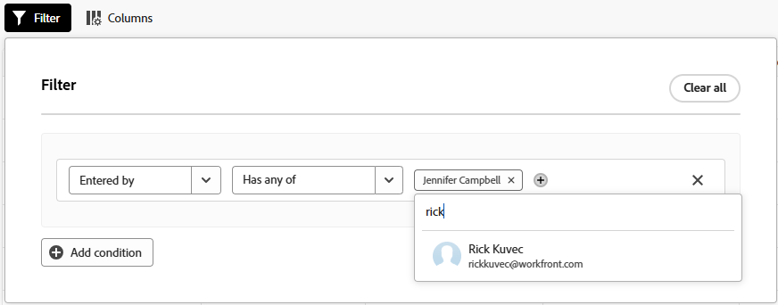

# Utiliser des listes améliorées

Des listes améliorées sont disponibles dans certaines parties d’Adobe Workfront. Ces listes utilisent un format de tableau pour afficher les éléments de liste et leur aspect est différent de celui des listes standard. La gestion des vues est également améliorée, notamment le filtrage, le regroupement, la gestion des colonnes et la recherche.

Pour plus d’informations sur les listes standard, voir [Prise en main des listes dans Adobe Workfront](/help/quicksilver/workfront-basics/navigate-workfront/use-lists/view-items-in-a-list.md).

>[!NOTE]
>
>Chaque liste améliorée peut être configurée différemment pour vous aider à afficher les données dont vous avez besoin. Chaque liste n’utilise pas toutes les fonctionnalités décrites dans cet article. En outre, certaines listes peuvent comporter des fonctionnalités spécifiques qui s’appliquent uniquement à cette liste.

## Conditions d’accès

+++ Développez pour afficher les exigences d’accès aux fonctionnalités de cet article.

<table style="table-layout:auto">
 <col> 
 <col>
 <tbody> 
  <tr> 
   <td>Package Adobe Workfront</td> 
   <td>
Tous
</td> 
  </tr> 
  <tr> 
   <td>Licence Adobe Workfront</td> 
   <td>
   
Contributeur ou version ultérieure

   
Requête ou supérieure
</td>
  </tr>
 </tbody> 
</table>

Pour plus d’informations, voir [Conditions d’accès requises dans la documentation Workfront](/help/quicksilver/administration-and-setup/add-users/access-levels-and-object-permissions/access-level-requirements-in-documentation.md).

+++

## Objets utilisant des listes améliorées

Vous trouverez ci-dessous certains types de listes d’objets Workfront qui utilisent le format de liste amélioré et certaines des zones où elles s’affichent par défaut lorsque vous disposez des droits pour afficher l’objet.

>[!NOTE]
>
>Cette liste n’est pas exhaustive. Chacune de ces listes d’objets peut également apparaître dans un rapport ou un tableau de bord. Par exemple, un rapport de projet ou un tableau de bord contenant un rapport de projet affiche également une liste de projets.

| Liste Workfront | Emplacement de la liste d’objets |
|--- |--- |
| Priorités | <ul><li>Accueil > sélectionnez l’icône Priorités dans le menu de gauche</li><li>Menu principal > Priorités</li></ul> |
| Liste des requêtes | <ul><li>Demandes (nouvelle expérience uniquement)</li><li>Widget Mes demandes sur l’Accueil</li></ul> |
| Listes de statuts, priorités, gravités et taux de change dans la configuration | <ul><li>Configuration > Préférences du projet > Statuts</li><li>Configuration > Préférences du projet > Priorités</li><li>Configuration > Préférences du projet > Gravités</li><li>Configuration > Préférences du projet > Taux de change</li></ul> |

## Ajout et modification d’éléments dans une liste améliorée

Selon la configuration de la liste améliorée, il peut y avoir deux façons d’ajouter un élément à la liste :

* Cliquez sur un bouton au-dessus de la liste. Cette option ouvre une boîte de dialogue dans laquelle vous saisissez des informations et les enregistrez.
* Cliquez sur **Nouvelle ligne** au bas de la liste. Cette option ajoute une nouvelle ligne au tableau et vous saisissez des informations dans chaque cellule.

  Les listes améliorées prennent en charge les types de champs suivants :

   * Texte
   * Nombre
   * Devise
   * Date
   * Date et heure
   * Listes déroulantes à sélection unique/multiple
   * Frappe continue
   * Paragraphe
   * Personne désignée (une ou plusieurs)
   * Sélecteur de couleurs

  Lorsque vous modifiez une cellule, chaque type de champ possède ses propres options de modification.

Pour modifier un élément de la liste, double-cliquez dans la cellule à modifier et tapez les informations. Certaines cellules peuvent être en lecture seule.

## Utiliser la barre d’actions et le menu Plus dans une liste améliorée

La barre d’actions affiche les actions que vous pouvez effectuer sur un élément de liste. Certaines actions peuvent être spécifiques à cette liste et n’apparaître dans aucune autre liste.

1. Cochez la case en regard d’un élément de la liste améliorée.

   La barre d’actions s’affiche en bas de l’écran.

   >[!NOTE]
   >
   >Différentes listes améliorées peuvent permettre de sélectionner un seul élément, de modifier en bloc (en sélectionnant plusieurs éléments) ou de ne pas sélectionner d’élément.

1. Cliquez sur un bouton de la barre d’actions pour effectuer cette action, par exemple afficher l’élément de liste, le supprimer ou le modifier.

   Si aucune action n’est disponible pour l’élément sélectionné, la barre d’actions indique « Aucune action disponible ».

   

1. Pointez sur un champ principal d’un élément de liste pour afficher le menu **Plus**. (Le champ principal est la colonne située le plus à gauche du tableau.)

1. Cliquez sur le menu pour afficher les actions supplémentaires pour l’élément. Certaines actions peuvent être spécifiques à cette liste et n’apparaître dans aucune autre liste.

   

## Personnalisation des colonnes d’une liste améliorée

Certaines listes améliorées vous permettent de masquer et d’afficher des colonnes, ainsi que de les réorganiser.

1. Cliquez sur **Colonnes** au-dessus de la liste.

   

1. Utilisez les boutons pour afficher ou masquer des colonnes dans la liste.
1. Pour réorganiser les colonnes, cliquez sur l’icône **Faire glisser** et déplacez une colonne vers l’emplacement souhaité. Le déplacement de colonnes modifie automatiquement la liste.

   >[!NOTE]
   >
   >Le champ principal est la colonne située le plus à gauche du tableau. Il est fixe en première position et vous ne pouvez pas modifier sa colonne. Si le nombre de colonnes est important, le champ principal est figé à gauche et lorsque vous faites défiler l’écran horizontalement, il est toujours visible.
   >
   >L’icône en regard d’un nom de champ affiche le type de champ, tel que du texte ou un champ de date.

   Un indicateur s’affiche sur le bouton **Colonnes** lorsque des colonnes sont masquées. L’indicateur n’apparaît pas lorsque vous réorganisez les colonnes.

   

## Ajout et suppression de colonnes dans une liste à l’aide du gestionnaire de colonnes

Certaines listes améliorées offrent le **Gestionnaire de colonnes** qui vous permet d’ajouter facilement des colonnes à la liste et de supprimer des colonnes. Les champs natifs et personnalisés sont tous deux disponibles pour être sélectionnés en tant que colonnes. Les champs personnalisés doivent exister dans le système avant de pouvoir les ajouter en tant que colonnes de liste.

Pour ajouter et supprimer des colonnes :

1. Cliquez sur l’icône + en haut à droite du tableau pour ouvrir la zone **Gestionnaire de colonnes**.
1. Recherchez un champ d’objet existant dans la colonne **Disponible**, puis cliquez sur + à droite du nom du champ pour l’ajouter à la colonne **Sélectionné**.
1. Cliquez sur - à droite d’un champ de la colonne **Sélectionné** pour le supprimer de la liste.

   >[!NOTE]
   >
   >Certains champs peuvent être corrigés et ne peuvent pas être supprimés.

1. Cliquer sur **Enregistrer**.

   

<!-- Add info about Properties and KPIs when something gets released with those options -->

## Affichage des données avec des vues dans une liste améliorée

Une vue est un ensemble personnalisé de dispositions de colonnes et de filtres que vous pouvez appliquer à une liste. Vous pouvez créer des vues et modifier des vues existantes.

### Application et création de vues

Pour appliquer une vue, cliquez sur la liste déroulante **Vues** et sélectionnez la vue à appliquer à la liste.

Pour créer une vue :

1. Cliquez sur la liste déroulante **Vues** et sélectionnez **Nouvelle vue**.
1. Attribuez un nom à la vue, puis cliquez sur **Créer**.
1. (Facultatif) Masquez, affichez ou réorganisez les colonnes. Pour plus d’informations, voir [ Personnaliser les colonnes d’une liste améliorée ](#customize-columns-in-an-enhanced-list).
1. (Facultatif) Filtrez et regroupez les éléments de liste. Pour plus d’informations, voir [Filtrer et regrouper des éléments dans une liste améliorée](#filter-and-group-items-in-an-enhanced-list).

   Les modifications apportées aux vues sont enregistrées automatiquement et sont visibles par toute personne utilisant la vue.

   La prochaine fois que vous appliquerez cette vue, les paramètres de colonne et de filtre resteront tels que vous les avez définis.

### Partager une vue

Dans la liste déroulante **Vues**, vous pouvez voir trois catégories de vues :

* **Vues système** : vues que l&#39;administrateur système vous a affectées.
* **Vues partagées** : vues qui ont été partagées avec vous par d&#39;autres utilisateurs.
* **Mes vues** : vues que vous avez créées et que vous pouvez partager avec d’autres utilisateurs. Vous pouvez partager des vues avec d’autres utilisateurs, équipes ou groupes.

Pour partager une vue :

1. Dans la liste déroulante **Vues**, passez la souris sur la vue de **Mes vues** que vous souhaitez partager, puis cliquez sur le menu à trois points lorsqu’il s’affiche.
1. Sélectionnez **Partager**.
1. Dans la boîte de dialogue Partager, saisissez les noms des utilisateurs, des équipes ou des groupes avec lesquels vous souhaitez partager la vue, puis sélectionnez-les dans la liste lorsqu’ils apparaissent.

   Vous pouvez accorder les autorisations suivantes aux destinataires :

   * **Affichage** : les utilisateurs et utilisatrices peuvent appliquer l’affichage à la liste, mais pas le partager.
   * **Gérer** : les utilisateurs et utilisatrices peuvent renommer la vue, la partager avec d’autres personnes et la supprimer.

1. Cliquer sur **Enregistrer**.

## Filtrer et regrouper des éléments dans une liste améliorée

Les filtres vous aident à réduire la quantité d’informations que vous affichez dans la liste. Les regroupements permettent de séparer les objets de la liste dans des zones selon des critères spécifiques.

### Utiliser des filtres

1. Cliquez sur **Filtrer** au-dessus de la liste.
1. Dans la zone Filtre, cliquez sur **Ajouter une condition**.
1. Sélectionnez un champ en fonction duquel effectuer le filtrage.
1. Sélectionnez un modificateur de filtre, tel que « A l’un des », « N’a aucun des », « Est avant » ou « Est après ». Les options des modificateurs sont différentes selon le type de champ en fonction duquel vous effectuez le filtrage.
1. Sélectionnez la ou les valeurs du champ. Selon le type de champ en fonction duquel vous effectuez le filtrage, vous pouvez être invité à sélectionner l’élément dans une liste, à le rechercher ou à utiliser un calendrier pour sélectionner une période.

   

   Le filtre est automatiquement appliqué à la liste.

   >[!TIP]
   >
   >Pour appliquer un caractère générique à l’utilisateur actuel, sélectionnez **Moi (utilisateur connecté)** comme valeur du champ. Le filtre s’applique alors à l’utilisateur ou l’utilisatrice qui consulte la liste. Ce caractère générique est disponible dans les champs où la valeur est un utilisateur.

1. Cliquez sur **Ajouter une condition** pour ajouter une autre condition au filtre sous la forme d’une instruction OR.
1. Lorsque le filtre est appliqué, vous pouvez ouvrir à nouveau les options **Filtre** pour modifier les options de filtre ou effacer tous les filtres.

   Un indicateur apparaît sur le bouton **Filtrer** lorsqu&#39;un filtre est appliqué à la liste.

   

### Utiliser les regroupements

1. Cliquez sur **Grouper** au-dessus de la liste.
1. Sélectionnez un regroupement pour organiser votre liste.

   

1. Lorsque le regroupement est appliqué, vous pouvez ouvrir à nouveau les options Regrouper pour réduire ou développer tous les regroupements à la fois, modifier le regroupement pour les regrouper selon un autre champ ou effacer tous les regroupements.

   

   Un indicateur apparaît sur le bouton **Regrouper** lorsqu&#39;un regroupement est appliqué à la liste.

   

## Tri et recherche dans une liste améliorée

Pour trier des colonnes individuelles :

1. Accédez à la colonne et cliquez sur la flèche vers le bas.

   Une icône en regard d’un nom de colonne indique que la liste est triée en fonction des valeurs de cette colonne et du sens du tri.

   >[!NOTE]
   >
   >Selon la liste, certaines colonnes peuvent ne pas être triables.

   

Pour trier votre travail dans un regroupement :

1. Cliquez sur **Grouper** et choisissez si vous souhaitez effectuer un tri par ordre croissant ou décroissant.

   

Pour effectuer une recherche :

1. Saisissez le terme à rechercher dans le champ de recherche situé au-dessus de la liste. Les résultats sont mis en surbrillance dans la liste au fur et à mesure que vous saisissez.

   
