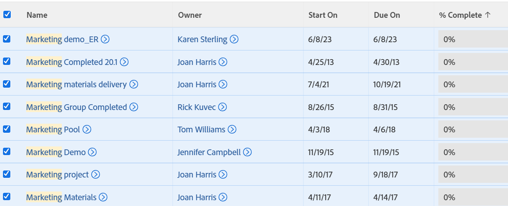

# Exporter une liste

<!--Audited: 11/2024-->

Vous pouvez exporter une liste d’objets à partir d’[!DNL Adobe Workfront]. Lorsque la liste d’objets dans [!DNL Workfront] contient plus de 2 000 éléments, l’export de la liste est la seule manière de réviser tous les éléments de la liste sur une seule page.

Pour plus d’informations sur les formats et les limites d’export, voir [Exporter des données](../../../reports-and-dashboards/reports/creating-and-managing-reports/export-data.md).

## Conditions d’accès

+++ Développez pour afficher les exigences d’accès aux fonctionnalités de cet article. 

<table style="table-layout:auto"> 
 <col> 
 <col> 
 <tbody> 
  <tr> 
   <td role="rowheader">Package Adobe Workfront</td> 
   <td> 
Tous
 </td> 
  </tr> 
  <tr> 
   <td role="rowheader">Licence Adobe Workfront</td> 
   <td> 
   
Contributeur ou supérieur 

   
Requête ou supérieure

   </td> 
  </tr> 
  <tr> 
   <td role="rowheader">Configurations des niveaux d’accès</td> 
   <td> 
Accès en affichage à la zone dans laquelle se trouve la liste.
</td> 
  </tr> 
  <tr> 
   <td role="rowheader">Autorisations d’objet</td> 
   <td> 
Autorisations [!UICONTROL View] à l'objet dans lequel se trouve la liste
  </td> 
  </tr> 
 </tbody> 
</table>

Pour plus d’informations, voir [Conditions d’accès requises dans la documentation Workfront](/help/quicksilver/administration-and-setup/add-users/access-levels-and-object-permissions/access-level-requirements-in-documentation.md).

+++

## Exporter une liste

1. Accédez à une liste d’objets.
1. (Facultatif) Sélectionnez les filtres, vues et regroupements à appliquer à la liste avant de l’exporter.
Pour plus d&#39;informations sur les filtres, les vues et les regroupements, voir [Eléments de reporting : filtres, vues et regroupements](../../../reports-and-dashboards/reports/reporting-elements/reporting-elements-filters-views-groupings.md).

1. (Facultatif) Pour exporter uniquement des éléments spécifiques d’une liste, sélectionnez tous les éléments de la liste que vous souhaitez inclure dans le fichier exporté.

   >[!TIP]
   >
   >Pour localiser tous les éléments à inclure, vous pouvez procéder comme suit :
   >
   >   
   >   
   >   * **Sélectionner cette option pour afficher tout ou 2 000 éléments dans les listes** : pour plus d’informations, voir [Modifier l’affichage d’une liste](../../../workfront-basics/navigate-workfront/use-lists/modify-list-display.md).
   >   
   >   * **Utiliser le filtre rapide** : pour plus d’informations, voir [Appliquer le filtre rapide à une liste](../../../workfront-basics/navigate-workfront/use-lists/apply-quick-filter-list.md).\
   >     Le filtre rapide s’applique uniquement à la page active de la liste.

   

1. Cliquez sur l’icône **[!UICONTROL Exporter]** .

1. Sélectionnez l’un des formats suivants :

   * PDF
   * [!DNL Excel]
   * [!DNL Excel] (xlsx)
   * Délimité par des tabulations

     Cette opération exporte une copie de la liste dans l’un de ces formats et l’enregistre sur votre ordinateur.

1. (Facultatif) Ouvrez la liste exportée à l’aide de l’application appropriée.
Tous les éléments de la liste s’affichent dans le fichier exporté, qu’ils soient affichés ou non à l’écran dans l’application web.
