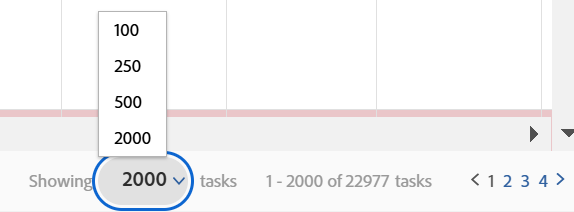

# Modifier l’affichage d’une liste

Dans [!DNL Adobe Workfront], vous pouvez personnaliser l’affichage d’une liste pour vous. Les autres utilisateurs qui affichent la liste ne voient pas vos modifications.

Vous pouvez effectuer les personnalisations suivantes :

* Le nombre d’éléments qui s’affichent
* Largeur ou ordre des colonnes
* Si les groupements sont développés ou réduits

>[!NOTE]
>
>Les modifications d’affichage ci-dessus que vous effectuez sont annulées lorsque vous vous déconnectez de [!DNL Workfront] ou fermez votre navigateur. Ces modifications peuvent également être annulées après une période de 8 heures.

Outre les personnalisations temporaires ci-dessus, vous pouvez également ajuster les colonnes de tri de la liste, qui [!DNL Workfront] conserve même après la déconnexion ou la fermeture du navigateur. Cependant, si quelqu’un modifie les options de tri dans la vue d’une liste, la sélection de tri précédente n’est pas conservée.

Pour plus d’informations sur la modification des informations qui s’affichent dans votre liste, voir [Éléments de reporting : filtres, vues et regroupements](../../../reports-and-dashboards/reports/reporting-elements/reporting-elements-filters-views-groupings.md).

## Exigences d’accès

Vous devez disposer des accès suivants pour effectuer les étapes de cet article :

<table style="table-layout:auto"> 
 <col> 
 <col> 
 <tbody> 
  <tr> 
   <td role="rowheader"><strong>[!DNL Adobe Workfront] plan*</strong></td> 
   <td> 
Tous
 </td> 
  </tr> 
  <tr> 
   <td role="rowheader"><strong>[!DNL Adobe Workfront] license*</strong></td> 
   <td> 
[!UICONTROL Request] ou version ultérieure
 </td> 
  </tr> 
  <tr> 
   <td role="rowheader"><strong>Paramétrages du niveau d'accès*</strong></td> 
   <td> 
Accès à la zone dans laquelle se trouve la liste [!UICONTROL View]
 
Par exemple, pour modifier la vue d’un projet, vous avez besoin de l’accès [!UICONTROL Vue] aux projets.
 
Remarque : Si vous n’avez toujours pas accès à , demandez à votre [!DNL Workfront] s’ils définissent des restrictions supplémentaires au niveau de votre accès. Pour plus d’informations sur la manière dont une [!DNL Workfront] l’administrateur peut modifier votre niveau d’accès, voir <a href="../../../administration-and-setup/add-users/configure-and-grant-access/create-modify-access-levels.md" class="MCXref xref">Création ou modification de niveaux d’accès personnalisés</a>.
 </td> 
  </tr> 
  <tr> 
   <td role="rowheader"><strong>Autorisations d’objet</strong></td> 
   <td> 
Autorisations [!UICONTROL View] ou supérieures à la vue appliquée à la liste
 
Pour plus d’informations sur la demande d’accès supplémentaire, voir <a href="../../../workfront-basics/grant-and-request-access-to-objects/request-access.md" class="MCXref xref">Demande d’accès aux objets </a>.
 </td> 
  </tr> 
 </tbody> 
</table>

&#42;Pour connaître le plan, le type de licence ou l’accès dont vous disposez, contactez votre [!DNL Workfront] administrateur.

## Modifier l’affichage d’une liste

1. Accédez à la liste dans [!DNL Workfront] que vous souhaitez modifier.

   <!--
   
 
   <MadCap:conditionalText data-mc-conditions="QuicksilverOrClassic.Draft mode">
   By default, groupings are collapsed.
   </MadCap:conditionalText>
     

   -->

1. (Facultatif et conditionnel) Si les regroupements de la liste sont réduits et que vous souhaitez afficher plus d’informations, cliquez sur le regroupement souhaité pour développer la liste et afficher les informations qui y sont répertoriées.

   Ou

   Pour développer tous les regroupements, cliquez sur la flèche située à droite de la case à cocher dans l’en-tête de colonne.

   

1. (Facultatif et conditionnel) Si vous souhaitez afficher un nombre spécifique d’éléments à l’écran, cliquez sur le bouton **[!UICONTROL Affichage]** menu déroulant dans le coin inférieur droit de l’écran, puis sélectionnez pour afficher **100**, **250**, **500**, **[!UICONTROL Tous]** ou **2000** éléments.

   

   >[!TIP]
   >
   >Par défaut, 2 000 éléments s’affichent pour les listes mises à jour et 100 éléments s’affichent pour les listes héritées. Si la liste contient plus de 2 000 éléments, vous ne pouvez pas tous les afficher sur une seule page.
   >
   >
   >Pour optimiser les performances des listes volumineuses où les objets contiennent des champs de texte formatés, il est recommandé de limiter ce nombre à 250.
   >
   >
   >Pour plus d’informations sur les 2 types de liste, voir la section [Différence entre les listes mises à jour et héritées](../../../workfront-basics/navigate-workfront/use-lists/view-items-in-a-list.md#updated) dans l’article [Prise en main des listes dans [!DNL Adobe Workfront]](../../../workfront-basics/navigate-workfront/use-lists/view-items-in-a-list.md).

   Les résultats de votre liste sont mis en page afin d’afficher le nombre d’éléments sélectionnés par page. Vous pouvez accéder aux résultats sur d’autres pages en cliquant sur les flèches vers l’arrière et vers l’avant ou en sélectionnant une page spécifique.

1. Pour redimensionner la largeur d’une colonne, placez le pointeur de la souris sur la ligne qui sépare 2 colonnes, puis cliquez pour la faire glisser sur la largeur souhaitée.

   La colonne est redimensionnée jusqu’à ce que vous effaciez le cache du navigateur ou que vous le redimensionniez manuellement.

1. Pour réorganiser les colonnes d’une liste, placez le pointeur de la souris sur l’en-tête d’une colonne afin d’afficher l’outil de main, puis cliquez pour faire glisser la colonne vers l’endroit où vous souhaitez l’afficher.

   La position de la colonne est enregistrée jusqu’à ce que vous actualisiez la page.\
   Pour plus d’informations sur la personnalisation de la largeur et de l’ordre des colonnes dans une liste, consultez l’article . [Modification de la largeur et de l’ordre des colonnes](../../../reports-and-dashboards/reports/reporting-elements/modify-column-width-order.md).

1. Pour ajuster l’ordre de tri d’une liste, cliquez sur l’en-tête d’une colonne pour la sélectionner, puis appuyez sur la touche CMD (activée) et maintenez-la enfoncée. [!DNL Mac]) ou la touche CTRL (activée). [!DNL Windows]) sur votre clavier et sélectionnez jusqu’à 2 en-têtes de colonne supplémentaires pour les trier.

   La liste est triée selon chacune des colonnes sélectionnées dans l&#39;ordre de votre sélection.

   Toutes les modifications apportées à la liste sont enregistrées instantanément.

   >[!NOTE]
   >
   >Si vous triez des groupes dans la variable [!UICONTROL Groupes] area dans [!UICONTROL Configuration], la vue hiérarchique des groupes et de leurs sous-groupes ne se divise pas lorsque vous modifiez le mode de tri de la liste : les sous-groupes restent avec leurs groupes parents. La liste est d’abord triée par groupes de niveau supérieur. Ensuite, sous chaque groupe parent, la liste des sous-groupes situés au même niveau est triée ensemble.
