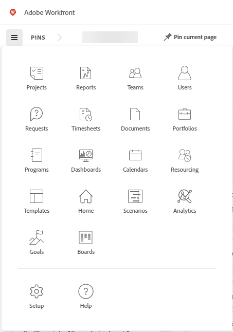

# [!DNL Adobe Unified Experience] pour [!DNL Workfront]

<!--Audited: 10/2024-->

Avec l’accès à [!DNL Workfront] grâce à [!DNL Adobe Experience Cloud], vous bénéficiez d’une expérience transparente et unifiée pour gérer l’ensemble de vos applications [!DNL Adobe]. La gestion des identités unique vous permet de vous connecter à un seul emplacement, sans avoir à utiliser plusieurs URL ou identifiants de connexion.

Si votre organisation utilise l’expérience unifiée Adobe, l’URL que vous utilisez pour accéder à Workfront commence par `experience.adobe.com`.

| URL | Adobe Experience |
|------------|------------|
| (Nom de l’entreprise).my.workfront.com | Expérience Workfront |
| experience.adobe.com | Adobe Unified Experience |

## Conditions d’accès

+++ Développez pour afficher les exigences d’accès aux fonctionnalités de cet article. 

<table style="table-layout:auto"> 
 <col> 
 <col> 
 <tbody> 
  <tr> 
   <td role="rowheader"><strong>Package Adobe Workfront</strong></td> 
   <td> 
Tous
 </td> 
  </tr> 
  <tr> 
   <td role="rowheader"><strong>Licence Adobe Workfront</strong></td> 
   <td> 
Contributeur ou version ultérieure
 
   
Requête ou supérieure
 </td> 
  </tr> 
 </tbody> 
</table>

Pour plus d’informations, consultez la section [Conditions d’accès dans la documentation Workfront](/help/quicksilver/administration-and-setup/add-users/access-levels-and-object-permissions/access-level-requirements-in-documentation.md).

+++

## Conditions préalables

L’instance d’[!DNL Workfront] de votre organisation doit être intégrée à l’[!DNL Adobe Business Platform] ou à l’[!DNL Adobe Admin Console].

Si vous avez des questions sur l’intégration [!DNL Adobe Admin Console], voir les [[!DNL Adobe Unified Experience] Questions fréquentes](/help/quicksilver/workfront-basics/navigate-workfront/workfront-navigation/unified-experience-faq.md/).

## Adobe Identity Management System (IMS)

Dans le cadre de la migration vers l’expérience unifiée Adobe, votre entreprise utilise désormais le système Identity Management d’Adobe pour authentifier les utilisateurs. Cela signifie que vous vous connectez à Workfront via Adobe, au lieu de vous connecter directement à Workfront. Adobe IMS exige également que les administrateurs Workfront gèrent la gestion des utilisateurs dans Adobe Admin Console, plutôt que dans Workfront.

Pour plus d’informations sur la connexion à Workfront dans l’expérience unifiée Adobe, voir [Connexion à Adobe Experience Cloud](#log-in-to-adobe-experience-cloud) dans cet article.

Pour plus d’informations sur la gestion des utilisateurs dans Adobe Admin Console, consultez l’article [Gestion des utilisateurs dans Adobe Admin Console](/help/quicksilver/administration-and-setup/add-users/create-and-manage-users/admin-console.md).

## Se connecter à [!DNL Adobe Experience Cloud]

1. Ouvrez une fenêtre de navigateur et accédez à <https://experience.adobe.com>.
1. Sur l’écran [!UICONTROL **Se connecter**], saisissez votre adresse e-mail, puis cliquez sur **[!UICONTROL Continuer]**.

   ![Connexion à [!DNL Adobe Experience Cloud]](assets/aec-login-page.png)

>[!NOTE]
>
>Si une session de l’onglet du navigateur expire dans une page sur laquelle Workfront est ouvert et que vous disposez d’une session Workfront active dans un autre onglet du navigateur, vous pouvez recharger l’onglet expiré pour rouvrir la page Workfront.

## Accéder à [!DNL Workfront]

Après la connexion à [!DNL Adobe Experience Cloud], vous pouvez afficher l’ensemble des organisations et environnements [!DNL Workfront] auxquels vous avez accès en cliquant sur le sélecteur d’organisation dans la zone de navigation supérieure. Sélectionnez l’organisation ou environnement [!DNL Workfront] où vous souhaitez travailler. Les environnements peuvent inclure celui de [!UICONTROL prévisualisation] et de [!UICONTROL sandbox] si votre organisation les utilise.

![Affichage des organisations et environnements [!DNL Workfront]](assets/aec-view-all-orgs.png)

>[!NOTE]
>
>La première fois que vous vous connectez à [!DNL Adobe Experience Cloud], l’organisation par défaut est la première de la liste alphabétique. La prochaine fois que vous vous connecterez, l’organisation par défaut sera la dernière que vous avez visitée.

[!DNL Workfront] apparaît dans la liste des produits [!DNL Adobe Experience Cloud] auxquels vous avez accès. Vous pouvez choisir [!DNL Workfront] dans le menu d’accès rapide de la page d’accueil [!DNL Experience Cloud] ou utiliser le sélecteur de produits  pour changer d’application à tout moment.

![Sélection de [!DNL Workfront] pour accéder à l’application](assets/aec-product-switcher.png)

## Parcourir [!DNL Workfront]

Utilisez l’icône [!UICONTROL Menu principal]  située à gauche de la barre de navigation [!DNL Workfront] pour accéder à toutes les pages auxquelles vous avez accès. Les options disponibles dans le [!UICONTROL Menu principal] dépendent des éléments suivants :

* **Configurations des modèles de mise en page** : pour savoir comment une équipe d’administration [!DNL Workfront] peut modifier le [!UICONTROL Menu principal] à partir d’un modèle de mise en page, voir [Personnaliser le [!UICONTROL Menu principal] à l’aide d’un modèle de mise en page](/help/quicksilver/administration-and-setup/customize-workfront/use-layout-templates/customize-main-menu.md).
* **Type de licence** : pour découvrir les configurations par défaut de différents types de licence, voir [Comprendre la navigation pour un utilisateur ou une utilisatrice d’une licence de [!UICONTROL relecture]](/help/quicksilver/workfront-basics/navigate-workfront/workfront-navigation/reviewer-global-navigation-bar.md) ou [Comprendre la navigation pour un utilisateur ou une utilisatrice d’une licence de [!UICONTROL travail]](/help/quicksilver/workfront-basics/navigate-workfront/workfront-navigation/worker-global-navigation-bar.md).

## Accéder à votre profil et à vos préférences

Vous pouvez accéder à vos options de profil et de préférences en cliquant sur le menu de compte Adobe (votre image de profil) dans la zone de navigation supérieure.

Ce menu vous permet d’effectuer les opérations suivantes :

* Choisissez le formatage **[!UICONTROL mode sombre]** pour [!DNL Adobe Experience Cloud].
* Définissez les **[!UICONTROL préférences]** pour [!DNL Adobe Experience Cloud], y compris les préférences de langue principale et secondaire.
  >[!NOTE]
  >
  >Vos paramètres de date sont basés sur vos paramètres de langue principale. Par exemple, si vous sélectionnez **Anglais (États-Unis)** les dates sont au format MM/JJ/AAAA, tandis que si vous sélectionnez **Anglais (Royaume-Uni)** les dates sont au format JJ/MM/AAAA.
* Accédez à votre profil **[!UICONTROL [!DNL Workfront]]**. Une fois que vous êtes sur le profil, cliquez sur le menu **[!UICONTROL Plus]**  et sélectionnez **[!UICONTROL Modifier]**. Pour plus d’informations sur le profil, voir [Configurer mes paramètres](/help/quicksilver/workfront-basics/manage-your-account-and-profile/configuring-your-user-profile/configure-my-settings.md).
* **[!UICONTROL Déconnectez-vous]** d’Adobe Experience Cloud.

## Gérer votre mot de passe

>[!NOTE]
>
>La modification de votre mot de passe s’applique à toutes vos applications [!DNL Adobe Experience Cloud].

Votre mot de passe n’est pas géré dans [!DNL Workfront].

Si votre organisation utilise une application distincte pour gérer les mots de passe, changez votre mot de passe par l’intermédiaire de ce fournisseur.

Si votre mot de passe est géré par [!DNL Adobe], vous pouvez modifier le mot de passe de votre compte Adobe.

[Voir cet article pour modifier votre mot de passe Adobe.](https://helpx.adobe.com/fr/manage-account/using/change-or-reset-password.html){target="_blank"}

Pour plus d’informations sur la modification de votre mot de passe, contactez votre administrateur ou administratrice.

