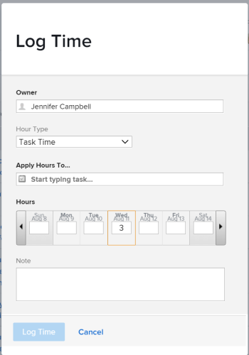
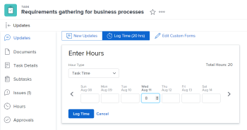

# Présentation des dates de projet, de tâche et de publication dans [!DNL Adobe Workfront]

<!--

(NOTE: consider expanding on this article with ALL dates for PTIs - Hand off dates, Approval Dates, etc) 

-->

Cet article fournit des définitions des dates les plus courantes associées aux projets, tâches et problèmes dans [!DNL Adobe Workfront]. Les images incluses ici sont des exemples d’affichage des dates dans Workfront et ne sont pas exhaustives. D’autres zones affichent les dates. Toutes les dates sont également visibles dans les listes et rapports de projet, de tâche et d’émission.

Pour plus d’informations sur les rapports et les listes, reportez-vous aux articles suivants :

* [Prise en main des listes dans [!DNL Adobe Workfront]](../../../workfront-basics/navigate-workfront/use-lists/view-items-in-a-list.md)
* [Prise en main des rapports](../../../reports-and-dashboards/reports/reporting/get-started-reports-workfront.md)

Pour plus d’informations sur les champs de projet, de tâche et de problème, voir [Glossaire [!DNL Adobe Workfront] terminologie](../../../workfront-basics/navigate-workfront/workfront-navigation/workfront-terminology-glossary.md).

## [!UICONTROL Date de début planifiée]

La variable [!UICONTROL Date de début planifiée] est la date de début prévue d’un projet, d’une tâche ou d’un problème.

Selon le [!UICONTROL Contrainte de tâche], il se peut que vous ne puissiez pas modifier la variable [!UICONTROL Date de début planifiée] d’une tâche. Selon le [!UICONTROL Mode Planification] du projet, vous ne pourrez peut-être pas modifier la variable [!UICONTROL Date de début planifiée] d’un projet.

Pour plus d’informations, voir [Présentation du projet [!UICONTROL Date de début planifiée]](../../../manage-work/projects/planning-a-project/project-planned-start-date.md).

## [!UICONTROL Date d’achèvement prévue]

La variable [!UICONTROL Date d’achèvement prévue] ou le [!UICONTROL Échéance activée] date correspond à la date de fin prévue d’un projet, d’une tâche ou d’un problème.

Selon le [!UICONTROL Contrainte de tâche], il se peut que vous ne puissiez pas modifier la variable [!UICONTROL Date d’achèvement prévue] d’une tâche. Selon le [!UICONTROL Mode Planification] du projet, vous ne pourrez peut-être pas modifier la variable [!UICONTROL Date d’achèvement prévue] d’un projet.

La variable [!UICONTROL Date d’achèvement prévue] s’affiche comme date d’échéance dans certaines zones de [!DNL Workfront].

Pour plus d’informations, voir les articles suivants :

* [Présentation de la tâche [!UICONTROL Date d’achèvement prévue]](../../../manage-work/tasks/task-information/task-planned-completion-date.md)
* [Définition du projet [!UICONTROL Date d’achèvement prévue]](../../../manage-work/projects/planning-a-project/project-planned-completion-date.md)
* [Présentation du problème [!UICONTROL Date d’achèvement prévue]](../../../manage-work/issues/issue-information/issue-planned-completion-date.md)

## [!UICONTROL Date d’entrée]

La variable [!UICONTROL Date d’entrée] est la date à laquelle un projet, une tâche ou un problème a été créé dans Workfront.

La variable [!UICONTROL Date d’entrée] n’influence pas la chronologie des projets, tâches ou problèmes, mais elle est importante à des fins de suivi et de création de rapports. [!DNL Workfront] génère automatiquement la variable [!UICONTROL Date d’entrée] lorsque l’objet est créé et que vous ne pouvez pas le modifier manuellement.

## [!UICONTROL Date de début réelle]

La variable [!UICONTROL Date de début réelle] est la date à laquelle un utilisateur commence effectivement à travailler sur un projet, une tâche ou un problème. La variable [!UICONTROL Date de début réelle] est vide lorsque le projet, la tâche ou le problème est créé.

Vous pouvez indiquer manuellement le moment où le travail a commencé sur une tâche ou un problème, ou le [!UICONTROL Date de début réelle] se remplit automatiquement lorsque la tâche ou l’état de l’émission passe de [!UICONTROL Nouveau] to [!UICONTROL En cours] ou [!UICONTROL Terminer]. La variable [!UICONTROL Date de début réelle] d’un projet correspond à la date de début de la première tâche du projet.

>[!TIP]
>
>La variable [!UICONTROL Date de début réelle] peut ne pas correspondre à [!UICONTROL Date de début planifiée] d’un projet, d’une tâche ou d’un problème, car l’utilisateur peut commencer à travailler plus tard ou avant la date prévue.

Pour plus d’informations, voir [Présentation du projet [!UICONTROL Date de début réelle]](../../../manage-work/projects/planning-a-project/project-actual-start-date.md).

>[!NOTE]
>
>La variable [!UICONTROL Doit démarrer le] La ou les contraintes de dates fixes affectent la [!UICONTROL Date de début planifiée] d’une tâche, et non de la fonction [!UICONTROL Date de début réelle]. Cette méthode met à jour la variable [!UICONTROL Date de début planifiée] à une date que vous spécifiez. La variable [!UICONTROL Date de début réelle] est mis à jour indépendamment de la fonction [!UICONTROL Date de début planifiée], comme décrit ci-dessus.

## [!UICONTROL Date d’achèvement réelle]

La variable [!UICONTROL Date d’achèvement réelle] est la date à laquelle un utilisateur termine un projet, une tâche ou un problème. La variable [!UICONTROL Date d’achèvement réelle] est vide lorsque le projet, la tâche ou le problème est créé.

Vous pouvez indiquer manuellement le moment où le travail se termine sur une tâche ou un problème, ou le [!UICONTROL Date de fin réelle] renseigne automatiquement lorsque l’une des situations suivantes se produit :

* Le statut du projet, de la tâche ou du problème passe à [!UICONTROL Terminer], [!UICONTROL Fermé], ou [!UICONTROL Résolu].
* Le pourcentage de réalisation de la tâche ou du projet est de 100 %.

La variable [!UICONTROL Date d’achèvement réelle] d’un projet correspond à la date à laquelle vous avez effectué la dernière tâche sur le projet.

>[!TIP]
>
>La variable [!UICONTROL Date d’achèvement réelle] peut ne pas correspondre à la variable [!UICONTROL Date d’achèvement prévue].

Pour plus d’informations, voir [Présentation du projet [!UICONTROL Date d’achèvement réelle]](../../../manage-work/projects/planning-a-project/project-actual-completion-date.md).

## [!UICONTROL Date de validation]

La variable [!UICONTROL Date de validation] est la date à laquelle un utilisateur affecté à une tâche ou à un problème s’engage à terminer la tâche ou le problème. Différent de la variable [!UICONTROL Date d’achèvement prévue], car il s’agit d’une estimation plus réaliste de la date d’achèvement donnée uniquement par l’utilisateur responsable du travail. Pour plus d’informations, voir [[!UICONTROL Date de validation] aperçu](../../../manage-work/projects/updating-work-in-a-project/overview-of-commit-dates.md).

>[!NOTE]
>
>Changement de la variable [!UICONTROL Date de validation] affecte l’ [!UICONTROL Date d’achèvement prévue] mais pas le [!UICONTROL Date d’achèvement prévue] d’une tâche ou d’un problème. Le chef de projet peut utiliser les modifications qu’une personne désignée apporte sur la variable [!UICONTROL Date de validation] pour mettre à jour la variable [!UICONTROL Date d’achèvement prévue] d’une tâche ou d’un problème.

## [!UICONTROL Date de début prévue]

La variable [!UICONTROL Date de début prévue] est une date en temps réel du moment où le projet, la tâche ou l’émission prend en compte tous les délais. La date de début du projet, de la tâche ou du problème est plus précise que la valeur [!UICONTROL Date de début planifiée]. La variable [!UICONTROL Date de début planifiée] ne prend pas en compte les retards ou les dates antérieures.

Lorsque vous planifiez un projet pour la première fois, la variable [!UICONTROL Date de début planifiée] et la variable [!UICONTROL Date de début prévue] des tâches et du projet sont identiques. Comme des retards peuvent se produire ou que des tâches peuvent être terminées plus tôt, la variable [!UICONTROL Date de début prévue] peut devenir différent de la variable [!UICONTROL Date de début planifiée].

Pour une tâche, une [!UICONTROL Date de début prévue] peut également différer de son [!UICONTROL Date de début planifiée] lorsque l&#39;un de ses prédécesseurs a pris le temps de respecter le calendrier.

>[!TIP]
>
>Vous pouvez afficher la [!UICONTROL Date de début prévue] d’un problème uniquement dans une liste ou un rapport.

Pour plus d’informations, voir [Présentation du projet [!UICONTROL Date de début prévue]](../../../manage-work/projects/planning-a-project/project-projected-start-date.md).

## [!UICONTROL Date d’achèvement prévue]

La variable [!UICONTROL Date d’achèvement prévue] est un indicateur calculé en temps réel du moment où le projet, la tâche ou le problème sera terminé. Lorsque le projet, la tâche ou le problème est marqué comme terminé, la variable [!UICONTROL Date d’achèvement prévue] modification de la date de la variable [!UICONTROL Date d’achèvement réelle].

Si tout se passe sans problème et comme prévu, la variable [!UICONTROL Date d’achèvement prévue] doit correspondre au [!UICONTROL Date d’achèvement prévue]. Sinon, en raison des retards sur les tâches précédentes, la variable [!UICONTROL Date d’achèvement prévue] peut devenir différent de la variable [!UICONTROL Date d’achèvement prévue].

Pour plus d’informations, voir [Présentation de la variable [!UICONTROL Date d’achèvement prévue] pour les projets, les tâches et les problèmes](../../../manage-work/projects/planning-a-project/project-projected-completion-date.md).

## [!UICONTROL Date d’entrée horaire]

Lorsque vous enregistrez le temps pour les projets, tâches et problèmes afin d’indiquer le temps réel (en heures) que vous passez à travailler sur le projet, la tâche ou le problème, le temps que vous connectez devient le temps [!UICONTROL Heures réelles] du projet, de la tâche ou du problème.

La date à laquelle vous enregistrez l’heure est la date [!UICONTROL Date d’entrée horaire] sur l’entrée d’heure. Certaines listes et rapports d’heures affichent la date d’entrée de l’heure comme date.

>[!TIP]
>
>La variable [!UICONTROL Date d’entrée horaire] est différent de la variable [!UICONTROL Date d’entrée] en ce sens qu’il ne s’agit pas de la date de création du journal des heures, mais plutôt de la date à laquelle vous souhaitez associer des heures.

Vous pouvez journaliser et afficher l’heure dans les zones suivantes de Workfront :

* L’heure de connexion et d’affichage dans le [!UICONTROL project], [!UICONTROL tâche], ou [!UICONTROL mises à jour des problèmes] ou dans la section [!UICONTROL Heures] . Lors de la connexion à l’événement [!UICONTROL Heures] , vous pouvez spécifier manuellement la date d’entrée de l’heure et l’utilisateur auquel appartiennent les heures.

  

  Pour plus d’informations, voir [Temps de connexion](../../../timesheets/create-and-manage-timesheets/log-time.md).

  >[!TIP]
  >
  >Il est recommandé de disposer du temps de connexion sur les tâches et les problèmes de travail, plutôt que sur les tâches ou les projets parents. La durée de connexion aux tâches de travail est cumulée aux tâches parentes et au projet comme [!UICONTROL Heures réelles] pour les tâches parentes et le projet. La durée de connexion aux problèmes s’étend au projet en tant que [!UICONTROL Heures réelles] pour le projet.

* Temps de connexion dans le flux de mise à jour d’une tâche ou d’un problème.

  

* Afficher la variable [!UICONTROL Dates d’entrée horaire] dans les rapports et listes d’heures.

  
