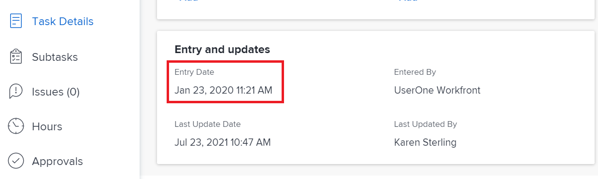
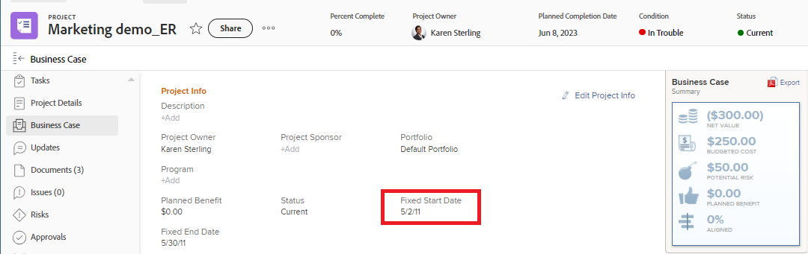

# Vue d’ensemble des dates du projet, de la tâche et du problème dans [!DNL Workfront]

<!-- Audited: 05/2024 -->

<!--consider expanding on this article with ALL dates for PTIs - Hand off dates, Approval Dates, etc-->

<!-- there are dates below that need definition - ask Product-->

Cet article fournit des définitions des dates les plus courantes associées aux projets, aux tâches et aux problèmes dans [!DNL Adobe Workfront]. Les images incluses ici sont des exemples de l’affichage des dates dans Workfront et ne sont pas exhaustives. D’autres zones affichent les dates. Toutes les dates sont également visibles dans les rapports et les listes de projets, de tâches et de problèmes.

Pour plus d’informations sur les rapports et les listes, voir les articles suivants :

* [Commencer avec les listes dans  [!DNL Adobe Workfront]](../../../workfront-basics/navigate-workfront/use-lists/view-items-in-a-list.md)
* [Commencer avec les rapports](../../../reports-and-dashboards/reports/reporting/get-started-reports-workfront.md)

Pour plus d&#39;informations sur les champs Projet, Tâche et Problème, voir [Glossaire  [!DNL Adobe Workfront]  terminologie](../../../workfront-basics/navigate-workfront/workfront-navigation/workfront-terminology-glossary.md).

## [!UICONTROL Date de début effective]

La [!UICONTROL date de début effective] est la date à laquelle un utilisateur ou une utilisatrice commence réellement à travailler sur un projet, une tâche ou un problème. Le champ [!UICONTROL date de début effective] est vide lors de la création du projet, de la tâche ou du problème.

Vous pouvez indiquer manuellement quand le travail a commencé sur une tâche ou un problème, ou la [!UICONTROL date de début effective] se remplit automatiquement lorsque le statut de la tâche ou du problème passe de [!UICONTROL Nouveau] à [!UICONTROL En cours] ou [!UICONTROL Terminé]. La [!UICONTROL date de début effective] d’un projet coïncide avec la date de début de la première tâche du projet.

>[!TIP]
>
>La [!UICONTROL date de début effective] peut ne pas correspondre à la [!UICONTROL date de début prévue] d’un projet, d’une tâche ou d’un problème, car l’utilisateur ou l’utilisatrice peut commencer le travail plus tard ou plus tôt que la date prévue.

Pour plus d’informations, voir [Vue d’ensemble de la [!UICONTROL date de début effective du projet]](../../../manage-work/projects/planning-a-project/project-actual-start-date.md).

>[!NOTE]
>
>La tâche [!UICONTROL Il Faut Commencer Le] ou les contraintes Dates fixes affectent la [!UICONTROL date de début prévue] d’une tâche, et non la [!UICONTROL date de début effective]. Cette opération met à jour la [!UICONTROL date de début prévue] à la date que vous avez spécifiée. La [!UICONTROL date de début effective] est mise à jour indépendamment de la [!UICONTROL date de début prévue], comme décrit ci-dessus.

## [!UICONTROL Date d’achèvement effective]

La [!UICONTROL date d’achèvement effective] est la date à laquelle un utilisateur ou une utilisatrice termine réellement un projet, une tâche ou un problème. La zone [!UICONTROL Date d’achèvement effective] est vide lors de la création du projet, de la tâche ou du problème.

Vous pouvez indiquer manuellement quand une tâche ou un problème se termine, ou la [!UICONTROL date d’achèvement effective] se remplit automatiquement lorsque l’une des situations suivantes se produit :

* Le statut du projet, de la tâche ou du problème passe à [!UICONTROL Terminé], [!UICONTROL Fermé], ou [!UICONTROL Résolu].
* Le pourcentage terminé de la tâche ou du projet est de 100 %.

La [!UICONTROL date d’achèvement effective] d’un projet coïncide avec la date à laquelle vous avez terminé la dernière tâche du projet.

>[!TIP]
>
>La [!UICONTROL date d’achèvement effective] peut ne pas correspondre à la [!UICONTROL date d’achèvement prévue].

Pour plus d’informations, voir [Vue d’ensemble de la [!UICONTROL date d’achèvement effective du projet]](../../../manage-work/projects/planning-a-project/project-actual-completion-date.md).

## Date d&#39;achèvement du chemin d&#39;approbation

La date d&#39;achèvement du chemin d&#39;approbation est la date à laquelle l&#39;approbation d&#39;un projet, d&#39;une tâche ou d&#39;un événement a été accordée et le statut de l&#39;élément a été modifié.

La date d&#39;achèvement du chemin d&#39;approbation est visible dans les listes et les rapports sur les projets, les tâches et les événements.

## Date de début du chemin d&#39;approbation

La date de début du chemin d&#39;approbation est la date à laquelle le statut du projet, de la tâche ou de l&#39;événement a été modifié en « Approbation en attente » et la demande d&#39;approbation du projet a été envoyée aux approbateurs.

La date de début du chemin d&#39;approbation est visible dans les listes et les rapports sur les projets, les tâches et les événements.

<!--## Auto Closure Date -->

## Date d’achèvement budgétée

Il s’agit d’un champ obsolète pour les projets. Toute information que ce champ peut afficher dans une liste ou un rapport est liée à une fonctionnalité que Workfront a supprimée. Ce champ ne peut pas être mis à jour.

Le champ est visible dans les rapports et les listes de projet.

## Date de début budgétée

Il s’agit d’un champ obsolète pour les projets. Toute information affichée dans ce champ est liée à une fonctionnalité que Workfront a supprimée. Ce champ ne peut pas être mis à jour.

Le champ est visible dans les rapports et les listes de projet.

## [!UICONTROL Date d’engagement]

La date d’engagement est la date à laquelle une personne affectée à une tâche ou à un problème s’engage à terminer la tâche ou le problème.  Elle est différente de la [!UICONTROL date d’achèvement prévue], car il s’agit d’une estimation plus réaliste de la date d’achèvement donnée uniquement par la personne en charge du travail. Pour plus d’informations, voir [[!UICONTROL Présentation de la date d’engagement]](../../../manage-work/projects/updating-work-in-a-project/overview-of-commit-dates.md).

>[!NOTE]
>
>La modification de la [!UICONTROL date d’engagement] affecte la [!UICONTROL date d’achèvement prévisionnelle] mais pas la [!UICONTROL date d’achèvement prévue] d’une tâche ou d’un problème. La ou le gestionnaire de projet peut utiliser les modifications apportées par une personne assignée à la [!UICONTROL date d’engagement] pour mettre à jour la [!UICONTROL date d’achèvement prévue] d’une tâche ou d’un problème.

<!--## Completion Pending Date-->

## Date de contrainte

Si vous utilisez une contrainte de tâche liée à une date spécifique, cette date spécifique devient la date de contrainte de la tâche.

Les contraintes de tâche suivantes mettent à jour le champ Date de contrainte :

* Il Faut Commencer Le
* Il Faut Finir Le
* Commencer Au Plus Tard
* Commencer Au Plus Tôt

>[!TIP]
>
>Une tâche avec une contrainte de dates fixes n&#39;a pas de date de contrainte.
>

La date de contrainte est visible dans une liste de tâches ou un rapport.

## Date d&#39;entrée de l&#39;événement converti

Date à laquelle l’événement converti en projet ou la tâche a été créé.

La date d&#39;entrée de l&#39;événement converti est visible dans les listes et rapports de projets et de tâches.

## Date d’échéance

Date d’échéance d’une tâche ou d’un événement. La date d&#39;échéance d&#39;une tâche ou d&#39;un événement est identique à la date d&#39;achèvement prévue.

La date d&#39;échéance de la tâche et de l&#39;événement est visible dans les listes et rapports de tâches et d&#39;événements.

Pour plus d’informations, reportez-vous à la section [Date d’achèvement prévue](#planned-completion-date) de cet article.

## Dû le

Date à laquelle le projet doit être terminé. La date d&#39;échéance d&#39;un projet correspond à la date d&#39;achèvement prévisionnelle du projet.

La date d’échéance du projet est visible dans les listes et les rapports de projet.

Pour plus d’informations, reportez-vous à la section [Date d’achèvement prévue](#planned-completion-date) de cet article.

## [!UICONTROL Date d’entrée]

La [!UICONTROL Date de saisie] est la date à laquelle un projet, une tâche ou un événement a été créé dans [!DNL Workfront].

La [!UICONTROL date d’entrée] n’a pas d’effet sur le calendrier des projets, des tâches ou des problèmes, mais elle est importante pour le suivi et la création de rapports. [!DNL Workfront] génère automatiquement la [!UICONTROL date d’entrée] lors de la création de l’objet et vous ne pouvez pas la modifier manuellement.

## Échéance estimée

La date d&#39;échéance estimée de la tâche et du projet indique une date plus réaliste à laquelle le projet ou la tâche doit se terminer.

Les dates estimées sont plus en phase avec la réalité du projet et de la tâche, car elles prennent en compte ce qui influence l&#39;achèvement effectif du projet ou de la tâche. Les dates d&#39;échéance estimées sont similaires aux dates d&#39;achèvement prévues.

Pour plus d&#39;informations, voir [Aperçu des dates prévues et estimées](/help/quicksilver/manage-work/tasks/task-information/differentiate-projected-estimated-dates.md).

Les échéances prévues des projets et des tâches sont visibles dans les listes et les rapports de projets et de tâches.

## Date de début estimée

La date de début estimée de la tâche et du projet affiche une date plus réaliste de début du projet ou de la tâche.

Les dates estimées sont plus en phase avec la réalité du projet et de la tâche, car elles prennent en compte ce qui influence le début réel du projet ou de la tâche. Les dates de début estimées sont similaires aux dates de début prévues.

Pour plus d&#39;informations, voir [Aperçu des dates prévues et estimées](/help/quicksilver/manage-work/tasks/task-information/differentiate-projected-estimated-dates.md).

Les dates de début estimées des projets et des tâches sont visibles dans les listes et rapports de projets et de tâches.

<!--## Exchange Rate Date-->

## Date de fin fixée

Le demandeur ou le propriétaire du projet identifie la date de fin fixée d&#39;un projet lors de la réalisation de l&#39;analyse de rentabilité. Il s’agit de la date à laquelle ils recommandent que le projet soit terminé.

Il s’agit d’une estimation manuelle qui ne prend en compte aucun avancement réel des tâches du projet.

La date de fin fixée pour un projet est visible dans la section Business case du projet ainsi que dans les listes et les rapports de projets.

## Date de début fixée

Le demandeur ou le propriétaire du projet identifie la date de début fixée d&#39;un projet lors de la réalisation de l&#39;analyse de rentabilité. Il s’agit de la date à laquelle ils recommandent que le projet commence.

Il s’agit d’une estimation manuelle qui ne prend en compte aucun avancement réel des tâches du projet.

La date de début fixée d&#39;un projet est visible dans la section Analyse de rentabilité du projet ainsi que dans les listes de projets et les rapports.

## Date de remise

Date à laquelle une tâche devient disponible pour le travail. Cela signifie que toutes les contraintes, validations et dépendances sont terminées et que les utilisateurs peuvent commencer à travailler sur la tâche.

La date de remise est un calcul qui ne peut pas être défini manuellement.

Pour plus d’informations sur la date de remise, voir [Présentation de la date de remise de la tâche](/help/quicksilver/manage-work/tasks/task-information/handoff-task-date.md).

La date de remise d’une tâche est visible dans les listes de tâches et les rapports.

## Dernière mise à jour financière

Date à laquelle les informations financières d&#39;un projet ont été mises à jour. Cela inclut la mise à jour des champs financiers dans la section Finance ou la section Analyse de rentabilité du projet.

La date de la dernière mise à jour financière est visible dans les listes et les rapports de projet.

## Date de dernière mise à jour

Date de la dernière mise à jour du projet, de la tâche ou de l’événement. Une mise à jour est considérée comme toute modification qui déclenche l’enregistrement d’un projet, d’une tâche ou d’un événement. Cela inclut les changements de statut, de condition, de chronologie, de finances ou de tout autre champ.

La date de la dernière mise à jour est visible dans les listes et les rapports sur les projets, les tâches et les événements.

## [!UICONTROL Date d’entrée des heures]

Lorsque vous consignez des heures pour des projets, des tâches et des problèmes afin d’indiquer le temps réel (en heures) que vous avez passé à travailler sur le projet, la tâche ou le problème, le temps que vous consignez devient les [!UICONTROL heures effectives] du projet, de la tâche ou du problème.

La date pour laquelle vous enregistrez l’heure est le champ [!UICONTROL Date de saisie des heures] sur la saisie d’heures.

La date de saisie horaire est visible dans les listes et les rapports d&#39;heures.

>[!TIP]
>
>Le [!UICONTROL Date de saisie] d&#39;une heure est différent du [!UICONTROL Date de saisie] d&#39;un autre objet Workfront, dans la mesure où il ne s&#39;agit pas de la date de création du journal des heures, mais plutôt de la date à laquelle vous souhaitez que les heures soient associées.
>
>Par exemple, vous pouvez consigner les heures d’une tâche le 5 septembre, mais les associer au 1er septembre. La date d&#39;entrée de l&#39;heure est le 1er septembre.

Pour plus d’informations sur la journalisation du temps dans Workfront, voir [Enregistrer le temps](../../../timesheets/create-and-manage-timesheets/log-time.md).

>[!TIP]
>
>Nous recommandons de consigner le temps passé sur des tâches et des problèmes de travail, plutôt que sur des tâches ou des projets parents. Le temps consigné sur les tâches de travail est répercuté sur les tâches parents et le projet en tant qu’[!UICONTROL Heures effectives] pour les tâches parents et le projet. Le temps consigné sur les problèmes est répercuté sur le projet en tant qu’[!UICONTROL Heures effectives] pour le projet.

## [!UICONTROL Date d’achèvement prévue]

La [!UICONTROL date d’achèvement prévue] ou la [!UICONTROL date d’échéance] est la date à laquelle il est prévu qu’un projet, une tâche ou un problème soit terminé(e).

En fonction de la [!UICONTROL contrainte de tâche], il se peut que vous ne puissiez pas modifier la [!UICONTROL date d’achèvement prévue] d’une tâche. En fonction du [!UICONTROL mode de planification] du projet, il se peut que vous ne puissiez pas modifier la [!UICONTROL date d’achèvement prévue] d’un projet.

La [!UICONTROL date d’achèvement prévue] s’affiche comme la date d’échéance dans certaines zones de [!DNL Workfront].

Pour plus d’informations, consultez les articles suivants :

* [Vue d’ensemble de la [!UICONTROL date d’achèvement prévue] de la tâche](../../../manage-work/tasks/task-information/task-planned-completion-date.md)
* [Définir la [!UICONTROL date d’achèvement prévue] du projet](../../../manage-work/projects/planning-a-project/project-planned-completion-date.md)
* [Vue d’ensemble de la [!UICONTROL date d’achèvement prévue] du problème](../../../manage-work/issues/issue-information/issue-planned-completion-date.md)

## Alignement de date planifié

Il s’agit d’un indicateur automatique que Workfront affecte des projets, des tâches et des événements pour indiquer quand un élément sera terminé par rapport à sa date d’achèvement prévue.

Les valeurs suivantes sont des valeurs possibles pour l’indicateur Alignement de date prévu :

* Sera terminé à la date d&#39;achèvement prévisionnelle
* Sera terminé avant la date d&#39;achèvement prévisionnelle
* Sera terminé après la date d&#39;achèvement prévisionnelle

L’alignement des dates prévues est visible dans les listes et les rapports des projets, des tâches et des événements.

## [!UICONTROL Date de début prévue]

La [!UICONTROL date de début prévue] est la date à laquelle un projet, une tâche ou un problème doit commencer.

En fonction de la [!UICONTROL contrainte de tâche], il se peut que vous ne puissiez pas modifier la [!UICONTROL date de début prévue] d’une tâche. En fonction du [!UICONTROL mode de planification] du projet, il se peut que vous ne puissiez pas modifier la [!UICONTROL date de début prévue] d’un projet.

Pour plus d’informations, voir [Vue d’ensemble de la [!UICONTROL date de début prévue du projet]](../../../manage-work/projects/planning-a-project/project-planned-start-date.md).

## [!UICONTROL Date d’achèvement prévisionnelle]

La [!UICONTROL date d’achèvement prévisionnelle] est un indicateur calculé en temps réel de la date d’achèvement du projet, de la tâche ou du problème. Lorsque le projet, la tâche ou le problème est marqué comme étant terminé, la [!UICONTROL date d’achèvement prévisionnelle] devient la [!UICONTROL date d’achèvement effective].

Si tout se passe bien et comme prévu, la date d’achèvement prévisionnelle devrait correspondre à la date d’achèvement prévue.  Sinon, en raison des retards des tâches précédentes, la [!UICONTROL date d’achèvement prévisionnelle] peut être différente de la [!UICONTROL date d’achèvement prévue].

Pour plus d’informations, voir [Vue d’ensemble de la [!UICONTROL date d’achèvement prévisionnelle] pour les projets, les tâches et les problèmes](../../../manage-work/projects/planning-a-project/project-projected-completion-date.md).

## [!UICONTROL Date de début prévisionnelle]

La date de début prévisionnelle est une date en temps réel à laquelle le projet, la tâche ou le problème est lancé et qui tient compte de tous les retards.  Il s’agit d’une date de début plus précise pour le projet, la tâche ou le problème que la date de début prévue.  La [!UICONTROL date de début planifiée] ne tient pas compte des retards ou des dates passées.

Lorsque vous planifiez un projet pour la première fois, la [!UICONTROL date de début planifiée] et la [!UICONTROL date de début prévisionnelle] des tâches et du projet sont identiques. Comme des retards peuvent survenir ou que des tâches peuvent être achevées plus tôt, la [!UICONTROL date de début prévisionnelle] peut devenir différente de la [!UICONTROL date de début planifiée].

Pour une tâche, une [!UICONTROL date de début prévisionnelle] peut également différer de sa [!UICONTROL date de début planifiée] lorsque l’une de ses prédécesseuses est en retard sur le calendrier.

>[!TIP]
>
>Vous pouvez afficher la [!UICONTROL date de début prévisionnelle] d’un problème uniquement dans une liste ou un rapport.

Pour plus d’informations, voir [Vue d’ensemble de la [!UICONTROL date de début prévisionnelle du projet]](../../../manage-work/projects/planning-a-project/project-projected-start-date.md).

<!--## Rejection Date-->

## Date de marge

Les tâches peuvent parfois commencer et se terminer en retard sans que cela ait une incidence sur la date d’achèvement du projet.

La date de marge affiche la date exacte à laquelle une tâche pourrait avoir un impact certain sur la date d’achèvement du projet.

Pour plus d’informations sur la date Slack d’une tâche, voir [Aperçu de la date Slack de la tâche](/help/quicksilver/manage-work/tasks/task-information/task-slack-date.md).

Les dates Slack de la tâche sont visibles dans les listes de tâches et les rapports.

## Démarré le

Date de début prévue du projet. La date de début d&#39;un projet correspond à la date de début planifiée du projet.

Ce champ est visible dans les listes de projets et les rapports.

Pour plus d’informations, reportez-vous à la section [Date de début prévue](#planned-start-date) de cet article.

