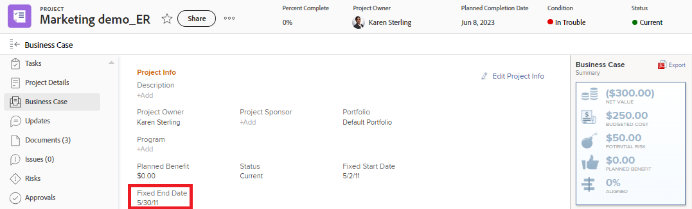

# Présentation des dates de projet, de tâche et de problème dans [!DNL Workfront]

<!-- Audited: 05/2024 -->

<!--consider expanding on this article with ALL dates for PTIs - Hand off dates, Approval Dates, etc-->

<!-- there are dates below that need definition - ask Product-->

Cet article fournit des définitions des dates les plus courantes associées aux projets, tâches et problèmes dans [!DNL Adobe Workfront]. Les images incluses ici sont des exemples d’affichage des dates dans Workfront et ne sont pas exhaustives. D’autres zones affichent les dates. Toutes les dates sont également visibles dans les listes et rapports de projet, de tâche et d’émission.

Pour plus d’informations sur les rapports et les listes, reportez-vous aux articles suivants :

* [Prise en main des listes dans [!DNL Adobe Workfront]](../../../workfront-basics/navigate-workfront/use-lists/view-items-in-a-list.md)
* [Prise en main des rapports](../../../reports-and-dashboards/reports/reporting/get-started-reports-workfront.md)

Pour plus d’informations sur les champs de projet, de tâche et de problème, consultez le [Glossaire de [!DNL Adobe Workfront] terminologie](../../../workfront-basics/navigate-workfront/workfront-navigation/workfront-terminology-glossary.md).

## [!UICONTROL Date de début réelle]

La [!UICONTROL Date de début réelle] est la date à laquelle un utilisateur commence réellement à travailler sur un projet, une tâche ou un problème. La [!UICONTROL Date de début réelle] est vide lors de la création du projet, de la tâche ou du problème.

Vous pouvez indiquer manuellement le moment où le travail a commencé sur une tâche ou un problème, ou la [!UICONTROL Date de début réelle] se remplit automatiquement lorsque la tâche ou l’état du problème passe de [!UICONTROL New] à [!UICONTROL En cours] ou [!UICONTROL Terminé]. La [!UICONTROL Date de début réelle] d’un projet correspond à la date de début de la première tâche du projet.

>[!TIP]
>
>La [!UICONTROL Date de début réelle] peut ne pas correspondre à une [!UICONTROL Date de début planifiée] d’un projet, d’une tâche ou d’un problème, car l’utilisateur peut commencer à travailler plus tard ou avant la date prévue.

Pour plus d’informations, voir [Présentation du projet [!UICONTROL Date de début réelle]](../../../manage-work/projects/planning-a-project/project-actual-start-date.md).

>[!NOTE]
>
>La tâche [!UICONTROL Doit démarrer le ] ou les contraintes de dates fixes affectent la [!UICONTROL Date de début planifiée] d’une tâche, et non la [!UICONTROL Date de début réelle]. Cette opération met à jour la [!UICONTROL Date de début planifiée] vers une date que vous spécifiez. La [!UICONTROL Date de début réelle] est mise à jour indépendamment de la [!UICONTROL  Date de début planifiée], comme décrit ci-dessus.

## [!UICONTROL Date d’achèvement réelle]

La [!UICONTROL date d’achèvement réelle] est la date à laquelle un utilisateur termine réellement un projet, une tâche ou un problème. La [!UICONTROL Date d’achèvement réelle] est vide lors de la création du projet, de la tâche ou du problème.

Vous pouvez indiquer manuellement le moment où le travail se termine sur une tâche ou un problème, ou la [!UICONTROL Date d’achèvement réelle] se remplit automatiquement lorsque l’un des événements suivants se produit :

* Le statut du projet, de la tâche ou du problème passe à [!UICONTROL Complete], [!UICONTROL Closed] ou [!UICONTROL Resolved].
* Le pourcentage de réalisation de la tâche ou du projet est de 100 %.

La [!UICONTROL Date d’achèvement réelle] d’un projet correspond à la date à laquelle vous avez terminé la dernière tâche du projet.

>[!TIP]
>
>La [!UICONTROL Date d’achèvement réelle] peut ne pas correspondre à la [!UICONTROL  Date d’achèvement planifiée].

Pour plus d’informations, voir [Présentation du projet [!UICONTROL Date d’achèvement réelle]](../../../manage-work/projects/planning-a-project/project-actual-completion-date.md).

## Date d&#39;achèvement du chemin d&#39;approbation

La date d’achèvement du chemin d’approbation est la date à laquelle l’approbation d’un projet, d’une tâche ou d’un problème a été accordée et que l’état de l’élément a été modifié.

La date d’achèvement du chemin d’approbation est visible dans les listes et rapports des projets, tâches et problèmes.

## Date de début du chemin d&#39;approbation

La date de début du chemin d’approbation est la date à laquelle le projet, la tâche ou le statut du problème a été remplacé par &quot;En attente d’approbation&quot; et la demande d’approbation de projet a été envoyée aux approbateurs.

La Date de début du chemin d’approbation est visible dans les listes et rapports des projets, tâches et problèmes.

<!--## Auto Closure Date -->

## Date d’achèvement budgétée

Il s’agit d’un champ obsolète pour les projets. Toute information que ce champ peut afficher dans une liste ou un rapport est liée à une fonctionnalité supprimée par Workfront. Ce champ ne peut pas être mis à jour.

Le champ est visible dans les listes et rapports du projet.

## Date de début budgétée

Il s’agit d’un champ obsolète pour les projets. Toutes les informations que ce champ peut afficher sont liées à une fonctionnalité que Workfront a supprimée. Ce champ ne peut pas être mis à jour.

Le champ est visible dans les listes et rapports du projet.

## [!UICONTROL Date de validation]

La [!UICONTROL Date de validation] est la date à laquelle un utilisateur affecté à une tâche ou à un problème s’engage à terminer la tâche ou le problème. Ceci est différent de la [!UICONTROL Date d’achèvement prévue], car il s’agit d’une estimation plus réaliste de la date d’achèvement donnée uniquement par l’utilisateur responsable du travail. Pour plus d’informations, voir [[!UICONTROL Présentation de la date de validation]](../../../manage-work/projects/updating-work-in-a-project/overview-of-commit-dates.md).

>[!NOTE]
>
>La modification de la [!UICONTROL date de validation] affecte la [!UICONTROL date d’achèvement prévue] mais pas la [!UICONTROL  date d’achèvement prévue] d’une tâche ou d’un problème. Le chef de projet peut utiliser les modifications qu’une personne désignée apporte à la [!UICONTROL Date de validation] pour mettre à jour la [!UICONTROL  date d’achèvement prévue] d’une tâche ou d’un problème.

<!--## Completion Pending Date-->

## Date de contrainte

Si vous utilisez une contrainte de tâche liée à une date spécifique, cette date spécifique devient la date de contrainte de la tâche.

Les contraintes de tâche suivantes mettent à jour le champ Date de contrainte :

* Il Faut Commencer Le
* Il Faut Finir Le
* Commencer Au Plus Tard
* Commencer Au Plus Tôt

>[!TIP]
>
>Une tâche avec une contrainte de dates fixes n’a pas de date de contrainte.
>

La Date de contrainte est visible dans une liste de tâches ou un rapport.

## Date d&#39;entrée de l&#39;événement converti

Date à laquelle le problème qui a été converti dans le projet ou la tâche a été créé.

La Date d’entrée du problème converti est visible dans les listes et rapports de projets et de tâches.

## Date d’échéance

Date à laquelle une tâche ou un problème doit être terminé. La date d’échéance d’une tâche ou d’une émission est la même que la date d’achèvement planifiée.

La tâche et le problème Échéance sont visibles dans les listes et rapports de tâches et de problèmes.

Pour plus d’informations, reportez-vous à la section [Date d’achèvement planifiée](#planned-completion-date) de cet article.

## Dû le

Date à laquelle le projet doit se terminer. La date d’échéance d’un projet est identique à la date d’achèvement prévue du projet.

La date d’échéance du projet est visible dans les listes et les rapports du projet.

Pour plus d’informations, reportez-vous à la section [Date d’achèvement planifiée](#planned-completion-date) de cet article.

## [!UICONTROL Date d’entrée]

[!UICONTROL Date d’entrée] est la date de création d’un projet, d’une tâche ou d’un problème dans [!DNL Workfront].

La [!UICONTROL date d’entrée] n’a aucune incidence sur la chronologie des projets, tâches ou problèmes, mais elle est importante à des fins de suivi et de création de rapports. [!DNL Workfront] génère automatiquement la [!UICONTROL Date d’entrée] lorsque l’objet est créé et vous ne pouvez pas le modifier manuellement.

## Échéance estimée

La tâche et la date d’échéance estimée du projet indiquent une date plus réaliste du moment où le projet ou la tâche doit se terminer.

Les dates estimées correspondent davantage à la réalité du projet et de la tâche, dans la mesure où elles prennent en compte ce qui influence l’achèvement réel du projet ou de la tâche. Les dates d’échéance estimées sont similaires aux dates d’achèvement prévues.

Pour plus d’informations, voir [Présentation des dates prévues et estimées](/help/quicksilver/manage-work/tasks/task-information/differentiate-projected-estimated-dates.md).

Les dates estimées du projet et de la tâche sont visibles dans les listes et rapports de projets et de tâches.

## Date de début estimée

La date de début estimée de la tâche et du projet indique une date plus réaliste de début du projet ou de la tâche.

Les dates estimées sont plus en phase avec la réalité du projet et de la tâche, car elles prennent en compte ce qui influence le début réel du projet ou de la tâche. Les dates de début estimées sont similaires aux dates de début projetées.

Pour plus d’informations, voir [Présentation des dates prévues et estimées](/help/quicksilver/manage-work/tasks/task-information/differentiate-projected-estimated-dates.md).

Les dates de début estimées du projet et de la tâche sont visibles dans les listes et rapports de projets et de tâches.

<!--## Exchange Rate Date-->

## Date de fin fixée

Le demandeur ou le propriétaire du projet identifie la date de fin fixe d’un projet lors de l’exécution de l’analyse de cas. Il s’agit de la date à laquelle il recommande que le projet soit terminé.

Il s’agit d’une estimation manuelle qui ne prend en compte aucune progression réelle des tâches sur le projet.

La date de fin fixe d’un projet est visible dans la section Analyse de cas du projet, ainsi que dans les listes et les rapports de projet.

## Date de début fixée

Le demandeur ou le propriétaire du projet identifie la date de début fixe d’un projet lors de l’exécution de l’analyse de cas. Il s’agit de la date à laquelle il est recommandé que le projet commence.

Il s’agit d’une estimation manuelle qui ne prend en compte aucune progression réelle des tâches sur le projet.

La date de début fixe d’un projet est visible dans la section Analyse de cas du projet, ainsi que dans les listes et les rapports de projet.

## Date de remise

Date à laquelle une tâche devient disponible pour le travail. Cela signifie que toutes les contraintes, validations et dépendances ont été réalisées et que les utilisateurs peuvent commencer à travailler sur la tâche.

La date de remise est un calcul qui ne peut pas être définie manuellement.

Pour plus d’informations sur la date de passation, voir [Présentation de la date de passation des tâches](/help/quicksilver/manage-work/tasks/task-information/handoff-task-date.md).

La Date de remise d’une tâche est visible dans les listes de tâches et les rapports.

## Dernière mise à jour financière

Date à laquelle l’une des informations financières sur un projet a été mise à jour. Cela inclut la mise à jour des champs financiers dans la section Finance ou Analyse de cas du projet.

La Date de la dernière mise à jour financière est visible dans les listes et les rapports de projet.

## Date de dernière mise à jour

Date de la dernière mise à jour du projet, de la tâche ou du problème. Une mise à jour est considérée comme toute modification qui déclenche l’enregistrement d’un projet, d’une tâche ou d’un problème. Cela inclut les modifications de l’état, de la condition, de la chronologie, des finances ou de tout autre champ.

La date de la dernière mise à jour est visible dans les listes et rapports des projets, des tâches et des problèmes.

## [!UICONTROL Date d’entrée de l’heure]

Lorsque vous enregistrez le temps pour les projets, les tâches et les problèmes afin d’indiquer le temps réel (en heures) que vous passez à travailler sur le projet, la tâche ou le problème, le temps que vous connectez devient les [!UICONTROL Heures réelles] du projet, de la tâche ou du problème.

La date pour laquelle vous enregistrez l’heure est le champ [!UICONTROL Date d’entrée de l’heure] sur l’entrée d’heure.

La date d’entrée de l’heure est visible dans les listes d’heures et les rapports.

>[!TIP]
>
>La [!UICONTROL date d’entrée] d’une heure est différente de la [!UICONTROL date d’entrée] d’un autre objet Workfront, dans la mesure où il ne s’agit pas de la date de création du journal d’heure, mais plutôt de la date à laquelle vous souhaitez associer les heures.
>
>Par exemple, vous pouvez consigner les heures d’une tâche le 5 septembre, mais associer les heures au 1er septembre. La date d’entrée de l’heure est le 1er septembre.

Pour plus d’informations sur la façon de consigner l’heure dans Workfront, voir [Temps du journal](../../../timesheets/create-and-manage-timesheets/log-time.md).

>[!TIP]
>
>Il est recommandé de disposer du temps de connexion sur les tâches et les problèmes de travail, plutôt que sur les tâches ou les projets parents. La durée de connexion aux tâches de travail est cumulée aux tâches parentes et le projet est [!UICONTROL Heures réelles] pour les tâches parentes et le projet. Les problèmes liés à l’heure de connexion sont cumulés au projet en tant que [!UICONTROL Heures réelles] pour le projet.

## [!UICONTROL Date d’achèvement prévue]

La date [!UICONTROL Date d’achèvement planifiée] ou la date [!UICONTROL Échéance le] est la date à laquelle un projet, une tâche ou un problème est prévu.

Selon la [!UICONTROL contrainte de tâche], vous ne pourrez peut-être pas modifier la [!UICONTROL  date d’achèvement prévue] d’une tâche. Selon le [!UICONTROL mode de planification] du projet, vous ne pourrez peut-être pas modifier la [!UICONTROL  date d’achèvement prévue] d’un projet.

La [!UICONTROL  date d’achèvement prévue] s’affiche comme date d’échéance dans certaines zones de [!DNL Workfront].

Pour plus d’informations, consultez les articles suivants :

* [Présentation de la tâche [!UICONTROL Date d’achèvement planifiée]](../../../manage-work/tasks/task-information/task-planned-completion-date.md)
* [Définition du projet [!UICONTROL Date d’achèvement prévue]](../../../manage-work/projects/planning-a-project/project-planned-completion-date.md)
* [Présentation du problème [!UICONTROL Date d’achèvement planifiée]](../../../manage-work/issues/issue-information/issue-planned-completion-date.md)

## Alignement de date planifié

Il s’agit d’un indicateur automatique selon lequel Workfront attribue des projets, des tâches et des problèmes à afficher lorsqu’un élément sera terminé par rapport à sa date d’achèvement planifiée.

Voici les valeurs possibles pour l’indicateur d’alignement de la date planifiée :

* Sera terminé à la date d&#39;achèvement prévisionnelle
* Sera terminé avant la date d&#39;achèvement prévisionnelle
* Sera terminé après la date d&#39;achèvement prévisionnelle

L’alignement des dates prévues est visible dans les listes et rapports des projets, des tâches et des problèmes.

## [!UICONTROL Date de début planifiée]

La [!UICONTROL Date de début planifiée] est la date de début prévue d’un projet, d’une tâche ou d’un problème.

Selon la [!UICONTROL contrainte de tâche], vous ne pourrez peut-être pas modifier la [!UICONTROL  date de début planifiée] d’une tâche. Selon le [!UICONTROL mode de planification] du projet, vous ne pourrez peut-être pas modifier la [!UICONTROL  date de début planifiée] d’un projet.

Pour plus d’informations, voir [Présentation du projet [!UICONTROL Date de début planifiée]](../../../manage-work/projects/planning-a-project/project-planned-start-date.md).

## [!UICONTROL Date d’achèvement prévue]

La [!UICONTROL date d’achèvement prévue] est un indicateur calculé en temps réel du moment où le projet, la tâche ou le problème sera terminé. Lorsque le projet, la tâche ou le problème est marqué comme terminé, la [!UICONTROL date d’achèvement prévue] change à la date de [!UICONTROL  date d’achèvement réelle].

Si tout se passe bien et comme prévu, la [!UICONTROL date d’achèvement prévue] doit correspondre à la [!UICONTROL  date d’achèvement prévue]. Sinon, en raison des retards sur les tâches précédentes, la [!UICONTROL date d’achèvement prévue] peut devenir différente de la [!UICONTROL  date d’achèvement prévue].

Pour plus d’informations, voir [Présentation de la [!UICONTROL date d’achèvement prévue] pour les projets, les tâches et les problèmes](../../../manage-work/projects/planning-a-project/project-projected-completion-date.md).

## [!UICONTROL Date de début prévue]

La [!UICONTROL date de début prévue] est une date en temps réel du début du projet, de la tâche ou du problème et prend en compte tous les délais. Il s’agit d’une date de début plus précise pour le projet, la tâche ou le problème que la [!UICONTROL date de début planifiée]. La [!UICONTROL Date de début planifiée] ne prend pas en compte les délais ou les dates antérieures.

Lorsque vous planifiez un projet pour la première fois, la [!UICONTROL Date de début planifiée] et la [!UICONTROL  Date de début prévue] des tâches et du projet sont identiques. Comme des retards peuvent se produire ou que des tâches peuvent être terminées plus tôt, la [!UICONTROL date de début prévue] peut devenir différente de la [!UICONTROL  date de début prévue].

Pour une tâche, une [!UICONTROL Date de début prévue] peut également différer de sa [!UICONTROL Date de début planifiée] lorsque l’un de ses prédécesseurs est en retard sur la planification.

>[!TIP]
>
>Vous pouvez afficher la [!UICONTROL date de début prévue] d’un problème uniquement dans une liste ou un rapport.

Pour plus d’informations, voir [Présentation du projet [!UICONTROL Date de début prévue]](../../../manage-work/projects/planning-a-project/project-projected-start-date.md).

<!--## Rejection Date-->

## Date de marge

Les tâches peuvent parfois démarrer et se terminer tard sans affecter la date d’achèvement du projet.

La date du Slack affiche la date exacte à laquelle une tâche peut avoir une incidence définitive sur la date de fin du projet.

Pour plus d’informations sur la date du Slack d’une tâche, voir [Présentation de la date du Slack de la tâche](/help/quicksilver/manage-work/tasks/task-information/task-slack-date.md).

Les dates du Slack de tâches sont visibles dans les listes de tâches et les rapports.

## Démarré le

Date prévue pour le démarrage du projet. La date de début d’un projet est identique à la date de début prévue du projet.

Ce champ est visible dans les listes et les rapports de projet.

Pour plus d’informations, reportez-vous à la section [Date de début planifiée](#planned-start-date) de cet article.

