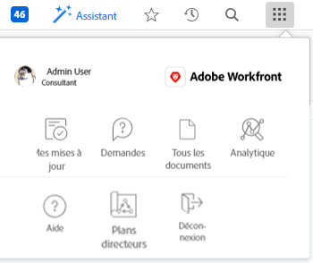

# Présentation de la navigation pour un utilisateur ou une utilisatrice de la licence [!UICONTROL Révision]

Le [!UICONTROL Menu principal] change selon le niveau d’accès que votre équipe d’administration [!DNL Adobe Workfront] vous a attribué. Par défaut, vous n’avez accès qu’aux zones qui incluent les fonctionnalités autorisées par votre niveau d’accès. Pour comprendre les composants de la disposition par défaut de chaque niveau d’accès, consultez [À propos de la disposition  [!DNL Adobe Workfront]  par défaut](../../../administration-and-setup/customize-workfront/use-layout-templates/about-the-default-wf-layout.md).

## Présentation du [!UICONTROL Menu principal] par défaut des [!UICONTROL réviseurs et réviseuses]

En tant que [!UICONTROL réviseur ou réviseuse], votre principale responsabilité est de réviser, de commenter et d’approuver le travail. Pour cela, vous utilisez les zones visibles dans le [!UICONTROL Menu principal].

Les zones suivantes sont incluses dans la disposition par défaut des [!UICONTROL réviseurs et réviseuses] :

* **[!UICONTROL Mes mises à jour]** : la zone **[!UICONTROL Accueil]** disponible pour tous les niveaux d’accès est remplacée par la zone **[!UICONTROL Mes mises à jour]** par défaut pour les utilisateurs et utilisatrices d’une licence de révision. En tant que [!UICONTROL réviseur ou réviseuse], vous ne terminez pas le travail. Vous ne voyez que les informations sur le travail que vous devez réviser, commenter ou approuver. La zone **[!UICONTROL Mes mises à jour]** vous permet d’effectuer ces actions. Il s’agit de la zone de destination par défaut pour les nouveaux réviseurs et réviseuses.

  >[!TIP]
  >
  >Votre administrateur ou administratrice [!DNL Workfront] ou de groupes peut vous affecter un modèle de mise en page qui peut modifier votre page de destination par défaut. Vous pouvez également, à l’aide d’un modèle de mise en page, afficher les zones [!UICONTROL Accueil] et [!UICONTROL Mises à jour] en tant qu’utilisateur ou utilisatrice de la licence de [!UICONTROL Révision].

* **[!UICONTROL Demandes]** : vous pouvez soumettre et examiner les demandes que vous, ainsi que d’autres utilisateurs et utilisatrices de votre entreprise, avez envoyées dans cette zone.
* **[!UICONTROL Documents]** : vous pouvez charger des documents ou examiner les documents partagés avec vous ici.
* **[!UICONTROL Plans directeurs]** : examinez les plans directeurs existants de votre système et demandez à en installer un, si l’équipe d’administration [!DNL Workfront] a configuré la file d’attente des demandes pour les plans directeurs. Pour plus d’informations, voir [Vue d’ensemble des plans directeurs](../../../administration-and-setup/blueprints/blueprints-overview.md).

## Personnaliser votre [!UICONTROL Menu principal] par défaut

Votre équipe d’administration [!DNL Workfront] peut modifier votre mise en page par défaut [!DNL Workfront] en vous attribuant un modèle de mise en page. Pour plus d’informations sur l’utilisation des modèles de mise en page, voir [Personnaliser le [!UICONTROL Menu principal] à l’aide d’un modèle de mise en page](../../../administration-and-setup/customize-workfront/use-layout-templates/customize-main-menu.md).
