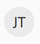

# Vue d’ensemble des objets [!DNL Adobe Workfront]

<!--Audited: 12/2023-->

<!--
<***Linked to several articles, do not remove/ change. 
-->

Les informations que vous affichez dans [!DNL Adobe Workfront] sont représentées par des objets stockés dans la base de données [!DNL Workfront]. Les objets sont ce qui motive les informations dans [!DNL Workfront].

Il est important de comprendre comment les objets sont définis dans [!DNL Workfront] afin que vous puissiez utiliser l’objet correct en fonction des besoins de votre organisation.

Par exemple, lorsque vous planifiez une grande quantité de travail, vous devez utiliser l’objet [!UICONTROL Project] pour définir cette tâche. Pour diviser ce travail en incréments planifiés plus petits, vous pouvez utiliser l’objet [!UICONTROL Task] . Pour effectuer un travail plus réduit qui n’est pas planifié et qui peut se produire de manière inattendue, vous pouvez utiliser l’objet Problème . Si vous souhaitez suivre l&#39;avancement et le respect du budget et de la chronologie d&#39;un groupe de projets, vous pouvez les organiser en [!UICONTROL Portfolios] et [!UICONTROL Programmes]. Pour définir d’autres éléments qui vous aident à résoudre votre travail, vous souhaitez utiliser d’autres objets stockés sous [!UICONTROL Projects], [!UICONTROL Tasks], [!UICONTROL Issues] ou [!UICONTROL Portfolios], tels que [!UICONTROL Documents], [!UICONTROL Updates], [!UICONTROL Hours], [!UICONTROL Users]} ou [!UICONTROL Rôles de tâche].

Les [!UICONTROL rapports] et les [!UICONTROL tableaux de bord] sont un autre exemple d’objets qui peuvent vous aider à organiser visuellement la quantité de données dans [!DNL Workfront] afin de le rendre facilement accessible à tous les utilisateurs.

Pour obtenir la liste complète des objets dans [!DNL Workfront], consultez l’ [explorateur d’API](../../../wf-api/general/api-explorer.md).

## Interdépendance et hiérarchie des objets

Les objets sont liés les uns aux autres dans [!UICONTROL Workfront]. Par exemple, une tâche ou un problème ne peut jamais exister indépendamment en dehors d’un projet. [!UICONTROL Tâches] et [!UICONTROL problèmes] sont des exemples d’objets stockés dans l’objet [!UICONTROL project]. [!UICONTROL Les tâches] et les [!UICONTROL problèmes] sont considérés comme des objets enfants des projets.

Voici quelques-uns des objets les plus couramment utilisés dans [!DNL Workfront] et leurs objets parents et enfants respectifs :

| **Objet** | **Objets parents** | **Objets enfant** |
|---|---|---|
| [!UICONTROL Portefeuilles] |  | [!UICONTROL Programmes], [!UICONTROL Projets], [!UICONTROL Documents], [!DNL Notes], [!UICONTROL Utilisateurs] |
| [!UICONTROL Programmes] | [!UICONTROL Portefeuilles] | [!UICONTROL Projets], [!UICONTROL Documents], [!UICONTROL Notes], [!UICONTROL Utilisateurs] |
| [!UICONTROL Projets] | [!UICONTROL Portfolios], [!UICONTROL Programmes] | [!UICONTROL Tâches], [!UICONTROL Problèmes], [!UICONTROL Documents], [!UICONTROL Notes], [!UICONTROL Heures], [!UICONTROL Utilisateurs] |
| [!UICONTROL Tâches] | [!UICONTROL Projets] | [!UICONTROL Problèmes], [!UICONTROL Tâches Enfants], [!UICONTROL Documents], [!UICONTROL Notes], [!UICONTROL Heures], [!UICONTROL Utilisateurs] |
| [!UICONTROL Événements] | [!UICONTROL Tâches], [!UICONTROL Projets] | [!UICONTROL Documents], [!UICONTROL Notes], [!UICONTROL Heures], [!UICONTROL Utilisateurs] |
| [!UICONTROL Tableaux de bord] |  | [!UICONTROL Rapports], Pages externes |
| [!UICONTROL Rapports] | [!UICONTROL Tableaux de bord] |  |
| [!UICONTROL Groupes] |  | [!UICONTROL Utilisateurs ou utilisatrices] |
| [!UICONTROL Équipes] |  | [!UICONTROL Utilisateurs ou utilisatrices] |
| [!UICONTROL Utilisateurs ou utilisatrices] | [!UICONTROL Groupes], [!UICONTROL Équipes], [!UICONTROL Entreprises] | [!UICONTROL Rôles de tâche] |
| [!UICONTROL Entreprises] |  | [!UICONTROL Utilisateurs ou utilisatrices] |
| [!UICONTROL Documents] | [!UICONTROL Tâches], [!UICONTROL Problèmes], [!UICONTROL Projets], [!UICONTROL Portfolios], [!UICONTROL Programmes], [!UICONTROL Utilisateurs] |  |
| [!UICONTROL Plans]* |  | [!UICONTROL Initiatives] |
| [!DNL Goals]* |  | [!UICONTROL Résultats], [!UICONTROL Activités] |

Pour obtenir la liste complète des objets dans [!DNL Workfront], consultez l’ [explorateur d’API](../../../wf-api/general/api-explorer.md).

*Les plans sont les objets de la [!DNL Adobe Workfront Scenario Planner]. Pour plus d’informations sur [!DNL Scenario Planner], consultez la [présentation du [!UICONTROL planificateur de scénario]](../../../scenario-planner/scenario-planner-overview.md).

*[!UICONTROL Goals] sont les objets de [!DNL Adobe Workfront Goals]. Pour plus d&#39;informations sur [!DNL Workfront Goals], voir [[!DNL Adobe Workfront Goals] overview](../../../workfront-goals/goal-management/wf-goals-overview.md).

## Personnalisation des noms d’objet

En tant qu&#39;administrateur [!DNL Workfront], vous pouvez personnaliser les noms d&#39;objet dans [!DNL Workfront] à l&#39;aide d&#39;un [!UICONTROL  modèle de mise en page ].

Pour plus d’informations sur la personnalisation des noms d’objet à l’aide d’un [!UICONTROL modèle de mise en page], voir [ Créer et gérer des modèles de mise en page](../../../administration-and-setup/customize-workfront/use-layout-templates/create-and-manage-layout-templates.md).

Une fois que vous avez personnalisé un modèle de mise en page et que vous l’avez attribué aux utilisateurs, ces derniers voient les noms personnalisés des objets. Les utilisateurs qui ont été affectés au modèle de mise en page ne voient plus les noms par défaut des objets, n’importe où dans l’application web.

Par exemple, si la plus grande partie du travail effectué dans votre organisation est appelée &quot;Engagement&quot;, vous pouvez remplacer le nom &quot;[!UICONTROL Projet]&quot; par &quot;Engagement&quot;. Votre interface [!DNL Workfront] affiche &quot;Engagement&quot; au lieu de &quot;[!UICONTROL Projet]&quot; partout où le nom &quot;[!UICONTROL Projet]&quot; s’affiche.

>[!NOTE]
>
>Pour que les nouveaux noms des objets soient visibles pour vos utilisateurs, ils doivent se déconnecter et se reconnecter à [!DNL Workfront] après avoir enregistré le [!UICONTROL modèle de mise en page].

>[!IMPORTANT]
>
>La documentation [!DNL Workfront] fait toujours référence aux noms par défaut des objets. En tant qu&#39;administrateur [!DNL Workfront], veillez à informer les utilisateurs des modifications apportées aux noms d&#39;objet afin qu&#39;ils puissent comprendre comment utiliser la documentation [!DNL Workfront], ainsi que les zones des applications qui ne reflètent pas les modifications apportées aux noms des objets.

* [Noms d’objet qui peuvent être personnalisés à l’aide d’un [!UICONTROL modèle de mise en page]](#object-names-that-can-be-customized-using-a-layout-template)
* [Zones de  [!DNL Workfront] qui reflètent les noms d’objet personnalisés](#areas-of-workfront-that-reflect-the-customized-object-names)
* [Zones de  [!DNL Workfront] qui ne reflètent pas les noms d’objet personnalisés](#areas-of-workfront-that-do-not-reflect-the-customized-object-names)

### Noms d’objet qui peuvent être personnalisés à l’aide d’un [!UICONTROL modèle de mise en page]

En tant qu&#39;administrateur [!DNL Workfront], vous pouvez personnaliser les noms des objets suivants pour qu&#39;ils correspondent à la terminologie de votre entreprise :

* [!UICONTROL Portfolio]
* [!UICONTROL Programme]
* [!UICONTROL Projet]
* [!UICONTROL Tâche]
* [!UICONTROL Problème]
* [!UICONTROL Objectif]*
* [!UICONTROL Result]*
* [!UICONTROL Activité]*

  *[!UICONTROL Goals], [!UICONTROL results] et [!UICONTROL activities] ne sont disponibles que si votre société a acheté [!DNL Workfront Goals]. Pour plus d&#39;informations sur [!DNL Workfront Goals], voir [[!DNL Adobe Workfront Goals] overview](../../../workfront-goals/goal-management/wf-goals-overview.md).

* [!UICONTROL Initiative]**
* [!UICONTROL Scénario]**
* [!UICONTROL Plan]**

  **[!UICONTROL Initiatives], [!UICONTROL scénarios] et [!UICONTROL plans] ne sont disponibles que si votre société a acheté le [!DNL Workfront Scenario Planner]. Pour plus d’informations sur [!DNL Scenario Planner], voir [Prise en main de  [!DNL Scenario Planner]](../../../scenario-planner/get-started-with-scenario-planning.md).

Pour plus d’informations sur la personnalisation des noms d’objet à l’aide de [!UICONTROL Modèles de mise en page], voir [Création et gestion des modèles de mise en page](../../../administration-and-setup/customize-workfront/use-layout-templates/create-and-manage-layout-templates.md).

Vous ne pouvez pas personnaliser les noms d’un autre objet dans Workfront. Pour obtenir la liste complète des objets dans [!DNL Workfront], consultez l’ [explorateur d’API](../../../wf-api/general/api-explorer.md).

Lorsque vous personnalisez le nom d’un objet, le nouveau nom de cet objet s’affiche dans la plupart des zones de l’application [!DNL Workfront] où ce nom d’objet s’affiche.

### Zones de [!DNL Workfront] qui reflètent les noms d’objet personnalisés

Les zones suivantes indiquent le nom mis à jour des objets :

* Barre de navigation supérieure
* Toutes les sections dans la navigation du panneau de gauche
* Tous les menus
* Notifications in-app
* Éléments de Report Builder et de rapport (vues, filtres et regroupements)
* Boutons [!UICONTROL Enregistrer]
* Fichiers exportés
* E-mails
* Applications mobiles

### Zones de [!DNL Workfront] qui ne reflètent pas les noms d’objet personnalisés

Les zones suivantes n’affichent pas le nom mis à jour des objets :

<!--
  <li data-mc-conditions="QuicksilverOrClassic.Draft mode"> 
Referenced Object Type selection for a Typeahead field in a Custom Form 
 
(NOTE: drafting this because I don't think this is true)
 </li>
  -->

* [!DNL Outlook] Module complémentaire

### Implications de la personnalisation des noms d’objet

Vous devez tenir compte des points suivants lors de la personnalisation des noms d’objet dans [!DNL Workfront] :

* Vous pouvez rencontrer des erreurs de syntaxe ou de grammaire dans les affichages du système. Par exemple, si vous renommez &quot;[!UICONTROL Problème]&quot; en &quot;Requête&quot; et que vous voyez partout dans le système l’expression &quot;Une requête&quot;, cela fonctionne comme prévu et ne doit pas être considéré comme un bogue.
* Les noms personnalisés des objets ne sont pas traduisibles. Seuls les noms par défaut [!DNL Workfront] peuvent être traduits dans les langues prises en charge. Pour plus d’informations sur les langues prises en charge dans [!DNL Workfront], voir [Langues prises en charge dans [!DNL Adobe Workfront]](../../../workfront-basics/supported-languages-in-workfront.md). Les champs de nom d’objet personnalisé prennent en charge les caractères étrangers afin que vous puissiez saisir la terminologie dans n’importe quelle langue.
* Lorsque vous personnalisez des noms d’objet à l’aide d’un [!UICONTROL modèle de mise en page], nous vous recommandons d’affecter vos [!UICONTROL  modèles de mise en page] en fonction de vos unités opérationnelles (équipes ou groupes).\
   Nous vous recommandons d’utiliser des noms clairement compris par les utilisateurs de ces unités afin d’éviter toute confusion.
* Les notifications par e-mail et les rapports distribués contiennent toujours des noms d’objet tels que définis par le [!UICONTROL modèle de mise en page] de l’utilisateur qui génère le courrier électronique. Vos utilisateurs doivent être prêts à voir dans leurs emails des noms d’objet qui ne sont pas liés à leur groupe ou équipe, s’ils reçoivent des notifications par e-mail d’utilisateurs d’autres équipes et groupes.\
   En tant qu&#39;administrateur [!DNL Workfront], conseillez aux utilisateurs de noter les icônes associées à chaque objet. Les icônes restent cohérentes entre les différents noms d’objet et cohérentes avec l’objet par défaut, tel qu’il apparaît dans la base de données. Pour obtenir la liste de toutes les icônes [!DNL Workfront] associées aux objets, voir [Icônes d’objet](#object-icons).

  >[!TIP]
  >
  >Pour les tâches courantes de votre entreprise, pensez à créer une documentation personnalisée reflétant votre terminologie.

## Icônes d’objet

La documentation [!DNL Workfront] fait toujours référence aux noms par défaut des objets. Si les noms de vos objets ont été personnalisés, vous pouvez vous fier à l’icône qui leur est associée pour déterminer l’objet personnalisé qui correspond à l’objet par défaut [!DNL Workfront].

Pour plus d’informations sur les objets qui peuvent avoir des noms personnalisés dans [!DNL Workfront], voir [Noms d’objet qui peuvent être personnalisés à l’aide d’un [!UICONTROL  modèle de mise en page]](#object-names-that-can-be-customized-using-a-layout-template).

Vous trouverez ci-dessous une liste d’objets et leurs icônes correspondantes dans Workfront.

| **Objet** | **Icône** | **Nom d’objet personnalisable** |
|---|---|---|
| [!UICONTROL Entreprise] |  ,  |  |
| [!UICONTROL Tableau de bord] |  ,  |  |
| [!UICONTROL Objectif] |  | ✔ |
| [!UICONTROL Groupe] |  ,  |  |
| [!UICONTROL Problème] |  ,  | ✔ |
| [!UICONTROL Rôle de tâche] | , , ,  |  |
| [!UICONTROL Plan] | ,  |  |
| [!UICONTROL Portfolio] |  ,  | ✔ |
| [!UICONTROL Programme] |  ,  | ✔ |
| [!UICONTROL Projet] |  ,  | ✔ |
| [!UICONTROL Rapport] |  ,  |  |
| [!UICONTROL Tâche] |  ,  | ✔ |
| [!UICONTROL Équipe] | , ,  |  |
| [!UICONTROL Modèle] |  ,  |  |
| [!UICONTROL Utilisateur ou utilisatrice] |  ,  ,  ,  ,  |  |

## Nombre de références d’objets

Chaque objet créé dans [!DNL Workfront] se voit attribuer un numéro de référence unique. Les numéros de référence sont utiles pour distinguer deux objets similaires (par exemple, des tâches portant le même nom). Vous pouvez rechercher des objets à l’aide de leur numéro de référence et les inclure dans les rapports.

Pour plus d’informations sur la recherche d’objets par numéro de référence, voir [Utilisation du numéro de référence des objets](../../../workfront-basics/navigate-workfront/search/reference-number-of-objects.md).

## Recherches spécifiques à un objet

Vous pouvez effectuer des recherches dans tous les objets pouvant faire l’objet d’une recherche dans [!DNL Workfront] ou sélectionner un objet spécifique à rechercher dans vos recherches de base et avancées.

Tous les objets ne peuvent pas faire l’objet de recherches dans [!DNL Workfront]. Vous pouvez exécuter des recherches de base et avancées pour les objets suivants dans [!DNL Workfront] :

| **Objet** | **Recherche de base** | **Recherche avancée** |
|---|---|---|
| [!UICONTROL Projets] | ✓ | ✓ |
| [!UICONTROL Tâches] | ✓ | ✓ |
| [!UICONTROL Événements] | ✓ | ✓ |
| [!UICONTROL Rapports] | ✓ | ✓ |
| [!UICONTROL Utilisateurs ou utilisatrices] | ✓ | ✓ |
| [!UICONTROL Modèles] | ✓ | ✓ |
| [!UICONTROL Documents] | ✓ | ✓ |
| [!UICONTROL Portefeuilles] | ✓ | ✓ |
| [!UICONTROL Programmes] | ✓ | ✓ |
| [!UICONTROL Tableaux de bord] | ✓ | ✓ |
| [!UICONTROL Entreprises] | ✓ | ✓ |
| [!UICONTROL Notes] (ou [!UICONTROL Mises à jour]) | ✓ |  |

Pour plus d’informations sur l’exécution de recherches de base et avancées dans [!DNL Workfront], voir [Recherche [!DNL Adobe Workfront]](../../../workfront-basics/navigate-workfront/search/search-workfront.md).

## Accès limité aux objets

Lorsqu’un utilisateur n’a pas accès à un objet, il voit &quot;Aucun accès&quot; partout où ce nom s’affiche dans Workfront.

L’accès aux objets peut être limité au niveau d’accès ou dans les autorisations d’un objet spécifique.

Cela s’applique à tous les objets et aux objets enfants répertoriés dans la section [Interdépendance et hiérarchie des objets](#interdependency-and-hierarchy-of-objects) de cet article. Cela ne s’applique pas aux objets Equipe et Utilisateur.

## Rapport sur les objets

Il est extrêmement important de comprendre la hiérarchie et l’interdépendance des objets avant de commencer à créer des rapports dans [!DNL Workfront]. Les rapports sont spécifiques à un objet. Vous devez sélectionner l’objet correct pour votre rapport avant de pouvoir afficher les données de votre choix.

>[!IMPORTANT]
>
>Vous ne pouvez créer un rapport que sur l’objet sélectionné et les objets parents du même rapport. Vous ne pouvez pas avoir d’informations sur les objets enfants dans un rapport d’objet parent. Vous pouvez, par exemple, afficher les informations d’un projet dans un rapport de tâche, mais pas les informations d’une tâche dans un rapport de projet.

Vous pouvez créer des rapports sur tous les objets de la base de données à l’aide de notre API ouverte. Pour obtenir la liste complète de tous les objets de la base de données, voir [API Explorer](../../../wf-api/general/api-explorer.md).

>[!NOTE]
>
> * Si vous avez personnalisé les noms de vos objets à l’aide d’un modèle de mise en page, les noms de l’objet dans le créateur de rapports ont également été personnalisés. Assurez-vous de connaître les objets qui ont été personnalisés et recherchez leur nom dans le créateur de rapports. Pour plus d’informations sur les objets qui peuvent avoir des noms personnalisés dans [!DNL Workfront], voir [Noms d’objet qui peuvent être personnalisés à l’aide d’un [!UICONTROL  modèle de mise en page]](#object-names-that-can-be-customized-using-a-layout-template) dans cet article.
> * Lors de l’utilisation du mode texte dans vos rapports, les noms des objets dans les expressions du mode texte sont les noms standard dans [!DNL Workfront], et non les noms d’objet personnalisés. Pour plus d’informations sur l’utilisation du mode texte dans les rapports, voir [Présentation du mode texte](../../../reports-and-dashboards/reports/text-mode/understand-text-mode.md).

Pour plus d’informations sur la création d’un rapport, voir [Création d’un rapport personnalisé](../../../reports-and-dashboards/reports/creating-and-managing-reports/create-custom-report.md).\
Pour plus d’informations sur notre API, voir [API Explorer](../../../wf-api/general/api-explorer.md).

### Objets disponibles pour les rapports

Vous pouvez créer des rapports sur les objets suivants lors de l’utilisation du créateur de rapports dans l’application web [!DNL Workfront]. Les puces avec retrait donnent plus d’informations sur l’objet et ne représentent pas d’objets supplémentaires.

* [!UICONTROL Projet]
* [!UICONTROL Tâche]
* [!UICONTROL Heure]
* [!UICONTROL Problème]
* [!UICONTROL Utilisateur ou utilisatrice]
* Niveau [!UICONTROL Accès]
* [!UICONTROL Approbation]
* [!UICONTROL Processus d’approbation]
* [!UICONTROL Attribution]
* [!UICONTROL Baseline]
* [!UICONTROL Tâche de ligne de base]
* [!UICONTROL Enregistrement de facturation]
* [!UICONTROL Heure budgétée]
   * Il s’agit des [!UICONTROL heures budgétées], telles qu’elles apparaissent dans les anciens outils de gestion des ressources obsolètes.
   * Le &quot;Bud. Le champ &quot;Hours&quot; du rapport [!UICONTROL Heure budgétée] fait référence aux heures budgétisées des rôles de tâche dans le [!UICONTROL planificateur de ressources]. Pour plus d’informations, voir [Comprendre le [!UICONTROL coût de la main-d’oeuvre budgétisé] et [!UICONTROL  heures budgétisées] pour les projets](../../../manage-work/projects/project-finances/budgeted-labor-cost.md).

* [!UICONTROL Événement de calendrier]
* [!UICONTROL Entreprise]
* [!UICONTROL Formulaire personnalisé]
* [!UICONTROL Tableau de bord]
* [!UICONTROL Document]
* [!UICONTROL Approbation de document]
* [!UICONTROL Version du document]
   * Vous pouvez afficher des informations sur la version du document, le document auquel la version est associée, qui a créé la version et l’utilisateur qui a créé le BAT sur la version du document, le cas échéant (Créateur de BAT).
* [!UICONTROL Modèle de courrier électronique]
* [!UICONTROL Frais]
* [!UICONTROL Type de dépense]
* [!UICONTROL Page externe]
* [!UICONTROL Favori]
* [!UICONTROL Filtre]
* [!UICONTROL Objectif]
   * Vous pouvez créer un rapport pour les objectifs stratégiques ou afficher des informations relatives aux objectifs dans un rapport de projet lorsque les projets sont associés aux objectifs en tant qu’activités d’objectif. Vous pouvez créer des objectifs stratégiques et connecter des projets uniquement si votre entreprise a acheté une licence [!DNL Workfront Goals]. Pour plus d&#39;informations sur [!DNL Workfront Goals], voir [[!DNL Workfront Goals] overview](../../../workfront-goals/goal-management/wf-goals-overview.md). Pour plus d’informations sur la connexion des projets aux objectifs stratégiques, voir [Ajout de projets aux objectifs dans les objectifs Adobe Workfront](../../../workfront-goals/results-and-activities/connect-projects-to-goals-overview.md).
*Vous ne pouvez pas générer de rapports sur les objectifs de projet associés à un [!UICONTROL Business Case]. Pour plus d’informations sur les objectifs du projet par rapport aux objectifs stratégiques, consultez le [Glossaire de [!DNL Adobe Workfront] terminologie](../../../workfront-basics/navigate-workfront/workfront-navigation/workfront-terminology-glossary.md).

* [!UICONTROL Groupe]
* [!UICONTROL Groupement]
* [!UICONTROL Type d’heure]
* [!UICONTROL Initiative]
   * Vous pouvez créer un rapport pour les initiatives qui sont des objets enfants d’un plan uniquement si votre entreprise a acheté une licence [!DNL Workfront Scenario Planner]. Pour plus d’informations sur les initiatives, consultez la [présentation des initiatives dans le  [!DNL Workfront Scenario Planner]](../../../scenario-planner/initiatives-overview.md).

* Fonction d&#39;initiative
   * Vous pouvez créer un rapport pour les rôles de tâche associés aux initiatives d’un plan uniquement si votre entreprise a acheté une licence [!DNL Workfront Scenario Planner]. Pour plus d’informations sur la création d’initiatives et leur association à des rôles de tâche, voir [Créer et modifier des initiatives dans le [!DNL Workfront Scenario Planner]](../../../scenario-planner/create-and-edit-initiatives.md).

* [!UICONTROL Itération]
* [!UICONTROL Rôle de tâche]
* [!UICONTROL Entrée du journal]
   * Vous pouvez créer des rapports sur les mises à jour système suivies dans la zone [!UICONTROL Mises à jour] d’objets tels que des tâches, des projets, des problèmes, etc. Pour plus d’informations, voir [Rapport sur la [!UICONTROL zone Mises à jour]](../../../reports-and-dashboards/reports/creating-and-managing-reports/create-journal-entry-report.md).

* [!UICONTROL Modèle de mise en page]
* [!UICONTROL Milestone]
* [!UICONTROL Chemin jalonné]
* [!UICONTROL Remarque] ou [!UICONTROL Mises à jour]
   * Vous pouvez créer des rapports sur les commentaires ajoutés par des utilisateurs individuels.

* [!UICONTROL Paramètre] (ou [!UICONTROL Champ personnalisé])
* [!UICONTROL Groupe de paramètres] (ou [!UICONTROL Saut de section])
* [!UICONTROL Portfolio]
* [!UICONTROL Programme]
* [!UICONTROL Projet (données financières)]
   * Les informations financières sont renseignées dans les rapports [!UICONTROL Projet (données financières)] uniquement lorsque les données qui y sont associées ont moins de 5 ans. Par exemple, si un rôle de tâche a été attribué à une tâche en janvier 2015 et qu’aujourd’hui est septembre 2021, un champ financier comme la [!UICONTROL Date d’affectation] pour le rôle de tâche ne figure pas dans le rapport [!UICONTROL Projet (données financières)].

  >[!CAUTION]
  >
  >L’exécution d’un rapport Projet (données financières) permet de recalculer les données financières, ce qui peut entraîner une surcharge des données financières précédentes et nécessiter un temps important. Pour plus d&#39;informations sur les conséquences du recalcul des données financières, voir [Recalculer les finances du projet](/help/quicksilver/manage-work/projects/project-finances/recalculate-project-finances.md).

* [!UICONTROL Approbation d&#39;épreuve]
   * Vous permet d’afficher diverses informations sur la validation du BAT, notamment : le BAT qui a été envoyé pour approbation, des informations sur l’ [!UICONTROL approbateur], des informations sur le demandeur (si le demandeur est un utilisateur possédant une licence [!DNL Workfront]), des informations sur la version, l’identifiant du BAT et la date de création du BAT.\
      Les rapports [!UICONTROL Approbation de BAT] incluent uniquement les bons à tirer disponibles dans les zones Mon travail des utilisateurs où les décisions n’ont pas encore été prises.\
   * Les validations de BAT sont attribuées dans [!DNL Workfront] comme décrit [Ajouter des utilisateurs à un BAT](../../../review-and-approve-work/proofing/managing-proofs-within-workfront/share-a-proof-in-workfront.md#add) dans [Partager un BAT dans [!DNL Adobe Workfront]](../../../review-and-approve-work/proofing/managing-proofs-within-workfront/share-a-proof-in-workfront.md).

* [!UICONTROL Queue]
* [!UICONTROL Rubrique de file d’attente]
* [!UICONTROL Rate] (affiche les informations relatives au rôle de tâche [!UICONTROL Taux de facturation])
* [!UICONTROL Notification de rappel]
* [!UICONTROL Rapport]
* [!UICONTROL Groupe de ressources]
* [!UICONTROL Risque]
* [!UICONTROL Type de risque]
* [!UICONTROL Planning]
* [!UICONTROL Fiche d’évaluation]
* [!UICONTROL Équipe]
* [!UICONTROL Modèle]
* [!UICONTROL Tâche de modèle]
* [!UICONTROL Time Off]
   * Vous pouvez créer des rapports sur le temps de pause d’un utilisateur comme indiqué par celui-ci dans son profil.

* [!UICONTROL Feuille de temps]
* [!UICONTROL Profil de feuille de calcul ]
* [!UICONTROL Groupe de rubriques]
* [!UICONTROL Approbation de l’utilisateur]
* [!UICONTROL Délégation d’utilisateurs]

   * Vous pouvez créer des rapports sur les utilisateurs qui ont été délégués pour effectuer les tâches et les problèmes d’autres utilisateurs lorsqu’ils sont absents du bureau. Ce rapport présente l’utilisateur absent du bureau ainsi que l’utilisateur qui remplit ses fonctions lorsqu’il est absent.

* [!UICONTROL Décisions d’utilisateurs]

   * Vous pouvez créer un rapport sur le nombre de décisions que les utilisateurs ont prises sur les bons à tirer et les documents au cours du mois en cours.

* [!UICONTROL Afficher]
* [!UICONTROL Élément de travail] (produit un rapport pour les tâches et les problèmes)
