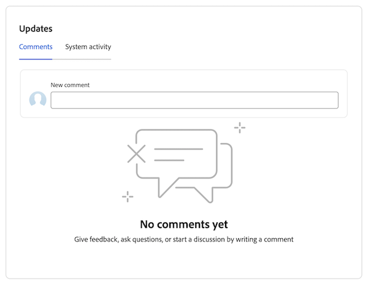

# Ajouter et afficher des commentaires dans Priorités

Vous pouvez ajouter une mise à jour sur une tâche ou un événement pour communiquer à d’autres personnes l’avancement de l’élément de travail.

Priorités affiche les éléments de travail qui vous sont affectés. Vous ne pouvez pas voir les éléments de travail affectés à votre équipe.

## Conditions d’accès

+++ Développez pour afficher les exigences d’accès aux fonctionnalités de cet article.

<table style="table-layout:auto"> 
 <col> 
 </col> 
 <col> 
 </col> 
 <tbody> 
  <tr> 
   <td role="rowheader"><strong>Package Adobe Workfront</strong></td> 
   <td> 
Tous
 </td> 
  </tr> 
  <tr> 
   <td role="rowheader"><strong>Licence Adobe Workfront</strong></td> 
   <td> 
   
Demande ou niveau supérieur pour les problèmes et les documents ; Révision ou niveau supérieur pour tous les autres objets

   
Contributeur ou version ultérieure pour les événements et les documents : légère ou supérieure pour tous les autres objets
 
   </td> 
  </tr> 
  <tr> 
   <td role="rowheader"><strong>Configurations des niveaux d’accès</strong></td> 
   <td> 
Accès Afficher ou Modifier à l’objet mis à jour
</td> 
  </tr> 
  <tr> 
   <td role="rowheader"><strong>Autorisations d’objet</strong></td> 
   <td> 
Accès Afficher à l’objet
</td> 
  </tr> 
 </tbody> 
</table>

Pour plus d’informations, voir [Conditions d’accès dans la documentation Workfront](/help/quicksilver/administration-and-setup/add-users/access-levels-and-object-permissions/access-level-requirements-in-documentation.md).

+++

## Ajouter un commentaire rapide

Vous pouvez ajouter un commentaire à partir de la liste de travail :

{{step1-to-priorities}}

1. Recherchez l’élément de travail à mettre à jour.
1. Passez la souris sur le nom, puis cliquez sur **Ajouter une nouvelle mise à jour**.
   
   <!--new screen for prod -->
1. Commencez à saisir votre commentaire.
1. (Facultatif) Dans la zone **Identifier des personnes ou des équipes**, commencez à saisir le nom ou l’adresse e-mail d’un utilisateur ou d’une équipe que vous souhaitez inclure dans ce commentaire, puis sélectionnez-le lorsqu’il s’affiche dans la liste.
1. (Facultatif) Utilisez les options de la barre d’outils Texte enrichi pour mettre en forme votre texte, ajouter des émoticônes, des liens ou des images à votre commentaire, afin d’améliorer votre contenu.
1. Cliquez sur **Envoyer** pour ajouter le commentaire à l’élément de travail.

   >[!IMPORTANT]
   >
   >Vous ne pouvez modifier votre commentaire que dans les 15 minutes suivant sa soumission. Pour modifier un commentaire, cliquez sur le menu **Plus** dans le coin supérieur droit du commentaire, puis cliquez sur **Modifier**.

Pour plus d’informations sur l’ajout de mises à jour, voir [ Ajouter une mise à jour à un élément de travail ](/help/quicksilver/workfront-basics/updating-work-items-and-viewing-updates/update-work.md).

## Afficher et ajouter des commentaires et des mises à jour système dans un élément de travail

Vous pouvez ajouter des commentaires et afficher des commentaires et des mises à jour du système dans un élément de travail individuel :

{{step1-to-priorities}}

1. Cliquez sur le nom d’un élément de travail pour ouvrir la page **Aperçu**.
1. Recherchez la zone **Mises à jour** dans le coin inférieur droit de l’écran.
1. (Facultatif) Utilisez l’onglet **Commentaires** pour afficher les mises à jour effectuées par d’autres personnes sur l’élément de travail.
1. (Facultatif) Utilisez l’onglet **Activité du système** pour afficher l’activité du système associée à l’élément de travail.
1. (Facultatif) Pour ajouter un commentaire, accédez à l’onglet **Commentaire** et commencez la saisie dans la zone **Nouveau commentaire**. Cliquez sur **Soumettre** lorsque vous avez terminé.
   

## Répondre à un commentaire

Vous pouvez répondre à un commentaire dans un élément de travail :

{{step1-to-priorities}}

1. Cliquez sur le nom d’un élément de travail pour ouvrir la page **Aperçu**.
1. Recherchez la zone **Mises à jour** dans le coin inférieur droit de l’écran.
1. Dans l’onglet **Commentaires**, recherchez le commentaire auquel vous souhaitez répondre, puis cliquez sur **Répondre**.
1. (Conditionnel) Si vous souhaitez importer le contenu d’un message dans votre réponse, cliquez sur l’icône de menu **Plus**  à côté du corps du message et choisissez **Citer la réponse**.

1. Saisissez votre réponse, puis cliquez sur **Envoyer**.

   >[!IMPORTANT]
   >
   >Vous ne pouvez modifier votre commentaire que dans les 15 minutes suivant sa soumission. Pour modifier un commentaire, cliquez sur le menu **Plus** dans le coin supérieur droit du commentaire, puis cliquez sur **Modifier**.

   
