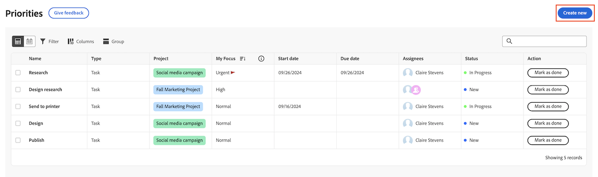

# Créer une tâche ou un événement dans Priorités

Vous pouvez créer de nouvelles tâches et de nouveaux événements directement à partir des Priorités :

## Conditions d’accès

+++ Développez pour afficher les exigences d’accès aux fonctionnalités de cet article.

Vous devez disposer des accès suivants pour effectuer les étapes décrites dans cet article :

<table style="table-layout:auto"> 
 <col> 
 </col> 
 <col> 
 </col> 
 <tbody> 
  <tr> 
   <td role="rowheader"><strong>Formule Adobe Workfront</strong></td> 
   <td> 
Tous
 </td> 
  </tr> 
  <tr> 
   <td role="rowheader"><strong>Licence Adobe Workfront*</strong></td> 
   <td> 
   
Actuel : Demander ou supérieur pour les demandes ; Vérifier ou supérieur pour les problèmes ; Travailler ou supérieur pour les tâches

   
Nouveau : Contributeur ou version ultérieure pour les demandes ; Léger ou version ultérieure pour les problèmes et documents : Tâches standard ou version ultérieure.
 
   </td> 
  </tr> 
  <tr> 
   <td role="rowheader"><strong>Configurations des niveaux d’accès</strong></td> 
   <td> 
Accès Afficher ou Modifier à l’objet mis à jour
</td> 
  </tr> 
  <tr> 
   <td role="rowheader"><strong>Autorisations d’objet</strong></td> 
   <td> 
Accès Afficher à l’objet
</td> 
  </tr> 
 </tbody> 
</table>

*Pour plus d’informations, voir [Conditions d’accès requises dans la documentation Workfront](/help/quicksilver/administration-and-setup/add-users/access-levels-and-object-permissions/access-level-requirements-in-documentation.md).

+++

## Créer des tâches ou des événements dans les priorités

Vous pouvez créer une tâche ou un événement dans un projet. Priorités affiche les éléments de travail qui vous sont affectés. Vous ne pouvez pas voir les éléments de travail affectés à votre équipe dans la liste de travail Priorités.

>[!NOTE]
>
>Si vous disposez d’une licence de type Requête ou Contributeur, vous pouvez créer une requête directement dans Priorités.

Pour créer une tâche ou un événement dans un projet :

{{step1-to-priorities}}

1. Cliquez sur **Créer** dans le coin supérieur droit.
   
1. Indiquez les informations suivantes :

   | champ | Instructions |
   |---------------|-------------|
   | Type d’élément de travail (facultatif) | Choisissez si vous souhaitez créer une **Tâche** ou **Problème**. |
   | Nom | Entrez un nom. |
   | Description (facultative) | Saisissez une description. |
   | Projet | Commencez à saisir le nom d’un projet, puis sélectionnez-le dans la liste déroulante. |
   | Cessionnaires (Facultatif) | Affectez des personnes à l’élément de travail. |
   | Date d’échéance (facultatif) | Choisissez une date d&#39;échéance. |

1. Cliquez sur **Créer**.
