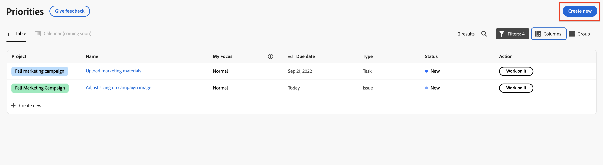

# Création d’une tâche ou d’un problème dans les priorités

Vous pouvez créer de nouvelles tâches et de nouveaux problèmes directement à partir des priorités :

## Conditions d’accès

+++ Développez pour afficher les exigences d’accès aux fonctionnalités de cet article.

Vous devez disposer des accès suivants pour effectuer les étapes décrites dans cet article :

<table style="table-layout:auto"> 
 <col> 
 </col> 
 <col> 
 </col> 
 <tbody> 
  <tr> 
   <td role="rowheader"><strong>Formule Adobe Workfront</strong></td> 
   <td> 
Tous
 </td> 
  </tr> 
  <tr> 
   <td role="rowheader"><strong>Licence Adobe Workfront*</strong></td> 
   <td> 
   
Actuel : demande pour les requêtes ; révision ou version ultérieure pour les problèmes ; travail ou version ultérieure pour les tâches

   
Nouveau : contributeur ou plus pour les demandes ; clair ou supérieur pour les problèmes <!--and documents--> : tâches standard ou supérieures
 
   </td> 
  </tr> 
  <tr> 
   <td role="rowheader"><strong>Configurations des niveaux d’accès</strong></td> 
   <td> 
Accès Afficher ou Modifier à l’objet mis à jour
</td> 
  </tr> 
  <tr> 
   <td role="rowheader"><strong>Autorisations d’objet</strong></td> 
   <td> 
Accès Afficher à l’objet
</td> 
  </tr> 
 </tbody> 
</table>

*Pour plus d’informations, voir [Conditions d’accès requises dans la documentation Workfront](/help/quicksilver/administration-and-setup/add-users/access-levels-and-object-permissions/access-level-requirements-in-documentation.md).

+++

## Création de tâches ou de problèmes dans les priorités

Vous pouvez créer une tâche ou un problème dans un projet.

>[!NOTE]
>
>Si vous disposez d’une licence de demande ou de contributeur, vous pouvez créer une demande directement dans Priorités.

Pour créer une tâche ou un problème dans un projet :

{{step1-to-priorities}}

1. Cliquez sur **Créer** dans le coin supérieur droit.
   
&lt;!—new screen pour prod —>
1. Indiquez les informations suivantes :

   | champ | Instructions |
   |---------------|-------------|
   | Type d’élément de travail (facultatif) | Choisissez si vous souhaitez créer une **tâche** ou **problème**. |
   | Nom | Entrez un nom. |
   | Description (facultative) | Saisissez une description. |
   | Projet | Commencez à saisir un nom de projet, puis sélectionnez-le dans la liste déroulante. |
   | Assignation (facultatif) | Affectez des personnes à l’élément de travail. |
   | Date d’échéance (facultatif) | Choisissez une date d&#39;échéance. |

1. Cliquez sur **Créer**.
