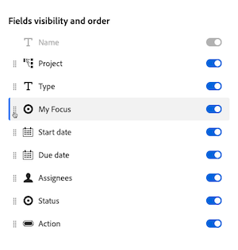

# Personnalisation des colonnes de la liste de travail des priorités

Les informations mises en surbrillance sur cette page font référence à des fonctionnalités qui ne sont pas encore disponibles de manière générale. Cette option n’est disponible que dans l’environnement de prévisualisation de sandbox.

Vous pouvez personnaliser les colonnes de la liste de travail dans Priorités pour prendre en charge votre manière de travailler.

>[!NOTE]
>
>Actuellement, vous ne pouvez pas ajouter de données personnalisées aux colonnes.

## Conditions d’accès

+++ Développez pour afficher les exigences d’accès aux fonctionnalités de cet article.

Vous devez disposer des accès suivants pour effectuer les étapes décrites dans cet article :

<table style="table-layout:auto"> 
 <col> 
 </col> 
 <col> 
 </col> 
 <tbody> 
  <tr> 
   <td role="rowheader"><strong>Formule Adobe Workfront</strong></td> 
   <td> 
Tous
 </td> 
  </tr> 
  <tr> 
   <td role="rowheader"><strong>Licence Adobe Workfront*</strong></td> 
   <td> 
   
Actuel : réviseur ou version ultérieure

   
Nouveau : Light ou supérieur
 
   </td> 
  </tr> 
  <tr> 
   <td role="rowheader"><strong>Configurations des niveaux d’accès</strong></td> 
   <td> 
Accès Afficher ou Modifier à l’objet mis à jour
</td> 
  </tr> 
  <tr> 
   <td role="rowheader"><strong>Autorisations d’objet</strong></td> 
   <td> 
Accès Afficher à l’objet
</td> 
  </tr> 
 </tbody> 
</table>

*Pour plus d’informations, voir [Conditions d’accès requises dans la documentation Workfront](/help/quicksilver/administration-and-setup/add-users/access-levels-and-object-permissions/access-level-requirements-in-documentation.md).

+++

## Personnalisation des colonnes de la liste de travail Priorités dans Production

### Activation ou désactivation de colonnes

{{step1-to-priorities}}

1. Cliquez sur **Colonnes** sur le côté droit de l’écran.
   
1. Utilisez les bascules pour activer ou désactiver les colonnes dans la liste de travail.

### Réorganiser les colonnes

{{step1-to-priorities}}

1. Cliquez sur **Colonnes** sur le côté droit de l’écran.
1. Cliquez sur l&#39;icône **Faire glisser** et déplacez la colonne à l&#39;emplacement de votre choix. Déplacement automatique des mises à jour des colonnes dans la liste de travail.
   

### Réinitialisation des largeurs de colonne

{{step1-to-priorities}}

1. Cliquez sur **Colonnes** sur le côté droit de l’écran.
1. Cliquez sur l&#39;icône **Plus**  et choisissez **Réinitialiser les largeurs de colonne**.
   

## Personnalisation des colonnes de la liste de travail Priorités dans Aperçu

### Activation ou désactivation de colonnes

{{step1-to-priorities}}

1. Cliquez sur **Colonnes** sur le côté gauche de l’écran.
   
1. Utilisez les bascules pour activer ou désactiver les colonnes dans la liste de travail.

### Réorganiser les colonnes

{{step1-to-priorities}}

1. Cliquez sur **Colonnes** sur le côté gauche de l’écran.
1. Cliquez sur l&#39;icône **Faire glisser** et déplacez la colonne à l&#39;emplacement de votre choix. Déplacement automatique des mises à jour des colonnes dans la liste de travail.
   

>[!NOTE]
>
>La colonne Nom est fixe et ne peut pas être déplacée.

