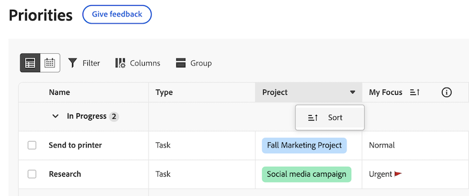

# Filtrage et regroupement de vos travaux avec des priorités

Les informations mises en surbrillance sur cette page font référence à des fonctionnalités qui ne sont pas encore disponibles de manière générale. Cette option n’est disponible que dans l’environnement de prévisualisation de sandbox.

Vous pouvez utiliser des filtres pour trouver le travail que vous recherchez, puis appliquer un groupement afin de le conserver organisé.

## Conditions d’accès

+++ Développez pour afficher les exigences d’accès aux fonctionnalités de cet article.

Vous devez disposer des accès suivants pour effectuer les étapes décrites dans cet article :

<table style="table-layout:auto"> 
 <col> 
 </col> 
 <col> 
 </col> 
 <tbody> 
  <tr> 
   <td role="rowheader"><strong>Formule Adobe Workfront</strong></td> 
   <td> 
Tous
 </td> 
  </tr> 
  <tr> 
   <td role="rowheader"><strong>Licence Adobe Workfront*</strong></td> 
   <td> 
   
Actuelle : demande ou niveau supérieur

   
Nouvelle : contributeur ou supérieure
 
   </td> 
  </tr> 
  <tr> 
   <td role="rowheader"><strong>Configurations des niveaux d’accès</strong></td> 
   <td> 
Accès Afficher ou Modifier à l’objet mis à jour
</td> 
  </tr> 
  <tr> 
   <td role="rowheader"><strong>Autorisations d’objet</strong></td> 
   <td> 
Accès Afficher à l’objet
</td> 
  </tr> 
 </tbody> 
</table>

*Pour plus d’informations, voir [Conditions d’accès requises dans la documentation Workfront](/help/quicksilver/administration-and-setup/add-users/access-levels-and-object-permissions/access-level-requirements-in-documentation.md).

+++

## Filtrage et regroupement de vos travaux avec des priorités dans la production

### Filtrer votre travail

Vous pouvez filtrer les tâches et les problèmes qui vous sont affectés.

{{step1-to-priorities}}

1. Cliquez sur **Filtres** en haut à droite de la liste de travail.
1. Sélectionnez un ou plusieurs filtres pour réduire vos tâches.
   

+++Développer pour afficher des informations détaillées sur les filtres disponibles
<table>
  <tbody>
   <tr>
   <th>Filtre</th>
   <th>Description</th>
   </tr>
    <tr>
      <td>Travail en cours</td>
      <td>Affiche les éléments sur lesquels vous travaillez actuellement</td>
    </tr>
    <tr>
      <td>Démarrage possible</td>
      <td>Affiche les éléments avec 
      <ul>
      <li>Pas de prédécesseurs incomplets ou de contraintes de tâche</li>
      
et

      <li>La date de début planifiée se situe au-delà ou jusqu’à deux semaines à l’avenir.</li>
      </ul>
      </td>
    </tr>
    <tr>
      <td>À préparer</td>
      <td>Affiche les éléments qui ont
       <ul>
      <li>Des prédécesseurs incomplets ou des contraintes de tâche qui empêchent l’utilisation de l’élément</li>
      
ou

      <li>La date de début planifiée de plus de deux semaines à l’avenir</li>
      </ul>
       </td>
    </tr>
    <tr>
      <td>Demandé</td>
      <td>Affiche les problèmes sur lesquels vous n’avez pas commencé à travailler.</td>
    </tr>
      <td>Terminée</td>
      <td>Affiche le travail terminé au cours des deux dernières semaines. Cette option de filtre n’inclut pas les validations.</td>
    </tr>
    <tr>
    <td>Projet</td>
    <td>Affiche les projets qui contiennent des tâches ou des problèmes auxquels vous avez été affecté.</td>
    </tr>
    <tr>
    <td>Date d’échéance</td>
    <td>Affiche le travail par date d’achèvement prévue</td>
    </tr>
    <tr>
    <td>Statut</td>
    <td>Affiche les tâches ou les problèmes dans les nouveaux états, en cours et complets.</td>
    </tr>
    <tr>
    <td>Mon focus</td>
    <td>Affiche les tâches ou les problèmes dans auxquels des niveaux de focus ont été attribués. Les niveaux de focus sont attribués et gérés par chaque utilisateur.</td>
    </tr>
  </tbody>
</table>

+++

1. (Facultatif) Cliquez sur **Retour à la valeur par défaut** pour réinitialiser votre sélection.

### Regrouper votre travail

{{step1-to-priorities}}

1. Cliquez sur **Groupes** en haut à droite de la liste de travail.
1. Sélectionner un groupe pour organiser votre liste de tâches
   

+++Développer pour afficher des informations détaillées sur les groupes disponibles

| Groupe | Description |
|-----------|-------------|
| Aucun | Cela supprime les regroupements de la liste de travail. |
| Mon focus | Ce groupe les éléments en fonction du niveau de focus que vous affectez. |
| Semaine d’échéance | Ce groupe les éléments en fonction de la semaine où ils doivent être envoyés. Les dates d’échéance sont déterminées par la date d’achèvement planifiée. |
| Statut | Les éléments sont ainsi regroupés selon les états suivants : Nouveau, En cours, Terminé.  Remarque : vous ne pouvez pas utiliser pour l’instant les états personnalisés dans les priorités. |
| Projet | Il regroupe les éléments par projet. |

+++

### Tri de votre travail

Pour trier votre travail, ouvrez **Group** et cliquez sur **Tri croissant** ou **Tri décroissant**.

>[!IMPORTANT]
>
>L’option de tri est temporairement indisponible si un groupe est appliqué.

### Développer ou réduire toutes les sections

Pour développer ou réduire toutes les sections, ouvrez **Group** et cliquez sur **Développer tout** ou **Réduire tout**.

## Filtrage et regroupement de vos travaux avec des priorités dans l’aperçu

### Filtrer votre travail

Vous pouvez filtrer les tâches et les problèmes qui vous sont affectés.

{{step1-to-priorities}}

1. Cliquez sur **Filtres** en haut à gauche de la liste de travail.
1. Sélectionnez un ou plusieurs filtres pour réduire vos tâches.
   

+++Développer pour afficher des informations détaillées sur les filtres disponibles
<table>
  <tbody>
   <tr>
   <th>Filtre</th>
   <th>Description</th>
   </tr>
    <tr>
      <td>Travail en cours</td>
      <td>Affiche les éléments sur lesquels vous travaillez actuellement</td>
    </tr>
    <tr>
      <td>Démarrage possible</td>
      <td>Affiche les éléments avec 
      <ul>
      <li>Pas de prédécesseurs incomplets ou de contraintes de tâche</li>
      
et

      <li>La date de début planifiée se situe au-delà ou jusqu’à deux semaines à l’avenir.</li>
      </ul>
      </td>
    </tr>
    <tr>
      <td>À préparer</td>
      <td>Affiche les éléments qui ont
       <ul>
      <li>Des prédécesseurs incomplets ou des contraintes de tâche qui empêchent l’utilisation de l’élément</li>
      
ou

      <li>La date de début planifiée de plus de deux semaines à l’avenir</li>
      </ul>
       </td>
    </tr>
    <tr>
      <td>Demandé</td>
      <td>Affiche les problèmes sur lesquels vous n’avez pas commencé à travailler.</td>
    </tr>
      <td>Terminée</td>
      <td>Affiche le travail terminé au cours des deux dernières semaines. Cette option de filtre n’inclut pas les validations.</td>
    </tr>
    <tr>
    <td>Projet</td>
    <td>Affiche les projets qui contiennent des tâches ou des problèmes auxquels vous avez été affecté.</td>
    </tr>
    <tr>
    <td>Date d’échéance</td>
    <td>Affiche le travail par date d’achèvement prévue</td>
    </tr>
    <tr>
    <td>Statut</td>
    <td>Affiche les tâches ou les problèmes dans les nouveaux états, en cours et complets.</td>
    </tr>
    <tr>
    <td>Mon focus</td>
    <td>Affiche les tâches ou les problèmes dans auxquels des niveaux de focus ont été attribués. Les niveaux de focus sont attribués et gérés par chaque utilisateur.</td>
    </tr>
  </tbody>
</table>

+++

1. (Facultatif) Cliquez sur **Retour à la valeur par défaut** pour réinitialiser votre sélection.

### Regrouper votre travail

{{step1-to-priorities}}

1. Cliquez sur **Groupes** en haut à gauche de la liste de travail.
1. Sélectionner un groupe pour organiser votre liste de tâches
   

+++Développer pour afficher des informations détaillées sur les groupes disponibles

| Groupe | Description |
|-----------|-------------|
| Projet | Il regroupe les éléments par projet. |
| Mon focus | Ce groupe les éléments en fonction du niveau de focus que vous affectez. |
| Semaine d’échéance | Ce groupe les éléments en fonction de la semaine où ils doivent être envoyés. Les dates d’échéance sont déterminées par la date d’achèvement planifiée. |
| Statut | Les éléments sont ainsi regroupés selon les états suivants : Nouveau, En cours, Terminé.  Remarque : vous ne pouvez pas utiliser pour l’instant les états personnalisés dans les priorités. |

+++

### Tri de votre travail

**Trier en groupes**

Pour trier votre travail dans un groupe, ouvrez **Group** et cliquez sur **Tri croissant** ou **Tri décroissant**.

**Trier les colonnes**

Pour trier des colonnes individuelles, accédez à la colonne et cliquez sur la flèche vers le bas.

### Développer ou réduire toutes les sections de groupe

Pour développer ou réduire toutes les sections de groupe, ouvrez **Group** et cliquez sur **Développer tout** ou **Réduire tout**.

