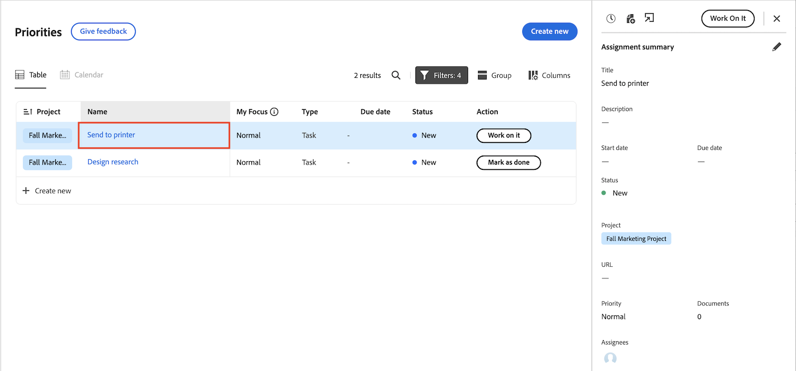

# Passage de la page d’accueil héritée aux priorités

La page d’accueil héritée sera supprimée de Workfront le 10/17 avec la version Q4. Cet article fournit des informations sur les fonctionnalités qui seront disponibles dans les priorités et des recommandations destinées aux administrateurs de Workfront qui déplacent les utilisateurs vers les priorités.

Pour plus d’informations sur l’obsolescence de la page d’accueil héritée, consultez le [Guide de l’obsolescence de la page d’accueil héritée](/help/quicksilver/product-announcements/announcements/legacy-home-deprecation.md).

## Comprendre ce qui change de la page d’accueil héritée aux priorités

### Liste de travail

#### Organisation du travail

Le tableau Priorités affiche les tâches et les problèmes qui vous ont été affectés, ainsi qu’à votre équipe. Vous pouvez filtrer et regrouper votre travail à l’aide des éléments suivants :

| **Filtre** | **Regroupement** |
|------------|-----------|
| - Travail sur   - Prêt à démarrer   - Non prêt   - Demandé   - Terminé   - Projet   - Date d’échéance   - État | - Aucun   - Échéance de semaine   - État   - Projet |

**Les options de regroupement et de filtre d’accueil hérités ne sont pas disponibles dans Priorités**

Filtres

* Terminé : renommé Terminé en Terminé dans les priorités

Regroupements

* Date d’achèvement prévue - renommée Date d’échéance dans les priorités
* Démarrage planifié
* Date d’engagement
* Ma priorité

#### Déléguer le travail

Actuellement, les utilisateurs ne peuvent pas déléguer ni afficher le travail délégué dans les priorités. Cependant, les utilisateurs peuvent toujours déléguer du travail à partir de la Nouvelle page d’accueil dans les widgets suivants :

* Mon travail
* Mes tâches
* Mes problèmes
* En attente de mes approbations

Les utilisateurs peuvent afficher le travail délégué à partir de la nouvelle page d’accueil dans les widgets suivants :

* Mon widget de travail à l’aide du filtre Délégué à moi
* En attente de mes validations à l’aide du filtre des validations déléguées

#### Utilisation de la vue Calendrier

Une vue de remplacement du calendrier n’est pas disponible pour l’instant, mais elle figure sur la feuille de route des priorités.

#### Créer une tâche personnelle

Les utilisateurs ne peuvent pas créer de tâches personnelles ni d’éléments à faire dans les priorités.

#### Ajout d’éléments à ma priorité

Les utilisateurs peuvent prioriser le travail avec la nouvelle colonne Mon point de mires . La colonne Mon point de mires est propre à chaque utilisateur et n’a aucune incidence sur les données de tâche, de problème ou de produit.

Les utilisateurs peuvent marquer les tâches prioritaires avec les options suivantes :

* Urgent
* Principal
* Secondaire
* Normal (par défaut)

#### Afficher les validations que j’ai envoyées

Les utilisateurs ne peuvent pas afficher les validations qu’ils ont soumises dans Priorités. Pour pallier ce problème, les utilisateurs peuvent consulter ces informations dans le widget Mes approbations de la page d’accueil à l’aide de l’option de filtre Validations que j’ai envoyées .

### Afficher les approbations et les demandes de l’équipe

Les utilisateurs ne peuvent pas interagir avec les approbations et les demandes de l’équipe dans les priorités. Cependant, ils peuvent gérer les demandes d’approbation et d’équipe dans la nouvelle page d’accueil à l’aide des widgets suivants :

* Mon approbation
* Toutes les approbations
* Demandes de l’équipe

### Mise à jour des éléments de travail

#### Mise à jour de formulaires personnalisés

Les utilisateurs peuvent mettre à jour des formulaires personnalisés dans la vue de la tâche en cliquant sur le nom de la tâche, en accédant à l’onglet Détails et en faisant défiler la page vers le bas.

#### Utilisation du panneau Résumé

Le panneau Résumé s’affiche pour les tâches et les problèmes. Dans le résumé, les utilisateurs peuvent

* Enregistrer des heures
* Charger un fichier
* Accédez à l’onglet Détails des priorités.
* Mise à jour des informations sur les tâches et les problèmes

<!--Can admins customize this? It looks different from the task/issue summary in other areas. -->

#### Ouvrez le panneau Résumé .

Sur l’onglet **Table** , cliquez dans la cellule de nom de l’élément de travail. Cliquez sur le nom de l’élément de travail pour accéder à la page Détails et n’ouvre pas le panneau Résumé.

## Préparation de l’obsolescence

* Partagez l’article [Commencer avec les priorités](/help/quicksilver/workfront-basics/priorities/get-started-with-priorities.md) avec vos utilisateurs finaux.
* Les priorités sont activées par défaut. Les administrateurs de Workfront peuvent désactiver les priorités dans Configuration > Système > Préférences.
* Actuellement, les administrateurs de Workfront ne peuvent pas personnaliser les priorités par le biais du modèle de mise en page.

### Articles d’aide pour les utilisateurs finaux

* [Prise en main des priorités](/help/quicksilver/workfront-basics/priorities/get-started-with-priorities.md)