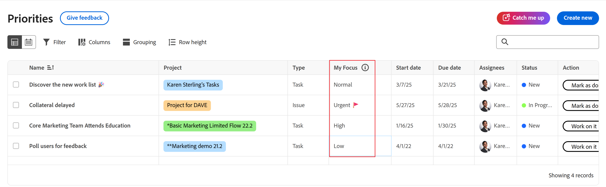

# Hiérarchiser les éléments de travail importants

Vous pouvez utiliser la colonne Mon focus pour hiérarchiser votre travail. La colonne Mon focus est une valeur personnelle qui n’a aucune incidence sur la priorité définie pour la tâche ou l’événement.

Priorités affiche les éléments de travail qui vous sont affectés. Vous ne pouvez pas voir les éléments de travail affectés à votre équipe.

## Conditions d’accès

+++ Développez pour afficher les exigences d’accès aux fonctionnalités de cet article.

<table style="table-layout:auto"> 
 <col> 
 </col> 
 <col> 
 </col> 
 <tbody> 
  <tr> 
   <td role="rowheader"><strong>Package Adobe Workfront</strong></td> 
   <td> 
Tous
 </td> 
  </tr> 
  <tr> 
   <td role="rowheader"><strong>Licence Adobe Workfront</strong></td> 
   <td> 
   
Réviseur ou supérieur

   
Léger ou supérieur
 
   </td> 
  </tr> 
  <tr> 
   <td role="rowheader"><strong>Configurations des niveaux d’accès</strong></td> 
   <td> 
Accès Afficher ou Modifier à l’objet mis à jour
</td> 
  </tr> 
  <tr> 
   <td role="rowheader"><strong>Autorisations d’objet</strong></td> 
   <td> 
Accès Afficher à l’objet
</td> 
  </tr> 
 </tbody> 
</table>

Pour plus d’informations sur ce tableau, voir [Conditions d’accès requises dans la documentation Workfront](/help/quicksilver/administration-and-setup/add-users/access-levels-and-object-permissions/access-level-requirements-in-documentation.md).

+++

## Hiérarchisez votre travail à l’aide de la colonne Mon focus

{{step1-to-priorities}}

1. Recherchez l’élément de travail sur lequel vous souhaitez mettre l’accent.
1. Dans la colonne **Mon focus**, choisissez l’un des niveaux de focus suivants :

   | Focus | Description |
   |-----------|-------------|
   | **Urgente** | Urgent pour les éléments de travail qui nécessitent une attention immédiate. Les tâches urgentes doivent être prioritaires sur toutes les autres et traitées dès que possible. |
   | **Élevé** | Élevée concerne les éléments de travail importants que vous prévoyez de traiter une fois le travail urgent terminé. |
   | **Normale** | La valeur Normale concerne les tâches de routine sur lesquelles vous travaillerez une fois les tâches urgentes et de haute priorité terminées. Il s’agit de la valeur par défaut pour les tâches et les événements. |
   | **Faible** | La valeur faible correspond aux éléments de travail qui n’ont pas besoin d’une attention immédiate et qui peuvent être différés jusqu’à ce que tous les éléments de travail de priorité supérieure soient terminés. |

   

   >[!TIP]
   >
   >Vous pouvez filtrer et regrouper votre travail en fonction de vos niveaux de focus.
