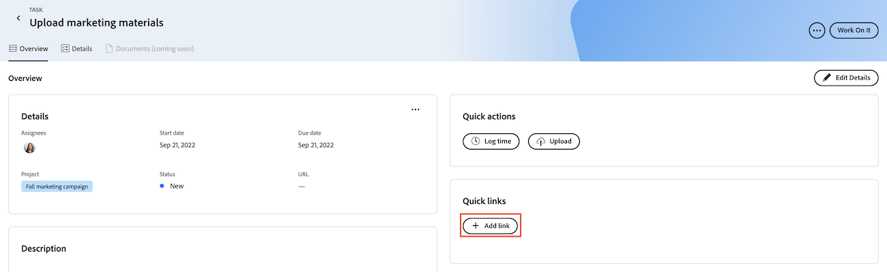
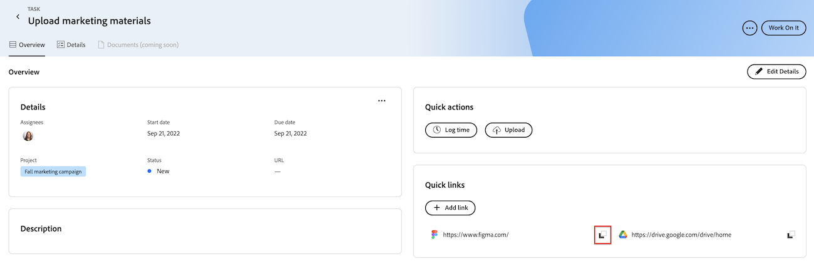

# Ajouter et gérer des liens rapides dans Priorités

Vous pouvez enregistrer les liens que vous consultez souvent dans une tâche ou un événement et y accéder à partir de l’onglet Aperçu dans Priorités.

Priorités affiche les éléments de travail qui vous sont affectés. Vous ne pouvez pas voir les éléments de travail affectés à votre équipe.

## Conditions d’accès

+++ Développez pour afficher les exigences d’accès aux fonctionnalités de cet article.

<table style="table-layout:auto"> 
 <col> 
 </col> 
 <col> 
 </col> 
 <tbody> 
  <tr> 
   <td role="rowheader"><strong>Package Adobe Workfront</strong></td> 
   <td> 
Tous
 </td> 
  </tr> 
  <tr> 
   <td role="rowheader"><strong>Licence Adobe Workfront</strong></td> 
   <td> 
   
Demande ou supérieure pour les événements ; Travail ou supérieur pour les tâches

   
Contributeur ou version ultérieure ou problèmes ; Léger ou version ultérieure pour les tâches
 
   </td> 
  </tr> 
  <tr> 
   <td role="rowheader"><strong>Configurations des niveaux d’accès</strong></td> 
   <td> 
Accès Afficher ou Modifier à l’objet mis à jour
</td> 
  </tr> 
  <tr> 
   <td role="rowheader"><strong>Autorisations d’objet</strong></td> 
   <td> 
Accès Afficher à l’objet
</td> 
  </tr> 
 </tbody> 
</table>

Pour plus d’informations, voir [Conditions d’accès dans la documentation Workfront](/help/quicksilver/administration-and-setup/add-users/access-levels-and-object-permissions/access-level-requirements-in-documentation.md).

+++

## Ajout de liens rapides dans les priorités

{{step1-to-priorities}}

1. Cliquez sur le nom d’un élément de travail pour ouvrir la page **Aperçu**.
1. Dans la section **Liens rapides**, cliquez sur **Ajouter un lien**.
1. Collez l’URL dans la zone **Ajouter un lien**.
1. Cliquer sur **Enregistrer**.
   

## Copier un lien rapide dans le presse-papiers

{{step1-to-priorities}}

1. Cliquez sur le nom d’un élément de travail pour ouvrir la page **Aperçu**.
1. Dans la section **Liens rapides**, recherchez le lien à copier.
1. Cliquez sur l’icône **Copier**.
   

## Ouvrir un lien rapide

{{step1-to-priorities}}

1. Cliquez sur le nom d’un élément de travail pour ouvrir la page **Aperçu**.
1. Dans la section **Liens rapides**, recherchez le lien que vous souhaitez ouvrir.
1. Cliquez sur le lien. Le lien s’ouvre dans un nouvel onglet.
   

## Supprimer les liens rapides

{{step1-to-priorities}}

1. Cliquez sur le nom d’un élément de travail pour ouvrir la page **Aperçu**.
1. Cliquez sur **Modifier les détails** dans le coin supérieur droit de l’écran.
   
1. Recherchez le lien à supprimer, puis cliquez sur l’icône **Supprimer** .
