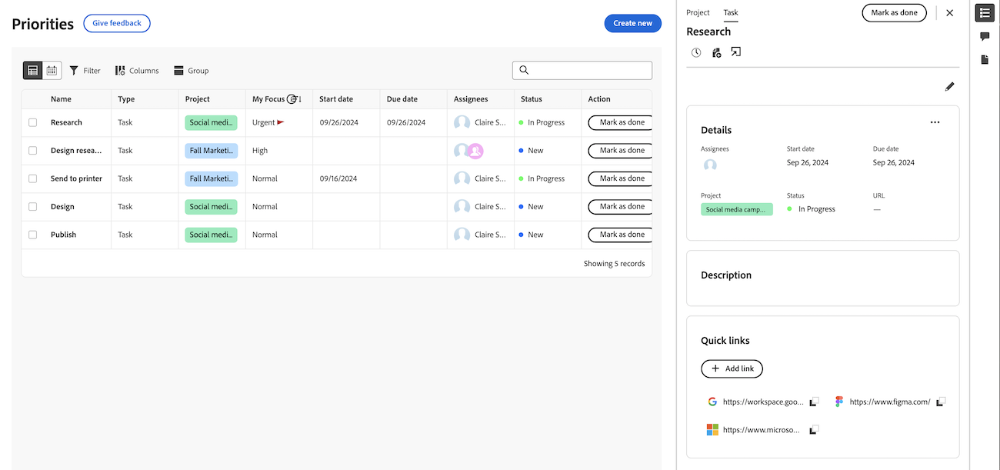

# Afficher les détails du projet et de l&#39;élément de travail dans Priorités

Vous pouvez afficher les détails des projets, des tâches et des événements dans la liste de travail des priorités.

>[!IMPORTANT]
>
>Les projets doivent avoir le statut Actuel ou un statut équivalent au statut actuel pour afficher les projets ainsi que leurs tâches et événements enfants.

## Conditions d’accès

+++ Développez pour afficher les exigences d’accès aux fonctionnalités de cet article.

Vous devez disposer des accès suivants pour effectuer les étapes décrites dans cet article :

<table style="table-layout:auto"> 
 <col> 
 </col> 
 <col> 
 </col> 
 <tbody> 
  <tr> 
   <td role="rowheader"><strong>Formule Adobe Workfront</strong></td> 
   <td> 
Tous
 </td> 
  </tr> 
  <tr> 
   <td role="rowheader"><strong>Licence Adobe Workfront*</strong></td> 
   <td> 
   
Current : Reviewer ou supérieur

   
Nouveau : Light ou supérieur
 
   </td> 
  </tr> 
  <tr> 
   <td role="rowheader"><strong>Configurations des niveaux d’accès</strong></td> 
   <td> 
Accès Afficher ou Modifier à l’objet mis à jour
</td> 
  </tr> 
  <tr> 
   <td role="rowheader"><strong>Autorisations d’objet</strong></td> 
   <td> 
Accès Afficher à l’objet
</td> 
  </tr> 
 </tbody> 
</table>

*Pour plus d’informations, voir [Conditions d’accès requises dans la documentation Workfront](/help/quicksilver/administration-and-setup/add-users/access-levels-and-object-permissions/access-level-requirements-in-documentation.md).

+++

## Afficher les détails dans le panneau latéral de la liste de tâches

### Afficher les détails du projet

{{step1-to-priorities}}

1. Dans la liste des tâches, passez la souris sur le nom de l’élément de travail, puis cliquez sur l’icône **Résumé** .
1. Cliquez sur **Projet** en haut du panneau Résumé . Ici, vous pouvez
   * Afficher et modifier les détails et la description du projet
   * Afficher et ajouter des commentaires sur le projet
   * Enregistrer des heures
   * Ajouter un fichier
   * Accéder directement au projet

   

### Afficher les détails de la tâche

{{step1-to-priorities}}

1. Dans la liste des tâches, passez la souris sur le nom de la tâche, puis cliquez sur l’icône **Résumé** .
1. La tâche est sélectionnée par défaut. Ici, vous pouvez
   * Afficher et modifier les détails et la description des projets et des tâches
   * Afficher et ajouter des commentaires sur le projet
   * Afficher et ajouter des documents
   * Créer une épreuve
   * Enregistrer des heures
   * Ajouter un fichier
   * Ajout de liens rapides

   

### Afficher les détails de l&#39;événement

{{step1-to-priorities}}

1. Dans la liste des tâches, passez la souris sur le nom de la tâche, puis cliquez sur l’icône **Résumé** .

1. L&#39;événement est sélectionné par défaut. Ici, vous pouvez
   * Afficher et modifier les détails et la description des projets et des événements
   * Afficher et ajouter des commentaires sur le projet
   * Afficher et ajouter des documents
   * Créer une épreuve
      * Enregistrer des heures
      * Ajouter un fichier
      * Ajout de liens rapides

   

## Afficher les détails sur la page Détails

Vous pouvez afficher des mises à jour en temps réel sur la page Détails d’une tâche ou d’un événement. Vous pouvez également voir si d’autres personnes consultent la page en même temps que vous avec des indicateurs de présence en temps réel.

## Afficher les détails de l’élément de travail

{{step1-to-priorities}}

1. Dans la liste des tâches, cliquez sur le nom de l’élément de travail. Sur la page Détails , vous pouvez effectuer les opérations suivantes :

* Afficher et modifier les détails et la description du projet
* Afficher et ajouter des commentaires sur le projet
* Afficher et ajouter des documents
* Créer une épreuve
* Enregistrer des heures
* Ajouter un fichier
* Ajout de liens rapides

<!-- screenshot for prod-->