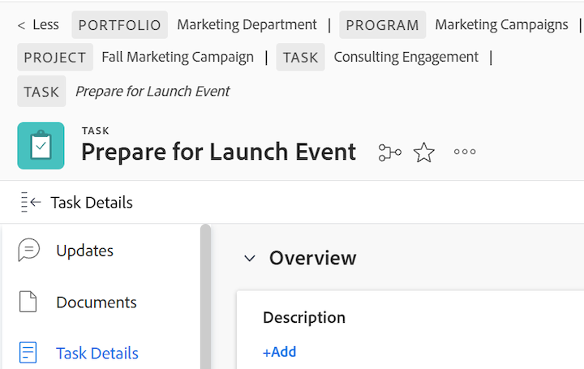

# Vue d’ensemble des chemins de navigation

Les chemins de navigation affichent la hiérarchie de navigation complète pour tous les types d’objets. Chaque objet du chemin de chemin de navigation comporte un libellé qui affiche le type d’objet. La page sur laquelle vous vous trouvez actuellement s’affiche à la fois dans l’en-tête de la page et à la fin du chemin de navigation en italique. Dans l’exemple ci-dessous, il s’agit de la tâche &quot;[!UICONTROL Partager avec l’équipe de marque]&quot;.

Lorsqu’il y a trop d’objets dans le chemin de navigation ou que la largeur d’écran interdit l’affichage de la hiérarchie de navigation complète, le chemin réduit certains chemins de navigation et regroupe ces objets au début du chemin de navigation. Le projet et la page d’objet active sont toujours visibles dans le chemin de chemin de navigation.

Par exemple, &quot;3 autres&quot; dans l’image ci-dessus indique que 3 objets ne s’affichent pas. Ces éléments peuvent se trouver au-dessus du niveau du projet ou entre le projet et la page active.

Cliquez sur &quot;[!UICONTROL more]&quot; pour développer la hiérarchie complète. Vous pouvez cliquer sur &quot;[!UICONTROL Less]&quot; pour réduire à nouveau le chemin de chemin de navigation.

Vous pouvez également utiliser les touches suivantes pour parcourir les chemins de navigation :

<table style="table-layout:auto"> 
 <col> 
 <col> 
 <tbody> 
  <tr> 
   <td role="rowheader"><strong>Onglet</strong> </td> 
   <td> 
Accédez à chaque élément dans le chemin de navigation.
 </td> 
  </tr> 
  <tr> 
   <td role="rowheader"><strong>Entrer</strong> </td> 
   <td> 
Développez un chemin de chemin de navigation réduit, réduisez-le, développez un chemin de chemin de navigation étendu, puis ouvrez une nouvelle page lors d’un lien d’objet.
 </td> 
  </tr> 
 </tbody> 
</table>

+++Exigences d’accès

Vous devez disposer des accès suivants pour effectuer les étapes de cet article :

<table style="table-layout:auto"> 
 <col> 
 </col> 
 <col> 
 </col> 
 <tbody> 
  <tr> 
   <td role="rowheader"><strong>[!DNL Adobe Workfront] forfait*</strong></td> 
   <td> 
N’importe quelle
 </td> 
  </tr> 
  <tr> 
   <td role="rowheader"><strong>[!DNL Adobe Workfront] licence*</strong></td> 
   <td> 
[!UICONTROL Request] ou version ultérieure
 </td> 
  </tr> 
 </tbody> 
</table>

*Pour savoir quel plan ou type de licence vous avez, contactez votre administrateur [!DNL Workfront].

+++

<!--drafted: this is no longer possible, since we removed Campaigns, but it might come back as part of Maestro: 

## Multi-object breadcrumbs

>[!NOTE]
>
>The information in this article is available only in the Preview environment when you participate in the [!UICONTROL Campaigns] beta program. The functionality described here might not be fully available yet. For more information about current available features and how to enroll, see [Campaigns beta].

Some objects can belong to multiple parent objects. For example, a project can belong to multiple campaigns. In this case, all the campaigns that the project belongs to display in the breadcrumb.

The multi-object listing in the breadcrumb (for example, the campaigns) displays the number of parent objects which expands into a list to display all the campaigns that the project is associated with. For more information, see [Add objects to a campaign](../../manage-work/campaigns/add-objects-to-a-campaign.md).

-->

## Accès à un objet parent à partir du chemin de navigation

Pour plus d’informations sur les objets parents dans [!DNL Workfront], voir [Comprendre les objets dans [!DNL Adobe Workfront]](../../workfront-basics/navigate-workfront/workfront-navigation/understand-objects.md).

1. (Conditionnel) Si vous ne voyez pas l’objet auquel vous souhaitez accéder dans un chemin de chemin de navigation réduit, cliquez sur **[!UICONTROL more]**, puis localisez l’objet.

   >[!NOTE]
   >
   >Si vous n’êtes pas autorisé à accéder à un objet, il n’est pas visible dans les chemins de navigation.

1. Cliquez sur n’importe quel objet du chemin de chemin de navigation pour y accéder.

   La page d’objet s’ouvre.
