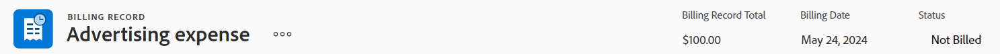
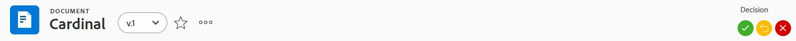
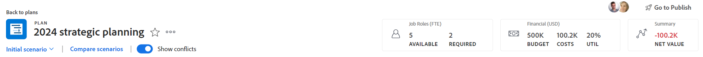

# Vue d’ensemble des en-têtes d’objets

Vous pouvez afficher les informations en un coup d’œil sur les objets d’[!DNL Adobe Workfront] lorsque vous passez en revue leur en-tête.

En plus du nom de l’objet, l’en-tête peut inclure la personne propriétaire de l’objet, le statut ou le pourcentage terminé.

[!DNL Workfront] donne la priorité au nom de l’objet, en lui allouant autant d’espace que possible dans l’en-tête. Lorsqu’un nom d’objet est trop long, il est tronqué. Pour afficher le nom complet d’un objet, vous pouvez le pointer avec la souris.

## Accéder à l’en-tête d’un objet

L’accès à l’en-tête d’un objet dans [!DNL Workfront] est identique pour tous les objets qui le possèdent.

Par exemple, pour accéder à l’en-tête d’un projet, procédez comme suit :

1. Accédez à un projet.\
   L’en-tête s’affiche en haut de la page et contient le nom du projet.

   

## Vue d’ensemble de l’en-tête [!UICONTROL Accueil]

Les en-têtes suivants sont disponibles dans Accueil :

* Tâche : pour plus d’informations sur l’utilisation de cet en-tête, consultez [Vue d’ensemble de l’en-tête de tâche](#task-header-overview) dans cet article.
* Problème : pour plus d’informations sur l’utilisation de cet en-tête, consultez [Vue d’ensemble de l’en-tête du problème](#issue-header-overview) dans cet article.

## En-têtes personnalisables

Votre administrateur ou administratrice [!DNL Workfront] ou de groupes peut personnaliser l’en-tête des projets, tâches et problèmes à l’aide d’un modèle de mise en page.

Cet article décrit les en-têtes par défaut de tous les objets, y compris les projets, les tâches et les problèmes.

Pour plus d’informations sur la personnalisation des informations sur l’en-tête d’un objet, consultez [Personnaliser des en-têtes d’objet à l’aide d’un modèle de mise en page](../../administration-and-setup/customize-workfront/use-layout-templates/customize-object-headers.md).

## Vue d’ensemble de l’en-tête du projet

L’en-tête du projet affiche les informations suivantes, par défaut :

<table style="table-layout:auto"> 
 <col> 
 <col> 
 <thead> 
  <tr> 
   <th>Informations sur l’en-tête</th> 
   <th>Notes</th> 
  </tr> 
 </thead> 
 <tbody> 
  <tr> 
   <td role="rowheader">Chemin de navigation avec les objets parent</td> 
   <td>Si le projet est associé à un programme ou à un portfolio, ceux-ci s’affichent dans le chemin de navigation dans le coin supérieur gauche de l’en-tête. Cliquer sur le nom du parent ouvre cet objet parent.</td> 
  </tr> 
  <tr data-mc-conditions=""> 
   <td role="rowheader">Icône d’objet </td> 
   <td> 
L’icône violette [!UICONTROL Project]  s’affiche à gauche du nom du projet.
 </td> 
  </tr> 
  <tr> 
   <td role="rowheader">Nom du projet</td> 
   <td>Vous pouvez modifier le nom du projet dans l’en-tête.</td> 
  </tr> 
  <tr> 
   <td role="rowheader">Nom du type d’objet</td> 
   <td> 
Le texte « [!UICONTROL PROJECT] » s’affiche au-dessus du nom du projet dans l’en-tête.
 </td> 
  </tr> 
  <tr> 
   <td role="rowheader">Zone d’actions de la tâche</td> 
   <td> 
En regard du nom du projet, la zone d’actions s’affiche.
 
  
  </td> 
  </tr> 
  <tr> 
   <td role="rowheader">[!UICONTROL Percent Complete]</td> 
   <td>Vous ne pouvez pas modifier le pourcentage terminé du projet dans l’en-tête.</td> 
  </tr> 
  <tr> 
   <td role="rowheader">[!UICONTROL Project Owner]</td> 
   <td> 
Vous pouvez modifier la [!UICONTROL Project Owner] dans l’en-tête.
 </td> 
  </tr> 
  <tr> 
   <td role="rowheader">[!UICONTROL Planned Completion Date] </td> 
   <td> 
Vous pouvez modifier la [!UICONTROL Planned Completion Date] et l’heure du projet dans l’en-tête si le projet est planifié à partir de la [!UICONTROL Completion Date]. Si le projet est planifié à partir de la [!UICONTROL Start Date], ces informations sont mises à jour à partir des tâches du projet.
 </td> 
  </tr> 
  <tr> 
   <td role="rowheader">[!UICONTROL Condition] </td> 
   <td> 
Lorsque vous définissez le [!UICONTROL Condition Type] du projet sur Manuel, vous pouvez mettre à jour le [!UICONTROL Condition] du projet dans l’en-tête.
</td> 
  </tr> 
  <tr> 
   <td role="rowheader">[!UICONTROL Status]</td> 
   <td>Vous pouvez modifier le [!UICONTROL Status] du projet dans l’en-tête.</td> 
  </tr> 
  <tr> 
   <td role="rowheader">Zone [!UICONTROL Approvals]</td> 
   <td> 
Lorsque vous êtes l’une des personnes approbatrices, utilisez les icônes suivantes pour gérer les approbations du projet :
 
  </img> [!UICONTROL Approve]
 
  </img> [!UICONTROL Reject]
 
  </img> [!UICONTROL Recall]
 
Si vous n’êtes pas un approbateur ou une approbatrice, cliquez sur l’icône [!UICONTROL More]  pour afficher des informations sur l’étape d’approbation actuelle.
 
Pour en savoir plus sur les approbations, voir <a href="../../review-and-approve-work/manage-approvals/approval-process-in-workfront.md" class="MCXref xref">Vue d’ensemble du processus d’approbation</a>.
 </td> 
  </tr> 
 </tbody> 
</table>

## Vue d’ensemble de l’en-tête de tâche

Par défaut, l’en-tête de la tâche comprend les informations suivantes :

<table style="table-layout:auto"> 
 <col> 
 <col> 
 <thead> 
  <tr> 
   <th>Informations sur l’en-tête</th> 
   <th>Notes</th> 
  </tr> 
 </thead> 
 <tbody> 
  <tr> 
   <td role="rowheader">Chemin de navigation avec les objets parent</td> 
   <td> 
Les objets parents de la tâche s’affichent dans le chemin de navigation. Cliquer sur le nom du parent ouvre cet objet parent.
 
Pour plus d’informations, voir <a href="../../workfront-basics/the-new-workfront-experience/breadcrumb-overview.md" class="MCXref xref">Vue d’ensemble des chemins de navigation</a>.
 </td> 
  </tr> 
  <tr data-mc-conditions=""> 
   <td role="rowheader">Icône d’objet </td> 
   <td> 
L’icône [!UICONTROL Task] verte  s’affiche à gauche du nom de la tâche.
 </td> 
  </tr> 
  <tr> 
   <td role="rowheader">Nom de la tâche</td> 
   <td>Vous pouvez modifier le nom de la tâche dans l’en-tête.</td> 
  </tr> 
  <tr> 
   <td role="rowheader">Nom du type d’objet</td> 
   <td> 
Le texte « [!UICONTROL TASK] » s’affiche au-dessus du nom de la tâche dans l’en-tête.
 </td> 
  </tr> 
  <tr> 
   <td role="rowheader">Zone d’actions de la tâche</td> 
   <td> 
En regard du nom de la tâche, la zone [!UICONTROL actions] s’affiche.
 
  
 
Si l’icône Dépendance s’affiche, vous pouvez cliquer sur l’icône pour afficher les prédécesseurs ou les successeurs de la tâche.
 </td> 
  </tr> 
  <tr> 
   <td role="rowheader">[!UICONTROL Percent Complete]</td> 
   <td>Vous pouvez modifier le pourcentage terminé de la tâche dans l’en-tête.</td> 
  </tr> 
  <tr> 
   <td role="rowheader">[!UICONTROL Assignments]</td> 
   <td>Vous pouvez modifier les personnes cessionnaires d’une tâche à partir de l’en-tête.</td> 
  </tr> 
  <tr> 
   <td role="rowheader"> 
Bouton [!UICONTROL Work on It], [!UICONTROL Done] ou [!UICONTROL Start Task]
 </td> 
   <td> 
Si la tâche vous est assignée, vous pouvez cliquer sur le bouton [!UICONTROL Work on It] ou [!UICONTROL Start Task] pour indiquer que vous êtes en train de travailler sur la tâche ou sur le bouton [!UICONTROL Done] pour indiquer que vous avez terminé la tâche.
 
Pour plus d’informations sur le remplacement du bouton [!UICONTROL Work On It] par un bouton [!UICONTROL Start Task], voir <a href="../../people-teams-and-groups/create-and-manage-teams/work-on-it-button-to-start-button.md" class="MCXref xref">Remplacer le bouton [!UICONTROL Work On It] par un bouton [!UICONTROL Start]</a>.
 </td> 
  </tr> 
  <tr> 
   <td role="rowheader">[!UICONTROL Planned Completion Date]</td> 
   <td> 
Vous pouvez modifier la [!UICONTROL Planned Completion Date] et l’heure de la tâche dans l’en-tête.
 
Conseil : notez que la [!UICONTROL Commit Date] n’est pas visible dans l’en-tête. Vous pouvez l’afficher sur la page des [!UICONTROL Details].
 </td> 
  </tr> 
  <tr> 
   <td role="rowheader">[!UICONTROL Status]</td> 
   <td>Vous pouvez modifier le [!UICONTROL Status] de la tâche dans l’en-tête.</td> 
  </tr> 
  <tr> 
   <td role="rowheader">Zone [!UICONTROL Approvals]</td> 
   <td> 
Lorsque vous figurez parmi les approbateurs et les approbatrices, utilisez les icônes suivantes pour gérer les approbations de la tâche :
 
  </img> [!UICONTROL Approve]
 
  </img> [!UICONTROL Reject]
 
  </img> [!UICONTROL Recall]
 
Si vous n’êtes pas un approbateur ou une approbatrice, cliquez sur l’icône [!UICONTROL More]  pour afficher des informations sur l’étape d’approbation actuelle.
 
Pour en savoir plus sur les approbations, voir <a href="../../review-and-approve-work/manage-approvals/approval-process-in-workfront.md" class="MCXref xref">Vue d’ensemble du processus d’approbation</a>.
 </td> 
  </tr> 
 </tbody> 
</table>

## Vue d’ensemble de l’en-tête du problème

Par défaut, l’en-tête du problème comprend les informations suivantes :

<table style="table-layout:auto"> 
 <col> 
 <col> 
 <thead> 
  <tr> 
   <th>Informations sur l’en-tête</th> 
   <th>Notes</th> 
  </tr> 
 </thead> 
 <tbody> 
  <tr> 
   <td role="rowheader">Chemin de navigation avec les objets parent</td> 
   <td> 
Les objets parents du problème s’affichent dans le chemin de navigation. Cliquer sur le nom du parent ouvre cet objet parent.
 
Pour plus d’informations, voir <a href="../../workfront-basics/the-new-workfront-experience/breadcrumb-overview.md" class="MCXref xref">Vue d’ensemble des chemins de navigation</a>.
 </td> 
  </tr> 
  <tr> 
   <td role="rowheader">Icône d’objet </td> 
   <td> 
L’icône rose du [!UICONTROL Issue]  s’affiche à gauche du nom du problème.
 </td> 
  </tr> 
  <tr> 
   <td role="rowheader">Nom du problème</td> 
   <td>Vous pouvez modifier le nom du problème dans l’en-tête.</td> 
  </tr> 
  <tr> 
   <td role="rowheader">Nom du type d’objet</td> 
   <td> 
Le texte « [!UICONTROL ISSUE] » s’affiche au-dessus du nom du problème dans l’en-tête.
 </td> 
  </tr> 
  <tr> 
   <td role="rowheader">Zone d’actions du problème</td> 
   <td> 
À côté du nom du problème, la zone [!UICONTROL actions] s’affiche.
 
  
 
Si l’icône [!UICONTROL Dependency] s’affiche, vous pouvez cliquer sur l’icône pour afficher les problèmes antérieurs et ultérieurs.
  </td> 
  </tr> 
  <tr> 
   <td role="rowheader">[!UICONTROL Percent Complete]</td> 
   <td> 
Vous pouvez modifier le pourcentage terminé du problème à partir de l’en-tête.
 </td> 
  </tr> 
  <tr> 
   <td role="rowheader">[!UICONTROL Assignments]</td> 
   <td>Vous pouvez modifier les personnes cessionnaires à qui un problème est affecté à partir de l’en-tête.</td> 
  </tr> 
  <tr> 
   <td role="rowheader">[!UICONTROL Work on It], [!UICONTROL Done] ou bouton [!UICONTROL Start Issue]</td> 
   <td>Si le problème vous est affecté, vous pouvez cliquer sur le bouton [!UICONTROL Work on It] ou [!UICONTROL Start Issue] pour indiquer que vous êtes en train de travailler sur le problème ou sur le bouton [!UICONTROL Done] pour indiquer que vous avez terminé le problème.Pour plus d’informations sur le remplacement du bouton [!UICONTROL Work On It] par un bouton [!UICONTROL Start Task], consultez la section  <a href="../../people-teams-and-groups/create-and-manage-teams/work-on-it-button-to-start-button.md" class="MCXref xref">Remplacer le bouton [!UICONTROL Work On It] par un bouton [!UICONTROL Start].</a>.</td> 
  </tr> 
  <tr> 
   <td role="rowheader">[!UICONTROL Planned Completion Date]</td> 
   <td> 
Vous pouvez modifier la [!UICONTROL Planned Completion Date] et l’heure du problème dans l’en-tête.
 
Conseil : notez que la [!UICONTROL Commit Date] n’est pas visible dans l’en-tête. Vous pouvez l’afficher sur la page des [!UICONTROL Details].
 </td> 
  </tr> 
  <tr> 
   <td role="rowheader">[!UICONTROL Status]</td> 
   <td>Vous pouvez modifier le [!UICONTROL Status] du problème dans l’en-tête.</td> 
  </tr> 
  <tr> 
   <td role="rowheader">Zone [!UICONTROL Approvals]</td> 
   <td> 
Lorsque vous êtes l’une des personnes chargées des approbations, utilisez les icônes suivantes pour gérer les approbations du problème :
 
  [!UICONTROL Approve]
 
  [!UICONTROL Reject]
 
  [!UICONTROL Recall]
 
Si vous n’êtes pas l’une des personnes chargées des approbations, cliquez sur l’icône [!UICONTROL More]  pour afficher des informations sur l’étape d’approbation actuelle.
 
Pour en savoir plus sur les approbations, consultez la section <a href="../../review-and-approve-work/manage-approvals/approval-process-in-workfront.md" class="MCXref xref">Vue d’ensemble du processus d’approbation</a>.
 </td> 
  </tr> 
 </tbody> 
</table>

## Vue d’ensemble de l’en-tête du programme

L’en-tête du programme affiche les informations suivantes :

<table style="table-layout:auto"> 
 <col> 
 <col> 
 <thead> 
  <tr> 
   <th>Informations sur l’en-tête</th> 
   <th>Notes</th> 
  </tr> 
 </thead> 
 <tbody> 
  <tr> 
   <td role="rowheader">Chemin de navigation avec le nom du portfolio</td> 
   <td> 
Vous pouvez accéder au [!UICONTROL Portfolio] à partir de l’en-tête du [!UICONTROL Program]. Cliquer sur le nom du parent ouvre cet objet parent.
 
Pour plus d’informations, voir <a href="../../workfront-basics/the-new-workfront-experience/breadcrumb-overview.md" class="MCXref xref">Vue d’ensemble des chemins de navigation</a>.
 </td> 
  </tr> 
  <tr> 
   <td role="rowheader">Icône d’objet </td> 
   <td> 
L’icône orange du [!UICONTROL Program]  s’affiche à gauche du nom du programme.
 </td> 
  </tr> 
  <tr> 
   <td role="rowheader">Nom du programme</td> 
   <td>Vous pouvez modifier le nom du programme dans l’en-tête.</td> 
  </tr> 
  <tr> 
   <td role="rowheader">Nom du type d’objet</td> 
   <td> 
Si le programme est marqué comme [!UICONTROL Active], le texte « [!UICONTROL PROGRAM] » s’affiche au-dessus du nom du programme dans l’en-tête.
 </td> 
  </tr> 
  <tr> 
   <td role="rowheader">Statut de l’activation</td> 
   <td> 
Si le programme est désactivé, le texte « [!UICONTROL PROGRAM DEACTIVATED] » s’affiche au-dessus du nom du programme dans l’en-tête.
 </td> 
  </tr> 
  <tr> 
   <td role="rowheader">Zone d’actions du programme</td> 
   <td> 
À côté du nom du programme, la zone [!UICONTROL actions] s’affiche.
 
  
 </td> 
  </tr> 
  <tr> 
   <td role="rowheader">[!UICONTROL Percent Complete]</td> 
   <td> 
Vous ne pouvez pas modifier le [!UICONTROL Percent Complete] du programme dans l’en-tête. Ces informations sont mises à jour à partir des projets du programme.
 
Conseil : par défaut, le pourcentage terminé du programme est une moyenne des valeurs de pourcentage terminé des projets dans un [!UICONTROL Current] ou un [!UICONTROL Approved Status] appartenant au programme.
 </td> 
  </tr> 
  <tr> 
   <td role="rowheader">[!UICONTROL Program Manager]</td> 
   <td> 
Vous pouvez modifier le [!UICONTROL Program Manager] dans l’en-tête. Il s’agit du même nom que le ou la [!UICONTROL Program Owner].
 </td> 
  </tr> 
  <tr> 
   <td role="rowheader">[!UICONTROL Planned Completion Date]</td> 
   <td>Vous ne pouvez pas modifier la [!UICONTROL Planned Completion Date] du programme dans l’en-tête. Ces informations sont mises à jour à partir de la [!UICONTROL Planned Completion Date] des projets du programme.</td> 
  </tr> 
  <tr> 
   <td role="rowheader">[!UICONTROL Active Projects Condition]</td> 
   <td>Il s’agit d’un calcul du pourcentage de projets actifs dans le programme pour lesquels la [!UICONTROL Condition] est définie sur [!UICONTROL On Target], [!UICONTROL At Risk] ou [!UICONTROL In Trouble].</td> 
  </tr> 
 </tbody> 
</table>

## Vue d’ensemble de l’en-tête du portfolio {#portfolio-header-overview}

L’en-tête du portfolio comprend les informations suivantes :

<table style="table-layout:auto"> 
 <col> 
 <col> 
 <thead> 
  <tr> 
   <th>Informations sur l’en-tête</th> 
   <th>Notes</th> 
  </tr> 
 </thead> 
 <tbody> 
  <tr> 
   <td role="rowheader">Icône d’objet </td> 
   <td> 
L'icône bleue [!UICONTROL Portfolio]  s’affiche à gauche du nom du portfolio.
 </td> 
  </tr> 
  <tr> 
   <td role="rowheader">Nom du portfolio</td> 
   <td>Vous pouvez modifier le nom du portfolio dans l’en-tête.</td> 
  </tr> 
  <tr> 
   <td role="rowheader">Nom du type d’objet</td> 
   <td> 
Si le portfolio est marqué comme actif, le texte « [!UICONTROL PORTFOLIO] » s’affiche au-dessus du nom du portfolio dans l’en-tête.
 </td> 
  </tr> 
  <tr> 
   <td role="rowheader">Statut de l’activation</td> 
   <td> 
Si le portfolio est désactivé, le texte « [!UICONTROL PORTFOLIO DEACTIVATED] » s’affiche au-dessus du nom du portfolio dans l’en-tête.
 </td> 
  </tr> 
  <tr> 
   <td role="rowheader">Zone [!UICONTROL actions] du portfolio</td> 
   <td> 
En regard du nom du portfolio, la zone [!UICONTROL actions] s’affiche.
 
  
</td> 
  </tr> 
  <tr> 
   <td role="rowheader">[!UICONTROL Portfolio Manager]</td> 
   <td>Vous pouvez modifier le [!UICONTROL Portfolio Manager] dans l’en-tête. Il s’agit du même nom que la [!UICONTROL Portfolio Owner].</td> 
  </tr> 
  <tr> 
   <td role="rowheader">[!UICONTROL On Time]</td> 
   <td>Il s’agit d’un calcul du pourcentage de projets du portfolio actuellement dans les délais.</td> 
  </tr> 
  <tr> 
   <td role="rowheader">[!UICONTROL On Budget]</td> 
   <td>Il s’agit d’un calcul du pourcentage de projets du portfolio actuellement dans le budget.</td> 
  </tr> 
  <tr> 
   <td role="rowheader">[!UICONTROL Aligned]</td> 
   <td>Il s’agit d’un calcul du pourcentage de projets du portfolio qui s’alignent sur le portfolio.</td> 
  </tr> 
  <tr> 
   <td role="rowheader">[!UICONTROL ROI]</td> 
   <td>Il s’agit du calcul du [!UICONTROL Return on Investment] pour tous les projets du portfolio.</td> 
  </tr> 
  <tr> 
   <td role="rowheader">[!UICONTROL Net Value]</td> 
   <td>Il s’agit du calcul de la [!UICONTROL Net Value] pour tous les projets du portfolio.</td> 
  </tr> 
 </tbody> 
</table>

## Vue d’ensemble de l’en-tête de modèle {#template-header-overview}

L’en-tête du modèle affiche les informations suivantes :

<table style="table-layout:auto"> 
 <col> 
 <col> 
 <thead> 
  <tr> 
   <th>Informations sur l’en-tête</th> 
   <th>Notes</th> 
  </tr> 
 </thead> 
 <tbody> 
  <tr> 
   <td role="rowheader">Icône d’objet </td> 
   <td> 
L’icône verte [!UICONTROL Template]  s’affiche à gauche du nom du modèle.
 </td> 
  </tr> 
  <tr> 
   <td role="rowheader">Nom du modèle</td> 
   <td>Vous pouvez modifier le nom du modèle dans l’en-tête.</td> 
  </tr> 
  <tr> 
   <td role="rowheader">Nom du type d’objet</td> 
   <td> 
Si le modèle est marqué comme actif, le texte « [!UICONTROL TEMPLATE] » s’affiche au-dessus du nom du modèle dans l’en-tête.
 </td> 
  </tr> 
  <tr> 
   <td role="rowheader">Statut de l’activation</td> 
   <td> 
Si le modèle est désactivé, le texte « [!UICONTROL TEMPLATE DEACTIVATED] » s’affiche au-dessus du nom du modèle dans l’en-tête.
 </td> 
  </tr> 
  <tr> 
   <td role="rowheader">Zone d’actions du modèle</td> 
   <td> 
En regard du nom du modèle, la zone d’actions s’affiche.
 
  
 </td> 
  </tr> 
  <tr> 
   <td role="rowheader">[!UICONTROL Template Owner]</td> 
   <td>Vous pouvez modifier le champ [!UICONTROL Template Owner] dans l’en-tête.</td> 
  </tr> 
  <tr> 
   <td role="rowheader">[!UICONTROL Duration]</td> 
   <td>Durée du modèle. Vous ne pouvez pas modifier ce champ dans l’en-tête.</td> 
  </tr> 
 </tbody> 
</table>

## Vue d’ensemble de l’en-tête des tâches de modèle

L’en-tête des tâches de modèle affiche les informations suivantes :

<table style="table-layout:auto"> 
 <col> 
 <col> 
 <thead> 
  <tr> 
   <th>Informations sur l’en-tête</th> 
   <th>Notes</th> 
  </tr> 
 </thead> 
 <tbody> 
  <tr> 
   <td role="rowheader">Chemin de navigation vers les objets parent</td> 
   <td> 
Les objets parent de la tâche de modèle s’affichent dans le chemin de navigation. Cliquez sur le nom d’un objet parent pour l’ouvrir.
 
Pour plus d’informations, voir <a href="../../workfront-basics/the-new-workfront-experience/breadcrumb-overview.md" class="MCXref xref">Vue d’ensemble des chemins de navigation</a>.
 </td> 
  </tr> 
  <tr> 
   <td role="rowheader">Icône d’objet </td> 
   <td> 
L’icône verte [!UICONTROL Task]  s’affiche à gauche du nom de la tâche de modèle.
 </td> 
  </tr> 
  <tr> 
   <td role="rowheader">Nom de la tâche de modèle</td> 
   <td>Vous pouvez modifier le nom de la tâche de modèle dans l’en-tête.</td> 
  </tr> 
  <tr> 
   <td role="rowheader">Nom du type d’objet</td> 
   <td> 
Le texte « [!UICONTROL TEMPLATE TASK] » s’affiche au-dessus du nom de la tâche de modèle dans l’en-tête.
 </td> 
  </tr> 
  <tr> 
   <td role="rowheader">Zone d’actions de la tâche de modèle</td> 
   <td> 
La zone d’actions s’affiche à côté du nom de la tâche de modèle.
 
  
 </td> 
  </tr> 
  <tr> 
   <td role="rowheader">[!UICONTROL Assignments]</td> 
   <td>Vous pouvez modifier les [!UICONTROL Assignments] de la tâche de modèle dans l’en-tête.</td> 
  </tr> 
  <tr> 
   <td role="rowheader">[!UICONTROL Completion Day]</td> 
   <td>Il s’agit du jour de la durée du modèle pendant lequel la tâche de modèle doit se terminer.</td> 
  </tr> 
 </tbody> 
</table>

## Vue d’ensemble de l’en-tête d’enregistrement de facturation

L’en-tête d’enregistrement de facturation affiche les informations suivantes :

<table style="table-layout:auto"> 
 <col> 
 <col> 
 <thead> 
  <tr> 
   <th>Informations sur l’en-tête</th> 
   <th>Notes</th> 
  </tr> 
 </thead> 
 <tbody> 
  <tr> 
   <td role="rowheader">Chemin de navigation vers les objets parent</td> 
   <td> 
Les objets parent de l’enregistrement de facturation s’affichent dans le chemin de navigation. Cliquez sur le nom d’un objet parent pour l’ouvrir.
 
Pour plus d’informations, voir <a href="../../workfront-basics/the-new-workfront-experience/breadcrumb-overview.md" class="MCXref xref">Vue d’ensemble des chemins de navigation</a>.
 </td> 
  </tr> 
  <tr> 
   <td role="rowheader">Icône d’objet </td> 
   <td> 
L’icône bleue [!UICONTROL Billing Record]  s’affiche à gauche du nom de l’enregistrement de facturation.
 </td> 
  </tr> 
  <tr> 
   <td role="rowheader">Nom de l’enregistrement de facturation</td> 
   <td>Vous pouvez modifier le nom de l’enregistrement de facturation dans l’en-tête.</td> 
  </tr> 
  <tr> 
   <td role="rowheader">Nom du type d’objet</td> 
   <td> 
Le texte « [!UICONTROL BILLING RECORD] » s’affiche au-dessus du nom de l’enregistrement de facturation dans l’en-tête.
 </td> 
  </tr> 
  <tr> 
   <td role="rowheader">Zone d’actions de l’enregistrement de facturation</td> 
   <td> 
En regard du nom de l’enregistrement de facturation, le menu [!UICONTROL More]  s’affiche, ce qui vous permet de sélectionner les options suivantes :
 
    <ul> 
     <li> 
[!UICONTROL Edit]
 </li> 
     <li> 
 
 </li> 
    </ul> </td> 
  </tr> 
  <tr> 
   <td role="rowheader">[!UICONTROL Billing Record Total]</td> 
   <td>Il s’agit du montant total de l’enregistrement de facturation. Vous ne pouvez pas modifier ce champ.</td> 
  </tr> 
  <tr> 
   <td role="rowheader">[!UICONTROL Billing Date]</td> 
   <td>Il s’agit de la date de création de l’enregistrement de facturation, sauf s’il a été modifié manuellement lors de la création de l’enregistrement de facturation. Vous pouvez modifier la [!UICONTROL Billing Date] dans l’en-tête.</td> 
  </tr> 
  <tr> 
   <td role="rowheader">[!UICONTROL Status]</td> 
   <td> 
Lorsque l’état de l’enregistrement de facturation est [!UICONTROL Billed], vous ne pouvez plus le modifier.
 
Vous pouvez modifier le Statut de l’enregistrement de facturation dans l’en-tête.
 </td> 
  </tr> 
 </tbody> 
</table>

## Vue d’ensemble de l’en-tête de la personne

L’en-tête de la personne affiche les informations suivantes :

<table style="table-layout:auto"> 
 <col> 
 <col> 
 <thead> 
  <tr> 
   <th>Informations sur l’en-tête</th> 
   <th>Notes</th> 
  </tr> 
 </thead> 
 <tbody> 
  <tr> 
   <td role="rowheader">Image de profil de la personne</td> 
   <td>Vous ne pouvez pas mettre à jour l’image de profil dans l’en-tête.</td> 
  </tr> 
  <tr> 
   <td role="rowheader">Nom de la personne et titre</td> 
   <td> 
 Le titre de la personne s’affiche en majuscules au-dessus de son nom. Vous ne pouvez pas modifier le nom de la personne dans l’en-tête.
 </td> 
  </tr> <!--
   <tr> 
    <td role="rowheader">Name of the object type</td> 
    <td> 
The name of the object type does not display.
 </td> 
   </tr>
  --> 
  <tr> 
   <td role="rowheader">Statut de l’activation</td> 
   <td> 
Si la personne a été désactivée, le texte et l’image de profil de l’en-tête sont grisés.
 </td> 
  </tr> 
  <tr> 
   <td role="rowheader">Zone d’actions de la personne</td> 
   <td> 
La zone d’actions s’affiche en regard du nom de la personne.
 
  
</td> 
  </tr> 
  <tr> 
   <td role="rowheader">Adresse e-mail</td> 
   <td>Vous ne pouvez pas modifier l’adresse e-mail dans l’en-tête. Il s’agit généralement également du nom d’utilisateur ou d’utilisatrice.</td> 
  </tr> 
  <tr> 
   <td role="rowheader">Numéro de téléphone</td> 
   <td>Vous ne pouvez pas modifier le numéro de téléphone dans l’en-tête.</td> 
  </tr> 
  <tr> 
   <td role="rowheader">Équipes</td> 
   <td> 
Vous pouvez afficher les équipes auxquelles la personne appartient. Pointez la souris sur l’avatar d’une équipe pour afficher le nom de l’équipe. Vous ne pouvez pas modifier les équipes dans l’en-tête.
 </td> 
  </tr> 
 </tbody> 
</table>

## Vue d’ensemble de l’en-tête de l’équipe

L’en-tête de l’équipe affiche les informations suivantes :

<table style="table-layout:auto"> 
 <col> 
 <col> 
 <thead> 
  <tr> 
   <th>Informations sur l’en-tête</th> 
   <th>Notes</th> 
  </tr> 
 </thead> 
 <tbody> 
  <tr> 
   <td role="rowheader">Icône d’objet </td> 
   <td> 
L’icône violette [!UICONTROL Team]  s’affiche à gauche du nom de l’équipe.
 </td> 
  </tr> 
  <tr> 
   <td role="rowheader">Nom de l’équipe</td> 
   <td>Vous pouvez modifier le nom de l’équipe dans l’en-tête.</td> 
  </tr> 
  <tr> 
   <td role="rowheader">Nom du type d’objet</td> 
   <td> 
Le texte « [!UICONTROL TEAM] » s’affiche au-dessus du nom de l’équipe dans l’en-tête.
 </td> 
  </tr> 
  <tr> 
   <td role="rowheader">Zone d’actions de l’équipe</td> 
   <td> 
La zone [!UICONTROL actions] s’affiche en regard du nom de l’équipe.
 
  
</td> 
  </tr> 
  <tr> 
   <td role="rowheader">Images de profil des personnes membres de l’équipe</td> 
   <td>Images de profil des personnes membres de l’équipe. Pointez la souris sur une image pour afficher le nom de la personne.</td> 
  </tr> 
  <tr> 
   <td role="rowheader">Description</td> 
   <td>Il s’agit d’une brève description des personnes membres de l’équipe. Vous ne pouvez pas modifier la description de l’équipe dans l’en-tête.</td> 
  </tr> 
 </tbody> 
</table>

## Vue d’ensemble de l’en-tête de l’itération

L’en-tête de l’itération affiche les informations suivantes :

<table style="table-layout:auto"> 
 <col> 
 <col> 
 <thead> 
  <tr> 
   <th>Informations sur l’en-tête</th> 
   <th>Notes</th> 
  </tr> 
 </thead> 
 <tbody> 
  <tr> 
   <td role="rowheader">Icône d’objet </td> 
   <td> 
L’icône orange [!UICONTROL Iteration]  s’affiche à gauche du nom de l’itération.
 </td> 
  </tr> 
  <tr> 
   <td role="rowheader">Nom de l’itération</td> 
   <td>Vous pouvez modifier le nom de l’itération dans l’en-tête.</td> 
  </tr> 
  <tr> 
   <td role="rowheader">Nom du type d’objet</td> 
   <td> 
Le texte « [!UICONTROL ITERATION] » s’affiche au-dessus du nom de l’itération dans l’en-tête.
 </td> 
  </tr> 
  <tr> 
   <td role="rowheader">Zone d’actions de l’itération</td> 
   <td> 
Dans le coin supérieur droit de l’en-tête, la zone d’actions s’affiche.
 
  
</td> 
  </tr> 
  <tr> 
   <td role="rowheader">Propriétaire</td> 
   <td>Il s’agit de la [!UICONTROL Owner] de l’itération. Vous ne pouvez pas modifier la [!UICONTROL Owner] dans l’en-tête.</td> 
  </tr> 
  <tr> 
   <td role="rowheader">[!UICONTROL Timeline]</td> 
   <td>La [!UICONTROL Timeline] affiche les dates de début et de fin de l’itération. Vous ne pouvez pas modifier la [!UICONTROL Timeline] dans l’en-tête.</td> 
  </tr> 
  <tr> 
   <td role="rowheader">[!UICONTROL Team]</td> 
   <td>Vous ne pouvez pas modifier l’équipe de l’itération dans l’en-tête. Cliquer sur le nom de l’équipe permet d’accéder à la page de l’équipe.</td> 
  </tr> 
 </tbody> 
</table>

## Vue d’ensemble de l’en-tête de groupe

L’en-tête de groupe affiche les informations suivantes :

<table style="table-layout:auto"> 
 <col> 
 <col> 
 <thead> 
  <tr> 
   <th>Informations sur l’en-tête</th> 
   <th>Notes</th> 
  </tr> 
 </thead> 
 <tbody> 
  <tr> 
   <td role="rowheader">Icône d’objet </td> 
   <td> 
L’icône orange [!UICONTROL Group]  s’affiche à gauche du nom du groupe.
 </td> 
  </tr> 
  <tr> 
   <td role="rowheader">Nom du groupe</td> 
   <td>Vous pouvez modifier le nom du groupe dans l’en-tête.</td> 
  </tr> 
  <tr> 
   <td role="rowheader">Nom du type d’objet</td> 
   <td> 
Le texte « [!UICONTROL GROUP] » s’affiche au-dessus du nom du groupe dans l’en-tête.
 </td> 
  </tr> 
  <tr> 
   <td role="rowheader">Zone [!UICONTROL actions] du groupe</td> 
   <td> 
À côté du nom du groupe, le menu [!UICONTROL More]  s’affiche, ce qui vous permet de sélectionner les options suivantes :
 
    <ul> 
     <li> 
[!UICONTROL Edit]
 </li> 
     <li> 
[!UICONTROL Copy]
 </li> 
     <li> 
[!UICONTROL Delete]
 </li> 
    </ul> </td> 
  </tr> 
  <tr> 
   <td role="rowheader">[!UICONTROL Business Leader]</td> 
   <td>Vous pouvez modifier la [!UICONTROL Business Leader] dans l’en-tête.</td> 
  </tr> 
  <tr> 
   <td role="rowheader">[!UICONTROL Licenses in use] </td> 
   <td> 
La zone [!UICONTROL Licenses in use] affiche le nombre d’utilisateurs et d’utilisatrices des licences [!UICONTROL Plan] et [!UICONTROL Work] du groupe et de ses sous-groupes. Vous pouvez cliquer sur les chiffres pour afficher ces informations pour les 5 types de licence.
 
Pour plus d’informations, consultez la section <a href="../../administration-and-setup/manage-groups/create-and-manage-groups/view-number-licenses-allocated-used-group.md" class="MCXref xref">Afficher le nombre de licences attribuées et utilisées dans un groupe dans la nouvelle expérience [!DNL Adobe Workfront]</a>.
 </td> 
  </tr> 
  <tr> 
   <td role="rowheader">[!UICONTROL Group Administrators]</td> 
   <td>Vous pouvez modifier les administrateurs et les administratrices de groupes dans l’en-tête.</td> 
  </tr> 
 </tbody> 
</table>

## Vue d’ensemble de l’en-tête d’un document

L’en-tête d’un document affiche les informations suivantes :

<table style="table-layout:auto"> 
 <col> 
 <col> 
 <thead> 
  <tr> 
   <th>Informations sur l’en-tête</th> 
   <th>Notes</th> 
  </tr> 
 </thead> 
 <tbody> 
  <tr> 
   <td role="rowheader">Chemin de navigation avec les objets parent</td> 
   <td> 
Les objets parent du document s’affichent dans le chemin de navigation. Cliquez sur le nom d’un objet parent pour l’ouvrir.
 
Pour plus d’informations, voir <a href="../../workfront-basics/the-new-workfront-experience/breadcrumb-overview.md" class="MCXref xref">Vue d’ensemble des chemins de navigation</a>.
 </td> 
  </tr> 
  <tr> 
   <td role="rowheader">Icône d’objet </td> 
   <td> 
L’icône bleue [!UICONTROL Document]  s’affiche à gauche du nom du document.
 </td> 
  </tr> 
  <tr> 
   <td role="rowheader">Nom du document</td> 
   <td>Vous pouvez modifier le nom du document dans l’en-tête.</td> 
  </tr> 
  <tr> 
   <td role="rowheader">Nom du type d’objet</td> 
   <td> 
Le texte « [!UICONTROL DOCUMENT] » s’affiche au-dessus du nom du document dans l’en-tête.
 </td> 
  </tr> 
  <tr> 
   <td role="rowheader">Zone d’actions du document</td> 
   <td> 
La zone d’actions s’affiche à côté du nom du document.
 
  
</td> 
  </tr> 
  <tr> 
   <td role="rowheader">Zone de [!UICONTROL Decision] d’approbation</td> 
   <td> La zone [!UICONTROL Decisions] s’affiche dans le coin supérieur droit de l’en-tête du document. Cette zone varie selon la phase d’approbation et selon que vous fassiez partie de l’équipe d’approbation, de révision ou d’aucune. <ul><li> 
Si vous faites partie de l’équipe d’approbation, vous pouvez utiliser les icônes suivantes pour gérer les approbations du document :
 
  [!UICONTROL Approve]
 
  [!UICONTROL Recall]
 
  [!UICONTROL Reject]
 
Pour plus d’informations sur les décisions d’approbation, voir <a href="../../review-and-approve-work/manage-approvals/approving-work.md" class="MCXref xref">Approuver du travail</a>.</li><li>
Si vous faites partie de l’équipe de révision, vous pouvez cliquer sur le bouton Terminer ma révision pour indiquer que vous avez examiné le document.

Pour plus d’informations sur la révision d’un document, voir <a href="../../review-and-approve-work/document-reviews-and-approvals/review-and-approve-documents/review-a-document.md" class="MCXref xref">Réviser un document</a>.
</li><li>Sinon cette zone affiche le statut de révision et d’approbation actuel du document.</li><ul>
 </td> 
  </tr> 
 </tbody> 
</table>

## Vue d’ensemble de l’en-tête de l’entreprise {#company-header-overview}

L’en-tête de l’entreprise affiche les informations suivantes :

<table style="table-layout:auto"> 
 <col> 
 <col> 
 <thead> 
  <tr> 
   <th>Informations sur l’en-tête</th> 
   <th>Notes</th> 
  </tr> 
 </thead> 
 <tbody> 
  <tr> 
   <td role="rowheader">Icône d’objet </td> 
   <td> 
L’icône bleue [!UICONTROL Company]  s’affiche à gauche du nom de l’entreprise.
 </td> 
  </tr> 
  <tr> 
   <td role="rowheader">Nom de l’entreprise</td> 
   <td>Vous pouvez modifier le nom de l’entreprise dans l’en-tête.</td> 
  </tr> 
  <tr> 
   <td role="rowheader">Nom du type d’objet</td> 
   <td> 
Le texte « [!UICONTROL COMPANY] » s’affiche au-dessus du nom de l’entreprise dans l’en-tête.
 </td> 
  </tr> 
  <tr> 
   <td role="rowheader">Zone d’actions de l’entreprise</td> 
   <td> 
Le menu [!UICONTROL More]  s’affiche à côté du nom de l’entreprise, ce qui vous permet de sélectionner les options suivantes :
 
    <ul> 
     <li> 
[!UICONTROL Edit]
 </li> 
     <li> 
[!UICONTROL Delete Company]
 </li> 
    </ul> </td> 
  </tr> 
 </tbody> 
</table>

## Vue d’ensemble de l’en-tête des plans

Les plans sont les objets du [!DNL Workfront Scenario Planner]. Pour plus d’informations sur le [!DNL Scenario Planner], voir [Vue d’ensemble du  [!DNL Scenario Planner] ](../../scenario-planner/scenario-planner-overview.md).

L’en-tête des plans affiche les informations suivantes :

<table style="table-layout:auto"> 
 <col> 
 <col> 
 <thead> 
  <tr> 
   <th>Informations sur l’en-tête</th> 
   <th>Notes</th> 
  </tr> 
 </thead> 
 <tbody> 
  <tr> 
   <td role="rowheader">Retour aux plans</td> 
   <td>Cliquez sur ce lien pour accéder à la liste des [!UICONTROL Plans].</td> 
  </tr> 
  <tr> 
   <td role="rowheader">Icône d’objet </td> 
   <td> 
L’icône bleue [!UICONTROL Plan]  s’affiche à gauche du nom du plan.
 </td> 
  </tr> 
  <tr> 
   <td role="rowheader">Nom du plan</td> 
   <td>Vous pouvez modifier le nom du plan dans l’en-tête.</td> 
  </tr> 
  <tr> 
   <td role="rowheader">Nom du type d’objet</td> 
   <td> 
Le texte « [!UICONTROL PLAN] » s’affiche au-dessus du nom du plan dans l’en-tête.
 </td> 
  </tr> 
  <tr> 
   <td role="rowheader">Zone d’actions du plan</td> 
   <td> 
La zone d’actions s’affiche à côté du nom du plan.
 
  
</td> 
  </tr> 
  <tr> 
   <td role="rowheader">Actions de plan supplémentaires</td> 
   <td> 
Sous la zone du nom du plan et des actions, vous pouvez effectuer les actions suivantes :
 
    <ul> 
     <li> 
<strong>[!UICONTROL Show conflicts]</strong> : cliquez sur ce bouton (bascule) pour afficher ou masquer les conflits dans les initiatives.
 </li> 
     <li> 
<strong>[!UICONTROL Compare scenarios]</strong> : cliquez sur ce lien pour afficher une comparaison côte à côte des scénarios que vous avez créés.
 </li> 
     <li> 
<strong>[!UICONTROL Scenario selection]</strong> : dans ce menu déroulant, vous pouvez copier un scénario ou en sélectionner un autre pour affichage.
 </li> 
    </ul> </td> 
  </tr> 
  <tr> 
   <td role="rowheader">Informations sur les fonctions</td> 
   <td>Dans la zone [!UICONTROL Job Role], vous pouvez voir combien de fonctions sont disponibles pour le plan par rapport au nombre requis. Cliquez sur la case pour ajuster les fonctions disponibles.</td> 
  </tr> 
  <tr> 
   <td role="rowheader">Informations [!UICONTROL Financial]</td> 
   <td>Dans la zone [!UICONTROL Financial], vous pouvez consulter le budget, le coût et le pourcentage d’utilisation du plan. Cliquer sur la case permet d’ajuster le montant du budget et de déterminer si les coûts des personnes sont inclus dans le plan.</td> 
  </tr> 
  <tr> 
   <td role="rowheader">[!UICONTROL Net Value]</td> 
   <td>Dans la zone [!UICONTROL Net Value], vous pouvez voir la valeur nette du plan en fonction du budget et des coûts que vous avez entrés pour le plan.</td> 
  </tr> 
  <tr> 
   <td role="rowheader">Informations sur [!UICONTROL Shared with]</td> 
   <td>Les personnes qui ont accès à l’affichage ou à la gestion du plan s’affichent dans le coin supérieur droit de l’en-tête. Pointer sur leurs images de profil permet d’afficher leur nom.</td> 
  </tr> 
  <tr> 
   <td role="rowheader">[!UICONTROL Go to Publish]</td> 
   <td>Lorsque vous cliquez sur [!UICONTROL Go to Publish], vous pouvez créer ou mettre à jour un projet lié à une initiative dans le scénario que vous affichez.</td> 
  </tr> 
 </tbody> 
</table>

## Vue d’ensemble de l’en-tête de l’objectif

Vous pouvez créer des objectifs stratégiques lorsque votre entreprise a accès aux Objectifs Workfront. Pour plus d’informations sur [!DNL Workfront Goals], voir [Commencer avec  [!DNL Adobe Workfront Goals]](../../workfront-goals/goal-management/getting-started-with-wf-goals.md).

L’en-tête d’objectif affiche les informations suivantes :

<table style="table-layout:auto"> 
 <col> 
 <col> 
 <thead> 
  <tr> 
   <th>Informations sur l’en-tête</th> 
   <th>Notes</th> 
  </tr> 
 </thead> 
 <tbody> 
  <tr> 
   <td role="rowheader">Icône d’objet </td> 
   <td> 
L’icône violette [!UICONTROL Goal]  s’affiche à gauche du nom de l’objectif.
 </td> 
  </tr> 
  <tr> 
   <td role="rowheader">Nom de l’objectif</td> 
   <td>Vous pouvez modifier le nom de l’objectif dans l’en-tête.</td> 
  </tr> 
  <tr> 
   <td role="rowheader">Nom du type d’objet</td> 
   <td> 
Le texte « [!UICONTROL GOAL] » s’affiche au-dessus du nom de l’objectif dans l’en-tête.
 </td> 
  </tr> 
  <tr> 
   <td role="rowheader">Zone d’actions de l’objectif</td> 
   <td> 
En regard du nom de l’objectif, la zone d’actions s’affiche.
 
  

   Vous pouvez effectuer les actions suivantes à partir de la zone d’actions de l’objectif :
   <ul><li>[!UICONTROL Edit]</li>
   <li>[!UICONTROL Copy goal]</li>
   <li>[!UICONTROL Delete goal]</li>
   <li>[!UICONTROL Share]</li>
   <li>[!UICONTROL Activate] ou [!UICONTROL Deactivate]</li>
   <li>[!UICONTROL Close] ou [!UICONTROL Reopen]</li>
   </td> 
  </tr> 
  <tr> 
   <td role="rowheader">[!UICONTROL Progress]</td> 
   <td>Pourcentage de l’objectif de progression, indiquant la part de l’objectif ayant été atteinte. Vous ne pouvez pas mettre à jour la progression de l’objectif. Workfront la calcule en fonction de la progression de chaque indicateur de progression par rapport à l’objectif.</td> 
  </tr> 
  <tr> 
   <td role="rowheader">[!UICONTROL Owner]</td> 
   <td>Il s’agit de la personne propriétaire de l’objectif. Vous pouvez mettre à jour manuellement la personne propriétaire de l’objectif. Les personnes, les équipes, les groupes ou votre organisation peuvent être propriétaires d’objectifs.</td> 
  </tr> 
  <tr> 
   <td role="rowheader">[!UICONTROL Period]</td> 
   <td>La période au cours de laquelle l’objectif doit être atteint. </td> 
  </tr> 
  <tr> 
   <td role="rowheader">[!UICONTROL Condition]</td> 
   <td>La condition de l’objectif indique si l’objectif est dans les temps ou s’il est en retard. </td> 
  </tr> 
  <tr> 
   <td role="rowheader">[!UICONTROL Status]</td> 
   <td>Indique si l’objectif est actif, nouveau ou fermé. Vous ne pouvez pas mettre à jour manuellement le statut de l’objectif. Pour plus d’informations, voir <a href="../../workfront-goals/goal-management/goal-status-overview.md" class="MCXref xref">Vue d’ensemble du statut des objectifs dans [!DNL Adobe Workfront Goals]</a></td> 
  </tr> 
 </tbody> 
</table>