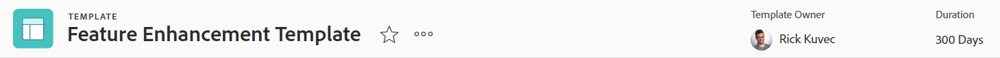

# Présentation des en-têtes d’objet

Vous pouvez afficher les informations en un coup d’oeil sur les objets de la section [!DNL Adobe Workfront] lorsque vous passez en revue leur en-tête.

En plus du nom de l’objet, l’en-tête peut inclure le propriétaire de l’objet, l’état ou le pourcentage de fin.

[!DNL Workfront] donne la priorité au nom de l’objet, en lui allouant autant d’espace que possible dans l’en-tête. Lorsqu’un nom d’objet est trop long, il est tronqué. Pour afficher le nom complet d’un objet, vous pouvez le survoler avec la souris.

## Accès à l’en-tête d’un objet

Accès à l’en-tête d’un objet dans [!DNL Workfront] est identique pour tous les objets qui le contiennent.

Par exemple, pour accéder à l’en-tête d’un projet :

1. Accédez à un projet.\
   L’en-tête s’affiche en haut de la page et contient le nom du projet.

   

## [!UICONTROL Accueil] aperçu de l’en-tête

Les en-têtes suivants sont disponibles dans Accueil :

* Tâche : pour plus d’informations sur l’utilisation de cet en-tête, voir la section [Présentation de l’en-tête de tâche](#task-header-overview) dans cet article.
* Problème : pour plus d’informations sur l’utilisation de cet en-tête, voir la section [Présentation de l’en-tête du problème](#issue-header-overview) dans cet article.

## En-têtes personnalisables

Votre [!DNL Workfront]  ou l’administrateur de groupe peut personnaliser l’en-tête des projets, tâches et problèmes à l’aide d’un modèle de mise en page.

Cet article décrit les en-têtes par défaut de tous les objets, y compris les projets, les tâches et les problèmes.

Pour plus d’informations sur la personnalisation des informations sur l’en-tête d’un objet, voir [Personnalisation des en-têtes d’objet à l’aide d’un modèle de mise en page](../../administration-and-setup/customize-workfront/use-layout-templates/customize-object-headers.md).

## Aperçu de l’en-tête du projet

L’en-tête du projet affiche les informations suivantes, par défaut :

<table style="table-layout:auto"> 
 <col> 
 <col> 
 <thead> 
  <tr> 
   <th>Informations sur l’en-tête</th> 
   <th>Notes</th> 
  </tr> 
 </thead> 
 <tbody> 
  <tr> 
   <td role="rowheader">Chemin de navigation avec les objets parents</td> 
   <td>Si le projet est associé à un programme ou à un portfolio, il s’affiche dans le chemin de navigation dans le coin supérieur gauche de l’en-tête. Cliquer sur le nom du parent ouvre cet objet parent.</td> 
  </tr> 
  <tr data-mc-conditions=""> 
   <td role="rowheader">Icône Objet </td> 
   <td> 
Icône violette [!UICONTROL Project]  s’affiche à gauche du nom du projet.
 </td> 
  </tr> 
  <tr> 
   <td role="rowheader">Nom du projet</td> 
   <td>Vous pouvez modifier le nom du projet dans l’en-tête .</td> 
  </tr> 
  <tr> 
   <td role="rowheader">Nom du type d’objet</td> 
   <td> 
Le texte "[!UICONTROL PROJECT]" s’affiche au-dessus du nom du projet dans l’en-tête.
 </td> 
  </tr> 
  <tr> 
   <td role="rowheader">Zone d’actions de la tâche</td> 
   <td> 
En regard du nom du projet, la zone d’actions s’affiche.
 
  
  </td> 
  </tr> 
  <tr> 
   <td role="rowheader">[!UICONTROL Pourcentage terminé]</td> 
   <td>Vous ne pouvez pas modifier le pourcentage de projet terminé dans l’en-tête .</td> 
  </tr> 
  <tr> 
   <td role="rowheader">[!UICONTROL Propriétaire du projet]</td> 
   <td> 
Vous pouvez modifier le [!UICONTROL Propriétaire du projet] dans l’en-tête .
 </td> 
  </tr> 
  <tr> 
   <td role="rowheader">[!UICONTROL Date d’achèvement prévue] </td> 
   <td> 
Vous pouvez modifier le projet [!UICONTROL Date d’achèvement prévue] et l’heure dans l’en-tête si le projet est planifié à partir de la [!UICONTROL Date d’achèvement]. Si le projet est planifié à partir de la [!UICONTROL Date de début], ces informations sont mises à jour à partir des tâches du projet.
 </td> 
  </tr> 
  <tr> 
   <td role="rowheader">[!UICONTROL Condition] </td> 
   <td> 
Lorsque vous définissez le [!UICONTROL Type de condition] du projet sur Manuel, vous pouvez mettre à jour la [!UICONTROL Condition] du projet dans l’en-tête .
</td> 
  </tr> 
  <tr> 
   <td role="rowheader">[!UICONTROL Status]</td> 
   <td>Vous pouvez modifier le projet [!UICONTROL Status] dans l’en-tête .</td> 
  </tr> 
  <tr> 
   <td role="rowheader">Zone [!UICONTROL Approbations]</td> 
   <td> 
Lorsque vous êtes l’un des approbateurs, utilisez les icônes suivantes pour gérer les validations du projet :
 
  </img> [!UICONTROL Approuver]
 
  </img> [!UICONTROL Rejeter]
 
  </img> [!UICONTROL Rappel]
 
Si vous n’êtes pas un approbateur, cliquez sur l’icône [!UICONTROL Plus]  pour afficher des informations sur l’étape d’approbation actuelle.
 
Pour en savoir plus sur les validations, voir <a href="../../review-and-approve-work/manage-approvals/approval-process-in-workfront.md" class="MCXref xref">Présentation du processus de validation</a>.
 </td> 
  </tr> 
 </tbody> 
</table>

## Présentation de l’en-tête de tâche

Par défaut, l’en-tête de la tâche comprend les informations suivantes :

<table style="table-layout:auto"> 
 <col> 
 <col> 
 <thead> 
  <tr> 
   <th>Informations sur l’en-tête</th> 
   <th>Notes</th> 
  </tr> 
 </thead> 
 <tbody> 
  <tr> 
   <td role="rowheader">Chemin de navigation avec les objets parents</td> 
   <td> 
Les objets parents de la tâche s’affichent dans le chemin de navigation. Cliquer sur le nom du parent ouvre cet objet parent.
 
Pour plus d’informations, voir <a href="../../workfront-basics/the-new-workfront-experience/breadcrumb-overview.md" class="MCXref xref">Présentation du chemin de navigation</a>.
 </td> 
  </tr> 
  <tr data-mc-conditions=""> 
   <td role="rowheader">Icône Objet </td> 
   <td> 
Icône verte [!UICONTROL Tâche]  s’affiche à gauche du nom de la tâche.
 </td> 
  </tr> 
  <tr> 
   <td role="rowheader">Nom de la tâche</td> 
   <td>Vous pouvez modifier le nom de la tâche dans l’en-tête.</td> 
  </tr> 
  <tr> 
   <td role="rowheader">Nom du type d’objet</td> 
   <td> 
Le texte "[!UICONTROL TASK]" s’affiche au-dessus du nom de la tâche dans l’en-tête.
 </td> 
  </tr> 
  <tr> 
   <td role="rowheader">Zone d’actions de la tâche</td> 
   <td> 
En regard du nom de la tâche, la zone [!UICONTROL Actions] s’affiche.
 
  
 
Si l’icône Dépendance s’affiche, vous pouvez cliquer sur l’icône pour afficher les prédécesseurs ou les successeurs de la tâche.
 </td> 
  </tr> 
  <tr> 
   <td role="rowheader">[!UICONTROL Pourcentage terminé]</td> 
   <td>Vous pouvez modifier le pourcentage de tâche terminé dans l’en-tête .</td> 
  </tr> 
  <tr> 
   <td role="rowheader">[!UICONTROL Affectations]</td> 
   <td>Vous pouvez modifier les personnes désignées d’une tâche à partir de l’en-tête.</td> 
  </tr> 
  <tr> 
   <td role="rowheader"> 
Bouton [!UICONTROL Travailler dessus], [!UICONTROL Terminé] ou [!UICONTROL Tâche de démarrage]
 </td> 
   <td> 
Si la tâche vous est assignée, vous pouvez cliquer sur le bouton [!UICONTROL Travailler dessus]. ou [!UICONTROL Tâche de démarrage] pour indiquer que vous êtes en train de travailler sur la tâche ou sur le bouton [!UICONTROL Terminé] pour indiquer que vous avez terminé la tâche.
 
Pour plus d’informations sur le remplacement du bouton [!UICONTROL Travailler dessus] par un bouton [!UICONTROL Tâche de démarrage], voir <a href="../../people-teams-and-groups/create-and-manage-teams/work-on-it-button-to-start-button.md" class="MCXref xref">Remplacez le bouton [!UICONTROL Travailler dessus] par un bouton [!UICONTROL Démarrer] .</a>.
 </td> 
  </tr> 
  <tr> 
   <td role="rowheader">[!UICONTROL Date d’achèvement prévue]</td> 
   <td> 
Vous pouvez modifier la tâche [!UICONTROL Date d’achèvement prévue] et heure dans l’en-tête .
 
Conseil : Notez que la [!UICONTROL Date de validation] n’est pas visible dans l’en-tête. Vous pouvez l’afficher sur la page [!UICONTROL Détails].
 </td> 
  </tr> 
  <tr> 
   <td role="rowheader">[!UICONTROL Status]</td> 
   <td>Vous pouvez modifier la tâche [!UICONTROL Status] dans l’en-tête .</td> 
  </tr> 
  <tr> 
   <td role="rowheader">Zone [!UICONTROL Approbations]</td> 
   <td> 
Lorsque vous êtes l’un des approbateurs, utilisez les icônes suivantes pour gérer les validations de la tâche :
 
  </img> [!UICONTROL Approuver]
 
  </img> [!UICONTROL Rejeter]
 
  </img> [!UICONTROL Rappel]
 
Si vous n’êtes pas un approbateur, cliquez sur l’icône [!UICONTROL Plus]  pour afficher des informations sur l’étape d’approbation actuelle.
 
Pour en savoir plus sur les validations, voir <a href="../../review-and-approve-work/manage-approvals/approval-process-in-workfront.md" class="MCXref xref">Présentation du processus de validation</a>.
 </td> 
  </tr> 
 </tbody> 
</table>

## Présentation de l’en-tête du problème

L’en-tête de problème comprend les informations suivantes, par défaut :

<table style="table-layout:auto"> 
 <col> 
 <col> 
 <thead> 
  <tr> 
   <th>Informations sur l’en-tête</th> 
   <th>Notes</th> 
  </tr> 
 </thead> 
 <tbody> 
  <tr> 
   <td role="rowheader">Chemin de navigation avec les objets parents</td> 
   <td> 
Les objets parents du problème s’affichent dans le chemin de navigation. Cliquer sur le nom du parent ouvre cet objet parent.
 
Pour plus d’informations, voir <a href="../../workfront-basics/the-new-workfront-experience/breadcrumb-overview.md" class="MCXref xref">Présentation du chemin de navigation</a>.
 </td> 
  </tr> 
  <tr> 
   <td role="rowheader">Icône Objet </td> 
   <td> 
Icône rose [!UICONTROL Problème]  s’affiche à gauche du nom du problème.
 </td> 
  </tr> 
  <tr> 
   <td role="rowheader">Nom du problème</td> 
   <td>Vous pouvez modifier le nom du problème dans l’en-tête .</td> 
  </tr> 
  <tr> 
   <td role="rowheader">Nom du type d’objet</td> 
   <td> 
Le texte "[!UICONTROL PROBLÈME]" s’affiche au-dessus du nom du problème dans l’en-tête.
 </td> 
  </tr> 
  <tr> 
   <td role="rowheader">Zone d’actions du problème</td> 
   <td> 
En regard du nom du problème, la zone [!UICONTROL Actions] s’affiche.
 
  
 
Si l’icône [!UICONTROL Dépendance] s’affiche, vous pouvez cliquer sur l’icône pour afficher les prédécesseurs ou les successeurs du problème.
  </td> 
  </tr> 
  <tr> 
   <td role="rowheader">[!UICONTROL Pourcentage terminé]</td> 
   <td> 
Vous pouvez modifier le pourcentage d’achèvement du problème à partir de l’en-tête .
 </td> 
  </tr> 
  <tr> 
   <td role="rowheader">[!UICONTROL Affectations]</td> 
   <td>Vous pouvez modifier les personnes désignées d’un problème à partir de l’en-tête .</td> 
  </tr> 
  <tr> 
   <td role="rowheader">[!UICONTROL Travail dessus], [!UICONTROL terminé], ou bouton [!UICONTROL Problème de début]</td> 
   <td>Si le problème vous est assigné, vous pouvez cliquer sur le bouton [!UICONTROL Travailler dessus]. ou [!UICONTROL Problème de démarrage] pour indiquer que vous êtes en train de travailler sur le problème ou le bouton [!UICONTROL Terminé] pour indiquer que vous avez terminé le problème.Pour plus d’informations sur le remplacement du bouton [!UICONTROL Travailler dessus] par un bouton [!UICONTROL Tâche de démarrage], voir <a href="../../people-teams-and-groups/create-and-manage-teams/work-on-it-button-to-start-button.md" class="MCXref xref">Remplacez le bouton [!UICONTROL Travailler dessus] par un bouton [!UICONTROL Démarrer] .</a>.</td> 
  </tr> 
  <tr> 
   <td role="rowheader">[!UICONTROL Date d’achèvement prévue]</td> 
   <td> 
Vous pouvez modifier le problème [!UICONTROL Date d’achèvement prévue] et heure dans l’en-tête .
 
Conseil : Notez que la [!UICONTROL Date de validation] n’est pas visible dans l’en-tête. Vous pouvez l’afficher sur la page [!UICONTROL Détails].
 </td> 
  </tr> 
  <tr> 
   <td role="rowheader">[!UICONTROL Status]</td> 
   <td>Vous pouvez modifier le problème [!UICONTROL Status] dans l’en-tête .</td> 
  </tr> 
  <tr> 
   <td role="rowheader">Zone [!UICONTROL Approbations]</td> 
   <td> 
Lorsque vous êtes l’un des approbateurs, utilisez les icônes suivantes pour gérer les approbations du problème :
 
  [!UICONTROL Approuver]
 
  [!UICONTROL Rejeter]
 
  [!UICONTROL Rappel]
 
Si vous n’êtes pas un approbateur, cliquez sur l’icône [!UICONTROL Plus]  pour afficher des informations sur l’étape d’approbation actuelle.
 
Pour en savoir plus sur les validations, voir <a href="../../review-and-approve-work/manage-approvals/approval-process-in-workfront.md" class="MCXref xref">Présentation du processus de validation</a>.
 </td> 
  </tr> 
 </tbody> 
</table>

## Aperçu de l’en-tête du programme

L’en-tête du programme affiche les informations suivantes :

<table style="table-layout:auto"> 
 <col> 
 <col> 
 <thead> 
  <tr> 
   <th>Informations sur l’en-tête</th> 
   <th>Notes</th> 
  </tr> 
 </thead> 
 <tbody> 
  <tr> 
   <td role="rowheader">Chemin de navigation avec le nom du Portfolio</td> 
   <td> 
Vous pouvez accéder au [!UICONTROL Portfolio] à partir de l’en-tête du [!UICONTROL Program]. Cliquer sur le nom du parent ouvre cet objet parent.
 
Pour plus d’informations, voir <a href="../../workfront-basics/the-new-workfront-experience/breadcrumb-overview.md" class="MCXref xref">Présentation du chemin de navigation</a>.
 </td> 
  </tr> 
  <tr> 
   <td role="rowheader">Icône Objet </td> 
   <td> 
Icône orange [!UICONTROL Program]  s’affiche à gauche du nom du programme.
 </td> 
  </tr> 
  <tr> 
   <td role="rowheader">Nom du programme</td> 
   <td>Vous pouvez modifier le nom du programme dans l’en-tête .</td> 
  </tr> 
  <tr> 
   <td role="rowheader">Nom du type d’objet</td> 
   <td> 
Si le programme est marqué comme [!UICONTROL actif], le texte "[!UICONTROL PROGRAM]" s’affiche au-dessus du nom du programme dans l’en-tête.
 </td> 
  </tr> 
  <tr> 
   <td role="rowheader">État de l’activation</td> 
   <td> 
Si le programme est désactivé, le texte "[!UICONTROL PROGRAM DEACTIVATED]" s’affiche au-dessus du nom du programme dans l’en-tête.
 </td> 
  </tr> 
  <tr> 
   <td role="rowheader">La zone d’actions du programme</td> 
   <td> 
En regard du nom du programme, la zone [!UICONTROL Actions] s’affiche.
 
  
 </td> 
  </tr> 
  <tr> 
   <td role="rowheader">[!UICONTROL Pourcentage terminé]</td> 
   <td> 
Vous ne pouvez pas modifier le [!UICONTROL Pourcentage terminé] du programme dans l’en-tête . Ces informations sont mises à jour à partir des projets du programme.
 
Conseil : Par défaut, le pourcentage de réussite du programme est une moyenne des valeurs de pourcentage de fin des projets dans un [!UICONTROL Actuel] ou un [!UICONTROL État approuvé] appartenant au programme.
 </td> 
  </tr> 
  <tr> 
   <td role="rowheader">[!UICONTROL Program Manager]</td> 
   <td> 
Vous pouvez modifier le [!UICONTROL Program Manager] dans l’en-tête . Il s’agit du même nom que le [!UICONTROL Propriétaire du programme].
 </td> 
  </tr> 
  <tr> 
   <td role="rowheader">[!UICONTROL Date d’achèvement prévue]</td> 
   <td>Vous ne pouvez pas modifier le programme [!UICONTROL Date d’achèvement prévue] dans l’en-tête . Ces informations sont mises à jour à partir de la [!UICONTROL Date d’achèvement prévue] des projets du programme.</td> 
  </tr> 
  <tr> 
   <td role="rowheader">[!UICONTROL Condition des projets actifs]</td> 
   <td>Il s’agit d’un calcul du pourcentage de projets actifs dans le programme pour lesquels la [!UICONTROL Condition] est définie sur [!UICONTROL Sur Target], [!UICONTROL À Risque] ou [!UICONTROL À Problème].</td> 
  </tr> 
 </tbody> 
</table>

## Présentation de l’en-tête de Portfolio {#portfolio-header-overview}

L’en-tête de portefeuille comprend les informations suivantes :

<table style="table-layout:auto"> 
 <col> 
 <col> 
 <thead> 
  <tr> 
   <th>Informations sur l’en-tête</th> 
   <th>Notes</th> 
  </tr> 
 </thead> 
 <tbody> 
  <tr> 
   <td role="rowheader">Icône Objet </td> 
   <td> 
Icône bleue [!UICONTROL Portfolio] s’affiche à gauche du nom du portfolio.
 </td> 
  </tr> 
  <tr> 
   <td role="rowheader">Nom du portfolio</td> 
   <td>Vous pouvez modifier le nom du portfolio dans l’en-tête.</td> 
  </tr> 
  <tr> 
   <td role="rowheader">Nom du type d’objet</td> 
   <td> 
Si le portfolio est marqué comme actif, le texte "[!UICONTROL PORTFOLIO]" s’affiche au-dessus du nom du portfolio dans l’en-tête.
 </td> 
  </tr> 
  <tr> 
   <td role="rowheader">État de l’activation</td> 
   <td> 
Si le portfolio est désactivé, le texte "[!UICONTROL PORTFOLIO DEACTIVATED]" s’affiche au-dessus du nom du portfolio dans l’en-tête.
 </td> 
  </tr> 
  <tr> 
   <td role="rowheader">Zone [!UICONTROL Actions] du portfolio</td> 
   <td> 
En regard du nom du portfolio, la zone [!UICONTROL Actions] s’affiche.
 
  
</td> 
  </tr> 
  <tr> 
   <td role="rowheader">[!UICONTROL Portfolio Manager]</td> 
   <td>Vous pouvez modifier le [!UICONTROL Gestionnaire de Portfolios] dans l’en-tête . Il s’agit du même nom que le [!UICONTROL propriétaire du Portfolio].</td> 
  </tr> 
  <tr> 
   <td role="rowheader">[!UICONTROL Heure d’activation]</td> 
   <td>Il s’agit d’un calcul du pourcentage de projets actuellement en cours dans le portefeuille.</td> 
  </tr> 
  <tr> 
   <td role="rowheader">[!UICONTROL Sur Le Budget]</td> 
   <td>Il s’agit d’un calcul du pourcentage de projets dans le portefeuille qui sont actuellement inscrits au budget.</td> 
  </tr> 
  <tr> 
   <td role="rowheader">[!UICONTROL Aligné]</td> 
   <td>Il s’agit d’un calcul du pourcentage de projets du portfolio qui s’alignent sur le portfolio.</td> 
  </tr> 
  <tr> 
   <td role="rowheader">ROI [!UICONTROL]</td> 
   <td>Il s’agit du calcul [!UICONTROL Retour sur investissement] pour tous les projets du portefeuille.</td> 
  </tr> 
  <tr> 
   <td role="rowheader">[!UICONTROL Net Value]</td> 
   <td>Il s’agit du calcul [!UICONTROL Net Value] pour tous les projets du portefeuille.</td> 
  </tr> 
 </tbody> 
</table>

## Présentation de l’en-tête de modèle {#template-header-overview}

L’en-tête du modèle affiche les informations suivantes :

<table style="table-layout:auto"> 
 <col> 
 <col> 
 <thead> 
  <tr> 
   <th>Informations sur l’en-tête</th> 
   <th>Notes</th> 
  </tr> 
 </thead> 
 <tbody> 
  <tr> 
   <td role="rowheader">Icône Objet </td> 
   <td> 
Icône verte [!UICONTROL Template] s’affiche à gauche du nom du modèle.
 </td> 
  </tr> 
  <tr> 
   <td role="rowheader">Nom du modèle</td> 
   <td>Vous pouvez modifier le nom du modèle dans l’en-tête.</td> 
  </tr> 
  <tr> 
   <td role="rowheader">Nom du type d’objet</td> 
   <td> 
Si le modèle est marqué comme actif, le texte "[!UICONTROL TEMPLATE]" s’affiche au-dessus du nom du modèle dans l’en-tête.
 </td> 
  </tr> 
  <tr> 
   <td role="rowheader">État de l’activation</td> 
   <td> 
Si le modèle est désactivé, le texte "[!UICONTROL MODÈLE DÉSACTIVÉ]" s’affiche au-dessus du nom du modèle dans l’en-tête.
 </td> 
  </tr> 
  <tr> 
   <td role="rowheader">La zone d’actions du modèle</td> 
   <td> 
En regard du nom du modèle, la zone d’actions s’affiche.
 
  
 </td> 
  </tr> 
  <tr> 
   <td role="rowheader">[!UICONTROL Propriétaire du modèle]</td> 
   <td>Vous pouvez modifier le champ [!UICONTROL Propriétaire du modèle] dans l’en-tête.</td> 
  </tr> 
  <tr> 
   <td role="rowheader">[!UICONTROL Duration]</td> 
   <td>Durée du modèle. Vous ne pouvez pas modifier ce champ dans l’en-tête.</td> 
  </tr> 
 </tbody> 
</table>

## Présentation de l’en-tête de tâche de modèle

L’en-tête de tâche du modèle affiche les informations suivantes :

<table style="table-layout:auto"> 
 <col> 
 <col> 
 <thead> 
  <tr> 
   <th>Informations sur l’en-tête</th> 
   <th>Notes</th> 
  </tr> 
 </thead> 
 <tbody> 
  <tr> 
   <td role="rowheader">Chemin de navigation vers les objets parents</td> 
   <td> 
Les objets parents de la tâche de modèle s’affichent dans le chemin de navigation. Cliquer sur le nom d’un objet parent ouvre cet objet parent.
 
Pour plus d’informations, voir <a href="../../workfront-basics/the-new-workfront-experience/breadcrumb-overview.md" class="MCXref xref">Présentation du chemin de navigation</a>.
 </td> 
  </tr> 
  <tr> 
   <td role="rowheader">Icône Objet </td> 
   <td> 
Icône verte [!UICONTROL Tâche] s’affiche à gauche du nom de la tâche de modèle.
 </td> 
  </tr> 
  <tr> 
   <td role="rowheader">Nom de la tâche de modèle</td> 
   <td>Vous pouvez modifier le nom de la tâche de modèle dans l’en-tête.</td> 
  </tr> 
  <tr> 
   <td role="rowheader">Nom du type d’objet</td> 
   <td> 
Le texte "[!UICONTROL TÂCHE DE MODÈLE]" s’affiche au-dessus du nom de la tâche de modèle dans l’en-tête.
 </td> 
  </tr> 
  <tr> 
   <td role="rowheader">Zone d’actions de la tâche de modèle</td> 
   <td> 
En regard du nom de la tâche de modèle, la zone d’actions s’affiche.
 
  
 </td> 
  </tr> 
  <tr> 
   <td role="rowheader">[!UICONTROL Affectations]</td> 
   <td>Vous pouvez modifier les [!UICONTROL Affectations] de la tâche de modèle dans l’en-tête.</td> 
  </tr> 
  <tr> 
   <td role="rowheader">[!UICONTROL Jour d’achèvement]</td> 
   <td>Il s’agit du jour de la durée du modèle pendant lequel la tâche de modèle doit se terminer.</td> 
  </tr> 
 </tbody> 
</table>

## Présentation de l’en-tête d’enregistrement de facturation

L’en-tête d’enregistrement de facturation affiche les informations suivantes :

<table style="table-layout:auto"> 
 <col> 
 <col> 
 <thead> 
  <tr> 
   <th>Informations sur l’en-tête</th> 
   <th>Notes</th> 
  </tr> 
 </thead> 
 <tbody> 
  <tr> 
   <td role="rowheader">Chemin de navigation vers les objets parents</td> 
   <td> 
Les objets parents de l’enregistrement de facturation s’affichent dans le chemin de navigation. Cliquer sur le nom d’un objet parent ouvre cet objet parent.
 
Pour plus d’informations, voir <a href="../../workfront-basics/the-new-workfront-experience/breadcrumb-overview.md" class="MCXref xref">Présentation du chemin de navigation</a>.
 </td> 
  </tr> 
  <tr> 
   <td role="rowheader">Icône Objet </td> 
   <td> 
Icône bleue [!UICONTROL Enregistrement de facturation]  s’affiche à gauche du nom de l’enregistrement de facturation.
 </td> 
  </tr> 
  <tr> 
   <td role="rowheader">Nom de l’enregistrement de facturation</td> 
   <td>Vous pouvez modifier le nom de l’enregistrement de facturation dans l’en-tête.</td> 
  </tr> 
  <tr> 
   <td role="rowheader">Nom du type d’objet</td> 
   <td> 
Le texte "[!UICONTROL ENREGISTREMENT DE FACTURATION]" s’affiche au-dessus du nom de l’enregistrement de facturation dans l’en-tête.
 </td> 
  </tr> 
  <tr> 
   <td role="rowheader">Zone d’actions de l’enregistrement de facturation</td> 
   <td> 
En regard du nom de l’enregistrement de facturation, le menu [!UICONTROL Plus]  s’affiche, ce qui vous permet de sélectionner les options suivantes :
 
    <ul> 
     <li> 
[!UICONTROL Edit]
 </li> 
     <li> 
 
 </li> 
    </ul> </td> 
  </tr> 
  <tr> 
   <td role="rowheader">[!UICONTROL Total des enregistrements de facturation]</td> 
   <td>Il s’agit du montant total de l’enregistrement de facturation. Vous ne pouvez pas modifier ce champ.</td> 
  </tr> 
  <tr> 
   <td role="rowheader">[!UICONTROL Date de facturation]</td> 
   <td>Il s’agit de la date de création de l’enregistrement de facturation, sauf s’il a été modifié manuellement lors de la création de l’enregistrement de facturation. Vous pouvez modifier la [!UICONTROL Date de facturation] dans l’en-tête .</td> 
  </tr> 
  <tr> 
   <td role="rowheader">[!UICONTROL Status]</td> 
   <td> 
Lorsque l’état de l’enregistrement de facturation est [!UICONTROL Facturé], vous ne pouvez plus le modifier.
 
Vous pouvez modifier le Statut de l'enregistrement de facturation dans l'en-tête.
 </td> 
  </tr> 
 </tbody> 
</table>

## Présentation de l’en-tête utilisateur

L’en-tête de l’utilisateur affiche les informations suivantes :

<table style="table-layout:auto"> 
 <col> 
 <col> 
 <thead> 
  <tr> 
   <th>Informations sur l’en-tête</th> 
   <th>Notes</th> 
  </tr> 
 </thead> 
 <tbody> 
  <tr> 
   <td role="rowheader">Image de profil de l'utilisateur</td> 
   <td>Vous ne pouvez pas mettre à jour l’image de profil dans l’en-tête.</td> 
  </tr> 
  <tr> 
   <td role="rowheader">Nom de l’utilisateur et titre</td> 
   <td> 
 Le titre de l’utilisateur s’affiche dans toutes les majuscules au-dessus de son nom. Vous ne pouvez pas modifier le nom de l’utilisateur dans l’en-tête.
 </td> 
  </tr> <!--
   <tr> 
    <td role="rowheader">Name of the object type</td> 
    <td> 
The name of the object type does not display.
 </td> 
   </tr>
  --> 
  <tr> 
   <td role="rowheader">État de l’activation</td> 
   <td> 
Si l’utilisateur a été désactivé, tout le texte et l’image de profil de l’en-tête sont grisés.
 </td> 
  </tr> 
  <tr> 
   <td role="rowheader">Zone d’actions de l’utilisateur</td> 
   <td> 
La zone Actions s’affiche en regard du nom de l’utilisateur.
 
  
</td> 
  </tr> 
  <tr> 
   <td role="rowheader">Adresse e-mail</td> 
   <td>Vous ne pouvez pas modifier l’adresse électronique dans l’en-tête. Il s’agit généralement également du nom d’utilisateur.</td> 
  </tr> 
  <tr> 
   <td role="rowheader">Numéro de téléphone</td> 
   <td>Vous ne pouvez pas modifier le numéro de téléphone dans l’en-tête.</td> 
  </tr> 
  <tr> 
   <td role="rowheader">Équipes</td> 
   <td> 
Vous pouvez afficher les équipes auxquelles l’utilisateur appartient. Pointez sur un avatar d’équipe pour afficher le nom de l’équipe. Vous ne pouvez pas modifier les équipes dans l’en-tête.
 </td> 
  </tr> 
 </tbody> 
</table>

## Présentation de l’en-tête de l’équipe

L’en-tête de l’équipe affiche les informations suivantes :

<table style="table-layout:auto"> 
 <col> 
 <col> 
 <thead> 
  <tr> 
   <th>Informations sur l’en-tête</th> 
   <th>Notes</th> 
  </tr> 
 </thead> 
 <tbody> 
  <tr> 
   <td role="rowheader">Icône Objet </td> 
   <td> 
Icône violette [!UICONTROL Team]  s’affiche à gauche du nom de l’équipe.
 </td> 
  </tr> 
  <tr> 
   <td role="rowheader">Nom de l'équipe</td> 
   <td>Vous pouvez modifier le nom de l’équipe dans l’en-tête .</td> 
  </tr> 
  <tr> 
   <td role="rowheader">Nom du type d’objet</td> 
   <td> 
Le texte "[!UICONTROL TEAM]" s’affiche au-dessus du nom de l’équipe dans l’en-tête.
 </td> 
  </tr> 
  <tr> 
   <td role="rowheader">La zone d’actions de l’équipe</td> 
   <td> 
En regard du nom de l’équipe, la zone [!UICONTROL Actions] s’affiche.
 
  
</td> 
  </tr> 
  <tr> 
   <td role="rowheader">Images du profil du membre de l’équipe</td> 
   <td>Les photos de profil des membres de l'équipe. Placez le pointeur de la souris sur une image pour afficher le nom de l’utilisateur.</td> 
  </tr> 
  <tr> 
   <td role="rowheader">Description</td> 
   <td>Voici une brève description des membres de l’équipe. Vous ne pouvez pas modifier la description de l’équipe dans l’en-tête.</td> 
  </tr> 
 </tbody> 
</table>

## Présentation de l’en-tête d’itération

L’en-tête d’itération affiche les informations suivantes :

<table style="table-layout:auto"> 
 <col> 
 <col> 
 <thead> 
  <tr> 
   <th>Informations sur l’en-tête</th> 
   <th>Notes</th> 
  </tr> 
 </thead> 
 <tbody> 
  <tr> 
   <td role="rowheader">Icône Objet </td> 
   <td> 
Icône orange [!UICONTROL Itération]  s’affiche à gauche du nom de l’itération.
 </td> 
  </tr> 
  <tr> 
   <td role="rowheader">Nom de l’itération</td> 
   <td>Vous pouvez modifier le nom de l’itération dans l’en-tête .</td> 
  </tr> 
  <tr> 
   <td role="rowheader">Nom du type d’objet</td> 
   <td> 
Le texte "[!UICONTROL ITERATION]" s’affiche au-dessus du nom de l’itération dans l’en-tête.
 </td> 
  </tr> 
  <tr> 
   <td role="rowheader">Zone d’actions de l’itération</td> 
   <td> 
Dans le coin supérieur droit de l’en-tête, la zone d’actions s’affiche.
 
  
</td> 
  </tr> 
  <tr> 
   <td role="rowheader">Propriétaire</td> 
   <td>Il s’agit du [!UICONTROL propriétaire de l’itération. Vous ne pouvez pas modifier le [!UICONTROL Propriétaire] dans l’en-tête.</td> 
  </tr> 
  <tr> 
   <td role="rowheader">[!UICONTROL Chronologie]</td> 
   <td>La [!UICONTROL Chronologie] affiche les dates de début et de fin de l’itération. Vous ne pouvez pas modifier la [!UICONTROL Chronologie] dans l’en-tête .</td> 
  </tr> 
  <tr> 
   <td role="rowheader">[!UICONTROL Team]</td> 
   <td>Vous ne pouvez pas modifier l’équipe de l’itération dans l’en-tête. Cliquez sur le nom de l’équipe pour accéder à la page de l’équipe.</td> 
  </tr> 
 </tbody> 
</table>

## Présentation de l’en-tête de groupe

L’en-tête du groupe affiche les informations suivantes :

<table style="table-layout:auto"> 
 <col> 
 <col> 
 <thead> 
  <tr> 
   <th>Informations sur l’en-tête</th> 
   <th>Notes</th> 
  </tr> 
 </thead> 
 <tbody> 
  <tr> 
   <td role="rowheader">Icône Objet </td> 
   <td> 
Icône orange [!UICONTROL Group]  s’affiche à gauche du nom du groupe.
 </td> 
  </tr> 
  <tr> 
   <td role="rowheader">Nom du groupe</td> 
   <td>Vous pouvez modifier le nom du groupe dans l’en-tête .</td> 
  </tr> 
  <tr> 
   <td role="rowheader">Nom du type d’objet</td> 
   <td> 
Le texte "[!UICONTROL GROUP]" s’affiche au-dessus du nom du groupe dans l’en-tête.
 </td> 
  </tr> 
  <tr> 
   <td role="rowheader">Zone [!UICONTROL Actions] du groupe</td> 
   <td> 
En regard du nom du groupe, le menu [!UICONTROL Plus]  s’affiche, ce qui vous permet de sélectionner les options suivantes :
 
    <ul> 
     <li> 
[!UICONTROL Edit]
 </li> 
     <li> 
[!UICONTROL Copie]
 </li> 
     <li> 
[!UICONTROL Supprimer]
 </li> 
    </ul> </td> 
  </tr> 
  <tr> 
   <td role="rowheader">[!UICONTROL Business Leader]</td> 
   <td>Vous pouvez modifier le [!UICONTROL Business Leader] dans l’en-tête .</td> 
  </tr> 
  <tr> 
   <td role="rowheader">Licences [!UICONTROL en cours d’utilisation] </td> 
   <td> 
La zone [!UICONTROL Licences en cours d’utilisation] affiche le nombre d’utilisateurs des licences [!UICONTROL Plan] et [!UICONTROL Work] du groupe et de ses sous-groupes. Vous pouvez cliquer sur les chiffres pour afficher ces informations pour les 5 types de licence.
 
Pour plus d’informations, voir <a href="../../administration-and-setup/manage-groups/create-and-manage-groups/view-number-licenses-allocated-used-group.md" class="MCXref xref">Afficher le nombre de licences attribuées et utilisées dans un groupe dans la nouvelle [!DNL Adobe Workfront] expérience</a>.
 </td> 
  </tr> 
  <tr> 
   <td role="rowheader">[!UICONTROL Administrateurs de groupe]</td> 
   <td>Vous pouvez modifier les administrateurs de groupe dans l’en-tête .</td> 
  </tr> 
 </tbody> 
</table>

## Présentation de l’en-tête de document

L’en-tête du document affiche les informations suivantes :

<table style="table-layout:auto"> 
 <col> 
 <col> 
 <thead> 
  <tr> 
   <th>Informations sur l’en-tête</th> 
   <th>Notes</th> 
  </tr> 
 </thead> 
 <tbody> 
  <tr> 
   <td role="rowheader">Chemin de navigation avec les objets parents</td> 
   <td> 
Les objets parents du document s’affichent dans le chemin de navigation. Cliquer sur le nom d’un objet parent ouvre cet objet parent.
 
Pour plus d’informations, voir <a href="../../workfront-basics/the-new-workfront-experience/breadcrumb-overview.md" class="MCXref xref">Présentation du chemin de navigation</a>.
 </td> 
  </tr> 
  <tr> 
   <td role="rowheader">Icône Objet </td> 
   <td> 
Icône bleue [!UICONTROL Document]  s’affiche à gauche du nom du document.
 </td> 
  </tr> 
  <tr> 
   <td role="rowheader">Nom du document</td> 
   <td>Vous pouvez modifier le nom du document dans l’en-tête .</td> 
  </tr> 
  <tr> 
   <td role="rowheader">Nom du type d’objet</td> 
   <td> 
Le texte "[!UICONTROL DOCUMENT]" s’affiche au-dessus du nom du document dans l’en-tête.
 </td> 
  </tr> 
  <tr> 
   <td role="rowheader">Zone d’actions du document</td> 
   <td> 
En regard du nom du document, la zone d’actions s’affiche.
 
  
</td> 
  </tr> 
  <tr> 
   <td role="rowheader">Zone de validation [!UICONTROL Decision]</td> 
   <td> La zone [!UICONTROL Décisions] s’affiche dans le coin supérieur droit de l’en-tête du document. Cette zone varie selon la phase d’approbation et selon que vous êtes un approbateur, un réviseur ou aucun des deux. <ul><li> 
Si vous êtes un approbateur, vous pouvez utiliser les icônes suivantes pour gérer les approbations du document :
 
  [!UICONTROL Approuver]
 
  [!UICONTROL Rappel]
 
  [!UICONTROL Rejeter]
 
Pour plus d’informations sur les décisions de validation, voir <a href="../../review-and-approve-work/manage-approvals/approving-work.md" class="MCXref xref">Valider le travail</a>.</li><li>
Si vous êtes un réviseur, vous pouvez cliquer sur le bouton Terminer ma révision pour indiquer que vous avez examiné le document.

Pour plus d’informations sur la révision d’un document, voir <a href="../../review-and-approve-work/document-reviews-and-approvals/review-and-approve-documents/review-a-document.md" class="MCXref xref">Révision d’un document</a>.
</li><li>Sinon, cette zone affiche l’état de révision et d’approbation actuel du document.</li><ul>
 </td> 
  </tr> 
 </tbody> 
</table>

## Présentation de l’en-tête de la société {#company-header-overview}

L’en-tête de l’entreprise affiche les informations suivantes :

<table style="table-layout:auto"> 
 <col> 
 <col> 
 <thead> 
  <tr> 
   <th>Informations sur l’en-tête</th> 
   <th>Notes</th> 
  </tr> 
 </thead> 
 <tbody> 
  <tr> 
   <td role="rowheader">Icône Objet </td> 
   <td> 
Icône bleue [!UICONTROL Société]  s’affiche à gauche du nom de la société.
 </td> 
  </tr> 
  <tr> 
   <td role="rowheader">Nom de la société</td> 
   <td>Vous pouvez modifier le nom de la société dans l’en-tête .</td> 
  </tr> 
  <tr> 
   <td role="rowheader">Nom du type d’objet</td> 
   <td> 
Le texte "[!UICONTROL COMPANY]" s’affiche au-dessus du nom de la société dans l’en-tête.
 </td> 
  </tr> 
  <tr> 
   <td role="rowheader">Zone d’actions de la société</td> 
   <td> 
En regard du nom de la société, le menu [!UICONTROL Plus]  s’affiche, ce qui vous permet de sélectionner les options suivantes :
 
    <ul> 
     <li> 
[!UICONTROL Edit]
 </li> 
     <li> 
[!UICONTROL Supprimer la société]
 </li> 
    </ul> </td> 
  </tr> 
 </tbody> 
</table>

## Présentation de l’en-tête Plan

Les plans sont l’objet de la [!DNL Workfront Scenario Planner]. Pour plus d’informations sur la variable [!DNL Scenario Planner], voir [La variable [!DNL Scenario Planner] aperçu](../../scenario-planner/scenario-planner-overview.md).

L’en-tête du plan affiche les informations suivantes :

<table style="table-layout:auto"> 
 <col> 
 <col> 
 <thead> 
  <tr> 
   <th>Informations sur l’en-tête</th> 
   <th>Notes</th> 
  </tr> 
 </thead> 
 <tbody> 
  <tr> 
   <td role="rowheader">Retour aux plans</td> 
   <td>Cliquez sur ce lien pour accéder à la liste [!UICONTROL Plans].</td> 
  </tr> 
  <tr> 
   <td role="rowheader">Icône Objet </td> 
   <td> 
Icône bleue [!UICONTROL Plan] s’affiche à gauche du nom du plan.
 </td> 
  </tr> 
  <tr> 
   <td role="rowheader">Nom du plan</td> 
   <td>Vous pouvez modifier le nom du plan dans l’en-tête.</td> 
  </tr> 
  <tr> 
   <td role="rowheader">Nom du type d’objet</td> 
   <td> 
Le texte "[!UICONTROL PLAN]" s’affiche au-dessus du nom du plan dans l’en-tête.
 </td> 
  </tr> 
  <tr> 
   <td role="rowheader">La zone d’actions du plan</td> 
   <td> 
En regard du nom du plan, la zone des actions s’affiche.
 
  
</td> 
  </tr> 
  <tr> 
   <td role="rowheader">Actions de plan supplémentaires</td> 
   <td> 
Sous la zone du nom du plan et des actions, vous pouvez effectuer les actions suivantes :
 
    <ul> 
     <li> 
<strong>[!UICONTROL Afficher les conflits]</strong>: le fait de cliquer sur ce bouton de basculement affiche ou masque les conflits dans les initiatives.
 </li> 
     <li> 
<strong>[!UICONTROL Comparaison de scénarios]</strong>: cliquez sur ce lien pour afficher une comparaison côte à côte des scénarios que vous avez créés.
 </li> 
     <li> 
<strong>[!UICONTROL Sélection du scénario]</strong>: dans ce menu déroulant, vous pouvez copier un scénario ou sélectionner pour en afficher un autre.
 </li> 
    </ul> </td> 
  </tr> 
  <tr> 
   <td role="rowheader">Informations sur les rôles de tâche</td> 
   <td>Dans la zone [!UICONTROL Rôle de la tâche], vous pouvez voir combien de rôles de tâche sont disponibles pour le plan par rapport au nombre requis. Cliquez sur la case pour ajuster les rôles de tâche disponibles.</td> 
  </tr> 
  <tr> 
   <td role="rowheader">Informations [!UICONTROL Financial]</td> 
   <td>Dans la zone [!UICONTROL Financial], vous pouvez consulter le budget, le coût et le pourcentage d’utilisation du plan. Cliquer sur la case permet d'ajuster le montant du budget et de déterminer si les coûts des personnes sont inclus dans le plan.</td> 
  </tr> 
  <tr> 
   <td role="rowheader">[!UICONTROL Net Value]</td> 
   <td>Dans la zone [!UICONTROL Valeur nette], vous pouvez voir la valeur nette du plan en fonction du budget et des coûts que vous avez engagés pour le plan.</td> 
  </tr> 
  <tr> 
   <td role="rowheader">Informations sur [!UICONTROL Partagé avec]</td> 
   <td>Les utilisateurs qui ont accès à l’affichage ou à la gestion du plan s’affichent dans le coin supérieur droit de l’en-tête. Survoler leurs images de profil avec la souris affiche leur nom.</td> 
  </tr> 
  <tr> 
   <td role="rowheader">[!UICONTROL Aller à la publication]</td> 
   <td>Lorsque vous cliquez sur [!UICONTROL Aller à la publication], vous pouvez créer ou mettre à jour un projet lié à une initiative dans le scénario que vous affichez.</td> 
  </tr> 
 </tbody> 
</table>

## Présentation de l’en-tête de l’objectif

Vous pouvez créer des objectifs stratégiques lorsque votre entreprise a accès aux objectifs Workfront. Pour plus d’informations sur [!DNL Workfront Goals], voir [Prise en main d’ [!DNL Adobe Workfront Goals]](../../workfront-goals/goal-management/getting-started-with-wf-goals.md).

L’en-tête d’objectif affiche les informations suivantes :

<table style="table-layout:auto"> 
 <col> 
 <col> 
 <thead> 
  <tr> 
   <th>Informations sur l’en-tête</th> 
   <th>Notes</th> 
  </tr> 
 </thead> 
 <tbody> 
  <tr> 
   <td role="rowheader">Icône Objet </td> 
   <td> 
Icône violette [!UICONTROL Goal]  s’affiche à gauche du nom de l’objectif.
 </td> 
  </tr> 
  <tr> 
   <td role="rowheader">Nom de l’objectif</td> 
   <td>Vous pouvez modifier le nom de l’objectif dans l’en-tête .</td> 
  </tr> 
  <tr> 
   <td role="rowheader">Nom du type d’objet</td> 
   <td> 
Le texte "[!UICONTROL OBJECTIF]" s’affiche au-dessus du nom de l’objectif dans l’en-tête.
 </td> 
  </tr> 
  <tr> 
   <td role="rowheader">Zone d’actions de l’objectif</td> 
   <td> 
En regard du nom de l’objectif, la zone d’actions s’affiche.
 
  

   Vous pouvez effectuer les actions suivantes à partir de la zone d’actions de l’objectif :
   <ul><li>[!UICONTROL Edit]</li>
   <li>[!UICONTROL Copier l’objectif]</li>
   <li>[!UICONTROL Supprimer l’objectif]</li>
   <li>[!UICONTROL Share]</li>
   <li>[!UICONTROL Activer] ou [!UICONTROL Désactiver]</li>
   <li>[!UICONTROL Fermer] ou [!UICONTROL Rouvrir]</li>
   </td> 
  </tr> 
  <tr> 
   <td role="rowheader">[!UICONTROL Progression]</td> 
   <td>Pourcentage de l’objectif de progression, indiquant la part de l’objectif ayant été atteinte. Vous ne pouvez pas mettre à jour la progression de l’objectif. Workfront le calcule en fonction de la progression de chaque indicateur de progression par rapport à l’objectif.</td> 
  </tr> 
  <tr> 
   <td role="rowheader">[!UICONTROL Propriétaire]</td> 
   <td>C'est le propriétaire de l'objectif. Vous pouvez mettre à jour manuellement le propriétaire de l’objectif. Les utilisateurs, les équipes, les groupes ou votre organisation peuvent être propriétaires d’objectifs.</td> 
  </tr> 
  <tr> 
   <td role="rowheader">[!UICONTROL Period]</td> 
   <td>La période au cours de laquelle l’objectif doit être atteint. </td> 
  </tr> 
  <tr> 
   <td role="rowheader">[!UICONTROL Condition]</td> 
   <td>La condition d’objectif indique si l’objectif est sur la cible pour se terminer à temps ou s’il est en retard. </td> 
  </tr> 
  <tr> 
   <td role="rowheader">[!UICONTROL Status]</td> 
   <td>Indique si l’objectif est actif, nouveau ou fermé. Vous ne pouvez pas mettre à jour manuellement l’état de l’objectif. Pour plus d’informations, voir <a href="../../workfront-goals/goal-management/goal-status-overview.md" class="MCXref xref">Aperçu de l’état des objectifs dans [!DNL Adobe Workfront Goals]</a></td> 
  </tr> 
 </tbody> 
</table>