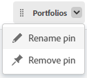

# Épingler des pages pour personnaliser votre espace de travail

Vous pouvez épingler votre travail le plus important dans [!DNL Adobe Workfront] pour une visibilité accrue, une meilleure organisation et un accès plus rapide. Les pages épinglées sont toujours accessibles depuis le haut d’une page dans Workfront.

Un modèle de mise en page peut vous être attribué avec des pages déjà épinglées (tel que décrit dans la section [Personnaliser des pages épinglées à l’aide d’un modèle de mise en page](../../administration-and-setup/customize-workfront/use-layout-templates/customize-pinned-pages.md)). Ces épingles prédéfinies ne peuvent être ni renommées ni supprimées. Toutes les pages que vous épinglez s’affichent à droite des épingles prédéfinies.

## Conditions d’accès

Vous devez disposer des accès suivants pour effectuer les étapes décrites dans cet article :

<table style="table-layout:auto"> 
 <col> 
 </col> 
 <col> 
 </col> 
 <tbody> 
  <tr> 
   <td role="rowheader"><strong>[!DNL Adobe Workfront] formule*</strong></td> 
   <td> 
Tous
 </td> 
  </tr> 
  <tr> 
   <td role="rowheader"><strong>[!DNL Adobe Workfront] licence*</strong></td> 
   <td> 
[!UICONTROL Request] ou version ultérieure
 </td> 
  </tr> 
 </tbody> 
</table>

&#42;Pour connaître le type de plan ou de licence dont vous disposez, contactez votre administrateur ou administratrice [!DNL Workfront].

## Épingler une page

1. Accédez à la page que vous souhaitez épingler.

   Il peut s’agir de n’importe quel élément de travail, tel qu’un projet, une tâche, une file d’attente des demandes, etc.

1. Cliquez sur **[!UICONTROL Épingler la page actuelle]** en haut de la page.

   La page épinglée est désormais accessible en haut de n’importe quelle page dans [!DNL Workfront].

## Accéder à une page épinglée

1. En haut d’une page, cliquez sur la page épinglée à afficher.

   >[!TIP]
   >
   >Passez la souris sur une page épinglée pour afficher son nom complet et sa description.

   Ou

   Si de nombreuses pages sont épinglées, vous devrez peut-être cliquer dans le menu **[!UICONTROL Plus]**  pour afficher d’autres pages épinglées.

   La page épinglée s’affiche.

## Renommer les pages épinglées

Vous pouvez modifier le nom d’une page épinglée pour qu’elle ait plus de signification pour vous.

1. Passez la souris sur la page épinglée dans le volet de navigation supérieur ou dans le **[!UICONTROL menu Plus]**.
1. Cliquez sur la flèche en regard du nom de l’épingle et sélectionnez **[!UICONTROL Renommer l’épingle]**.

   

1. Saisissez le nouveau nom de l’épingle et cliquez sur l’icône de la coche ou appuyez sur Entrée.

   .

   Une petite fenêtre pop-up apparaît pendant quelques secondes après que vous avez cliqué sur la coche ou appuyé sur Entrée, vous permettant d‘annuler la modification du nom de l’épingle avant qu’elle ne soit enregistrée.

## Réorganiser les pages épinglées

Vous pouvez réorganiser l’ordre d’affichage des pages épinglées.

1. Passez la souris sur la page épinglée dans le volet de navigation supérieur ou dans le **[!UICONTROL menu Plus]**. Lorsque vous voyez le curseur manuel, cliquez sur l’épingle et faites-la glisser dans l’ordre souhaité.

   Vos modifications seront automatiquement enregistrées et mémorisées la prochaine fois que vous accéderez à Workfront.

## Supprimer une page épinglée

1. Cliquez sur la page épinglée que vous souhaitez désépingler.
1. Cliquez sur **[!UICONTROL Désépingler la page actuelle]** en haut de l’écran.

   Ou

   Cliquez sur la flèche en regard du nom de l’épingle et sélectionnez **[!UICONTROL Supprimer l’épingle]**.

   

   La page n’est plus accessible depuis le haut d’une page dans [!DNL Workfront].
