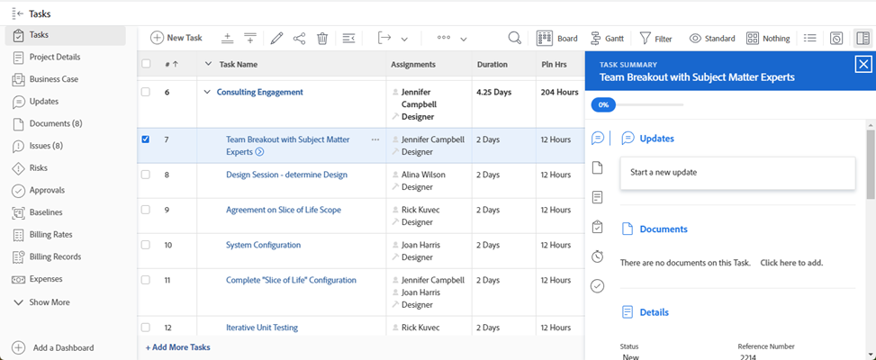

# [!UICONTROL Résumé] aperçu

Vous pouvez utiliser la variable [!UICONTROL Résumé] pour passer en revue et mettre à jour les informations des éléments de travail directement à partir d’une liste de tâches, de problèmes, de documents ou d’autres zones de [!DNL Adobe Workfront] qui affichent les tâches et les problèmes.

Le tableau suivant répertorie les zones où vous pouvez localiser et utiliser la variable [!UICONTROL Résumé] panel :

<table style="table-layout:auto"> 
 <col data-mc-conditions=""> 
 <tbody> 
  <tr> 
   <td>Tâches</td> 
  </tr> 
  <tr> 
   <td> 
Listes de tâches dans une
 
    <ul> 
     <li>Projet</li> 
     <li>Sous-tâche</li> 
    </ul> </td> 
  </tr> 
  <tr> 
   <td>Tâches dans les zones de travail [!UICONTROL non affecté] et [!UICONTROL Affecté] de l’[!UICONTROL équilibreur de charge de travail]</td> 
  </tr> 
  <tr data-mc-conditions=""> 
   <td>Événements</td> 
  </tr> 
  <tr data-mc-conditions=""> 
   <td> 
Listes de problèmes dans
 
    <ul> 
     <li>Projet</li> 
     <li>Tâche</li> 
     <li>Sous-tâche</li> 
    </ul> </td> 
  </tr> 
  <tr data-mc-conditions=""> 
   <td>Problèmes dans la zone [!UICONTROL Affecté de travail] de l’[!UICONTROL équilibreur de charge de travail]</td> 
  </tr> 
  <tr data-mc-conditions=""> 
   <td>Problèmes dans la section [!UICONTROL Envoyé] de la zone [!UICONTROL Demandes]</td> 
  </tr> 
  <tr data-mc-conditions=""> 
   <td>Documents</td> 
  </tr> 
  <tr data-mc-conditions=""> 
   <td>Zone [!UICONTROL Documents]</td> 
  </tr> 
  <tr data-mc-conditions=""> 
   <td>Section [!UICONTROL Documents] d’un objet (projet, tâche, problème, programme, portefeuille, modèle, tâche de modèle, utilisateur)</td> 
  </tr> 
 </tbody> 
</table>

<!--

Workfront administrators can customize the Summary in the Layout Template. For more information, see <a href="../../administration-and-setup/customize-workfront/use-layout-templates/create-and-manage-layout-templates.md" class="MCXref xref">Create and manage layout templates</a>.

-->

Cet article décrit comment accéder à et utiliser le [!UICONTROL Résumé] pour les tâches et les problèmes dans les listes.

Pour plus d’informations sur l’accès au [!UICONTROL Résumé] dans le [!UICONTROL Équilibreur de charge de travail], voir [Mise à jour des tâches dans [!UICONTROL Équilibreur de charge de travail] en utilisant la variable [!UICONTROL Résumé]](../../resource-mgmt/workload-balancer/update-items-in-summary-panel-in-workload-balancer.md).

Pour plus d’informations sur l’accès au [!UICONTROL Résumé] pour les documents, voir [[!UICONTROL Résumé] présentation des documents](../../documents/managing-documents/summary-for-documents.md).

## Exigences d’accès

Vous devez disposer des accès suivants pour effectuer les étapes de cet article :

<table style="table-layout:auto"> 
 <col> 
 <col> 
 <tbody> 
  <tr> 
   <td role="rowheader"><strong>[!DNL Adobe Workfront] plan*</strong></td> 
   <td> 
Tous
 </td> 
  </tr> 
  <tr> 
   <td role="rowheader"><strong>[!DNL Adobe Workfront] license*</strong></td> 
   <td> 
[!UICONTROL Request] ou version ultérieure
 </td> 
  </tr> 
  <tr> 
   <td role="rowheader"><strong>Paramétrages du niveau d'accès*</strong></td> 
   <td> 
[!UICONTROL Affichage] ou accès supérieur à Tâches, Problèmes, Documents
 
[!UICONTROL Affichage] ou un accès supérieur à tout objet pour lequel vous souhaitez afficher le [!UICONTROL Résumé] des documents
 
Remarque : Si vous n’avez toujours pas accès à , demandez à votre [!DNL Workfront] s’ils définissent des restrictions supplémentaires au niveau de votre accès. Pour plus d’informations sur la manière dont une [!DNL Workfront] l’administrateur peut modifier votre niveau d’accès, voir <a href="../../administration-and-setup/add-users/configure-and-grant-access/create-modify-access-levels.md" class="MCXref xref">Création ou modification de niveaux d’accès personnalisés</a>.
 </td> 
  </tr> 
  <tr> 
   <td role="rowheader"><strong>Autorisations d’objet</strong></td> 
   <td> 
Autorisations [!UICONTROL View] ou supérieures pour une tâche, un problème ou un document
 
Pour plus d’informations sur la demande d’accès supplémentaire, voir <a href="../../workfront-basics/grant-and-request-access-to-objects/request-access.md" class="MCXref xref">Demande d’accès aux objets </a>.
 </td> 
  </tr> 
 </tbody> 
</table>

&#42;Pour connaître le plan, le type de licence ou l’accès dont vous disposez, contactez votre [!DNL Workfront] administrateur.

## Afficher la variable [!UICONTROL Résumé] dans une liste de tâches ou de problèmes

1. Accédez à une tâche ou à un problème et sélectionnez un élément dans la liste.
1. Cliquez sur le bouton **[!UICONTROL Résumé]** icon 

   ou

   Cliquez sur le bouton **[!UICONTROL Résumé ouvert]** icon  dans le [!UICONTROL Envoyé] de la section [!UICONTROL Demandes] zone.

   Une fois le résumé ouvert, il reste ouvert lorsque vous cliquez ou sélectionnez d’autres tâches ou problèmes et reste ouvert jusqu’à ce que vous le fermiez manuellement.

   >[!TIP]
   >
   >Vous ne pouvez sélectionner qu’une seule tâche ou un seul problème à la fois pour afficher leurs détails dans la variable [!UICONTROL Résumé] du panneau.

   

1. (Facultatif) Pour fermer la variable [!UICONTROL Résumé] effectuez l’une des opérations suivantes :

   * Dans une liste de tâches ou de problèmes, cliquez sur le bouton **[!UICONTROL Résumé ouvert]** icon 

     Ou

     Cliquez sur le bouton **X** dans le coin supérieur droit de la [!UICONTROL Résumé] du panneau.

   * Dans le [!UICONTROL Envoyé] de la section [!UICONTROL Demandes] , cliquez sur la zone **[!UICONTROL Fermer le résumé]** icon 

     Ou

     Cliquez sur le bouton **X** dans le coin supérieur droit du panneau Résumé.

## [!UICONTROL Pourcentage d&#39;achèvement]

Utilisez la barre de progression en haut de la [!UICONTROL Résumé] pour mettre à jour le pourcentage terminé pour la tâche ou le problème que vous avez sélectionné. Saisissez un nombre ou faites glisser la barre vers le pourcentage approprié.

## [!UICONTROL Mises à jour]

Utilisez la variable [!UICONTROL Mises à jour] de la section [!UICONTROL Résumé] pour afficher les mises à jour récentes et effectuer des mises à jour sur la tâche ou le problème que vous avez sélectionné. Cliquez sur **[!UICONTROL Afficher tout]** pour accéder directement au [!UICONTROL Mises à jour] de la tâche.

## [!UICONTROL Documents]

Utilisez la variable [!UICONTROL Documents] de la section [!UICONTROL Résumé] pour afficher les documents associés à la tâche ou au problème que vous avez sélectionné. Cliquez sur la miniature pour ouvrir un aperçu du document. Pour accéder directement au [!UICONTROL Documents] sur la tâche ou le problème, cliquez sur l’onglet **[!UICONTROL Documents]** titre.

## [!UICONTROL Détails]

Utilisez la variable [!UICONTROL Détails] de la section [!UICONTROL Résumé] pour afficher les détails généraux de l’élément de travail, effectuer des affectations ou ajouter des dates de début. Cliquez sur **[!UICONTROL Afficher tout]** pour accéder directement au [!UICONTROL Détails] sur la tâche ou le problème.

>[!NOTE]
>
>Les champs qui apparaissent dans cette section sont les mêmes que ceux qui apparaissent dans le panneau de droite de l’écran d’accueil. Vous pouvez personnaliser ces champs [Personnaliser [!UICONTROL Accueil] et [!UICONTROL Résumé] utilisation d’un modèle de mise en page](../../administration-and-setup/customize-workfront/use-layout-templates/customize-home-summary-layout-template.md).

## [!UICONTROL Sous-tâches]

Cette section n’est disponible que pour les tâches. Utilisez la variable [!UICONTROL Sous-tâches] de la section [!UICONTROL Résumé] pour afficher [!UICONTROL Nouveau], [!UICONTROL En cours], et [!UICONTROL Fermé] sous-tâches sur la tâche que vous avez sélectionnée. Cliquez sur le bouton **[!UICONTROL État]** menu déroulant pour basculer entre les états. Pour accéder directement au [!UICONTROL Sous-tâches] sur la tâche, cliquez sur l’onglet **[!UICONTROL Sous-tâches]** Titre &#x200B;.

Si vous n’avez ajouté aucune sous-tâche à la tâche, cliquez sur **[!UICONTROL En ajouter un ici]** pour accéder directement au [!UICONTROL Sous-tâches] de la tâche.

## [!UICONTROL Heures]

Utilisez la variable [!UICONTROL Heures] de la section [!UICONTROL Résumé] pour consigner les heures sur la tâche ou le problème que vous avez sélectionné. Cliquez sur **[!UICONTROL Temps journal]** et saisissez vos heures. Pour accéder directement à l’onglet Heures de la tâche ou du problème, cliquez sur le bouton **[!UICONTROL Heures]** titre.

Le nombre d’heures dans la variable [!UICONTROL Résumé] affiche les heures que vous enregistrez. Les autres utilisateurs auront des totaux d’heure différents dans la variable [!UICONTROL Résumé] selon l’heure à laquelle ils se connectent à la tâche.

S’il n’y a pas de planification [!UICONTROL heures] sur la tâche ou le problème et que vous avez consigné l’heure, la barre d’heures s’affiche en rouge.

## Approbations

Utilisez la variable [!UICONTROL Approbations] de la section [!UICONTROL Résumé] pour afficher les validations associées à la tâche ou au problème sélectionné. Si vous n&#39;avez ajouté aucune validation, sélectionnez une validation existante dans le menu déroulant ou cliquez sur **[!UICONTROL Créer un processus d’approbation à usage unique]** pour accéder directement au [!UICONTROL Approbations] sur la tâche ou le problème.

Pour accéder directement au [!UICONTROL Approbations] sur la tâche ou le problème, cliquez sur l’onglet **[!UICONTROL Approbations]** titre.

