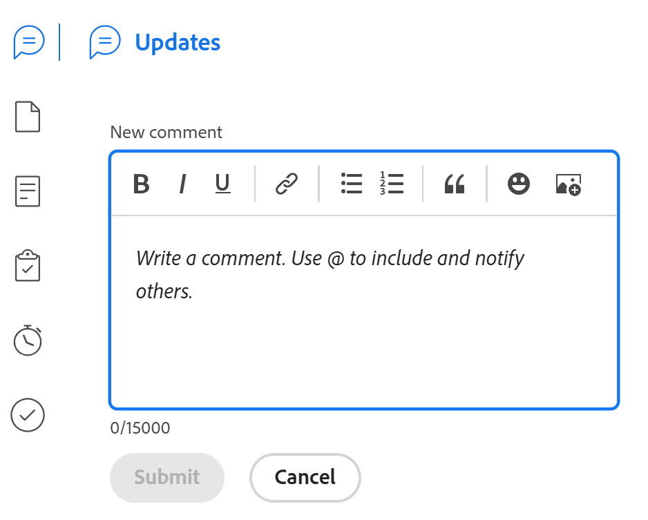

# Vue d’ensemble du [!UICONTROL résumé]

<!--The highlighted information on this page refers to functionality not yet generally available. It is available only in the Preview environment for all customers or in Production for customers who enabled fast releases. 

For information about fast releases, see [Enable or disable fast releases for your organization](/help/quicksilver/administration-and-setup/set-up-workfront/configure-system-defaults/enable-fast-release-process.md).

For information about the current release schedule, see [Second Quarter 2024 release overview](/help/quicksilver/product-announcements/product-releases/24-q2-release-activity/24-q2-release-overview.md). -->

Vous pouvez utiliser le panneau [!UICONTROL Résumé] pour réviser et mettre à jour les informations de l’élément de travail directement à partir d’une liste de tâches, de problèmes, de documents ou d’autres zones de [!DNL Adobe Workfront] qui affichent les tâches et les problèmes.

Votre administrateur ou administratrice Workfront ou de groupes peut modifier les zones et les champs qui s’affichent dans le panneau Résumé. Ils ou elles peuvent ajouter jusqu’à 16 champs au panneau Résumé.

>[!IMPORTANT]
>
>Nous vous recommandons d’ajouter des champs que vous devez fréquemment mettre à jour dans le panneau Résumé, afin que vous puissiez facilement y accéder et les mettre à jour sans accéder à la page principale de l’objet.
>
>Par exemple, vous pouvez ajouter les champs fréquemment mis à jour suivants au panneau Résumé de tâches et de problèmes :
>
>* Statut
>* Pourcentage d’achèvement
>* Date d&#39;engagement
>* Date d&#39;achèvement prévue
>* Condition

Le tableau suivant présente les zones où vous pouvez localiser et utiliser le panneau [!UICONTROL Résumé] :

<table style="table-layout:auto"> 
 <col data-mc-conditions=""> 
 <tbody> 
  <tr> 
   <td><b>Tâches</b></td> 
  </tr> 
  <tr> 
   <td> 
Listes de tâches dans un/une
 
    <ul> 
     <li>Projet</li> 
     <li>Sous-tâche</li> 
    </ul> </td> 
  </tr> 
  <tr> 
   <td>Tâches dans les zones de travail [!UICONTROL Unassigned] et [!UICONTROL Assigned] de l’[!UICONTROL Workload Balancer]</td> 
  </tr> 
   <tr> 
   <td>Tâches dans une [!UICONTROL Timesheet]</td> 
  </tr> 
  <tr data-mc-conditions=""> 
   <td><b>Problèmes</b></td> 
  </tr> 
  <tr data-mc-conditions=""> 
   <td> 
Listes de problèmes dans un/une
 
    <ul> 
     <li>Projet</li> 
     <li>Tâche</li> 
     <li>Sous-tâche</li> 
    </ul> </td> 
  </tr> 
  <tr data-mc-conditions=""> 
   <td>Problèmes dans la zone [!UICONTROL Assigned Work] de l’[!UICONTROL Workload Balancer]</td> 
  </tr> 
  <tr data-mc-conditions=""> 
   <td>Problèmes dans la section [!UICONTROL Submitted] de la zone [!UICONTROL Requests]</td> 
  </tr> 
</tr> 
   <tr> 
   <td>Problèmes dans une [!UICONTROL Timesheet]</td> 
  </tr>

<tr data-mc-conditions=""> 
   <td><b>Documents</b></td> 
  </tr> 
  <tr data-mc-conditions=""> 
   <td>Zone [!UICONTROL Documents]</td> 
  </tr> 
  <tr data-mc-conditions=""> 
   <td>Section [!UICONTROL Documents] d’un objet (projet, tâche, problème, programme, portfolio, modèle, tâche de modèle, utilisateur ou utilisatrice)</td> 
  </tr> 
 </tbody> 
</table>

<!--

Workfront administrators can customize the Summary in the Layout Template. For more information, see <a href="../../administration-and-setup/customize-workfront/use-layout-templates/create-and-manage-layout-templates.md" class="MCXref xref">Create and manage layout templates</a>.

-->

Cet article décrit comment accéder au [!UICONTROL Résumé] et comment l’utiliser pour les tâches et les problèmes dans les listes.

Pour plus d’informations sur l’accès au [!UICONTROL Résumé] dans l’[!UICONTROL équilibreur de charge de travail], voir [Mettre à jour des tâches dans l’[!UICONTROL équilibreur de charge de travail] à l’aide du [!UICONTROL Résumé]](../../resource-mgmt/workload-balancer/update-items-in-summary-panel-in-workload-balancer.md).

Pour plus d’informations sur l’accès au [!UICONTROL Résumé] des documents, voir [[!UICONTROL Vue d’ensemble du résumé] des documents](../../documents/managing-documents/summary-for-documents.md).

## Afficher le panneau [!UICONTROL Résumé] dans une liste de tâches ou de problèmes

1. Accédez à une tâche ou à un problème et sélectionnez un élément dans la liste.
1. Cliquez sur l’icône **[!UICONTROL Résumé]** 

   ou

   Cliquez sur l’icône **[!UICONTROL Ouvrir le résumé]**  dans la section [!UICONTROL Soumis] de la zone [!UICONTROL Demandes].

   Une fois le résumé ouvert, il reste ouvert lorsque vous cliquez ou sélectionnez d’autres tâches ou problèmes et jusqu’à ce que vous le fermiez manuellement.

   >[!TIP]
   >
   >Vous ne pouvez sélectionner qu’une seule tâche ou un seul problème à la fois pour afficher ses détails dans le panneau [!UICONTROL Résumé].

   

1. (Facultatif) Pour fermer le panneau [!UICONTROL Résumé], effectuez l’une des opérations suivantes :

   * Dans une liste de tâches ou d’événements, cliquez sur l’icône **[!UICONTROL Ouvrir le résumé]** 

     Ou

     Cliquez sur l’icône **X** dans le coin supérieur droit du panneau [!UICONTROL Résumé].

   * Dans la section [!UICONTROL Envoyé] de la zone [!UICONTROL Demandes], cliquez sur l’icône **[!UICONTROL Fermer le résumé]** 

     Ou

     Cliquez sur l’icône **X** dans le coin supérieur droit du panneau Résumé.

## [!UICONTROL Pourcentage d&#39;achèvement]

Utilisez la bulle bleue de progression en haut du [!UICONTROL Résumé] pour mettre à jour le pourcentage d&#39;achèvement de la tâche ou de l&#39;événement que vous avez sélectionné. Saisissez un nombre ou faites glisser la bulle vers le pourcentage correct.

Lorsque vous faites glisser la bulle dans le panneau Résumé , le Pourcentage d’achèvement des mises à jour s’incrémente d’un point. Vous ne pouvez pas saisir de nombre décimal.

## [!UICONTROL Mises à jour]

Utilisez la section [!UICONTROL Mises à jour] du [!UICONTROL résumé] pour afficher les mises à jour récentes et effectuer des mises à jour sur la tâche ou le problème que vous avez sélectionné. Cliquez sur **[!UICONTROL Tout afficher]** pour accéder directement à l’onglet [!UICONTROL Mises à jour] de la tâche.

## [!UICONTROL Documents]

Utilisez la section [!UICONTROL Documents] du [!UICONTROL résumé] pour afficher les documents associés à la tâche sélectionnée ou au problème sélectionné. Cliquez sur la miniature pour ouvrir un aperçu du document. Pour accéder directement à l’onglet [!UICONTROL Documents] sur la tâche ou le problème, cliquez sur le titre **[!UICONTROL Documents]**.

## [!UICONTROL Détails]

Utilisez la section [!UICONTROL Détails] du [!UICONTROL résumé] pour afficher les détails généraux de l’élément de travail, effectuer des affectations ou ajouter des dates de début. Cliquez sur **[!UICONTROL Afficher tout]** pour accéder directement à l’onglet [!UICONTROL Détails] de la tâche ou du problème.

## [!UICONTROL Sous-tâches]

Cette section n’est disponible que pour les tâches. Utilisez la section [!UICONTROL Sous-tâches] du [!UICONTROL résumé] pour afficher les sous-tâches avec les statuts [!UICONTROL Nouvelle], [!UICONTROL En cours], et [!UICONTROL Fermée] de la tâche que vous avez sélectionnée. Cliquez sur le menu déroulant **[!UICONTROL Statut]** pour passer d’un statut à un autre. Pour accéder directement à l’onglet [!UICONTROL Sous-tâches] de la tâche, cliquez sur le titre **[!UICONTROL Sous-tâches]**.

Si vous n’avez ajouté aucune sous-tâche à la tâche, cliquez sur **[!UICONTROL Ajoutez-en une ici]** pour accéder directement à l’onglet [!UICONTROL Sous-tâches] de la tâche.

## [!UICONTROL Heures]

Utilisez la section [!UICONTROL Heures] du [!UICONTROL résumé] pour consigner des heures sur la tâche sélectionnée ou le problème sélectionné. Cliquez sur **[!UICONTROL Consigner les heures]** et saisissez vos heures. Pour accéder directement à l’onglet Heures de la tâche ou du problème, cliquez sur le titre **[!UICONTROL Heures]**.

Le nombre d’heures dans le [!UICONTROL résumé] affiche les heures que vous consignez. Les autres utilisateurs et utilisatrices auront un nombre total d’heures différent dans le [!UICONTROL Résumé] selon les heures qu’ils consignent pour la tâche.

S’il n’y a pas de nombre d’[!UICONTROL heures] prévues sur la tâche ou le problème et que vous avez consigné des heures, la barre d’heures s’affiche en rouge.

## Approbations

Utilisez la section [!UICONTROL Approbations] du [!UICONTROL résumé] pour afficher les approbations jointes à la tâche sélectionnée ou au problème sélectionné. Si vous n’avez ajouté aucune approbation, sélectionnez une approbation existante dans le menu déroulant ou cliquez sur **[!UICONTROL Créer un processus d’approbation à utilisation unique]** pour accéder directement à l’onglet [!UICONTROL Approbations] de la tâche ou du problème.

Pour accéder directement à l’onglet [!UICONTROL Approbations] de la tâche ou du problème, cliquez sur le titre **[!UICONTROL Approbations]**.

