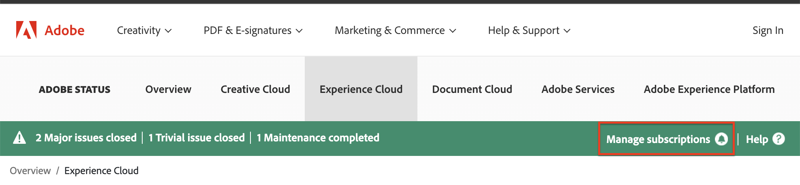

# Le site [!DNL Adobe Workfront] Status

<!-- Audited: 1/2024 -->

## Présentation du site État

Vous pouvez consulter l’état de la plateforme [!DNL Workfront], y compris les incidents, les fenêtres de maintenance planifiées et l’état actuel de toutes les grappes [!DNL Workfront] en accédant au site [!DNL Workfront Status].

Vous avez accès aux informations suivantes sur le site État :

* Statistiques des performances du système en temps réel
* Planifier la maintenance
* Informations sur les protections utilisées par [!DNL Workfront] pour protéger les données utilisateur
* Statuts de vulnérabilité nommés

## Afficher les mises à jour de statut [!DNL Adobe Workfront]

Vous pouvez afficher les mises à jour d’état sur le site [!DNL Adobe] Status.

1. Saisissez [status.adobe.com](https://status.adobe.com/) dans votre navigateur pour accéder au site État.

1. Sélectionnez **[!UICONTROL Experience Cloud]**.
1. Faites défiler l’écran vers le bas et sélectionnez **[!UICONTROL Adobe Workfront]** dans la liste des solutions.

## Abonner ou gérer votre abonnement

Pour vous abonner au site État ou gérer votre abonnement après vous être déjà abonné :

1. Accédez à [status.adobe.com](https://status.adobe.com/).
1. Dans la barre d’état, sélectionnez **[!UICONTROL Gérer les abonnements]**.
   
1. Si vous disposez d’un compte existant, connectez-vous au compte ; dans le cas contraire, créez un compte.
1. Cliquez sur le bouton **[!UICONTROL Créer des abonnements]** .
1. Sélectionnez **[!UICONTROL Adobe Workfront]** sous l’en-tête **[!UICONTROL Experience Cloud]**, puis cliquez sur **[!UICONTROL Continuer]**.
1. Sélectionnez vos préférences régionales et de type d’événement, puis cliquez sur **[!UICONTROL Continuer]**.
1. Cliquez sur **[!UICONTROL Terminé]** pour confirmer votre abonnement.

## Présentation des vulnérabilités nommées

### Qu’est-ce qu’une vulnérabilité nommée ? {#what-is-a-named-vulnerability}

En matière de sécurité informatique, une vulnérabilité est une faiblesse qui permet à un attaquant de réduire la stabilité, la sécurité ou l&#39;intégrité d&#39;un système.

Les chercheurs en vulnérabilité et les créateurs d’exploitation nomment leurs projets en interne pour faciliter leur référence (par exemple, [!DNL ShellShock], [!DNL Heartbleed], [!DNL POODLE] et [!DNL WannaCry]/[!DNL Petya]). Lorsqu&#39;une vulnérabilité a un impact à grande échelle, ces noms deviennent publics lorsque les vulnérabilités sont divulguées.

### Comment afficher les vulnérabilités nommées identifiées par [!DNL Workfront?] {#how-do-i-view-named-vulnerabilities-identified-by-workfront}

1. Accédez à [status.adobe.com](https://status.adobe.com/), puis cliquez sur **[!UICONTROL Security]**.

## Pourquoi est-ce important ? {#why-is-this-important}

Les administrateurs réseau soucieux de la sécurité doivent connaître le site État et les vulnérabilités nommées identifiées par Workfront.

Lorsque des vulnérabilités d’impact importantes sont divulguées, il est impératif de s’assurer que vos fournisseurs sont informés et de garder vos données protégées.

Le site État propose un journal actuel de ces vulnérabilités que vous pouvez atteindre à tout moment, où vous pouvez éviter d’attendre en enregistrant un ticket ou en contactant votre gestionnaire de compte pour obtenir ces informations.
