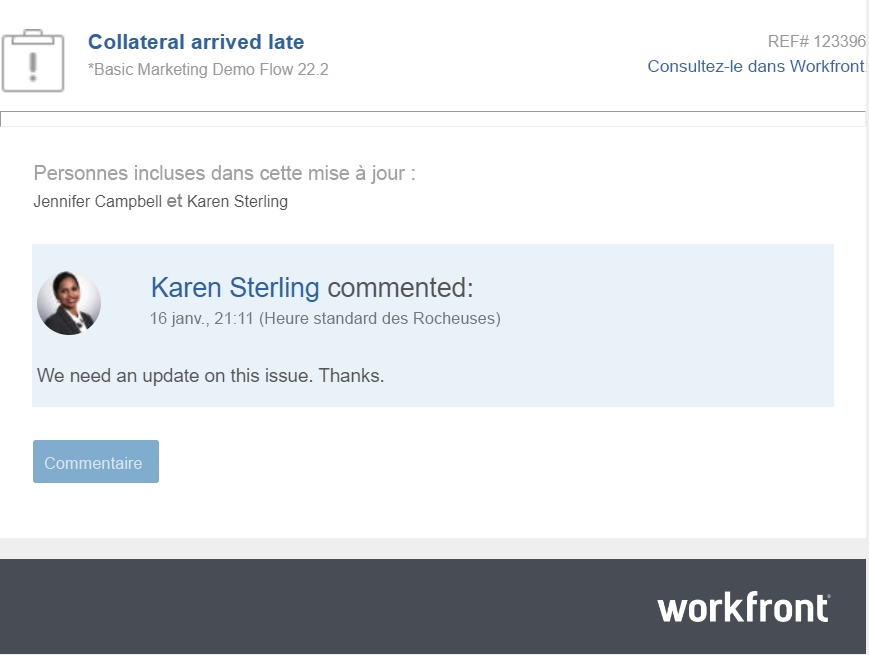

# Répondre aux notifications par e-mail

Selon le mode de configuration de vos notifications électroniques, vous pouvez recevoir une notification par courrier électronique lorsqu’une mise à jour est effectuée sur certains objets auxquels vous avez accès.

Vous pouvez répondre à une mise à jour à partir d&#39;une notification par email de la manière suivante :

* Utilisez le bouton Commentaire dans le courrier électronique pour revenir à Workfront et répondre à la mise à jour dans la zone Mises à jour.
* Répondez à l’email que vous recevez. Votre email de réponse est ajouté en tant que réponse Workfront au commentaire d’origine.

<!--
>[!NOTE]
>
>Replying to updates by email is not available for environments on Cluster 6.
-->

Vous pouvez répondre à un courrier électronique Workfront généré à partir de commentaires effectués sur les objets suivants :

* Projet
* Tâche
* Problème
* Document
* Tâche Modèle et modèle
* Portfolio
* Programme
* Itération
* Feuille de temps

## Exigences d’accès

Vous devez disposer des accès suivants pour effectuer les étapes de cet article :

<table style="table-layout:auto">
 <col> 
 <col> 
 <tbody> 
  <tr> 
   <td role="rowheader"><strong>Formule Adobe Workfront*</strong></td> 
   <td> 
Quelconque
 </td> 
  </tr> 
  <tr> 
   <td role="rowheader"><strong>Licence Adobe Workfront*</strong></td> 
   <td> 
Demande ou version ultérieure pour les problèmes et les documents ; révision ou version ultérieure pour tous les autres objets
 </td> 
  </tr> 
  <tr> 
   <td role="rowheader"><strong>Paramétrages du niveau d'accès*</strong></td> 
   <td> 
Demandeur ou supérieur pour les problèmes et les documents ; Réviseur ou supérieur pour tous les autres objets
 
<b>NOTE</b>

Si vous n’avez toujours pas accès à , demandez à votre administrateur Workfront s’il définit des restrictions supplémentaires à votre niveau d’accès. Pour plus d’informations sur la façon dont un administrateur Workfront peut modifier votre niveau d’accès, voir <a href="../../administration-and-setup/add-users/configure-and-grant-access/create-modify-access-levels.md" class="MCXref xref">Création ou modification de niveaux d’accès personnalisés</a>.
 </td>
</tr> 
  <tr> 
   <td role="rowheader"><strong>Autorisations d’objet</strong></td> 
   <td> 
Afficher l’accès à l’objet
 
Pour plus d’informations sur la demande d’accès supplémentaire, voir <a href="../../workfront-basics/grant-and-request-access-to-objects/request-access.md" class="MCXref xref">Demande d’accès aux objets </a>.
 </td> 
  </tr> 
 </tbody> 
</table>

## Réponse à une mise à jour à partir d’une notification par email

Lorsque vous recevez une notification électronique, vous pouvez ouvrir rapidement l’objet Workfront associé à partir de la notification électronique et ajouter une réponse directement au thread de communication.

1. Ouvrez la notification électronique générée par une mise à jour dans Workfront.

   
1. Cliquez sur **Commentaire** à partir de la notification électronique.

   La page Détails de l’objet s’ouvre dans Workfront.

1. Accédez à la mise à jour à laquelle vous souhaitez ajouter une réponse.

   En plus de voir les utilisateurs qui participent activement à la conversation, vous pouvez voir qui a été balisé dans chaque réponse en haut de ce fil de mise à jour. Ces utilisateurs, ainsi que tous les utilisateurs abonnés à l’objet, reçoivent une notification chaque fois qu’une mise à jour ou une réponse est apportée à l’objet. Pour baliser davantage d’utilisateurs, voir [Balisage des autres sur les mises à jour](../../workfront-basics/updating-work-items-and-viewing-updates/tag-others-on-updates.md).

1. Cliquez sur **Répondre,** saisissez votre réponse, puis cliquez sur **Répondre**.

   La réponse est ajoutée en tant que nouveau commentaire au fil de commentaires.

## Ajouter une mise à jour à un objet en répondant à une notification électronique

Lorsque vous recevez une notification électronique Workfront, vous pouvez rapidement ajouter une mise à jour au thread de communication sans vous connecter à Workfront.

>[!IMPORTANT]
>
>* Vous devez disposer des autorisations nécessaires pour au moins afficher l’objet qui a déclenché la mise à jour avant de pouvoir répondre à la notification par e-mail.
>
>* Pour éviter les erreurs d’envoi, les utilisateurs d’Outlook doivent supprimer le contenu d’email existant avant de saisir votre réponse.

Pour ajouter une mise à jour à un email Workfront :

1. Dans votre application de messagerie, ouvrez l’e-mail Workfront auquel vous souhaitez répondre, puis ouvrez une fenêtre de réponse à partir de l’e-mail d’origine.

   >[!NOTE]
   >
   >    Vous ne pouvez pas répondre à une notification électronique qui vous a été transmise par une autre personne.

1. Saisissez votre mise à jour dans la réponse email.

   Les pièces jointes ne sont pas autorisées et le formatage de texte enrichi appliqué à une mise à jour dans un email ne s’affiche pas sur la mise à jour lors de l’affichage dans l’onglet Mises à jour.
1. Cliquez sur **Envoyer**.

   Votre mise à jour est ajoutée en tant que réponse au fil de communication de l’objet .
