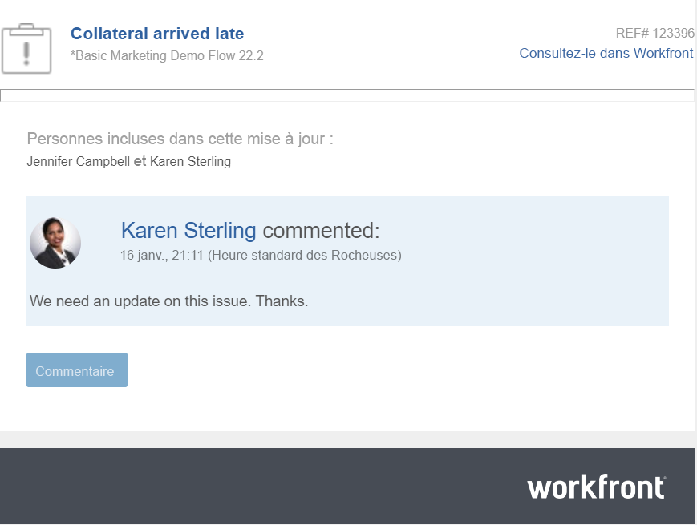

# Répondre aux mises à jour

<!-- Audited: April 2024-->

<!--
>[!IMPORTANT]
>
>We are currently redesigning the commenting experience in Adobe Workfront.
>
>Depending on what objects you access the commenting experience for, you might see the following functionality for the Updates section:
>* The new experience
>* The legacy experience
>* The new and the legacy experience
>
>For more information about the new commenting experience and its availability, see [New commenting experience](../../product-announcements/betas/new-commenting-experience-beta/unified-commenting-experience.md). 
>
> The legacy commenting experience has been removed from projects, tasks, issues, and documents in the Preview environment. 
>
>The new commenting experience is available only for the Updates section of Workfront objects, and it is not available when you access updates from the following areas:
>
> * Home
> * Summary panel in lists
> * Summary panel in timesheets 
> * Summary panel in the Workload Balancer
>
>The new commenting experience is available in the Summary panel in lists, timesheets, and the Workload Balancer in the Preview environment and in the Production environment for customers who have opted for the fast release process.  
-->

Lorsqu’une personne répond à un commentaire ou à une mise à jour système sur un objet de travail, sa réponse apparaît dans le thread de communication des onglets Commentaires et Tous de la section Mises à jour de l’objet.

>[!IMPORTANT]
>
>Il n’est pas possible de répondre aux mises à jour du système dans l’onglet Activité du système. Toutes les réponses aux mises à jour système effectuées dans l’ancienne expérience de commentaires avant le 11 avril 2024 s’affichent en lecture seule.

Cet article décrit comment répondre aux commentaires de la plupart des objets dans Workfront. Pour plus d’informations sur les différences entre les sections Mises à jour des divers objets Workfront, voir [Vue d’ensemble de la section Mises à jour](/help/quicksilver/workfront-basics/updating-work-items-and-viewing-updates/updates-tab-overview.md).

## Conditions d’accès

+++ Développez pour afficher les exigences d’accès aux fonctionnalités de cet article. 

<table style="table-layout:auto"> 
 <col> 
 <col> 
 <tbody> 
  <tr> 
   <td role="rowheader"><strong>Package Adobe Workfront</strong></td> 
   <td> 
Tous
 </td> 
  </tr> 
  <tr> 
   <td role="rowheader"><strong>Licence Adobe Workfront</strong></td> 
   <td> 
Pour les événements et les documents :

<ul><li>
Contributeur ou version ultérieure
</li>
   <li>
Requête ou supérieure
</li></ul>

Pour tous les autres objets :

   <ul><li>
Léger ou supérieur
</li>
   <li>
Révision ou supérieur
</li></ul>

</td>  
  </tr> 
  <tr> 
   <td role="rowheader"><strong>Configuration du niveau d’accès</strong></td> 
   <td> 
Accès Afficher ou Modifier à l’objet mis à jour
 </td> 
  </tr> 
  <tr> 
   <td role="rowheader"><strong>Autorisations d’objet</strong></td> 
   <td> 
Autorisations d’affichage pour l’objet
 </td> 
  </tr> 
 </tbody> 
   </table>

Pour plus d’informations, consultez les [Conditions d’accès de la documentation de Workfront](/help/quicksilver/administration-and-setup/add-users/access-levels-and-object-permissions/access-level-requirements-in-documentation.md).

+++

<!--Old:
<table style="table-layout:auto"> 
 <col> 
 <col> 
 <tbody> 
  <tr> 
   <td role="rowheader"><strong>Adobe Workfront plan</strong></td> 
   <td> 
Any
 </td> 
  </tr> 
  <tr> 
   <td role="rowheader"><strong>Adobe Workfront license*</strong></td> 
   <td> 
New: Contributor or higher for issues and documents; Light or higher for all other objects
 
   
Current: Request or higher for issues and documents; Review or higher for all other objects
 </td> 
  </tr> 
  <tr> 
   <td role="rowheader"><strong>Access level configuration</strong></td> 
   <td> 
View or Edit access for the object the update is on
 </td> 
  </tr> 
  <tr> 
   <td role="rowheader"><strong>Object permissions</strong></td> 
   <td> 
View access to the object
 </td> 
  </tr> 
 </tbody> 
</table>

*To find out what plan, license type, or access you have, contact your Workfront administrator. For more information, see [Access requirements for Workfront documentation](/help/quicksilver/administration-and-setup/add-users/access-levels-and-object-permissions/access-level-requirements-in-documentation.md). -->

## Répondre à une mise à jour ou à une réponse dans Workfront

Vous pouvez répondre à un commentaire dans le thread d’un objet que vous pouvez afficher ou vous connecter en tant qu’administrateur ou administratrice Workfront ou de groupes et répondre à un commentaire au nom d’un autre utilisateur ou d’une autre utilisatrice. Pour plus d’informations, consultez la section [Se connecter en tant qu’autre utilisateur ou autre utilisatrice](../../administration-and-setup/add-users/create-and-manage-users/log-in-as-another-user.md).

### Répondre à un commentaire

La réponse à un commentaire dans la section Mises à jour d’un objet est similaire pour la plupart des objets dans Workfront.

1. Accédez à l’objet auquel vous souhaitez apporter une réponse.
1. Cliquez sur **Mises à jour**, puis cliquez sur l’onglet **Commentaires** de l’objet et recherchez la réponse ou le commentaire auquel vous souhaitez répondre.

   Ou

   Sélectionnez l’onglet Tous, puis cliquez sur Répondre dans les commentaires pour ouvrir le commentaire dans l’onglet Commentaires et y répondre. **&#x200B;**&#x200B;**&#x200B;** Vous ne pouvez pas répondre dans l’onglet Tous.

1. (Facultatif) Pour inclure le texte d’une mise à jour précédente dans votre réponse, cliquez sur le menu Plus dans le coin supérieur droit du commentaire auquel vous souhaitez répondre, puis cliquez sur Citer la réponse. **&#x200B;**&#x200B;**&#x200B;** Le texte de la mise à jour précédente apparaît dans la zone de saisie, marqué d’une ligne grise verticale.
1. Cliquez sur **Répondre**.

   

   Vous pouvez voir les utilisateurs et les utilisatrices qui participent activement à la conversation en bas de la zone **Ajouter une réponse...** et vous pouvez en ajouter d’autres ou supprimer les personnes qui ne sont plus pertinentes. Ces utilisateurs et utilisatrices, ainsi que toutes les personnes abonnées à l’objet, reçoivent une notification chaque fois qu’une mise à jour ou une réponse est apportée à l’objet. Vous pouvez également taguer d’autres utilisateurs et d’autres utilisatrices pour les inclure dans votre réponse.  Pour taguer davantage d’utilisateurs et d’utilisatrices, consultez la section [Taguer d’autres personnes dans les mises à jour](../../workfront-basics/updating-work-items-and-viewing-updates/tag-others-on-updates.md).

   >[!TIP]
   >
   >   Pour ajouter des réponses supplémentaires à une réponse existante, vous pouvez commencer à saisir un texte dans la zone **Ajouter une réponse...** ou cliquer sur **Répondre** sur le commentaire original. Votre réponse est ajoutée à la fin du thread.

1. Commencez à saisir votre réponse et utilisez toutes les options supplémentaires de la barre d’outils de texte enrichi. Pour plus d’informations sur l’utilisation du texte enrichi ou d’autres fonctionnalités de mise à jour, consultez la section [Mettre à jour le travail](../updating-work-items-and-viewing-updates/update-work.md).

1. Cliquez sur **Soumettre** pour enregistrer la réponse.

1. (Facultatif) Cliquez sur le menu **Plus**  dans le coin supérieur droit du commentaire auquel vous souhaitez répondre pour accéder à d’autres options de gestion de la réponse. Pour plus d’informations, voir [Mettre à jour le travail](../updating-work-items-and-viewing-updates/update-work.md).

<!--
### Reply to an update or reply in the legacy Updates section

1. Go to the object to which you want to add a reply.
1. On the **Updates** tab for the object, find the update or reply to which you want to reply.

1. (Optional) To view an image in the existing update do one of the following:

   * Click the **Preview** icon  on the image thumbnail to open the full-size image in a new browser tab.
   * Click the **Download** icon  on the image thumbnail to download the image.

1. Click **Reply** on the update, then type a reply in the box that appears.

   You can see the users who are actively engaged in the conversation or tagged in each reply at the top of that update thread. These users, along with any users subscribed to the object, receive a notification whenever an update or reply is made on the object. You can also tag more users to include them in your reply.  To tag more users, see [Tag others on updates](../../workfront-basics/updating-work-items-and-viewing-updates/tag-others-on-updates.md).

   
   
1. (Optional) To include text from a previous update in your reply, click the **More** menu next to the update or reply you want to quote, then click **Quote Reply**. Text from the previous update appears in the input area, marked with a vertical gray line.
1. (Optional) Use formatting, emojis, include links, or images as explained in the section "Use Rich Text in a Workfront update" in the article [Update work](../../workfront-basics/updating-work-items-and-viewing-updates/update-work.md).
1. Click **Reply** to save the reply.

-->

## Répondre à une mise à jour à partir d’une notification par e-mail

Selon le mode de configuration de vos notifications par e-mail, vous pouvez recevoir une notification par e-mail lorsqu’une mise à jour est effectuée sur certains objets auxquels vous avez accès.

Vous pouvez répondre à une mise à jour à partir d’une notification par e-mail de la manière suivante :

* Répondez à l’e-mail que vous recevez. Votre e-mail de réponse est ajouté en tant que réponse Workfront au commentaire d’origine.
* Utilisez le bouton Commenter dans l’e-mail pour revenir à Workfront et répondre à la mise à jour dans la zone Mises à jour.

Voici un exemple de notification par e-mail déclenchée suite à une mise à jour effectuée dans l’onglet des mises à jour d’une tâche :

Pour plus d’informations, consultez la section [Répondre aux notifications par e-mail](../updating-work-items-and-viewing-updates/reply-to-email-notifications.md).

