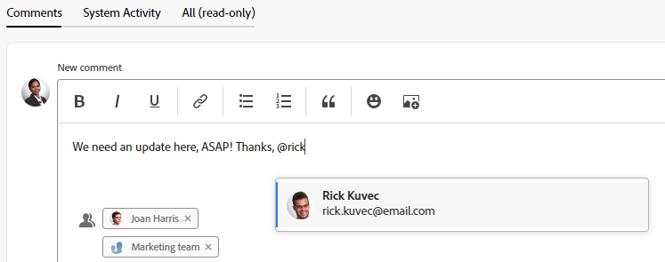

# Baliser d’autres personnes sur les mises à jour

<!--Audited: April, 2024-->

<!--
>[!IMPORTANT]
>
>We are currently redesigning the commenting experience in Adobe Workfront.
>
>Depending on what objects you access the commenting experience for, you might see the following functionality for the Updates section:
>* The new experience
>* The legacy experience
>* The new and the legacy experience
>
>For more information about the new commenting experience and its availability, see [New commenting experience](../../product-announcements/betas/new-commenting-experience-beta/unified-commenting-experience.md). 
>
> The legacy commenting experience has been removed from projects, tasks, issues, and documents in the Preview environment. 
>
>The new commenting experience is available only for the Updates section of Workfront objects, and it is not available when you access updates from the following areas:
>
> * Home
> * Summary panel in lists
> * Summary panel in timesheets 
> * Summary panel in the Workload Balancer
>
>The new commenting experience is available in the Summary panel in lists, timesheets, and the Workload Balancer in the Preview environment and in the Production environment for customers who have opted for the fast release process.  
-->

Vous pouvez baliser des utilisateurs et utilisatrices lors de la mise à jour d’un objet si vous souhaitez attirer leur attention sur un objet qu’ils n’auraient pas normalement suivi.

Plutôt que d’inclure ces utilisateurs et utilisatrices dans l’objet en les affectant ou en les abonnant à celui-ci, vous pouvez les baliser sur la mise à jour pour la partager avec eux. Les utilisateurs et utilisatrices tagués reçoivent une notification Workfront concernant la mise à jour que vous avez saisie. En fonction de leurs paramètres de notification, ils ou elles reçoivent également un e-mail concernant la mise à jour que vous avez saisie.

## Remarques relatives au balisage d’utilisateurs et d’utilisatrices dans des mises à jour

* Les utilisateurs et utilisatrices balisés dans des mises à jour doivent activer une notification personnelle dans leur profil pour qu’ils puissent recevoir la notification par e-mail. Pour plus d’informations, consultez [Modifier vos propres notifications par e-mail](../../workfront-basics/using-notifications/activate-or-deactivate-your-own-event-notifications.md).

  Pour plus d’informations sur l’ajout de mises à jour aux objets Workfront, consultez [Mettre à jour le travail](../../workfront-basics/updating-work-items-and-viewing-updates/update-work.md).

* Lorsqu’un problème est converti en projet ou tâche, les mises à jour sont copiées dans le nouveau projet ou la nouvelle tâche, mais pas les utilisateurs et utilisatrices balisés. Pour continuer la conversation, vous devez baliser à nouveau les participantes et les participants.

## Conditions d’accès

Vous devez disposer des accès suivants pour effectuer les étapes de cet article :

<table style="table-layout:auto">
 <col> 
 <col> 
 <tbody> 
  <tr> 
   <td role="rowheader"><strong>Forfait Adobe Workfront</strong></td> 
   <td> 
N’importe quelle
 </td> 
  </tr> 
  <tr> 
   <td role="rowheader"><strong>Licence Adobe Workfront*</strong></td> 
   <td> 
Nouveau : licence de contribution ou supérieure pour les problèmes et les documents ; licence légère (Light) ou supérieure pour tous les autres objets

   
Actuel : licence de demande ou supérieure pour les problèmes et les documents ; licence de révision ou supérieure pour tous les autres objets
 </td> 
  </tr> 
  <tr> 
   <td role="rowheader"><strong>Configuration du niveau d’accès</strong></td> 
   <td> 
Accès en affichage ou supérieur aux objets dans lesquels vous souhaitez publier la réponse
 </td> 
  </tr> 
  <tr> 
   <td role="rowheader"><strong>Autorisation d’objet</strong></td> 
   <td> 
Autorisations d’affichage ou supérieures sur les objets dans lesquels vous souhaitez publier la réponse
 </td> 
  </tr> 
 </tbody> 
</table>

* Pour connaître le forfait, le type de licence ou l’accès dont vous disposez, contactez votre administrateur ou administratrice Workfront. Pour plus d’informations, voir [Conditions d’accès dans la documentation Workfront](/help/quicksilver/administration-and-setup/add-users/access-levels-and-object-permissions/access-level-requirements-in-documentation.md).

## Baliser d’autres personnes sur les mises à jour

Vous pouvez taguer d’autres personnes sur des mises à jour des manières suivantes :

* **Automatiquement**: lorsqu’un utilisateur lance un thread, ajoute un commentaire ou ajoute une réponse, il est automatiquement balisé et ajouté à la zone Baliser les personnes ou les équipes de la zone de commentaire.
* **Manuellement** : lorsque vous ajoutez manuellement un utilisateur ou une utilisatrice à la zone Taguer des personnes de la zone de commentaire.

Vous pouvez également supprimer des utilisateurs et utilisatrices balisés par erreur lorsque vous modifiez ou répondez à un commentaire.

1. Commencez à mettre à jour un élément de travail, comme décrit dans [Mettre à jour le travail](../../workfront-basics/updating-work-items-and-viewing-updates/update-work.md). En tant que personne propriétaire de commentaire, vous êtes automatiquement balisée et ajoutée à la zone Taguer des personnes ou des équipes de la zone de commentaire.

   >[!TIP]
   >
   >La personne propriétaire du commentaire ne peut pas voir son propre nom dans la zone Taguer des personnes ou des équipes de la zone de commentaire.

1. Dans le champ **Taguer des personnes ou des équipes**, commencez à saisir le nom de l’utilisateur ou utilisatrice ou de l’équipe que vous souhaitez inclure, puis cliquez sur le nom lorsqu’il apparaît dans la liste déroulante.

   Ou

   Saisissez le symbole @ dans la zone **Rédiger un commentaire**, commencez à saisir le nom de l’utilisateur ou utilisatrice ou de l’équipe à inclure dans la mise à jour, puis cliquez sur le nom lorsqu’il apparaît dans la liste déroulante.

   >[!TIP]
   > 
   >Pour identifier le bon utilisateur ou la bonne utilisatrice lorsqu’il existe des utilisateurs et des utilisatrices portant des noms similaires ou identiques, notez l’avatar, le rôle principal de l’utilisateur ou de l’utilisatrice ou son adresse e-mail.
   > 
   >Les utilisateurs et utilisatrices doivent être associés à au moins une fonction pour l’afficher à mesure que vous les balisez dans une mise à jour.
   > 
   >Pour pouvoir voir les adresses e-mail des utilisateurs et utilisatrices, le paramètre Afficher les coordonnées doit être activé dans votre niveau d’accès. Pour plus d’informations, consultez [Accorder l’accès aux utilisateurs et utilisatrices](../../administration-and-setup/add-users/configure-and-grant-access/grant-access-other-users.md).

   

1. (Facultatif) Pour rendre la mise à jour privée, activez **Réservé à mon entreprise** dans le coin inférieur droit de la zone de mise à jour. La mise à jour n’est ainsi visible que pour les utilisateurs et utilisatrices de votre entreprise. L’option **Réservé à mon entreprise** n’est disponible que lorsqu’une entreprise est spécifiée dans votre profil Workfront.

   >[!NOTE]
   >
   >* Cette option ne s’affiche que lorsque la personne est associée à une entreprise.
   >* Les utilisateurs et utilisatrices en dehors de l’entreprise balisés peuvent toujours recevoir une notification in-app ou un e-mail, même s’ils ne verront pas les commentaires privés dans l’onglet Mises à jour. Nous vous recommandons de ne pas baliser d’utilisateurs et d’utilisatrices externes lors d’une mise à jour si vous ne souhaitez pas partager les informations avec eux.

1. (Facultatif) Pour ajouter plusieurs utilisateurs et utilisatrices et équipes, répétez l’étape 2.<!--insure this stays accurate-->

   >[!NOTE]
   >
   >Tous les utilisateurs et utilisatrices et personnes membres de l’équipe répertoriés dans le champ « Taguer des personnes ou des équipes » reçoivent une notification in-app pour la mise à jour et peuvent recevoir un e-mail, en fonction de la configuration de leurs paramètres de notification par e-mail. Les utilisateurs et utilisatrices qui se balisent eux-mêmes dans un commentaire ou une réponse reçoivent une notification pour ce commentaire ou cette réponse et peuvent voir leur nom dans la liste en tant que personne membre du thread pour le reste du thread, mais ne reçoivent pas d’autre notification à moins qu’ils ne se balisent à nouveau. Pour plus d’informations, consultez [Modifier vos propres notifications par e-mail](../../workfront-basics/using-notifications/activate-or-deactivate-your-own-event-notifications.md) et [Configurer les notifications d’événement pour tout le monde dans le système](../../administration-and-setup/manage-workfront/emails/configure-event-notifications-for-everyone-in-the-system.md).

1. Cliquez sur **Soumettre**.\
   Les utilisateurs et utilisatrices inclus dans la mise à jour se voient automatiquement accorder l’autorisation Afficher sur l’objet et peuvent afficher les mises à jour apportées à l’objet et y répondre.

   Les noms des entités balisées s’affichent en regard de leurs avatars, jusqu’à deux entités. Si plus de deux entités sont balisées, le nom de la première s’affiche, en plus du nombre d’autres entités balisées.

   

   Lorsque vous êtes tagué dans le texte du commentaire, votre nom est mis en surbrillance dans ces commentaires.

   Pour plus d’informations sur les fonctionnalités supplémentaires disponibles lors de la mise à jour d’un élément de travail, consultez [Mettre à jour le travail](../../workfront-basics/updating-work-items-and-viewing-updates/update-work.md).

1. (Facultatif) Cliquez sur le menu **Plus**  dans le coin supérieur droit du commentaire, puis sur **Modifier**. Supprimez des utilisateurs et utilisatrices tagués, puis cliquez sur **Soumettre**.

   >[!IMPORTANT]
   >
   >Vous ne pouvez modifier un commentaire que dans les 15 minutes qui suivent sa saisie. Vous ne pouvez modifier que les commentaires que vous avez ajoutés.

<!--
   >[!TIP]
   >
   >When using the legacy commenting experience to add comments and replies, comment owners that were not specifically tagged cannot be manually removed by people who use the new commenting experience.
-->

<!--
### Tag others on updates in the legacy Updates section

You can manually tag users in the legacy Updates section. 

1. Begin updating a work item, as described in [Update work](../../workfront-basics/updating-work-items-and-viewing-updates/update-work.md).
1. In the **Notify** field, begin typing the name of the user or team you want to include, then click the name when it appears in the drop-down list.

   Or

   Type the @ symbol in the **Start a new update** area, begin typing the name of the user or team you want to include on the update, then click the name when it appears in the drop-down list.

   >[!TIP]
   >
   >To identify the correct user when there are users with similar or identical names, notice the avatar, the user's Primary Role, or their email address. 
   >
   >Users must be associated with at least one job role to view it as you tag them in an update. 
   >
   >You must have the View Contact Info setting enabled in your access level for Users to view users' emails. For information, see [Grant access to users](../../administration-and-setup/add-users/configure-and-grant-access/grant-access-other-users.md).

   

1. (Optional) To make the update private, enable **Private to my company** in the lower-right corner of the update box. This makes the update visible just to users in your company. The **Private to my company** option is available only when a Company is specified in your Workfront profile. 

   >[!NOTE]
   >
   >Tagged users outside the company could still receive an in-app notification or email, even though they will not see the private comments on the Updates tab. We recommend not to tag external users on an update if you do not want to share the information with them.  

1. (Optional) To add multiple users and teams, repeat step 2.

   >[!NOTE]
   >
   >All users and team members listed in the Notify field receive an in-app notification for the update and might receive an email, depending on the configuration of their email notification settings. Users who tag themselves in a comment or reply receive a notification for that comment or reply and can see their name in the Notify field for the remainder of the thread, but they do not receive another notification unless they tag themselves again. For more information, see [Modify your own email notifications](../../workfront-basics/using-notifications/activate-or-deactivate-your-own-event-notifications.md) and [Configure event notifications for everyone in the system](../../administration-and-setup/manage-workfront/emails/configure-event-notifications-for-everyone-in-the-system.md).

1. Click **Update**.  
   Users included in the update are automatically granted View permission to the object and can view and respond to updates made to the object.

   You can see who has been tagged in each reply at the top of the update thread. These users, along with any users subscribed to the object, receive a notification whenever an update or reply is made on the object.

   
-->

Pour plus d’informations sur les fonctionnalités supplémentaires disponibles lors de la mise à jour d’un élément de travail, voir [Mettre à jour le travail](../../workfront-basics/updating-work-items-and-viewing-updates/update-work.md).

