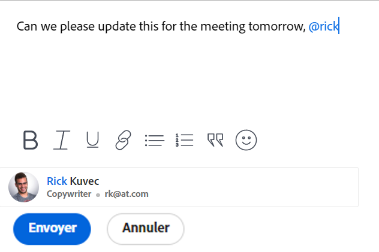

# Balisage des autres sur les mises à jour

<!--take "Beta" references out when we remove the beta-->

<!--The highlighted information on this page refers to functionality not yet generally available. It is available only in the Preview environment.-->

>[!NOTE]
>
>Nous sommes en train de reconcevoir l’expérience de commentaire dans Adobe Workfront.
>Pour plus d’informations sur la nouvelle mise à jour de l’expérience, voir [Nouvelle expérience de commentaire](../updating-work-items-and-viewing-updates/unified-commenting-experience.md).
>
>Vous pouvez accéder à la nouvelle conception pour les objets suivants :
> * Problèmes lors de l’activation de la version bêta des commentaires.
   >
   >     Cette fonctionnalité est disponible uniquement pour la section Mises à jour des problèmes et elle n’est pas disponible pour les zones suivantes :
   >
   >     * Page d’accueil
   >     * Panneau Résumé dans les listes
   >     * Panneau Résumé dans les feuilles de temps
>
> * Objectifs

   >
   >   La nouvelle expérience de commentaire est la valeur par défaut des objectifs. Vous devez disposer d’une licence supplémentaire pour accéder aux objectifs de Workfront. Pour plus d’informations, voir [Conditions requises pour utiliser les objectifs Workfront](../../workfront-goals/goal-management/access-needed-for-wf-goals.md).
   >
   >    Pour plus d’informations sur les commentaires sur les objectifs, voir [Gestion des commentaires d’objectif dans les objectifs Adobe Workfront](../../workfront-goals/goal-management/manage-goal-comments.md).

Vous pouvez baliser les utilisateurs lors d’une mise à jour d’un objet si vous souhaitez attirer leur attention sur un objet qu’ils n’auraient pas normalement suivi.
Plutôt que d’inclure ces utilisateurs dans l’objet en les y affectant ou en les abonnant, vous pouvez les baliser sur la mise à jour pour les partager avec eux. Les utilisateurs balisés reçoivent une notification concernant la mise à jour que vous avez saisie.

>[!NOTE]
>
>Une notification d’événement doit être activée pour qu’un utilisateur puisse recevoir la notification par e-mail. Les administrateurs peuvent activer les notifications pour l’ensemble du système ou pour un groupe de niveau supérieur. Un utilisateur peut également activer et désactiver des notifications d’événement individuelles dans son propre profil utilisateur. Pour plus d’informations, voir :
>
>* [Configuration des notifications d’événement pour tous les membres du système](../../administration-and-setup/manage-workfront/emails/configure-event-notifications-for-everyone-in-the-system.md).
>* [Affichage et configuration des notifications d’événement pour un groupe](../../administration-and-setup/manage-groups/create-and-manage-groups/view-and-configure-event-notifications-group.md)
>* [Activation ou désactivation de vos propres notifications d’événement](../../workfront-basics/using-notifications/activate-or-deactivate-your-own-event-notifications.md).
>

Pour plus d’informations sur l’ajout de mises à jour aux objets Workfront, voir [Mise à jour du travail](../../workfront-basics/updating-work-items-and-viewing-updates/update-work.md).

>[!NOTE]
>
>Lorsqu’un problème est converti en projet ou tâche, les mises à jour sont copiées dans le nouveau projet ou la nouvelle tâche, mais pas les utilisateurs balisés. Pour continuer la conversation, vous devez marquer à nouveau les participants.

## Exigences d’accès

Vous devez disposer des accès suivants pour effectuer les étapes de cet article :

<table style="table-layout:auto"> 
 <col> 
 </col> 
 <col> 
 </col> 
 <tbody> 
  <tr> 
   <td role="rowheader"><strong>Formule Adobe Workfront*</strong></td> 
   <td> 
Tous
 </td> 
  </tr> 
  <tr> 
   <td role="rowheader"><strong>Licence Adobe Workfront*</strong></td> 
   <td> 
Demande ou version ultérieure pour les problèmes et les documents ; Révision ou version ultérieure pour tous les autres objets
 </td> 
  </tr> 
  <tr> 
   <td role="rowheader"><strong>Paramétrages du niveau d'accès*</strong></td> 
   <td> 
Demandeur ou plus pour les problèmes et les documents ; Réviseur ou version supérieure pour tous les autres objets
 
Remarque : Si vous n’avez toujours pas accès à , demandez à votre administrateur Workfront s’il définit des restrictions supplémentaires à votre niveau d’accès. Pour plus d’informations sur la façon dont un administrateur Workfront peut modifier votre niveau d’accès, voir <a href="../../administration-and-setup/add-users/configure-and-grant-access/create-modify-access-levels.md" class="MCXref xref">Création ou modification de niveaux d’accès personnalisés</a>.
 </td> 
  </tr> 
  <tr> 
   <td role="rowheader"><strong>Autorisations d’objet</strong></td> 
   <td> 
Afficher l’accès à l’objet
 
Pour plus d’informations sur la demande d’accès supplémentaire, voir <a href="../../workfront-basics/grant-and-request-access-to-objects/request-access.md" class="MCXref xref">Demande d’accès aux objets </a>.
 </td> 
  </tr> 
 </tbody> 
</table>

*Pour connaître le plan, le type de licence ou l’accès dont vous disposez, contactez votre administrateur Workfront.

## Balisage des autres sur les mises à jour

Le balisage des autres dans une mise à jour varie en fonction de l’expérience et de l’objet sélectionné.

### Balisage des autres mises à jour dans la section Mises à jour actuelles

1. Commencez à mettre à jour un élément de travail, comme décrit dans la section [Mise à jour du travail](../../workfront-basics/updating-work-items-and-viewing-updates/update-work.md).
1. Dans le **Notifier** , commencez à saisir le nom de l’utilisateur ou de l’équipe que vous souhaitez inclure, puis cliquez sur le nom lorsqu’il apparaît dans la liste déroulante.

   Ou

   Saisissez le symbole @ dans la zone **Démarrer une nouvelle mise à jour** , commencez à saisir le nom de l’utilisateur ou de l’équipe à inclure dans la mise à jour, puis cliquez sur le nom lorsqu’il apparaît dans la liste déroulante.

   >[!TIP]
   >
   >Pour identifier le bon utilisateur lorsqu’il existe des utilisateurs portant des noms similaires ou identiques, notez l’avatar, le rôle Principal de l’utilisateur ou son adresse électronique. Les utilisateurs doivent être associés à au moins un rôle de tâche pour l’afficher au fur et à mesure que vous les marquez dans une mise à jour.

   

1. (Facultatif) Pour rendre la mise à jour privée, activez **Privé à ma société** dans le coin inférieur droit de la zone de mise à jour. La mise à jour est ainsi visible uniquement par les utilisateurs de votre entreprise.

   >[!NOTE]
   >
   >Les utilisateurs balisés en dehors de l’entreprise peuvent toujours recevoir une notification ou un courrier électronique in-app, même s’ils ne verront pas les commentaires privés sur l’onglet Mises à jour . Nous vous recommandons de ne pas baliser les utilisateurs externes lors d’une mise à jour si vous ne souhaitez pas partager les informations avec eux.

1. (Facultatif) Pour ajouter plusieurs utilisateurs et équipes, répétez l’étape 2.

   >[!NOTE]
   >
   >Tous les utilisateurs et membres de l’équipe répertoriés dans le champ Notifier reçoivent une notification in-app pour la mise à jour et peuvent recevoir un courrier électronique, selon la configuration de leurs paramètres de notification électronique. Les utilisateurs qui se balisent dans un commentaire ou une réponse reçoivent une notification pour ce commentaire ou cette réponse et peuvent voir leur nom dans le champ Notifier pour le reste du thread, mais ils ne reçoivent aucune autre notification à moins qu’ils ne se balisent à nouveau. Pour plus d’informations, voir [Activation ou désactivation de vos propres notifications d’événement](../../workfront-basics/using-notifications/activate-or-deactivate-your-own-event-notifications.md) et [Configuration des notifications d’événement pour tous les membres du système](../../administration-and-setup/manage-workfront/emails/configure-event-notifications-for-everyone-in-the-system.md).

1. Cliquez sur **Mettre à jour**.\
   Les utilisateurs inclus dans la mise à jour se voient automatiquement accorder l’autorisation Afficher à l’objet et peuvent afficher les mises à jour apportées à l’objet et y répondre.

   Vous pouvez voir qui a été balisé dans chaque réponse en haut du fil de mise à jour. Ces utilisateurs, ainsi que tous les utilisateurs abonnés à l’objet, reçoivent une notification chaque fois qu’une mise à jour ou une réponse est apportée à l’objet.

   

   Pour plus d’informations sur les fonctionnalités supplémentaires disponibles lors de la mise à jour d’un élément de travail, voir [Mise à jour du travail](../../workfront-basics/updating-work-items-and-viewing-updates/update-work.md).

### Balisage des autres sur les mises à jour dans les commentaires sur l’expérience bêta

1. Commencez à mettre à jour un élément de travail, comme décrit dans la section [Mise à jour du travail](../../workfront-basics/updating-work-items-and-viewing-updates/update-work.md).
1. Dans le **Balisage de personnes ou d’équipes** , commencez à saisir le nom de l’utilisateur ou de l’équipe que vous souhaitez inclure, puis cliquez sur le nom lorsqu’il apparaît dans la liste déroulante.

   Ou

   Saisissez le symbole @ dans la zone **Rédiger un commentaire** , commencez à saisir le nom de l’utilisateur ou de l’équipe à inclure dans la mise à jour, puis cliquez sur le nom lorsqu’il apparaît dans la liste déroulante.

   >[!TIP]
   >
   >Pour identifier le bon utilisateur lorsqu’il existe des utilisateurs portant des noms similaires ou identiques, notez l’avatar, le rôle Principal de l’utilisateur ou son adresse électronique. Les utilisateurs doivent être associés à au moins un rôle de tâche pour l’afficher au fur et à mesure que vous les marquez dans une mise à jour.

   

1. (Facultatif) Pour rendre la mise à jour privée, activez **Privé à ma société** dans le coin inférieur droit de la zone de mise à jour. La mise à jour est ainsi visible uniquement par les utilisateurs de votre entreprise.

   >[!NOTE]
   >
   >* Cette option s’affiche uniquement lorsque l’utilisateur est associé à une entreprise.
   >* Les utilisateurs balisés en dehors de l’entreprise peuvent toujours recevoir une notification ou un courrier électronique in-app, même s’ils ne verront pas les commentaires privés sur l’onglet Mises à jour . Nous vous recommandons de ne pas baliser les utilisateurs externes lors d’une mise à jour si vous ne souhaitez pas partager les informations avec eux.

1. (Facultatif) Pour ajouter plusieurs utilisateurs et équipes, répétez l’étape 2. <!--insure this stays accurate-->

   >[!NOTE]
   >
   >Tous les utilisateurs et membres de l’équipe répertoriés dans le champ &quot;Baliser les personnes ou les équipes&quot; reçoivent une notification in-app pour la mise à jour et peuvent recevoir un e-mail, selon la configuration de leurs paramètres de notification par e-mail. Les utilisateurs qui se marquent dans un commentaire ou une réponse reçoivent une notification pour ce commentaire ou cette réponse et peuvent voir leur nom dans la liste en tant que membre du thread pour le reste du thread, mais ils ne reçoivent pas une autre notification à moins qu’ils ne se balisent à nouveau. Pour plus d’informations, voir [Activation ou désactivation de vos propres notifications d’événement](../../workfront-basics/using-notifications/activate-or-deactivate-your-own-event-notifications.md) et [Configuration des notifications d’événement pour tous les membres du système](../../administration-and-setup/manage-workfront/emails/configure-event-notifications-for-everyone-in-the-system.md).

1. Cliquez sur **Envoyer**.\
   Les utilisateurs inclus dans la mise à jour se voient automatiquement accorder l’autorisation Afficher à l’objet et peuvent afficher les mises à jour apportées à l’objet et y répondre.

   Vous pouvez voir qui a été balisé dans chaque réponse sous le texte de la mise à jour, dans la zone Membres . Ces utilisateurs, ainsi que tous les utilisateurs abonnés à l’objet, reçoivent une notification chaque fois qu’une mise à jour ou une réponse est apportée à l’objet.
1. (Facultatif) Cliquez sur le nombre de **Membres** inclus dans la mise à jour pour afficher la liste des entités avec lesquelles la mise à jour que vous avez saisie est partagée.

   

   Pour plus d’informations sur les fonctionnalités supplémentaires disponibles lors de la mise à jour d’un élément de travail, voir [Mise à jour du travail](../../workfront-basics/updating-work-items-and-viewing-updates/update-work.md).