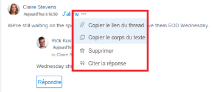

# Mise à jour du travail

<!-- Drafted for commenting experience: 

<!--take "Beta" references out when we remove the beta-->

<!--The highlighted information on this page refers to functionality not yet generally available. It is available only in the Preview environment. 

>[!NOTE]
>
>We are currently redesigning the way you update work when using the Updates section of an object. 
>You can access the new design by enabling the commenting Beta. 
>Currently, the Beta is available for issues. 
For more information about the new updating experience, see [New commenting experience](../updating-work-items-and-viewing-updates/unified-commenting-experience.md). 

-->

Vous pouvez ajouter des commentaires à la plupart des objets dans Adobe Workfront dans la section Mises à jour . Pour plus d’informations sur les objets qui affichent la section Mises à jour, voir [Présentation de la section Mises à jour](../updating-work-items-and-viewing-updates/updates-tab-overview.md).

Vous pouvez ajouter une mise à jour sur un objet Workfront (projet, tâche ou problème) pour communiquer sur la progression de l’objet, lorsque vous mettez en commentaire l’objet. Les utilisateurs affectés ou abonnés à l’objet peuvent afficher votre mise à jour. Vous pouvez également marquer les utilisateurs pour attirer leur attention sur la mise à jour. Les utilisateurs balisés recevront une notification in-app et un e-mail concernant votre mise à jour.

Les informations de cette page vous expliquent comment ajouter des commentaires aux objets Workfront et comment mettre à jour des projets, des tâches et des problèmes. Pour plus d’informations sur les commentaires sur les objectifs, voir [Gestion des commentaires d’objectif dans les objectifs Adobe Workfront](../../workfront-goals/goal-management/manage-goal-comments.md). Vous devez disposer d’une licence supplémentaire pour accéder aux objectifs de Workfront.

Vous pouvez ajouter une mise à jour aux projets, aux tâches et aux problèmes dans les zones suivantes de Workfront :

* Dans la section Mises à jour d’un objet Workfront
* Dans la zone Accueil (pour les tâches et les problèmes)
* Dans le panneau Résumé d’une liste d’objets (pour les tâches et les problèmes)
* À partir de la feuille de temps (pour les tâches et les problèmes)

## Exigences d’accès

<!--
drafted for P&P release:
<table style="table-layout:auto"> 
 <col> 
 </col> 
 <col> 
 </col> 
 <tbody> 
  <tr> 
   <td role="rowheader"><strong>Adobe Workfront plan*</strong></td> 
   <td> 
Any
 </td> 
  </tr> 
  <tr> 
   <td role="rowheader"><strong>Adobe Workfront license*</strong></td> 
   <td> 
Current license: Contributor or higher for issues and documents: Light or higher for all other objects
 
   Or
   
Legacy  license: Request or higher for issues and documents; Review or higher for all other objects

   </td> 
  </tr> 
  <tr> 
   <td role="rowheader"><strong>Access level configurations*</strong></td> 
   <td> 
View or Edit access for the object the update is on
 
<b>NOTE</b>
   
   If you still don't have access, ask your Workfront administrator if they set additional restrictions in your access level. For information on how a Workfront administrator can modify your access level, see <a href="../../administration-and-setup/add-users/configure-and-grant-access/create-modify-access-levels.md" class="MCXref xref">Create or modify custom access levels</a>.
 </td> 
  </tr> 
  <tr> 
   <td role="rowheader"><strong>Object permissions</strong></td> 
   <td> 
View access to the object
 
For information on requesting additional access, see <a href="../../workfront-basics/grant-and-request-access-to-objects/request-access.md" class="MCXref xref">Request access to objects </a>.
 </td> 
  </tr> 
 </tbody> 
</table>
-->
Vous devez disposer des accès suivants pour effectuer les étapes de cet article :

<table style="table-layout:auto"> 
 <col> 
 </col> 
 <col> 
 </col> 
 <tbody> 
  <tr> 
   <td role="rowheader"><strong>Formule Adobe Workfront*</strong></td> 
   <td> 
Tous
 </td> 
  </tr> 
  <tr> 
   <td role="rowheader"><strong>Licence Adobe Workfront*</strong></td> 
   <td> 
Demande ou version ultérieure pour les problèmes et les documents ; Révision ou version ultérieure pour tous les autres objets
 </td> 
  </tr> 
  <tr> 
   <td role="rowheader"><strong>Paramétrages du niveau d'accès*</strong></td> 
   <td> 
Accès à l’affichage ou à la modification de l’objet activé par la mise à jour
 
<b>NOTE</b>

Si vous n’avez toujours pas accès à , demandez à votre administrateur Workfront s’il définit des restrictions supplémentaires à votre niveau d’accès. Pour plus d’informations sur la façon dont un administrateur Workfront peut modifier votre niveau d’accès, voir <a href="../../administration-and-setup/add-users/configure-and-grant-access/create-modify-access-levels.md" class="MCXref xref">Création ou modification de niveaux d’accès personnalisés</a>.
 </td>
</tr> 
  <tr> 
   <td role="rowheader"><strong>Autorisations d’objet</strong></td> 
   <td> 
Afficher l’accès à l’objet
 
Pour plus d’informations sur la demande d’accès supplémentaire, voir <a href="../../workfront-basics/grant-and-request-access-to-objects/request-access.md" class="MCXref xref">Demande d’accès aux objets </a>.
 </td> 
  </tr> 
 </tbody> 
</table>

&#42;Pour connaître le plan, le type de licence ou l’accès dont vous disposez, contactez votre administrateur Workfront.

## Ajouter une mise à jour à un élément de travail

<!--drafted for the commenting experience - change the NOTE at the top of the following section with every new release to other objects

Adding an update to a work item differs depending on what version of the Updates section and what object you choose. 

### Add an update to a work item in the current Updates section

>[!NOTE]
>
>The following functionality is available for all objects except for goals. You must have an additional license to access Workfront Goals. For information about commenting on goals, see [Manage goal comments in Adobe Workfront Goals](../../workfront-goals/goal-management/manage-goal-comments.md)

-->

1. Accédez à l’élément de travail pour lequel vous souhaitez fournir une mise à jour (projet, tâche ou problème, par exemple).
1. Cliquez sur le bouton **Mises à jour** .
1. Cliquez sur **Démarrer une nouvelle mise à jour,** saisissez ensuite votre mise à jour.
1. (Facultatif) Utilisez du texte enrichi ou ajoutez des émoticônes, des liens ou des images à votre mise à jour pour améliorer votre contenu. Pour plus d’informations, reportez-vous à la section &quot;Utiliser du texte enrichi dans une mise à jour Workfront&quot; de cet article.
1. (Facultatif) Mettez à jour l’une des informations suivantes sur l’élément de travail :

   <table style="table-layout:auto"> 
    <col> 
    <col> 
    <tbody> 
     <tr> 
      <td role="rowheader"><strong>Notifier </strong></td> 
      <td>Identifiez les utilisateurs qui doivent être informés de la mise à jour. Les utilisateurs affectés ou abonnés à l’objet reçoivent automatiquement une notification lorsqu’une mise à jour est effectuée. 
Pour plus d’informations sur la manière d’inclure d’autres personnes à une mise à jour, voir <a href="../../workfront-basics/updating-work-items-and-viewing-updates/tag-others-on-updates.md" class="MCXref xref">Balisage des autres sur les mises à jour</a>.
</td> 
     </tr> 
     <tr> 
      <td role="rowheader"><strong>Date d'engagement</strong></td> 
      <td>Dans le sélecteur de date, sélectionnez la date de validation de la fin de l’élément de travail. Pour plus d’informations sur la date de validation, voir <a href="../../manage-work/projects/updating-work-in-a-project/overview-of-commit-dates.md" class="MCXref xref">Présentation de la date de validation</a>.</td> 
     </tr> 
     <tr> 
      <td role="rowheader"><strong>Condition</strong></td> 
      <td>Sélectionnez une nouvelle condition pour la tâche ou le problème. Pour plus d’informations sur la sélection d’une condition, voir <a href="../../manage-work/projects/updating-work-in-a-project/update-condition-for-tasks-and-issues.md" class="MCXref xref">Mise à jour de la condition pour les tâches et les problèmes</a>.</td> 
     </tr> 
     <tr> 
      <td role="rowheader"><strong>Statut</strong></td> 
      <td>Cliquez sur la flèche en regard de l’état actuel, puis sélectionnez l’état de votre choix dans le menu déroulant. Pour plus d’informations sur la définition d’un état, voir <a href="../../manage-work/projects/updating-work-in-a-project/update-task-status.md" class="MCXref xref">Mettre à jour le statut des tâches</a>.
La mise à jour de l’état d’un élément de travail ne modifie pas automatiquement l’état d’un projet. Selon la configuration de votre projet, vous devrez peut-être apporter des mises à jour distinctes de son état. Pour plus d’informations sur les différents types de mise à jour de projet, voir <a href="../../manage-work/projects/manage-projects/select-project-update-type.md" class="MCXref xref">Sélectionnez le type de mise à jour du projet. </a>.

<b>NOTE</b>

   Vous ne pouvez pas modifier l’état d’un élément de travail lorsqu’il est dans un état d’approbation en attente.
</td>
   </tr> 
     <tr> 
      <td role="rowheader"><strong>Barre d’achèvement</strong></td> 
      <td>(Uniquement disponible sur les tâches) Indiquez le pourcentage de travail réalisé en glissant la barre de progression sur le pourcentage souhaité. Vous pouvez également double-cliquer sur la barre d’achèvement et saisir le pourcentage terminé.</td> 
     </tr> 
     <tr> 
      <td role="rowheader"><strong>Réservé à mon entreprise</strong></td> 
      <td> 
Désactivez cette option pour empêcher les utilisateurs en dehors de votre entreprise d’avoir accès à cette mise à jour.
 
      
<b>NOTE</b>

      
Cette option s’affiche uniquement lorsque l’utilisateur est associé à une entreprise.

      </td> 
     </tr> 
    </tbody> 
   </table>

1. Cliquez sur **Mettre à jour** pour ajouter la mise à jour à l’objet Workfront.

   >[!NOTE]
   >
   >Une petite fenêtre contextuelle s’affiche pendant sept secondes après avoir cliqué **Mettre à jour**, ce qui vous permet d’annuler la mise à jour et de revenir au volet d’édition avant la publication de la mise à jour. La mise à jour sera publiée si vous ignorez la fenêtre contextuelle Annuler, attendez qu’elle disparaisse ou quittez la page.
   >
   >Si votre administrateur Workfront sélectionne le paramètre &quot;Ne jamais autoriser les utilisateurs à supprimer les commentaires&quot; dans votre niveau d’accès, vous ne pouvez pas annuler un commentaire. Pour plus d’informations, voir [Création et modification de niveaux d’accès personnalisés](../../administration-and-setup/add-users/configure-and-grant-access/create-modify-access-levels.md).

1. Pour répondre à une mise à jour, voir [Répondre aux mises à jour](../../workfront-basics/updating-work-items-and-viewing-updates/reply-to-updates.md).

<!--

### Add an update to a work item using the commenting Beta experience

>[!NOTE]
>
>The functionality described in this section is available for the following objects:
>
>* Issues, when you enable the commenting Beta experience.
>
>   This functionality is available only for the Updates section of issues, and it is not available for the following areas:
>
>   * Home
>   * Summary panel in lists
>   * Summary panel in timesheets
>* Goals
>
>   The commenting experience Beta is the default current experience for goals.
>   You must have an additional license to access Workfront Goals. For information, see [Requirements to use Workfront Goals](../../workfront-goals/goal-management/access-needed-for-wf-goals.md).

1. Locate the object you want to update, then click its name to open the object's page.
1. Click  **Updates** in the left panel. 
1. Click **Try out the commenting Beta** button in the lower-right corner of the Updates area, then click **Agree** on the Beta agreement. This switches the Updates area to the commenting Beta experience. 
   The **Comments** tab is selected by default. 
1. Start entering a comment in the **New comment** box. 
   
   

   >[!TIP]
   >
   >Navigating away from the Updates section before you finish typing and submitting a comment keeps the comment on the page in draft mode even after you log off and log back on. Drafted comments are only visible to the user entering them.

1. (Optional) In the **Tag people or teams** area, start typing the name or the email of a user, or a team that you would like to include in this comment, then select it when it displays in the list. 
1. (Optional) To add rich text formatting to your update, use any of the following options from the **Rich Text** toolbar to enhance your text: 

   * Bold
   * Italics
   * Underline
   * Link
   * Bulleted List
   * Numbered List
   * Add attachment (mark this parenthesis as draft: ************ this might be renamed)
   
   For more information, see the "Use Rich Text in a Workfront update" section in this article.

   >[!TIP]
   >
   >   If another user submits a comment to the same item you are updating, there will be a red line with a "New" indicator to inform you of the newer comments. The indicator only displays only after the comment was submitted on the item, and not when the comment is still composed. 
   >
   > 

1. Click **Submit** to add the update to the Workfront object. 
1. (Optional) To edit a comment, click the **More** menu  to the right of the Like icon, then click **Edit**. 
1. Edit the information in the comment, or remove any of the tagged users. 
   You can edit your comment within 15 from submitting it. An "Edited" indicator is added to the left of the date stamp that displays when the comment was updated. 

   

   >[!TIP]
   >
   >   An email is generated to notify users of your update only when you submit the original update. No email is generated after you edited your update.
1. (Optional) Click **Reply** to reply to an existing comment, then follow the steps 5-7 above. (**************insure this stays accurate***********). For information about replying to an update, see [Reply to updates](../../workfront-basics/updating-work-items-and-viewing-updates/reply-to-updates.md).
1. (Optional) Click the **Like** icon. The icon updates with the number of likes.
1. (Conditional and Optional) If you included additional people in your comment, click the number of members included in the update to display a list of entities that the comment you entered is shared with. 

   
1. (Optional) Click the **System Activity** tab to view updates logged by the system. When the object or any of its children are updated, Workfront generates a note about that update and displays it in the System Activity tab. 

   For more information see [Updates section  overview](../updating-work-items-and-viewing-updates/updates-tab-overview.md)

   >[!TIP]
   >
   >You cannot add a comment to a system update.
-->

## Utilisation de texte enrichi dans une mise à jour Workfront

<!--remove this top note when we get to parity with the current version, OR change the note to mention that some options are ONLY available in the Beta version and not the current one.

>[!NOTE]
>
>Some of the options in the Rich Text toolbar are not available for the commenting Beta experience.-->

Vous pouvez améliorer vos mises à jour en utilisant du texte enrichi ou en y ajoutant divers éléments, tels que des émoticônes, des liens ou des images.

1. Accédez à la zone Mises à jour et commencez à saisir un commentaire.
1. (Facultatif) Pour ajouter une mise en forme de texte enrichi à votre mise à jour, utilisez n’importe quel attribut du **Texte enrichi** au fur et à mesure que vous tapez.

   | **Attribut** | **Bouton Barre d’outils** | **Clés de raccourci Mac** | **Clés de raccourci PC** |
   |---|---|---|---|
   | Gras |  | épargner+b | Ctrl+B |
   | Italique |  | %+i | Ctrl+I |
   | Souligner |  | %+u | Ctrl+U |
   | Lien hypertexte |  | ⌘+Ko | Ctrl+K |
   | Liste à puces |  | Greatest + Maj + 8 | Ctrl+Maj+8 |
   | Liste numérotée |  | Greatest + Maj + 7 | Ctrl+Maj+7 |
   | Citation |  | CY+Maj+9 | Ctrl+Maj+9 |

   Pour arrêter le formatage du texte, désélectionnez l’attribut sur la **Texte enrichi** de la barre d’outils.

   >[!NOTE]
   >
   >* Le formatage s’affiche également dans toutes les notifications électroniques que les utilisateurs reçoivent contenant votre mise à jour.
   >* Le formatage de texte enrichi appliqué à une mise à jour dans un email ne s’affiche pas sur la mise à jour lors de son affichage dans l’onglet Mises à jour .
   >* Si votre entreprise utilise Workfront avec Internet Explorer, tout texte formaté collé dans une mise à jour perd sa mise en forme de texte enrichi et s’affiche en tant que texte brut. Vous pouvez reformater le texte à l’aide des attributs de la barre d’outils Texte enrichi.
   >* La mise en forme de texte enrichi n’est pas disponible pour les mises à jour effectuées dans la zone Fiches horaires ou pour les objets Remarque et Dernière condition affichés dans un rapport.

1. (Facultatif) Si vous souhaitez inclure du texte provenant de mises à jour précédentes ou d’autres sources et le distinguer de votre propre mise à jour, vous pouvez le marquer comme une citation de bloc. Cliquez sur le bouton **Blocs de citations** icon  et tapez le texte que vous souhaitez citer. Le texte entre guillemets s’affiche avec une ligne grise verticale. Cliquez sur le bouton **Blocs de citations** pour revenir à la mise en forme normale.

   

1. (Facultatif) Ajoutez des émoticônes à votre mise à jour.

   >[!NOTE]
   >
   >* Workfront ne remplace pas les émoticônes de ponctuation telles que :) par des émoticônes.
   >* Les émoticônes ne sont pas disponibles pour les mises à jour effectuées dans la zone Fiches horaires ou pour les objets Remarque et Dernière condition affichés dans un rapport.
   >* La fonction d’émoticône de Workfront utilise des caractères Unicode et, en tant que tels, s’affiche uniquement sur les navigateurs et les systèmes d’exploitation qui prennent en charge les points de code Unicode. Les utilisateurs d’une plateforme, d’un navigateur ou d’une version de système d’exploitation différente de la vôtre peuvent ne pas avoir accès aux mêmes émoticônes.
   >* Une émoticône non prise en charge est représentée par une boîte noire ou blanche.
   >* Windows 7 ne prend en charge que les émoticônes en noir et blanc.
   >* Les émoticônes qui sont appliqués à une mise à jour effectuée par courrier électronique ne s’affichent pas sur la mise à jour lors de l’affichage dans la zone Mises à jour .

1. (Facultatif) Pour ajouter un lien URL vers des sources d’informations supplémentaires :

   1. Cliquez dans la mise à jour où vous souhaitez insérer un lien.
   1. Sur le **Texte enrichi** , cliquez sur **Lien hypertexte** icône . 

   1. Dans le **Créer un lien** s’affiche, sous **URL**, saisissez ou collez l’URL de la source à laquelle vous souhaitez créer un lien.

   1. Sous **Texte à afficher**, saisissez ou collez le texte du lien.
   1. Cliquer sur **Enregistrer**.

1. (Facultatif) Pour joindre une image à votre mise à jour, cliquez sur le bouton **Image** icon  et accédez à l’image sur votre ordinateur.\
   Ou\
   Faites glisser l’image dans la zone de mise à jour.

   >[!NOTE]
   >
   >* L’administrateur Workfront doit activer l’ajout d’images avant que l’icône Image ne s’affiche.
   >* La taille maximale du fichier image est de 7 Mo. Les types de fichiers image pris en charge sont .jpg, .gif et .png.
   >* Les images sont accessibles uniquement à partir de l’onglet Mises à jour d’un objet et elles ne sont pas disponibles dans l’onglet Documents.
   >* Vous pouvez envoyer une mise à jour avec une image et sans texte.

1. Cliquez sur **Mettre à jour**  <!--or **Submit**, in the commenting Beta experience-->.

## Copie des informations de mise à jour

<!--drafted for beta release toggle - remove when copying an update will be available: 

>[!NOTE]
>
>Copying an update is not possible when using the Beta commenting experience.
-->

Il existe plusieurs façons de copier une mise à jour. Après avoir copié un lien, vous pouvez le partager avec d’autres personnes afin de les rediriger vers la mise à jour.

* [Copier la mise à jour](#copy-the-update)
* [Copier le lien du thread](#copy-the-thread-link)
* [Copier le lien de mise à jour](#copy-the-update-link)

### Copier la mise à jour {#copy-the-update}

Cette option copie le texte d’une mise à jour spécifique dans le Presse-papiers.

1. Accédez à la mise à jour ou à la réponse que vous souhaitez copier.
1. Cliquez sur le bouton **Plus** , puis cliquez sur **Copier le texte du corps**.

   

### Copier le lien du thread {#copy-the-thread-link}

Cette option copie le lien de thread complet dans le Presse-papiers afin que vous puissiez partager le thread avec d’autres utilisateurs.

1. Accédez au thread de mise à jour que vous souhaitez copier.
1. Cliquez sur le bouton **Plus** , puis cliquez sur **Copier le lien du thread**.

   

### Copier le lien de mise à jour {#copy-the-update-link}

Cette option copie un lien de mise à jour spécifique dans le Presse-papiers. Lorsque vous partagez le lien de mise à jour, l’utilisateur qui le suit voit une bordure autour de la mise à jour.

1. Accédez à la mise à jour ou à la réponse que vous souhaitez copier.
1. Cliquez sur le bouton **Plus** en regard de la mise à jour individuelle, puis cliquez sur **Copier le lien de mise à jour**.

   

## Supprimer une mise à jour ou une réponse

Selon l’accès que votre administrateur Workfront vous donne, vous pouvez supprimer les mises à jour que vous avez ajoutées dans l’onglet Mises à jour d’un objet . Pour plus d’informations, voir [Création ou modification de niveaux d’accès personnalisés](../../administration-and-setup/add-users/configure-and-grant-access/create-modify-access-levels.md#creating-a-new-access-from-scratch) dans l’article [Création ou modification de niveaux d’accès personnalisés](../../administration-and-setup/add-users/configure-and-grant-access/create-modify-access-levels.md).

Aucun utilisateur Workfront (y compris l’administrateur Workfront) ne peut supprimer les mises à jour effectuées par un autre utilisateur. Cependant, si le niveau d’accès d’un utilisateur lui permet de supprimer ses propres mises à jour, l’administrateur Workfront peut se connecter en tant qu’utilisateur et supprimer les mises à jour qu’il a effectuées. Pour plus d’informations, voir [Création ou modification de niveaux d’accès personnalisés](../../administration-and-setup/add-users/configure-and-grant-access/create-modify-access-levels.md#creating-a-new-access-from-scratch) et [Connexion en tant qu’autre utilisateur](../../administration-and-setup/add-users/create-and-manage-users/log-in-as-another-user.md).

1. Accédez à la mise à jour ou à la réponse à supprimer.
1. Cliquez sur le bouton **Plus** en regard de la mise à jour ou de la réponse que vous souhaitez supprimer, puis cliquez sur **Supprimer**.

   

1. Dans le message qui s’affiche, cliquez sur **Confirmer** <!--or **Delete**, in the commenting Beta experience-->.

>[!NOTE]
>
>La suppression d’une mise à jour avec une image jointe supprime le commentaire et l’image.

## Ajout d’une mise à jour à une feuille de calcul

1. Accédez à une Frise chronologique sur laquelle vous souhaitez effectuer une mise à jour.
1. Cliquez sur la feuille de calcul pour l’ouvrir.
1. Au bas de la feuille de calcul, cliquez sur **Inclure un commentaire**.
1. Dans la zone qui s’affiche au bas de la feuille de calcul, saisissez une mise à jour.

   

1. (Conditionnel) Pour enregistrer votre mise à jour sans envoyer la feuille de temps pour approbation, cliquez sur **Enregistrer ultérieurement**.

   Ou

   Pour enregistrer votre mise à jour et envoyer la feuille de calcul pour approbation, cliquez sur **Envoyer pour approbation**.

   Ou

   Si votre feuille de calcul n’est pas configurée avec un approbateur, cliquez sur **Enregistrement et fermeture de la feuille de calcul** pour enregistrer votre mise à jour.

## Activation ou désactivation des mises à jour système

<!--remove preview with 23.2 production: 

>[!NOTE]
>
>It is not possible to disable system updates when using the Beta commenting experience. 
>The information in this section refers only to functionality available in the current Updtes section. 
>For more information about system updates in the Beta version, see [Updates section overview](../updating-work-items-and-viewing-updates/updates-tab-overview.md) 

-->

La section Mises à jour d’un objet Workfront affiche deux types d’informations :

* **Mises à jour utilisateur :** Les mises à jour des utilisateurs sont des commentaires que vous et d’autres utilisateurs de votre système saisissez.

   

* **Mises à jour système :** Le système met à jour l’enregistrement de suppression des ressources, d’ajout ou de suppression de versions, de pièce jointe ou de suppression d’une demande d’approbation, ainsi que des modifications ou modifications apportées aux documents sur l’objet.

   

Selon votre licence Workfront, les mises à jour système peuvent être activées par défaut. Les administrateurs de Workfront peuvent déterminer ce qui est suivi dans les mises à jour du système, comme expliqué dans la section [Mises à jour suivies par le système](../../administration-and-setup/set-up-workfront/system-tracked-update-feeds/system-tracked-update-feeds.md). Vous pouvez également filtrer les mises à jour système ou les activités afin de n’afficher que les mises à jour utilisateur pour tous les objets.

Pour plus d’informations sur la différence entre les mises à jour des utilisateurs et des systèmes, voir [Mises à jour suivies par le système](../../administration-and-setup/set-up-workfront/system-tracked-update-feeds/system-tracked-update-feeds.md).

Pour activer ou désactiver les mises à jour du système :

1. Cliquez sur le bouton **Mises à jour** sur un objet.
1. Cliquez sur **Afficher les mises à jour du système** pour faire glisser le commutateur vers la gauche (désactivé) ou la droite (activé).

   

   Cette option est persistante dans tous les objets de Workfront et reste à l’emplacement sélectionné, même si vous vous déconnectez de Workfront.

