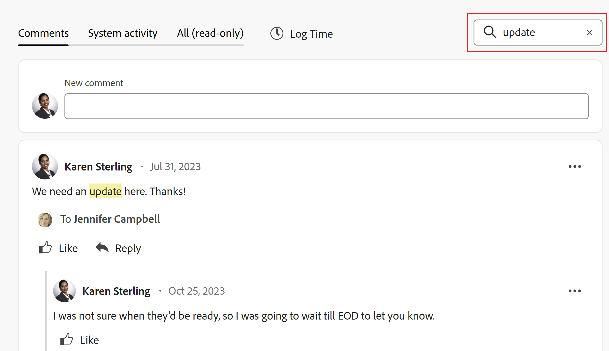

# Mettre à jour le travail

<!-- Audited: 4/2025 -->

<!--The highlighted information on this page refers to functionality not yet generally available. It is available only in the Preview environment for all customers. After the monthly releases to Production, the same features are also available in the Production environment for customers who enabled fast releases.    

For information about fast releases, see [Enable or disable fast releases for your organization](/help/quicksilver/administration-and-setup/set-up-workfront/configure-system-defaults/enable-fast-release-process.md). -->

<!--info for April 11: hide the "Important" box below-->

<!--
>[!IMPORTANT]
>
>We are currently redesigning the commenting experience in Adobe Workfront.
>
>Depending on what objects you access the commenting experience for, you might see the following functionality for the Updates section:
>* The new experience
>* The legacy experience
>* The new and the legacy experience
>
>For more information about the new commenting experience and its availability, see [New commenting experience](../../product-announcements/betas/new-commenting-experience-beta/unified-commenting-experience.md). 
>
>The legacy commenting experience has been removed from projects, tasks, issues, and documents in the Preview environment. 
>
>The new commenting experience is available only for the Updates section of Workfront objects, and it is not available when you access updates from the following areas:
>
> * Home
> * Summary panel in lists
> * Summary panel in timesheets 
> * Summary panel in the Workload Balancer
>
>The new commenting experience is available in the Summary panel in lists, timesheets, and the Workload Balancer in the Preview environment and in the Production environment for customers who have opted for the fast release process. 
-->

Vous pouvez ajouter une mise à jour à un objet Adobe Workfront en y ajoutant un commentaire pour informer les autres utilisateurs du statut ou de la progression de l’objet, ou pour demander des informations supplémentaires ou des ressources supplémentaires.

Pour plus d’informations sur les objets auxquels vous pouvez ajouter des mises à jour dans Workfront, voir [Vue d’ensemble de la section Mises à jour](/help/quicksilver/workfront-basics/updating-work-items-and-viewing-updates/updates-tab-overview.md).

Les informations de cet article décrivent comment apporter des commentaires sur des projets, des tâches et des événements. Les utilisateurs affectés ou abonnés à l’objet peuvent afficher votre mise à jour. Vous pouvez également taguer les utilisateurs et utilisatrices pour attirer leur attention sur la mise à jour.

L’ajout de commentaires à d’autres objets Workfront est similaire à la mise à jour de projets, tâches et problèmes.

Pour plus d’informations sur les commentaires relatifs aux cartes, objectifs et enregistrements dans Workfront Planning, consultez également les articles suivants :

* [Gérer les commentaires des objectifs dans Objectifs Adobe Workfront](../../workfront-goals/goal-management/manage-goal-comments.md).

* [Ajouter une carte ad hoc à un panorama](/help/quicksilver/agile/get-started-with-boards/add-card-to-board.md)

* [Utiliser des cartes connectées sur des panoramas](/help/quicksilver/agile/get-started-with-boards/connected-cards.md)

* [Gérer les commentaires des enregistrements](/help/quicksilver/planning/records/manage-record-comments.md)

## Conditions d’accès

+++ Développez pour afficher les exigences d’accès aux fonctionnalités de cet article.

<table style="table-layout:auto"> 
 <col> 
 </col> 
 <col> 
 </col> 
 <tbody> 
  <tr> 
   <td role="rowheader"><strong>Package Adobe Workfront</strong></td> 
   <td> 
Tous
 </td> 
  </tr> 
  <tr> 
   <td role="rowheader"><strong>Licence Adobe Workfront</strong></td> 
   <td> 
Pour les événements et les documents :

<ul><li>
Contributeur ou version ultérieure
</li>
   <li>
Requête ou supérieure
</li></ul>

Pour tous les autres objets :

   <ul><li>
Léger ou supérieur
</li>
   <li>
Révision ou supérieur
</li></ul>

</td> 
  </tr> 
  <tr> 
   <td role="rowheader"><strong>Configurations des niveaux d’accès</strong></td> 
   <td> 
Accès Afficher ou Modifier à l’objet mis à jour
</td> 
  </tr> 
  <tr> 
   <td role="rowheader"><strong>Autorisations d’objet</strong></td> 
   <td> 
Accès Afficher à l’objet
</td> 
  </tr> 
 </tbody> 
</table>

Pour plus d’informations, voir [Conditions d’accès dans la documentation Workfront](/help/quicksilver/administration-and-setup/add-users/access-levels-and-object-permissions/access-level-requirements-in-documentation.md).

+++

<!--Old:
<table style="table-layout:auto"> 
 <col> 
 </col> 
 <col> 
 </col> 
 <tbody> 
  <tr> 
   <td role="rowheader"><strong>Adobe Workfront plan</strong></td> 
   <td> 
Any
 </td> 
  </tr> 
  <tr> 
   <td role="rowheader"><strong>Adobe Workfront license*</strong></td> 
   <td> 
   
New: Contributor or higher for issues and documents: Light or higher for all other objects

   
Current: Request or higher for issues and documents; Review or higher for all other objects

   </td> 
  </tr> 
  <tr> 
   <td role="rowheader"><strong>Access level configurations</strong></td> 
   <td> 
View or Edit access for the object the update is on
</td> 
  </tr> 
  <tr> 
   <td role="rowheader"><strong>Object permissions</strong></td> 
   <td> 
View access to the object
</td> 
  </tr> 
 </tbody> 
</table>
-->

## Considérations relatives aux commentaires sur les objets

* Vous pouvez ajouter des commentaires à la plupart des objets dans Adobe Workfront dans la section Mises à jour. Pour plus d’informations sur les objets qui affichent la section Mises à jour, voir [Vue d’ensemble de la section Mises à jour](../updating-work-items-and-viewing-updates/updates-tab-overview.md).

* Vous pouvez ajouter des commentaires aux objets Workfront à partir d’autres applications intégrées à Workfront ou à partir de l’application mobile Workfront.

  Toutes les applications intégrées à Workfront ne peuvent pas ajouter de commentaires aux objets Workfront.

  Toutes les fonctions disponibles dans la section Mises à jour d’un objet dans Workfront ne sont pas disponibles dans d’autres applications lors de l’accès aux objets Workfront à partir de l’application. Par exemple, les fonctionnalités de texte enrichi ou la définition d’un commentaire privé pour la société d’une personne peuvent ne pas être disponibles lors de l’ajout de commentaires à un objet Workfront à partir d’une application tierce.

* Vous pouvez communiquer sur la progression d’un objet Workfront (projet, tâche ou problème) lorsque vous faites des commentaires sur l’objet. Les utilisateurs et utilisatrices affectés ou abonnés à l’objet peuvent recevoir une notification à propos de votre mise à jour. Les utilisateurs et utilisatrices disposant de l’accès Afficher à l’objet peuvent consulter votre mise à jour.

* Vous pouvez taguer les utilisateurs et utilisatrices pour attirer leur attention sur la mise à jour. Les utilisateurs et utilisatrices tagués reçoivent une notification in-app et un e-mail concernant votre mise à jour.

  >[!TIP]
  >
  >Les personnes propriétaires de commentaires sont automatiquement taguées. Pour plus d’informations, voir [Taguer d’autres personnes lors de mises à jour](../../workfront-basics/updating-work-items-and-viewing-updates/tag-others-on-updates.md).

* Vous pouvez ajouter un commentaire à un objet que vous pouvez afficher ou vous connecter en tant qu’administrateur ou administratrice Workfront ou de groupe et ajouter un commentaire au nom d’un autre utilisateur ou d’une autre utilisatrice. Pour plus d’informations, voir [Se connecter en tant qu’un autre utilisateur ou qu’une autre utilisatrice](../../administration-and-setup/add-users/create-and-manage-users/log-in-as-another-user.md).

* Vous pouvez ajouter une mise à jour aux projets, aux tâches et aux problèmes dans les zones suivantes de Workfront :

   * Dans un objet Workfront, dans la section Mises à jour (pour les projets, les tâches et les problèmes)
   * Dans la zone Accueil (pour les tâches et les problèmes)

     Pour plus d’informations, voir [&#x200B; Gérer votre travail avec le widget Mes tâches &#x200B;](/help/quicksilver/workfront-basics/using-home/using-the-home-area/my-work-widget.md).
   * Dans le panneau Résumé des zones suivantes (pour les tâches, les problèmes et les documents) :

      * Une liste des objets
      * Une feuille de temps
      * Page d’accueil
      * Équilibreur de charge de travail

     Pour plus d’informations, consultez les articles suivants :

      * [Vue d’ensemble du résumé](/help/quicksilver/workfront-basics/the-new-workfront-experience/summary-overview.md)
      * [Mettre à jour des éléments de travail dans l’équilibreur de charge de travail à l’aide du résumé](/help/quicksilver/resource-mgmt/workload-balancer/update-items-in-summary-panel-in-workload-balancer.md)

<!--info for April 11: hide the section below: add an update to a work item-->

<!--
## Add an update to a work item

Adding an update to a work item differs depending on what version of the Updates section you use.

You can add updates to the following objects: 

* Projects
* Tasks
* Issues
* Programs
* Portfolios
* Templates
* Template tasks
* Users
* Timesheets
* Teams
* Goals
* Cards in the Boards area
* Iterations
-->

<!--info for April 11: hide the section below completely:-->

<!--
### Add an update to a work item in the legacy Updates section

>[!IMPORTANT]
>
>The information on this page describes how you update projects, tasks, and issues.

1. Go to the work item for which you want to provide an update (such as a project, task, or issue).
1. Click the **Updates** section.
1. (Conditional) If it is enabled, click the **New commenting** option in the upper-right corner of the Updates section to disable it and enable the legacy commenting experience.
1. Click **Start a new update,** then type your update.  
1. (Optional) Use the options in the Rich Text toolbar to format your text, add emojis, links, or images to your update, to enhance your content. For more information, see the [Use Rich Text in a Workfront update](#use-rich-text-in-a-workfront-update) section in this article.
1. (Optional) Update any of the following information about the work item:

   <table style="table-layout:auto"> 
    <col> 
    <col> 
    <tbody> 
     <tr> 
      <td role="rowheader"><strong>Notify</strong></td> 
      <td>Identify users who must be notified of the update. Users assigned or subscribed to the object automatically receive notification when an update is made. 
For information about how to include others on an update, see <a href="../../workfront-basics/updating-work-items-and-viewing-updates/tag-others-on-updates.md" class="MCXref xref">Tag others on updates</a>.
</td> 
     </tr> 
     <tr> 
      <td role="rowheader"><strong>Commit Date</strong></td> 
      <td>In the date picker, select the date that you commit to complete the work item. For information about Commit Date, see <a href="../../manage-work/projects/updating-work-in-a-project/overview-of-commit-dates.md" class="MCXref xref">Commit Date overview</a>.</td> 
     </tr> 
     <tr> 
      <td role="rowheader"><strong>Condition</strong></td> 
      <td>Select a new condition for the task or issue. For information about selecting a condition, see <a href="../../manage-work/projects/updating-work-in-a-project/update-condition-for-tasks-and-issues.md" class="MCXref xref">Update Condition for tasks and issues</a>.</td> 
     </tr> 
     <tr> 
      <td role="rowheader"><strong>Status</strong></td> 
      <td>Click the arrow beside the current status, then select the desired status from the drop-down menu. For information about setting a Status, see <a href="../../manage-work/projects/updating-work-in-a-project/update-task-status.md" class="MCXref xref">Update task status</a>.
Updating the status of a work item does not automatically change the status of a project. Depending on how your project is set up, you might make updates to the project status separately. For more information on the various project update types, see <a href="../../manage-work/projects/manage-projects/select-project-update-type.md" class="MCXref xref">Select the project Update Type </a>.

<b>NOTE</b>
      
      You cannot change the status of a work item while it is in a Pending Approval status.
</td> 
     </tr> 
     <tr> 
      <td role="rowheader"><strong>Completion Bar</strong></td> 
      <td>(Only available on tasks) Indicate the percentage of work completed by sliding the progress bar to the desired percentage. You can also double-click the completion bar and enter the percent complete.</td> 
     </tr> 
     <tr> 
      <td role="rowheader"><strong>Private to my company</strong></td> 
      <td> 
Disable this option to prevent users outside your company from having access to view this update.
 
      
<b>NOTE</b>

      
This option displays only when the user is associated with a Company.

      
This option is not available in all areas where you can add updates from. For example, this is not available in third-party applications where you can add updates from. 

      </td> 
     </tr> 
    </tbody> 
   </table>

1. Click **Update** to add the update to the Workfront object.

   >[!NOTE]
   >
   >A small pop-up window will appear for seven seconds after clicking **Update**, allowing you to undo the update and return to the editing pane before the update is posted. The update is posted if you dismiss the undo pop-up, wait for it to disappear, or navigate away from the page. 
   >
   >If your Workfront administrator selects the "Never allow users to delete comments" setting in your access level, you cannot undo a comment. For more information, see [Create and modify custom access levels](../../administration-and-setup/add-users/configure-and-grant-access/create-modify-access-levels.md).

1. To reply to an update, see [Reply to updates](../../workfront-basics/updating-work-items-and-viewing-updates/reply-to-updates.md).
-->

<!--info for April 11: reword the title of this section to: "Add an update to a work item"; take out the step that says you need to enable the "New commenting" toggle (I think it is step 3??)-->

## Ajouter un commentaire à un élément de travail

Cet article décrit comment mettre à jour des projets, des tâches ou des événements. La mise à jour de la plupart des autres objets est similaire.

1. Recherchez l’objet auquel vous souhaitez ajouter un commentaire, puis cliquez sur son nom pour ouvrir la page de l’objet.
1. Cliquez sur Mises à jour dans le panneau de gauche. **&#x200B;**
L’onglet **Commentaires** est sélectionné par défaut.

1. Commencez à saisir un commentaire dans la zone **Nouveau commentaire**.

   

   >[!TIP]
   >
   >Lorsque vous quittez la section Mises à jour avant de terminer la saisie, un commentaire est envoyé afin de conserver le commentaire sur la page en mode brouillon, même après une déconnexion et une reconnexion. Toutes les images ajoutées au commentaire sont également enregistrées dans le brouillon. Les brouillons sont enregistrés pendant 7 jours, après quoi ils sont éliminés et ne peuvent pas être récupérés. Les commentaires en mode brouillon ne sont visibles que par l’utilisateur ou l’utilisatrice qui les saisit.

1. (Facultatif) Pour annuler ou rétablir une modification, utilisez les raccourcis clavier suivants :
   * Ctrl + Z (⌘ + z pour Mac) pour annuler une modification
   * Ctrl + Y (⌘ + y pour Mac) pour rétablir une modification

1. (Facultatif) Dans la zone **Identifier des personnes ou des équipes**, commencez à saisir le nom ou l’adresse e-mail d’un utilisateur ou d’une équipe que vous souhaitez inclure dans ce commentaire ou sélectionnez-le lorsqu’il s’affiche dans la liste.
1. (Facultatif) Utilisez les options de la barre d’outils de texte enrichi pour mettre en forme votre texte, ajouter des émoticônes, des liens ou des images à votre mise à jour, afin d’améliorer votre contenu. Pour plus d’informations, voir [Utiliser du texte enrichi dans une mise à jour Workfront](#use-rich-text-in-a-workfront-update) dans cet article.

   >[!TIP]
   >
   >Si une autre personne envoie un commentaire au même élément que celui que vous mettez à jour, une ligne rouge s’affiche avec un indicateur « Nouveau » pour vous informer des commentaires les plus récents.
   >
   >L’indicateur s’affiche uniquement après l’envoi du commentaire sur l’élément, et non tant que le commentaire est toujours en train d’être composé.
   >
   >L’indicateur « Nouveau » s’affiche uniquement lorsque la personne qui a saisi une nouvelle mise à jour, ainsi que celle qui saisit actuellement une mise à jour, utilisent toutes deux la nouvelle expérience de commentaire.
   >

1. Cliquez sur **Envoyer** pour ajouter la mise à jour à l’objet Workfront.
1. (Facultatif) Pour modifier un commentaire, cliquez sur le menu **Plus**  dans le coin supérieur droit du commentaire, puis cliquez sur **Modifier**.

   >[!IMPORTANT]
   >
   >Vous ne pouvez modifier votre commentaire qu’au cours des 15 minutes suivant son envoi.

1. Modifiez les informations du commentaire, ajoutez ou supprimez des images ou supprimez l’une des personnes mentionnées. Un indicateur « Modifié » est ajouté à gauche de l’horodatage qui s’affiche lorsque le commentaire a été saisi.

   >[!TIP]
   >
   >Les commentaires de l’année en cours n’affichent pas l’année dans l’horodatage. Le survol d’un horodatage affiche la date complète, année incluse.

   

   >[!TIP]
   >
   >* Un e-mail est généré pour informer les utilisateurs et utilisatrices de votre mise à jour, uniquement lorsque vous envoyez la mise à jour d’origine. Aucun e-mail n’est généré après que vous avez modifié votre mise à jour.
   >* L’horodatage en regard du commentaire correspond à la date du commentaire d’origine, et non à celle de la dernière modification.
   >* Lorsque vous ajoutez un commentaire au nom d’une autre personne (lorsque vous vous connectez avec un autre identifiant en tant qu’administrateur ou administratrice Workfront ou de groupe), vous ne pouvez pas le modifier en cas de connexion en tant l’autre utilisateur ou utilisatrice. Vous ne pouvez modifier le commentaire que si vous vous déconnectez en tant que cet autre utilisateur ou cette autre utilisatrice et que vous vous reconnectez sous votre propre identifiant.

1. (Facultatif) Cliquez sur **Répondre** ou commencez à saisir un commentaire dans la zone **Ajouter une réponse...** pour répondre à un commentaire existant, puis suivez les étapes 3 à 7 ci-dessus. <!--(**************insure this stays accurate***********)--> Pour plus d’informations sur la réponse à une mise à jour, voir [Répondre aux mises à jour](../../workfront-basics/updating-work-items-and-viewing-updates/reply-to-updates.md).

1. (Le cas échéant - Facultatif) Si d’autres personnes ont ajouté des commentaires qui s’affichent en dehors de la zone visible dans la section Mises à jour pendant que vous ajoutiez vos commentaires, cliquez sur **Afficher** à l’intérieur de la **bannière bleue des nouveaux commentaires** en bas de l’écran pour les afficher.

   

   D’autres commentaires s’affichent en bas de l’écran.

1. (Facultatif) Cliquez sur l’icône **J’aime** Icône . L’icône se met à jour avec le nombre de mentions « J’aime ».
1. (Le cas échéant - Facultatif) Si vous avez inclus des personnes supplémentaires dans votre commentaire, cliquez sur le nombre de membres inclus dans la mise à jour pour afficher une liste des entités avec lesquelles le commentaire que vous avez saisi est partagé.

   

   >[!TIP]
   >
   >Les noms des deux premières entités mentionnées s’affichent en regard de leurs avatars. Si plus de deux entités sont mentionnées, seul le nom de la première et le nombre d’entités supplémentaires s’affichent.

1. (Facultatif) Cliquez sur le nom d’un commentateur ou d’une commentatrice pour afficher son nom, son rôle et son adresse e-mail dans une zone d’informations. Cliquez à nouveau sur le nom du commentateur ou de la commentatrice dans la zone d’informations pour ouvrir son profil utilisateur.
1. (Facultatif) Cliquez sur l’onglet Activité du système pour afficher les mises à jour consignées par le système. **&#x200B;**&#x200B;Lorsque l’objet ou l’un de ses enfants est mis à jour, Workfront génère une note relative à cette mise à jour et l’affiche dans l’onglet Activité du système.

   Pour plus d’informations, consultez [Vue d’ensemble de la section Mises à jour](../updating-work-items-and-viewing-updates/updates-tab-overview.md).

   >[!TIP]
   >
   >Vous ne pouvez pas ajouter de commentaire à une mise à jour système. Cependant, toutes les réponses apportées aux enregistrements d’activité système dans l’expérience de commentaire héritée ont été ajoutées à l’onglet Activité système en lecture seule. L’expérience de commentaire héritée a été supprimée de Workfront le 11 avril 2024.

1. (Facultatif) Cliquez sur l’onglet Tous pour afficher les commentaires d’utilisateur ou d’utilisatrice et les commentaires d’activité du système au même endroit **&#x200B;**. Il s’agit d’un onglet en lecture seule.

   >[!TIP]
   >
   >Vous ne pouvez pas répondre aux commentaires ni identifier d’autres personnes dans les commentaires existants de l’onglet Tous. Pour répondre à un commentaire dans l’onglet Tous, cliquez sur **Répondre dans les commentaires** pour ouvrir le commentaire dans l’onglet Commentaires.

## Utilisation de texte enrichi dans un commentaire Workfront{#use-rich-text-in-a-workfront-comment}

Vous pouvez enrichir vos commentaires à l’aide de texte enrichi ou en y ajoutant divers éléments, tels que des émoticônes, des liens ou des images.

1. Accédez à la zone **Mises à jour** d’un objet Workfront, ouvrez l’onglet **Commentaires** et commencez à saisir un commentaire.
1. (Facultatif) Pour ajouter du texte enrichi à votre commentaire, utilisez les attributs de la barre d’outils **Texte enrichi** au fur et à mesure que vous tapez.

   

   | **Attribut** | **Bouton Barre d’outils** | **Raccourcis clavier Mac** | **Raccourcis clavier Windows** |
   |---|---|---|---|
   | Gras |  | ⌘+b | Ctrl + B |
   | Italique |  | ⌘+i | Ctrl + I |
   | Souligner |  | ⌘+u | Ctrl + U |
   | Lien hypertexte |  |  Pour ouvrir la zone Ajouter des liens : ⌘+K   Pour coller un lien sur le texte sélectionné : ⌘+V  |  Pour ouvrir la zone Ajouter des liens : Ctrl + K   Pour coller un lien sur le texte sélectionné : Ctrl + V  |
   | Liste à puces |  | ⌘+Maj+8 | Ctrl + Maj + 8 |
   | Liste numérotée |  | ⌘+Maj+7 | Ctrl + Maj + 7 |

   <!--| Block Quote | |⌘+Shift+9 | Ctrl+Shift+9   This is not available in the new commenting experience.   |-->

   <!--remove the last row when we remove legacy from the system-->

   Pour arrêter le formatage du texte, désélectionnez l’attribut sur la barre d’outils **Texte enrichi**.

   <!-- in the table above: take "Create Links" verbiage from the hyperlink when the old commenting is removed and the commenting beta is the only way to comment - with October 2023-->

   >[!NOTE]
   >
   >* Le formatage s’affiche également dans toutes les notifications par e-mail contenant votre mise à jour que les utilisateurs et utilisatrices reçoivent.
   >* Le formatage de texte enrichi appliqué à une mise à jour dans un e-mail ne s’affiche pas sur la mise à jour lorsqu’il est affiché dans l’onglet Mises à jour.
   >* Si votre entreprise utilise Workfront avec Internet Explorer, tout texte formaté collé dans une mise à jour perd sa mise en forme de texte enrichi et s’affiche en tant que texte brut. Vous pouvez reformater le texte à l’aide des attributs de la barre d’outils Texte enrichi.
   >* Le formatage de texte enrichi n’est pas disponible pour les mises à jour effectuées dans la zone Feuilles de temps ou pour les objets Remarque et Dernière condition affichés dans un rapport.

   <!--1. (Optional and conditional) If you want to include text from previous updates or from other sources and distinguish it from your own update, you can mark it as a Block Quote. Click the **Block Quote** icon  and type the text you want to quote. The quoted text displays marked with a vertical gray line. Click the **Block Quote** icon again to return to normal formatting. This is not available in the new commenting experience.-->

   <!--remove this picture below and the bullet above when we remove legacy-->

   <!---->

1. (Facultatif) Cliquez sur l’icône **émoji**  pour ajouter des émoticônes à votre mise à jour.

   >[!NOTE]
   >
   >* Workfront ne remplace pas les émoticônes faites de ponctuation telles que :) par des émoticônes.
   >* Les émoticônes ne sont pas disponibles pour les objets Remarque et Dernière condition affichés dans un rapport.
   >* La fonction d’émoticône de Workfront utilise des caractères Unicode et, de ce fait, s’affiche uniquement sur les navigateurs et les systèmes d’exploitation qui prennent en charge les points de code Unicode. Les utilisateurs et utilisatrices utilisant une plateforme, un navigateur ou une version de système d’exploitation différente de la vôtre peuvent ne pas avoir accès aux mêmes émoticônes.
   >* Une émoticône non prise en charge est représentée par un bloc noir ou blanc.
   >* Windows 7 ne prend en charge que les émoticônes en noir et blanc.
   >* Les émoticônes qui sont appliquées à une mise à jour effectuée par e-mail ne s’affichent pas sur la mise à jour lorsqu’elles sont affichées dans la zone Mises à jour.

1. (Facultatif) Pour ajouter un lien URL vers des sources d’informations supplémentaires :

   1. Cliquez dans la mise à jour où vous souhaitez insérer un lien.
   1. Dans la barre d’outils **Texte enrichi**, cliquez sur l’icône **Lien hypertexte** .

   1. Dans la zone **Créer un lien**, sous **URL**, saisissez ou collez l’URL de la source à lier.

   1. Sous **Texte à afficher**, saisissez ou collez le texte du lien.
   1. Cliquer sur **Enregistrer**.

1. (Facultatif) Joindre une image à une mise à jour.

   >[!WARNING]
   >
   >Vous ne pouvez pas joindre d’image à la zone des mises à jour des objets suivants :
   >
   >* Objectifs
   >* Cartes ad hoc sur les panoramas
   >* Enregistrements dans Workfront Planning. Pour plus d’informations, voir [Prise en main d’Adobe Workfront Planning](/help/quicksilver/planning/general/planning-overview.md)
   >

   Pour joindre une image à votre mise à jour, effectuez l’une des opérations suivantes :

   * Enregistrez l’image sur votre ordinateur, puis faites-la glisser et déposez-la dans la zone Nouveau commentaire.
   * Copiez une capture d’écran depuis votre ordinateur, puis collez-la dans le commentaire.
   * Cliquez sur l’icône **Ajouter une image**  et accédez à l’image sur votre ordinateur.

   >[!IMPORTANT]
   >
   >
   >* Vous ne pouvez pas ajouter d’images aux objectifs ou aux cartes ad hoc sur les panoramas.
   >
   >* Votre administrateur ou administratrice Workfront doit activer l’ajout d’images dans la section Mettre à jour les préférences des flux de la zone Interface Workfront avant de pouvoir voir les icônes Image ou Ajouter une pièce jointe. Pour plus d’informations, voir [Configurer des préférences pour les mises à jour des utilisateurs et utilisatrices](../../administration-and-setup/set-up-workfront/system-tracked-update-feeds/configure-preferences-user-updates.md).
   >* La taille maximale du fichier image est de 7 Mo. Les types de fichiers image pris en charge sont .jpg, .gif et .png.
   >* Les images sont accessibles à partir de la section Mises à jour d’un objet et elles sont également disponibles dans la zone Documents sous le menu principal.
   >Vous pouvez copier une capture d’écran de votre ordinateur à l’aide d’une combinaison de clavier ou, par exemple, utiliser la fonction Imprimer l’écran (sur les ordinateurs Windows).
   >* Vous pouvez coller l’image en cliquant avec le bouton droit dans le nouveau commentaire, puis en cliquant sur **Coller**, ou en appuyant sur Ctrl + V pour Windows (ou ⌘ + V pour Mac) sur votre clavier.
   >* Vous pouvez envoyer une mise à jour avec une image et sans texte.
   >* Lorsque vous supprimez un commentaire qui contient une image, celle-ci est supprimée de la section Mises à jour, ainsi que de la zone Documents. L’image est également supprimée de la zone Documents lorsque vous modifiez un commentaire et supprimez l’image.
   >* Lorsqu’une personne supprime une image jointe à un commentaire de la zone Documents, elle est également supprimée du commentaire.

   <!--remove the statement above about legacy, when we remove the legacy environment.-->

1. (Facultatif) Pour afficher une image dans la mise à jour existante, effectuez l’une des opérations suivantes :

   * Cliquez sur l’icône **Aperçu**  de la miniature de l’image pour ouvrir l’image en taille réelle dans un nouvel onglet du navigateur.
   * Cliquez sur l’icône **Télécharger**  de la miniature de l’image pour télécharger l’image.

1. Cliquez sur **Soumettre** pour ajouter votre commentaire.

## Rechercher une mise à jour

Vous pouvez rechercher un commentaire ou une réponse dans la section Mises à jour d’un objet.

1. Accédez à la section **Mises à jour** d’un objet.
1. Commencez à saisir un mot-clé <!--or a user's name --> dans la boîte de dialogue **Rechercher** dans le coin supérieur droit de l’onglet **Commentaires**.

   <!--Add this tip or note instead of the note below - when it'll be possible: You can search for users who have been tagged or for comment owners.-->

   >[!NOTE]
   >
   >Vous ne pouvez rechercher que les mots qui appartiennent au texte d’un commentaire ou d’une réponse. Vous ne pouvez pas rechercher les noms des utilisateurs et utilisatrices ou des équipes tagués dans une mise à jour.

   

   Le mot-clé <!--or user--> que vous recherchez est mis en surbrillance et les commentaires qui le contiennent s’affichent en haut de la section Mises à jour.

   Workfront recherche l’intégralité du flux de mise à jour de l’objet, en dehors des commentaires visibles à l’écran.

1. Cliquez sur l’icône **x** dans le champ de recherche pour effacer les résultats de recherche et revenir à tous les commentaires.

<!-- when we release search to production, check above and make sure you don't have to add that the users tagged/ owners are also searchable-->

## Copier les commentaires

Vous pouvez copier un commentaire de plusieurs façons.

Vous pouvez copier un lien vers le commentaire ou copier le contenu du commentaire pour l’utiliser dans une nouvelle mise à jour.

<!--Copying an update differs depending on which commenting experience you use.-->

<!--info for April 11: take the sentence above out and reword the section title below to: Copy an update-->

### Copier un commentaire

Vous pouvez copier des informations d’un commentaire existant en effectuant l’une des opérations suivantes :

* [Citer la réponse](#quote-reply)
* [Copier le lien](#copy-link)
* [Copier le texte du message](#copy-body-text)

#### Citer la réponse

L’option Citer la réponse copie le commentaire d’origine dans une nouvelle réponse sous forme de bloc de citation.

1. Accédez au commentaire ou à la réponse que vous souhaitez copier.
1. Cliquez sur le menu **Plus** puis sur **Citer la réponse**.

   Une nouvelle zone de commentaire s’ouvre. La réponse entre guillemets est ensuite incluse dans le nouveau commentaire et marquée comme un bloc de citation.

   

1. Continuez à ajouter votre mise à jour et cliquez sur **Soumettre** pour ajouter le commentaire.

#### Copier le lien vers un commentaire

L’option Copier le lien copie le lien du commentaire ou du thread dans le presse-papiers afin que vous puissiez partager le commentaire ou l’intégralité du thread avec d’autres utilisateurs et utilisatrices.

1. Accédez au commentaire dont vous souhaitez copier le lien.

1. Cliquez sur le menu **Plus** , puis cliquez sur **Copier le lien**.

1. Collez le lien que vous avez copié à l’étape précédente dans un e-mail ou dans une autre application pour le partager avec d’autres personnes. Le lien partagé ouvre le commentaire à partir duquel vous avez partagé le lien.

   >[!TIP]
   >
   >Lorsque vous partagez le lien d’une conversation sur un objet enfant à partir d’un objet de rang supérieur, le lien ouvre le thread dans la zone Mises à jour de l’objet de rang supérieur.
   >
   >Par exemple, si vous copiez le lien d’un commentaire de tâche dans la zone Mises à jour du projet, le commentaire ouvre la page du projet.

#### Copier le texte du message

L’option Copier le corps du texte copie le texte d’un commentaire spécifique dans le presse-papiers.

1. Accédez au commentaire ou à la réponse que vous souhaitez copier.
1. Cliquez sur le menu **Plus**, puis sur **Copier le texte du corps**.

<!--info for April 11: hide the entire section below - notice that there are several sub-sub sections below this main section - hide them all, all the way up to "Delete an update"-->

<!--
### Copy an update in the legacy commenting experience

* [Copy the update](#copy-the-update) 
* [Copy the thread link](#copy-the-thread-link) 
* [Copy the update link](#copy-the-update-link)
* [Quote Reply](#quote-reply)

   >[!TIP]
   >
   >When you copy and share the link of a conversation on a child object from a higher-ranking object, the link opens the thread in the child object's Updates area. 
   >
   >For example, if you copy the link of a task comment from the project's Updates area, the comment opens the task page.

#### Copy the update {#copy-the-update}

This option copies the text from a specific update to the clipboard.

1. Go to the update or reply you want to copy.
1. Click the **More** menu, then click **Copy body text**.

   

#### Copy the thread link {#copy-the-thread-link}

This option copies the full thread link to the clipboard so you can share the thread with other users.

1. Go to the update thread you want to copy.

1. Click the **More** menu, then click **Copy thread link**.

    

1. Paste the link you copied in the previous step in an email or another application to share it with others. The shared link opens the comment you shared the link from. 

#### Copy the update link {#copy-the-update-link}

This option copies a specific update link to the clipboard. When you share the update link, the user who follows it sees a border around the update.

1. Go to the update or reply you want to copy.
1. Click the **More** menu next to the individual update, then click **Copy update link**.

   

1. Paste the link you copied in the previous step in an email or another application to share it with others. The shared link opens the comment you shared the link from. 

#### Quote Reply  

The Quote Reply option copies the original comment to a new reply as a block quote. 

1. Go to the update or reply you want to copy.
1. Click the **More** menu, then click **Quote Reply**.

   A new comment box opens and the quoted reply is included in the new comment and marked as a block quote.

1. Continue adding your update and click **Reply** to add the comment.
-->

## Supprimer un commentaire ou une réponse

Selon l’accès que vous accorde votre administrateur Workfront, vous pouvez être en mesure de supprimer les commentaires ajoutés dans la section Mises à jour d’un objet.

Pour plus d’informations, voir [Créer ou modifier des niveaux d’accès personnalisés](../../administration-and-setup/add-users/configure-and-grant-access/create-modify-access-levels.md#creating-a-new-access-from-scratch) dans l’article [Créer ou modifier des niveaux d’accès personnalisés](../../administration-and-setup/add-users/configure-and-grant-access/create-modify-access-levels.md).

Aucun utilisateur ou aucune utilisatrice Workfront (y compris l’administrateur ou l’administratrice Workfront) ne peut supprimer les mises à jour effectuées par un autre utilisateur ou une autre utilisatrice. Cependant, si le niveau d’accès d’un utilisateur ou d’une utilisatrice lui permet de supprimer ses propres mises à jour, l’administrateur ou l’administratrice Workfront peut se connecter en tant qu’utilisateur ou utilisatrice et supprimer les mises à jour qu’il ou elle a effectuées. Pour plus d’informations, voir [Créer ou modifier des niveaux d’accès personnalisés](../../administration-and-setup/add-users/configure-and-grant-access/create-modify-access-levels.md#creating-a-new-access-from-scratch) et [Se connecter en tant qu’un autre utilisateur ou qu’une autre utilisatrice](../../administration-and-setup/add-users/create-and-manage-users/log-in-as-another-user.md).

1. Accédez au commentaire ou à la réponse à supprimer.
1. Cliquez sur le menu **Plus** en regard du commentaire ou de la réponse à supprimer, puis cliquez sur **Supprimer**.

   

1. Dans le message qui apparaît, cliquez sur **Supprimer**.

   >[!NOTE]
   >
   >La suppression d’une mise à jour avec une image jointe supprime à la fois le commentaire et l’image. Pour plus d’informations, voir la section [Utiliser du texte enrichi dans une mise à jour Workfront](#use-rich-text-in-a-workfront-update) dans cet article.

   Lorsque des réponses sont associées au commentaire que vous supprimez, il est indiqué que le commentaire a été supprimé avec le nom de l’utilisateur ou de l’utilisatrice qui l’a supprimé.

   

   Les commentaires supprimés sont immédiatement retirés de Workfront. Un utilisateur ou une utilisatrice qui utilise la section Mises à jour voit un commentaire supprimé par un autre utilisateur ou une autre utilisatrice en temps réel.

## Passer en revue les mises à jour système

La section Mises à jour d’un objet Workfront affiche deux types d’informations :

* **Mises à jour des utilisateurs et des utilisatrices : les mises à jour des utilisateurs et des utilisatrices sont des commentaires que vous et d’autres personnes de votre système saisissez.** Les mises à jour des utilisateurs et des utilisatrices s’affichent dans les onglets Commentaires et Tous de la section Mises à jour.

  

* **Mises à jour système :** les mises à jour système consignent la suppression de tâches ou de problèmes, l’ajout ou la suppression de versions de document, l’association ou la suppression d’une demande d’approbation, ainsi que les modifications ou changements apportés à l’objet. Les mises à jour système s’affichent dans l’activité système et dans les onglets Tous de la section Mises à jour.

  

  Les administrateurs et administratrices de Workfront peuvent déterminer ce qui est suivi dans les mises à jour du système, comme expliqué dans la section [Mises à jour suivies par le système](../../administration-and-setup/set-up-workfront/system-tracked-update-feeds/system-tracked-update-feeds.md). Vous pouvez également filtrer les mises à jour système ou les activités afin de n’afficher que les mises à jour d’utilisateur ou d’utilisatrice pour tous les objets.

  Les objets suivants ne comportent pas de mises à jour générées par le système :

   * Equipe
   * Modèle
   * Tâche de modèle
   * Carte ad hoc sur un panorama

Pour plus d’informations sur les mises à jour des utilisateurs et du système, ainsi que sur leur affichage dans la section Mises à jour des objets Workfront, voir [Présentation de la section Mises à jour](../updating-work-items-and-viewing-updates/updates-tab-overview.md).

<!--
After the monthly releases to Production, the same features are also available in the Production environment for customers who enabled fast releases.   
For information about fast releases, see [Enable or disable fast releases for your organization](../../administration-and-setup/set-up-workfront/configure-system-defaults/enable-fast-release-process.md)  
-->

<!-- with October 26 release: add somewhere this, and decide where we need to keep information about the legacy commenting. Should we create an article about iterations comments like we have for goals and cards?!:

>[!NOTE]
>
>Iterations display the legacy commenting experience.-->

<!--old message, before Auhust 17: 

>[!NOTE]
>
>We are currently redesigning the commenting experience in Adobe Workfront.
>
>For more information about the new commenting experience, see [New commenting experience](../../product-announcements/betas/new-commenting-experience-beta/unified-commenting-experience.md). 
>
>You can access the new experience for the following objects:
> * Issues, projects, tasks, and documents.
>
>     This is available when you enable the commenting Beta experience.
>
>     This functionality is available only for the Updates section, and it is not available for the following areas:
>
>     * Home
>     * Summary panel in lists
>     * Summary panel in timesheets
>
> * Goals, cards in the Boards area
>
>   The new commenting experience is the only experience for goals and cards. You must have an additional license to access Workfront Goals. For more information, see [Requirements to use Workfront Goals](../../workfront-goals/goal-management/access-needed-for-wf-goals.md). 
>
>     You can add and view updates to cards in the Boards area when you enable the Comments and System Activity sections on a card. For more information, see [Add an ad hoc card to a board](../../agile/get-started-with-boards/add-card-to-board.md).
-->
