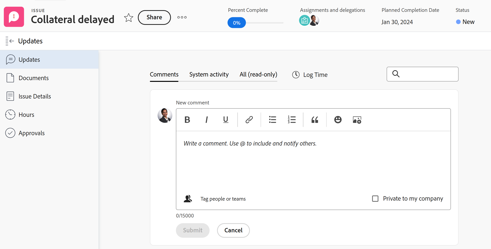
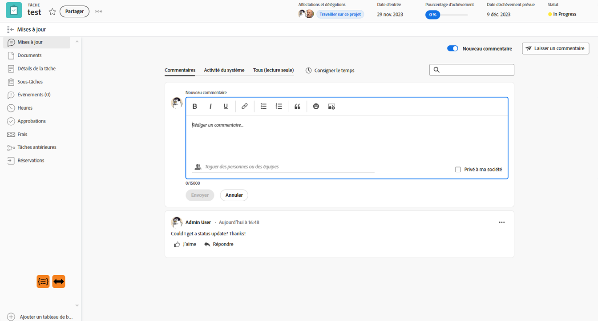

# Vue d’ensemble de la section Mises à jour

<!-- Audited: 1/2024 -->

<!--
The highlighted information on this page refers to functionality not yet generally available. It is available only in the Preview environment for all customers or in Production for customers who enabled fast releases. 

For information about fast releases, see [Enable or disable fast releases for your organization](/help/quicksilver/administration-and-setup/set-up-workfront/configure-system-defaults/enable-fast-release-process.md).

For information about the current release schedule, see [Second Quarter 2024 release overview](/help/quicksilver/product-announcements/product-releases/24-q2-release-activity/24-q2-release-overview.md).
-->

La section Mises à jour d’un objet affiche les commentaires que les utilisateurs et utilisatrices font sur les mises à jour de l’objet ou du système qui effectuent le suivi des modifications apportées à l’objet.

<!--
>[!IMPORTANT]
>
>We are currently redesigning the commenting experience in Adobe Workfront.
>
>Depending on what objects you access the commenting experience for, you might see the following functionality for the Updates section:
>* The new experience
>* The legacy experience
>* The new and the legacy experience
>
>For more information about the new commenting experience and its availability, see [New commenting experience](../../product-announcements/betas/new-commenting-experience-beta/unified-commenting-experience.md). 
>
> The legacy commenting experience has been removed from projects, tasks, issues, and documents in the Preview environment. 
>
>The new commenting experience is available only for the Updates section of Workfront objects, and it is not available when you access updates from the following areas:
>
> * Home
> * Summary panel in lists
> * Summary panel in timesheets 
> * Summary panel in the Workload Balancer
>
>The new commenting experience is available in the Summary panel in lists, timesheets, and the Workload Balancer in the Preview environment and in the Production environment for customers who have opted for the fast release process.
-->

## Vue d’ensemble de la section Mises à jour

La section Mises à jour d’un objet affiche les mises à jour système et jusqu’à 200 mises à jour les plus récentes effectuées par les utilisateurs et utilisatrices au cours des 90 derniers jours.

<!--Info for April 11: Add the following right under the screen shot above:-->

Les objets suivants comportent une section Mises à jour dans laquelle vous pouvez ajouter des commentaires ou revoir les mises à jour du système :

* Projets
* Tâches
* Problèmes
* Programmes
* Portefeuilles
* Modèles
* Tâches de modèles
* Utilisateurs et utilisatrices
* Feuilles de temps
* Équipes
* Objectifs
* Itérations

Les objets suivants comportent des zones dans lesquelles vous pouvez ajouter des commentaires et passer en revue les mises à jour du système :

* Cartes sur les panoramas
* Enregistrements dans Workfront Planning

<!--info for April 11: remove all the information below, all the way down to the following section: -->

<!--
Depending on what objects you access the commenting experience for, you might find the following experience for the Updates section:

* Both the new and legacy commenting experience for the following objects: 

  * Project
  * Task (this includes Stories)
  * Issue
  * Document

    >[!TIP]
    >
    >Use the New commenting option to display the new commenting experience (when you enable it) or the legacy commenting experience (when you disable it). The new commenting experience is the default. For more information, see [New commenting experience](../../product-announcements/betas/new-commenting-experience-beta/unified-commenting-experience.md). 

* Only the new commenting experience for the objects listed below. There is no option to enable the legacy commenting experience for these objects:   

  * Goal

    >[!NOTE]
    >
    >You must have an additional license to Adobe Workfront Goals to be able to access this area of Workfront. For more information, see [Requirements to use Workfront Goals](../../workfront-goals/goal-management/access-needed-for-wf-goals.md). 

  * Card on a board
  * Team
  * Template
  * Template Task
  * Timesheet
  * Program
  * Portfolio
  * User

* Only the legacy commenting experience for the following objects:

  * Iterations

    There is no option to enable the new commenting experience for iterations. For more information, see [Manage iteration comments](/help/quicksilver/agile/use-scrum-in-an-agile-team/iterations/manage-iteration-updates.md). 
-->

<!--Info for April 11: reword the section title below to: Overview of the Updates section; and remove the preview tags-->

### Présentation des onglets des sections Mises à jour

La section Mises à jour affiche des informations dans les onglets suivants :

* **Commentaires : affiche les commentaires effectués par les utilisateurs et utilisatrices et les réponses à ces commentaires**. Utilisez l’onglet Commentaires pour ajouter de nouveaux commentaires ou répondre à des commentaires existants. Pour plus d’informations sur la mise à jour des objets, voir [Mettre à jour le travail](../updating-work-items-and-viewing-updates/update-work.md).
* **Activité du système** : affiche les mises à jour du système qui sont des messages d’information créés par Workfront pour enregistrer certains événements sur un objet. Par exemple, les modifications du statut, du nom ou des champs personnalisés sont capturées avec des mises à jour du système. Votre administrateur ou administratrice Workfront ou de groupe peut activer les mises à jour système de vos objets. Toutes les réponses apportées aux enregistrements d&#39;activité du système dans l&#39;expérience de commentaires héritée sont renseignées dans l&#39;onglet Activité du système en lecture seule. Pour plus d’informations, consultez la section [Configurer les mises à jour du système](../../administration-and-setup/set-up-workfront/system-tracked-update-feeds/configure-system-updates.md).
* **Tous (lecture seule)** : affiche à la fois les commentaires d’un utilisateur ou d’une utilisatrice et les commentaires d’activité du système. Il s’agit d’un onglet en lecture seule. Vous ne pouvez pas répondre aux commentaires ni taguer d’autres utilisateurs ou utilisatrices dans les commentaires existants dans l’onglet Tous. Pour répondre à un commentaire spécifique, utilisez le lien dans l’onglet Tous vers l’onglet Commentaires. Pour plus d’informations sur la mise à jour des objets, voir [Mettre à jour le travail](../updating-work-items-and-viewing-updates/update-work.md).

  >[!NOTE]
  >
  >Les onglets Commentaires et Activité du système sont mis à jour en temps réel. Vous devez actualiser l’onglet Tous pour afficher les mises à jour les plus récentes.

### Similitudes et différences entre les zones Mises à jour de différents objets

Il existe des différences dans l’affichage des commentaires et des mises à jour pour différents objets.

* Les objets suivants présentent des expériences similaires dans les trois onglets de la section Mises à jour :

   * Projets
   * Tâches
   * Problèmes
   * Programmes
   * Portefeuilles
   * Utilisateurs et utilisatrices
   * Feuilles de temps

* Les objets suivants n’ont pas d’onglet Activité du système ou Tous et l’expérience dans l’onglet Commentaires correspond à celle de tous les autres objets :

   * Equipe
   * Modèle
   * Tâche de modèle

* Les objets suivants n’ont pas d’onglet Activité du système ni d’onglet Tout et l’expérience dans l’onglet Commentaires diffère de celle de tous les autres objets :

   * Itérations
   * Cartes ad hoc dans la zone Tableaux

     Pour plus d’informations sur les mises à jour des cartes, voir [Ajouter une carte ad hoc à un panorama](/help/quicksilver/agile/get-started-with-boards/add-card-to-board.md).

* Les objets suivants ont un onglet Activité du système et ils n’ont pas d’onglet Tous :

   * Cartes connectées dans la zone Tableaux

     Pour plus d’informations, voir [Utilisation de cartes connectées sur les panoramas](/help/quicksilver/agile/get-started-with-boards/connected-cards.md).

* Les objets suivants comportent un onglet Historique qui remplace l’onglet Activité du système :

   * Enregistrements dans Workfront Planning

     Pour plus d’informations, voir [Présentation de la section Historique](/help/quicksilver/planning/records/history-section-overview.md).

* Les objets suivants n’ont pas d’onglet Tous et l’expérience de l’onglet Commentaires correspond à celle de la plupart des objets :

   * Objectifs

     Pour plus d’informations sur les mises à jour des objectifs, voir [Gérer des commentaires d’objectif](/help/quicksilver/workfront-goals/goal-management/manage-goal-comments.md).

<!-- info for April 11: hide the entire section below: -->

<!--
### Overview of the legacy Updates section 

The legacy Updates section shows the following information:

* **User updates**: Comments made by users and replies to those comments. 
* **System updates**: Informational messages that Workfront creates to record certain events on an objects. For example, you can capture changes in status, name, or custom fields with system updates. Your Workfront or group administrator can enable system updates for your objects. For more information, see [Configure system updates](../../administration-and-setup/set-up-workfront/system-tracked-update-feeds/configure-system-updates.md).

The following objects don't record system updates:

* Team
* Template
* Template Task
* Iterations
-->

## Mises à jour apparaissant également sur les objets de niveau supérieur

Les commentaires, les réponses ou les mises à jour système de certains objets apparaissent également dans la section Mises à jour d’objets de niveau supérieur.

Par exemple, lorsque vous ajoutez une mise à jour à une tâche, la mise à jour s’affiche dans la section Mises à jour de la tâche et dans la section Mises à jour du projet contenant la tâche.

Le tableau suivant présente les objets dont les commentaires s’affichent également sur les objets de rang supérieur :

<table style="table-layout:auto"> 
 <col> 
 <col> 
 <thead> 
  <tr> 
   <th><strong>Objet où la mise à jour d’origine a été ajoutée</strong> </th> 
   <th> 
<strong>Objet de niveau supérieur où la mise à jour d’origine apparaît également</strong> 
 </th> 
  </tr> 
 </thead> 
 <tbody> 
  <tr> 
   <td>Problème</td> 
   <td>Projet</td> 
  </tr> 
  <tr> 
   <td>Tâche</td> 
   <td>Projet</td> 
  </tr> 
  <tr> 
   <td>Projet</td> 
   <td>Programme, Portfolio</td> 
  </tr> 
  <tr data-mc-conditions=""> 
   <td>Document </td> 
   <td>Objet où le document est joint, Projet </td> 
  </tr> 
 </tr> 
  <tr data-mc-conditions=""> 
   <td>Épreuve </td> 
   <td>Document </td> 
  </tr>

<tr> 
   <td>Programme</td> 
   <td>Portfolio</td> 
  </tr> 
  <tr> 
   <td>l’utilisateur ou de l’utilisatrice</td> 
   <td>Equipe</td> 
  </tr> 
  <tr> 
   <td>Feuille de temps</td> 
   <td>
Utilisateur, Équipe

   
<b>NOTE</b>

   
Les commentaires de la feuille de temps s’affichent dans la section Mises à jour de l’utilisateur ou de l’utilisatrice qui a rédigé le commentaire, ainsi que dans la section Mises à jour de son équipe interne.

   </td> 
  </tr> 
  <tr> 
   <td>Tâche de modèle</td> 
   <td>Modèle</td> 
  </tr> 
  <tr> 
   <td>Histoire</td> 
   <td>Itération, Équipe</td> 
  </tr> 
  <tr> 
   <td>Itération</td> 
   <td>Equipe</td> 
  </tr>

<tr> 
   <td>Résultat</td> 
   <td>Objectif</td> 
  </tr> 
  <tr> 
   <td>Activité</td> 
   <td>Objectif</td> 
  </tr> 
 </tbody> 
</table>

<!--info for April 11: hide the note below-->

<!--
>[!NOTE]
>
>Replies added to system updates do not roll up to the parent object. Only direct replies on a child object and replies added to existing updates roll up to parent objects.
>
>For information about the object hierarchy in Adobe Workfront, see [Understand objects in Adobe Workfront](../../workfront-basics/navigate-workfront/workfront-navigation/understand-objects.md).
>
> It is not possible to reply to system updates in the new commenting experience. For more information, see [New commenting experience](../../product-announcements/betas/new-commenting-experience-beta/unified-commenting-experience.md).
-->

## Limites de la section Mises à jour

Il existe certaines limites dans la section Mises à jour d’une équipe et lors de la saisie de mises à jour pour le compte d’autres utilisateurs ou utilisatrices.

### Considérations relatives aux utilisateurs et aux équipes

Tenez compte des points suivants lors de l’affichage des mises à jour pour les utilisateurs et utilisatrices et les équipes :

* Vous ne pouvez pas ajouter de nouveaux commentaires dans la section Mises à jour d’une équipe.

* Vous pouvez ajouter une réponse à une mise à jour que vous avez consultée dans une équipe. La réponse s’affiche dans la section Mises à jour de l’équipe ainsi que dans la section Mises à jour de l’objet auquel elle appartient.

* Dans la section Mises à jour pour les utilisateurs et utilisatrices et les équipes, vous pouvez afficher les mises à jour qui ont été saisies au cours des 90 derniers jours.

  Si vous souhaitez afficher toutes les mises à jour effectuées sur un utilisateur ou une utilisatrice ou une équipe, au-delà de la limite de 90 jours, vous pouvez créer un rapport pour les notes. Le rapport ne doit pas comporter de filtre d’heure qui affiche toutes les mises à jour effectuées pour les utilisateurs ou utilisatrices ou les équipes. Pour plus d’informations, consultez la section [Créer un rapport personnalisé](../../reports-and-dashboards/reports/creating-and-managing-reports/create-custom-report.md).

* La section Mises à jour pour les équipes est renseignée par des commentaires ajoutés aux objets suivants :

   * Utilisateurs et utilisatrices
   * Histoires
   * Feuilles de temps
   * Itérations

* L’onglet Mises à jour système de la zone Mises à jour pour les utilisateurs est renseigné par les mises à jour d’autres objets. Voici des mises à jour qui s’affichent dans l’onglet Mises à jour système du profil de l’utilisateur, lorsque ces champs sont suivis dans la zone Flux de mises à jour de la configuration :

   * Ajout, suppression et autres mises à jour de documents
   * Ajout, suppression, ajout au nom de et autres mises à jour de saisie d&#39;heures
   * Mises à jour des champs personnalisés
   * Mises à jour du profil utilisateur (mises à jour de l’avatar de l’utilisateur, du numéro de mobile, du champ « Me parler » et du titre)
   * Ajout utilisateur, suppression, modification du niveau d&#39;accès, modifications des champs utilisateur intégrés
   * Informations financières des tâches et projets.

### Limites lors de la saisie de commentaires au nom d’un autre utilisateur ou d’une autre utilisatrice

Les administrateurs et administratrices d’Adobe Workfront et les administrateurs et administratrices de groupe peuvent se connecter en tant qu’autres utilisateurs et utilisatrices et effectuer des actions dans Workfront, telles que saisir des commentaires.

Pour plus d’informations, consultez la section [Se connecter en tant qu’un autre utilisateur ou qu’une autre utilisatrice](../../administration-and-setup/add-users/create-and-manage-users/log-in-as-another-user.md).

Tenez compte des points suivants lorsque vous vous connectez en tant qu’un autre utilisateur ou qu’une autre utilisatrice et ajoutez des commentaires :

* Tout commentaire fait au nom d’un autre utilisateur ou d’une autre utilisatrice est indiqué sur le commentaire.

* Un administrateur ou une administratrice de groupe peut commenter au nom d’une autre personne, mais ne peut pas supprimer ce commentaire. Seul un administrateur ou une administratrice Adobe Workfront peut supprimer un commentaire fait au nom d’un autre utilisateur ou d’une autre utilisatrice.

* Un administrateur ou une administratrice Workfront ou de groupe ne peut modifier un commentaire ajouté au nom d’un autre utilisateur ou d’une autre utilisatrice qu‘en se déconnectant en tant qu’utilisateur ou utilisatrice et en se reconnectant lui-même ou elle-même. Cette personne ne peut pas supprimer un commentaire au nom d’un autre utilisateur ou d’une autre utilisatrice.

## Afficher les mises à jour du système sur les éléments de travail avec le rapport Entrée du journal

Le rapport Entrée du journal répertorie les mises à jour système de la zone Mises à jour des projets, tâches et problèmes.

Le rapport vous permet d’obtenir les informations suivantes :

* Combien de changements de statut ont eu lieu.
* Quand la suppression d’une tâche ou d’un problème est survenue.
* Modification des valeurs de champs personnalisés importants au cours d’un projet
* Dates importantes ayant changé au cours d’un projet
* Si la priorité a changé au cours d’un projet
* Si la personne propriétaire d’un projet a changé.

Pour plus d&#39;informations, voir [Rapport sur la zone Mises à jour avec un rapport Entrée de journal](../../reports-and-dashboards/reports/creating-and-managing-reports/create-journal-entry-report.md).
