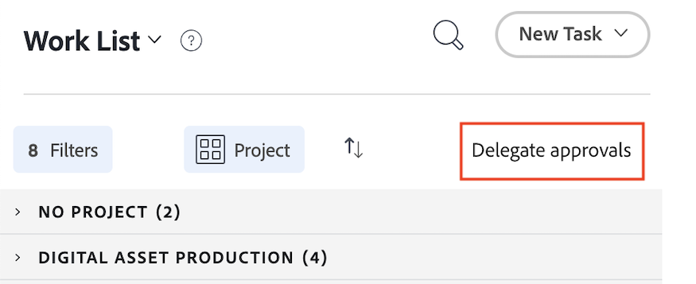

# Passer de la page d’accueil héritée à la nouvelle page d’accueil

La page d’accueil héritée sera supprimée de Workfront le 17 octobre avec la version du 4e trimestre. Cet article fournit des informations sur les fonctionnalités qui seront disponibles dans la nouvelle page d’accueil, ainsi que des recommandations destinées aux administrateurs de Workfront qui souhaitent déplacer les utilisateurs vers la nouvelle expérience Page d’accueil .

Pour plus d’informations sur l’obsolescence de la maison héritée, consultez le [Guide d’obsolescence de la maison héritée].

## Comprendre ce qui change d’une page d’accueil héritée en nouvelle page d’accueil

### Liste de travail

#### Organisation du travail à l’aide du widget Mon travail

Le widget Mon travail a été créé sous forme de widget pour refléter la liste de travail de l’accueil hérité aussi fidèlement que possible. Les utilisateurs peuvent regrouper et filtrer leur liste de travail dans le widget Mes tâches avec des filtres et des regroupements similaires :

| **Filtre** | **Regroupement** |
|------------|-----------|
| - En cours de   - Prêt à démarrer   - Pas prêt   -   demandé -   délégué - Terminé | -   du projet - Statut   - Échéance   - Rien |

**Les regroupements principaux hérités ne sont pas disponibles dans la nouvelle page d’accueil**

* Date d’achèvement prévue - Renommé « Échéance » dans la nouvelle page d’accueil
* Début prévu
* Date d’engagement
* Ma priorité

| **Page de départ héritée** | **Nouvel accueil** |
|------------|-----------|
|  |  |

#### Déléguer le travail

Les utilisateurs peuvent toujours déléguer du travail depuis la Nouvelle page d’accueil dans les widgets suivants :

* Mon travail
* Mes tâches
* Mes problèmes
* Mes approbations

Les utilisateurs peuvent accéder au travail qui leur a été délégué dans les widgets suivants :

* Widget Mon travail à l’aide du filtre Qui m’a été délégué
* Mes approbations à l&#39;aide du filtre Approbations déléguées

| **Page de départ héritée** | **Nouvel accueil** |
|------------|-----------|
|  |  |

#### Utiliser la vue Calendrier

La vue Calendrier n’est plus disponible dans la nouvelle page d’accueil. Toutefois, un remplacement de calendrier figure sur la feuille de route pour les priorités.

#### Créer une tâche personnelle

Les utilisateurs ne peuvent plus créer de tâche personnelle de la même manière que dans l&#39;Accueil hérité. Ils peuvent créer des tâches.

#### Afficher les approbations que j&#39;ai envoyées

Les utilisateurs peuvent afficher les approbations qu’ils ont envoyées dans la nouvelle page d’accueil dans le widget Mes approbations à l’aide du filtre Approbations que j’ai envoyées .

#### Ajouter des éléments à Ma priorité

Les utilisateurs n’ont plus accès à la fonctionnalité Ma priorité de la nouvelle page d’accueil. Nous introduisons une nouvelle colonne Mon objectif avec des priorités qui remplaceront cela.

Les utilisateurs peuvent utiliser le widget Panoramas pour effectuer le suivi des éléments à priorité élevée, si nécessaire.

### Mettre à jour les éléments de travail

Dans la page d’accueil héritée, les utilisateurs pouvaient utiliser le panneau de droite pour mettre à jour leur travail. Dans la nouvelle page d’accueil, les utilisateurs utilisent désormais le panneau Résumé pour mettre à jour le travail. Il s’agit du même panneau Résumé disponible dans Projets, Tâches, Événements et Documents.

#### Utilisation du panneau Résumé

Dans le résumé, les utilisateurs peuvent :

* Mettre à jour le pourcentage terminé
* Ajouter une mise à jour
* Accédez à la zone Documents pour charger un document
* Affichage des détails des éléments de travail et mise à jour des champs personnalisés
L’administration de Workfront peut personnaliser les champs qui apparaissent dans le résumé du modèle de mise en page. Pour plus d’informations, voir [Personnaliser l’accueil et le résumé à l’aide d’un modèle de disposition](/help/quicksilver/administration-and-setup/customize-workfront/use-layout-templates/customize-home-summary-layout-template.md).
* Modifier le statut de l’élément de travail
* Afficher les sous-tâches
* Enregistrer des heures
* Afficher les processus d&#39;approbation joints
* Télécharger des fichiers - Cette fonctionnalité est nouvelle

| **Page de départ héritée** | **Nouvel accueil** |
|------------|-----------|
|  |  |

#### Ouvrir le panneau de résumé

Les utilisateurs peuvent ouvrir le panneau Résumé en pointant sur l’élément de travail, puis en cliquant sur l’icône **Résumé** .

Pour plus d’informations sur l’utilisation du panneau Résumé, voir [Aperçu du résumé](/help/quicksilver/workfront-basics/the-new-workfront-experience/summary-overview.md).

#### Utilisation d’actions rapides

Outre le panneau Résumé , les utilisateurs peuvent également utiliser des actions rapides pour :

* Enregistrer des heures
* Ajouter une mise à jour
* Mise à jour d’un formulaire personnalisé
* Charger un fichier

Pour localiser le menu d’actions rapides, passez la souris sur l’élément de travail. La liste des actions rapides s’affiche à côté du bouton **Travailler sur ce projet** ou **Terminé**.

### Afficher les validations et les demandes d&#39;équipe

Les utilisateurs peuvent toujours gérer les validations et les demandes d’équipe dans la nouvelle page d’accueil à l’aide des widgets suivants :

* Mon approbation
* Toutes les approbations
* Demandes de l’équipe

Pour plus d’informations sur l’ajout de widgets à votre nouvelle page d’accueil, voir [Ajouter, modifier ou supprimer des widgets dans la nouvelle page d’accueil].

## Découvrez les widgets disponibles

Les widgets sont la base de la nouvelle page d’accueil. En ajoutant des widgets à la page d’accueil, les utilisateurs et utilisatrices peuvent choisir le type d’informations qui s’affiche pour répondre au mieux à leurs besoins professionnels. Certains widgets ne sont disponibles que pour des types de licences spécifiques, car les objets qu’ils suivent ne sont disponibles que pour ces licences.

Les administrateurs et administratrices de Workfront peuvent personnaliser les widgets disponibles dans la nouvelle page d’accueil à l’aide d’un modèle de disposition. Pour plus d’informations, consultez la section [Personnaliser la nouvelle page d’accueil à l’aide d’un modèle de mise en page](/help/quicksilver/administration-and-setup/customize-workfront/use-layout-templates/customize-new-home-layout-template.md).

+++ Développez pour afficher une liste détaillée des widgets disponibles
Vous trouverez ci-dessous les 11 widgets actuellement disponibles, ainsi qu’un résumé des informations qu’ils affichent :

* **Mes tâches**\
   Affiche toutes les tâches, événements et demandes qui vous ont été affectés au même endroit. Vous pouvez cliquer sur le bouton Travailler sur ce projet pour commencer à travailler sur un élément ou sur le bouton Terminé pour le marquer comme terminé. Vous pouvez également mettre à jour des informations (statut, condition, pourcentage terminé) sur les tâches et les problèmes, consigner des heures et ajouter des mises à jour à partir du widget Mon travail.

* **Panoramas**\
    Affiche les tableaux que vous avez créés ou que vous avez été invité à utiliser. Vous pouvez également créer un nouveau panorama basé sur les modèles suivants : panorama de base, panorama Kanban, panorama rétrospectif, panorama dynamique.

* **Mes projets**\
    Affiche _projets que vous possédez_ ou _projets auxquels vous participez_ dans une liste. Vous pouvez utiliser les filtres, les vues ou les regroupements existants pour personnaliser la liste, ou vous pouvez créer un projet directement à partir du widget.

* **Mes tâches**\
    Affiche les tâches qui vous sont affectées dans une liste. Vous pouvez utiliser les filtres, les vues ou les regroupements existants pour personnaliser la liste, ou vous pouvez créer une tâche directement à partir du widget. Vous pouvez également déléguer vos tâches lorsque vous n’êtes pas au bureau.

* **Mes problèmes**\
    Affiche les problèmes qui vous sont attribués dans une liste. Vous pouvez utiliser des filtres, des vues ou des regroupements existants pour personnaliser la liste, ou créer un problème directement à partir du widget. Ce widget inclut uniquement les événements dont les projets associés sont définis sur En cours et n&#39;inclut pas les projets terminés. Vous pouvez également déléguer vos problèmes lorsque vous n’êtes pas au bureau.

* **Mes demandes**\
    Affiche toutes les demandes que vous avez envoyées, un filtre pour afficher uniquement les demandes ouvertes et un bouton qui ouvre le panneau de résumé d’une demande.

  Dans l’environnement Aperçu , ce widget affiche toutes les requêtes que vous avez envoyées, un filtre pour afficher uniquement les requêtes qui répondent aux critères que vous spécifiez et un bouton qui vous permet de réorganiser les colonnes du widget.

* **Demandes de l’équipe**\
    Affiche toutes les demandes en attente classées par équipe pour les équipes dont vous faites partie, ainsi que des boutons permettant d’attribuer directement une demande à un utilisateur ou à une utilisatrice ou d’y travailler soi-même.

* **Mon approbation**\
    Affiche toutes les approbations affectées ou déléguées en attente, un bouton pour déléguer des approbations et des boutons pour prendre des décisions d’approbation directement dans le widget.

* **Toutes les approbations**\
        Affiche 2 graphiques avec des informations sur le temps d’approbation moyen et les décisions, ainsi que des vues de liste des approbations en attente et en retard. Cette fonctionnalité fait partie d’une version progressive et n’est actuellement disponible que pour certains clientes et clients.

* **Mentions**\
    Affiche les threads de commentaires récents de Workfront, comme la page Mes mises à jour . Vous pouvez utiliser le bouton de réponse pour rédiger une réponse dans le widget. Ce widget affiche également les commentaires sur les tâches et les problèmes qui vous sont affectés, que vous avez affectés à un autre utilisateur ou une autre utilisatrice, qui vous appartiennent, dont vous êtes le contact principal ou que vous avez créés, à condition que l’élément ait été mis à jour au cours des 30 derniers jours.

* **À faire**\
    Ce widget unique vous permet d’ajouter des éléments à une liste de contrôle personnelle que vous pouvez modifier librement. Les tâches À faire sont suivies en tant que tâches dans votre projet personnel et restent jusqu’à deux semaines après leur achèvement.

  >[!NOTE]
  >
  >Vous devez disposer des autorisations nécessaires pour créer des tâches afin de créer des tâches dans le widget À faire. Seules les tâches personnelles saisies par l’utilisateur ou utilisatrice actuel apparaîtront dans le widget.

+++

### Widgets d’affichage disponibles pour chaque type de licence

Par défaut, la page d’accueil contient quelques widgets spécifiques en fonction de votre type de licence. Les tableaux ci-dessous indiquent les widgets que les utilisateurs et utilisatrices de chaque type de licence voient lorsqu’ils naviguent pour la première fois dans la nouvelle page d’accueil.

<table border="1" class="inlineTable">
    <tr>
        <td><b>Nouveau type de licence</b></td>
        <td><b>Widgets par défaut</b></td>
    </tr>
    <tr>
        <td>Standard</td>
        <td>Mes projets, Mon travail, Mentions, À faire</td>
    </tr>
    <tr>
        <td>Léger</td>
        <td>Mon travail, mon approbation</td>
    </tr>
    <tr>
        <td>Contributeur</td>
        <td>Mes demandes, Mentions, Mon approbation, Tableaux</td>
    </tr>
    <tr>
        <td>Externe</td>
        <td>Mon approbation</td>
    </tr>
</table>

<table border="1" class="inlineTable">
    <tr>
        <td><b>Type de licence actuel</b></td>
        <td><b>Widgets par défaut</b></td>
    </tr>
    <tr>
        <td>Plan</td>
        <td>Mes projets, Mentions, À faire</td>
    </tr>
    <tr>
        <td>Travail</td>
        <td>Mon travail, Mentions, À faire</td>
    </tr>
    <tr>
        <td>Vérifier</td>
        <td>Mon travail, Mentions</td>
    </tr>
    <tr>
        <td>Demande</td>
        <td>Mes projets, mon approbation</td>
    </tr>
    <tr>
        <td>Contribuer</td>
        <td>Mon travail, Mentions</td>
    </tr>
    <tr>
        <td>Externe</td>
        <td>Mon approbation</td>
    </tr>
</table>

## Préparation à l’obsolescence

Afin de minimiser les perturbations pour vous et votre entreprise, voici quelques recommandations qui faciliteront la transition.

### Commencer la transition vers la nouvelle page d’accueil

Notre principale recommandation est de commencer à effectuer la transition vers une nouvelle page d’accueil dès que possible. Sur le plan organisationnel, cela signifie que votre administrateur personnalise les expériences des utilisateurs au moyen de modèles de mise en page (similaires à l’ancienne page d’accueil) pour s’assurer que chaque utilisateur dispose de ce dont il a besoin.

Nous recommandons aux administrateurs de :

1. Créez une nouvelle disposition de page d’accueil par défaut à l’aide de modèles de disposition (ou, éventuellement, créez-en un pour chaque utilisateur, équipe, groupe ou fonction nécessitant une disposition unique). Pour plus d’informations, consultez [Personnaliser une nouvelle page d’accueil à l’aide d’un modèle de disposition](/help/quicksilver/administration-and-setup/customize-workfront/use-layout-templates/customize-new-home-layout-template.md).

1. Attribuez vos nouveaux modèles de disposition à un petit nombre d’utilisateurs tests, qui peuvent vérifier que leurs widgets et paramètres généraux répondent à leurs besoins professionnels.

1. Réaffectez le reste de vos utilisateurs à la nouvelle disposition de la page d’accueil.

Si vous effectuez cette opération dès que possible, vos utilisateurs auront le temps de s’adapter à la nouvelle expérience et de personnaliser leurs nouvelles pages d’accueil en fonction de leurs besoins individuels. Voir [Supprimer, ajouter et réorganiser des widgets dans la nouvelle page d’accueil] pour plus d’informations sur la personnalisation des widgets sur leur propre nouvelle page d’accueil.

### Ressources pour les utilisateurs finaux

**Articles d’aide**

* [Gérer votre travail à l’aide du widget Mon travail]

**Formation**

* [Tutoriel sur la suppression, l’ajout et la réorganisation des widgets dans l’Accueil](https://experienceleague.adobe.com/en/docs/workfront-learn/tutorials-workfront/home/remove-add-and-rearrange-widgets)
* [Principes fondamentaux des programmes de travail dans Adobe Workfront](https://adobe-ats.sabacloud.com/Saba/Web_spf/PRODTNT100/app/me/learningeventdetail/cours000000000098821?regId=regdw000000001250612)

>[!IMPORTANT]
>
>Ce cours est gratuit, mais vous devez vous connecter et vous inscrire pour y accéder.
