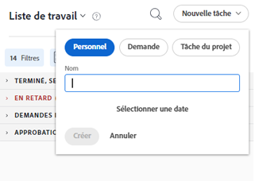

# Création d’éléments de travail à partir de la zone Accueil

<!--

(NOTE: From Courtney: Need to rename)

-->

Vous pouvez créer des éléments de travail à partir du [!UICONTROL Accueil] zone. Vous pouvez créer des tâches personnelles, demander du travail à d’autres utilisateurs ou ajouter des tâches à des projets spécifiques.

## Exigences d’accès

Vous devez disposer des accès suivants pour effectuer les étapes de cet article :

<table style="table-layout:auto"> 
 <col> 
 <col> 
 <tbody> 
  <tr> 
   <td role="rowheader"><strong>[!DNL Adobe Workfront plan*]</strong></td> 
   <td> 
Tous
 </td> 
  </tr> 
  <tr> 
   <td role="rowheader"><strong>[!DNL Adobe Workfront] license*</strong></td> 
   <td> 
[!UICONTROL Work] ou version ultérieure
 </td> 
  </tr> 
  <tr> 
   <td role="rowheader"><strong>Paramétrages du niveau d'accès*</strong></td> 
   <td> 
[!UICONTROL Worker]
 
<b>NOTE</b>
 
   
Si vous n’avez toujours pas accès à , demandez à votre [!DNL Workfront] s’ils définissent des restrictions supplémentaires au niveau de votre accès. Pour plus d’informations sur la manière dont une [!DNL Workfront] l’administrateur peut modifier votre niveau d’accès, voir <a href="../../../administration-and-setup/add-users/configure-and-grant-access/create-modify-access-levels.md" class="MCXref xref">Création ou modification de niveaux d’accès personnalisés</a>.
 </td> 
  </tr> 
  <tr> 
   <td role="rowheader"><strong>Autorisations d’objet</strong></td> 
   <td> 
Accès à [!UICONTROL Modifier] ou version ultérieure pour les tâches
 
Pour plus d’informations sur la demande d’accès supplémentaire, voir <a href="../../../workfront-basics/grant-and-request-access-to-objects/request-access.md" class="MCXref xref">Demande d’accès aux objets </a>.
 </td> 
  </tr> 
 </tbody> 
</table>

&#42;Pour connaître le plan, le type de licence ou l’accès dont vous disposez, contactez votre [!DNL Workfront] administrateur.

## Créer une tâche personnelle

Vous pouvez créer une tâche personnelle qui n’est disponible que dans la variable [!UICONTROL Accueil] area :

1. Cliquez sur le bouton **[!UICONTROL Menu Principal]**  dans le coin supérieur droit, puis cliquez sur **[!UICONTROL Accueil]**.
1. Cliquez sur **[!UICONTROL Nouvelle tâche]** > **[!UICONTROL Personal Personal]**.

   

1. Dans le **[!UICONTROL Nom]** , indiquez un nom pour la tâche.
1. (Facultatif) Cliquez sur **[!UICONTROL Sélectionner la date]**, puis sélectionnez la date d’échéance de la tâche. Cette méthode définit la variable [!UICONTROL Date d’achèvement prévue] pour la tâche.\
   Vous pouvez modifier la variable **[!UICONTROL Date d’achèvement prévue]** en cliquant sur la date dans le panneau de droite ou en modifiant le **[!UICONTROL Cette opération sera effectuée par]** date directement dans la tâche.

1. Cliquez sur **[!UICONTROL Créer]** pour enregistrer la tâche.\
   La tâche vous est assignée et est disponible dans la [!UICONTROL Accueil] zone.

>[!NOTE]
>
>* Lorsque vous créez une tâche personnelle, elle est stockée dans un projet &quot;masqué&quot; dans lequel il n’est pas possible de rechercher des données. [!UICONTROL Workfront]. Le projet est nommé &quot;&lt; User Name >&#39;s Tasks&quot;. Le &quot;Nom d’utilisateur&quot; est le nom complet de l’utilisateur qui a créé la tâche. Vous ne pouvez accéder à ce projet que lorsque vous cliquez sur la tâche personnelle dans le [!UICONTROL Accueil] , à partir du chemin de navigation de la tâche, par exemple.
>
>* Contrairement aux tâches de projet standard, les tâches personnelles disposent d’un ensemble limité de champs visibles dans l’interface de Workfront et n’influencent pas la chronologie ni la progression d’un projet. La réaffectation d’une tâche personnelle à un autre utilisateur ajoute tous les champs de tâche à une tâche personnelle, mais la tâche reste sur le projet personnel de l’utilisateur qui a créé la tâche.
>
>
>* Les tâches personnelles s’affichent sur les feuilles de temps uniquement lorsque des heures sont enregistrées ou qu’elles sont épinglées sur la feuille de temps. Vous ne pouvez épingler une tâche personnelle à une feuille de temps que lorsqu’il y a des heures enregistrées pour la tâche. Pour plus d’informations, voir [Temps de connexion](../../../timesheets/create-and-manage-timesheets/log-time.md).
> 
>* Nous vous recommandons de créer un projet et d’y déplacer toute tâche personnelle, si vous souhaitez que les tâches personnelles fassent partie du workflow normal.
>
> ![[!UICONTROL Projet pour les tâches personnelles]](assets/createworkitems-personal--project-350x105.png)

## Demande de travail auprès d’un autre utilisateur

Vous pouvez demander du travail à un autre utilisateur directement depuis la zone Accueil . Lorsque vous demandez du travail à un autre utilisateur, comme décrit dans cette section, la tâche s’affiche sous forme de requête dans la zone d’accueil de l’utilisateur jusqu’à ce que l’utilisateur clique sur **[!UICONTROL Travailler dessus]**.

Pour demander du travail à un autre utilisateur de la fonction [!UICONTROL Accueil] area :

1. Cliquez sur le bouton **[!UICONTROL Menu Principal]**  dans le coin supérieur droit, puis cliquez sur **[!UICONTROL Accueil]**.
1. Cliquez sur **[!UICONTROL Nouvelle tâche]**, puis sélectionnez **[!UICONTROL Requête]**.

   

1. Dans le **[!UICONTROL Nom]** , indiquez un nom pour la tâche.
1. Dans le **[!UICONTROL Attribuer à]** , commencez à saisir le nom de l’utilisateur, de l’équipe ou du rôle que vous souhaitez affecter, puis cliquez sur le nom lorsqu’il apparaît dans le menu déroulant.
1. Dans le [!UICONTROL Ajouter sous] , choisissez d’ajouter une tâche ou un problème.
1. Cliquez sur **[!UICONTROL Sélectionner la date]**, puis sélectionnez la date et l’heure auxquelles la tâche doit être effectuée.
1. Cliquez sur **[!UICONTROL Créer]** pour enregistrer la tâche.\
   La tâche s’affiche en tant que requête de travail dans la fonction [!UICONTROL Accueil] de l’utilisateur que vous avez désigné.

## Ajout d’une tâche ou d’un problème à un projet

Vous pouvez ajouter une tâche ou un problème à un projet existant directement depuis la zone Accueil :

1. Cliquez sur le bouton **[!UICONTROL Menu Principal]**  dans le coin supérieur droit, puis cliquez sur **Accueil**.
1. Cliquez sur **[!UICONTROL Nouvelle tâche]**, puis sélectionnez **[!UICONTROL Tâche du projet]**.

   

1. Dans le **[!UICONTROL Nom]** , indiquez un nom pour la tâche ou le problème.
1. Dans le **[!UICONTROL Attribuer à]** , commencez à saisir le nom de l’utilisateur, de l’équipe ou du rôle que vous souhaitez affecter, puis cliquez sur le nom lorsqu’il apparaît dans le menu déroulant.
1. Commencez à saisir le nom du projet dans lequel vous souhaitez créer la tâche ou le problème, puis cliquez sur le nom lorsqu’il apparaît dans le menu déroulant.

   >[!IMPORTANT]
   >
   >La tâche ou le problème apparaît sur la [!UICONTROL Liste de tâches] uniquement lorsque le projet ; [!UICONTROL État] est défini sur [!UICONTROL Actuel].

1. (Conditionnel) Pour créer un problème, sélectionnez **[!UICONTROL Problème]** de la **[!UICONTROL Ajouter sous]** menu déroulant. Par défaut, **[!UICONTROL Tâche]** est sélectionnée.

1. Cliquez sur **[!UICONTROL Sélectionner la date]**, puis sélectionnez la date et l’heure auxquelles la tâche doit être effectuée.
1. Cliquez sur **[!UICONTROL Créer]** pour enregistrer la tâche.
