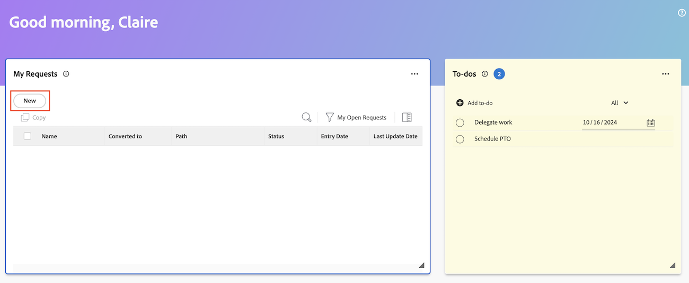

# Créer des éléments de travail et des projets à partir de la zone d’Accueil

Vous pouvez créer des éléments de travail et des projets à partir de la zone [!UICONTROL Accueil].

De chez vous, vous pouvez

* Soumettre des demandes
* Ajouter des tâches et des événements à des projets spécifiques
* Créez des projets à partir d’un modèle, d’un projet vierge ou importez un projet MS.

## Conditions d’accès

+++ Développez pour afficher les exigences d’accès aux fonctionnalités de cet article.

Vous devez disposer des accès suivants pour effectuer les étapes de cet article :

<table style="table-layout:auto"> 
 <col> 
 <col> 
 <tbody> 
  <tr> 
   <td role="rowheader"><strong>[!DNL Adobe Workfront plan*]</strong></td> 
   <td> 
Tous
 </td> 
  </tr> 
  <tr> 
   <td role="rowheader"><strong>[!DNL Adobe Workfront] licence*</strong></td> 
   <td> 
[!UICONTROL Work] ou licence supérieure
 </td> 
  </tr> 
  <tr> 
   <td role="rowheader"><strong>Configurations du niveau d’accès*</strong></td> 
   <td> 
[!UICONTROL Worker]
 
<b>NOTE</b>
 
   
Si vous ne disposez toujours pas d’un accès, demandez à votre équipe d’administration [!DNL Workfront] si elle a défini des restrictions supplémentaires pour votre niveau d’accès. Pour plus d’informations sur la manière dont un un administrateur ou une administratrice de [!DNL Workfront] peut modifier votre niveau d’accès, voir <a href="../../../administration-and-setup/add-users/configure-and-grant-access/create-modify-access-levels.md" class="MCXref xref">Créer ou modifier des niveaux d’accès personnalisés</a>.
 </td> 
  </tr> 
  <tr> 
   <td role="rowheader"><strong>Autorisations d’objet</strong></td> 
   <td> 
Accès [!UICONTROL Edit] ou supérieur aux tâches
 
Pour plus d’informations sur la demande d’accès supplémentaire, voir <a href="../../../workfront-basics/grant-and-request-access-to-objects/request-access.md" class="MCXref xref">Demander l’accès aux objets </a>.
 </td> 
  </tr> 
 </tbody> 
</table>

&#42;Pour connaître le plan, le type de licence ou l’accès dont vous disposez, contactez l’administration [!DNL Workfront].

+++

## Créer un élément de tâche personnel

Vous pouvez créer un élément de tâches personnel dans le widget Tâches de la zone [!UICONTROL Accueil]. Les tâches sont des tâches personnelles que vous créez pour vous-même.

Vous et d&#39;autres utilisateurs pouvez afficher vos tâches personnelles dans un rapport de tâches personnelles. De là, ils peuvent les ajouter aux projets, si nécessaire.

>[!TIP]
>
>Les tâches que vous envoyez à d’autres utilisateurs ou à vous-même à partir de la page du profil utilisateur s’affichent également dans le widget Tâches de la zone Accueil de l’utilisateur. Pour plus d’informations, voir [Créer des tâches personnelles](/help/quicksilver/workfront-basics/updating-work-items-and-viewing-updates/create-personal-tasks.md).

Pour créer une tâche, procédez comme suit :

1. Cliquez sur l&#39;icône **[!UICONTROL Menu principal]**  dans le coin supérieur droit, ou sur l&#39;icône **Menu principal**  dans le coin supérieur gauche, si disponible, puis cliquez sur **[!UICONTROL Accueil]**.
1. (Conditionnel) Cliquez sur **Personnaliser**, puis sur **Tâches** pour ajouter le widget Tâches à votre écran d’accueil.
1. Accédez au widget **Tâches**, puis cliquez sur **Ajouter une tâche**.
1. Saisissez le nom de votre élément de tâche personnel, puis cliquez sur Entrée.
1. (Facultatif) Cliquez sur l’icône **Date**  pour ajouter une date d’échéance à l’élément.
   
1. (Facultatif) Créez un rapport ou un filtre de tâche personnel. Pour plus d’informations sur la création d’un filtre de tâche personnel, voir [Filtre : tâche personnelle](/help/quicksilver/reports-and-dashboards/reports/custom-view-filter-grouping-samples/filter-personal-tasks.md).
Vous pouvez afficher vos tâches, ainsi que les tâches des autres utilisateurs, dans le rapport de tâches personnelles.

## Ajouter une tâche à un projet

Vous pouvez ajouter une tâche à un projet existant directement à partir de la zone d’Accueil :

1. Cliquez sur l’icône **[!UICONTROL Menu principal]**  dans le coin supérieur droit, puis cliquez sur **[!UICONTROL Accueil]**.
1. (Conditionnel) Ajoutez le widget **Mes tâches** à votre écran d’accueil. Cliquez sur **Personnaliser** et recherchez **Mes tâches**.
1. Accédez au widget **Mes tâches**, puis cliquez sur **Nouveau**.
   
1. Dans la boîte de dialogue **Nouvelle tâche**, saisissez le nom de la tâche.
1. Commencez à saisir le nom d’un projet, puis sélectionnez-le dans la liste.
1. (Facultatif) Renseignez les champs suivants :

   | champ | Instructions |
   |----------|----------|
   | **Description** | Saisissez une description. |
   | **Affectations** | Attribuez des utilisateurs. |
   | **Durée** | Saisissez la durée. |
   | **Date d’achèvement prévue** | Choisissez une date d&#39;achèvement planifiée. |
   | **Autres options** | Choisissez d’autres options pour configurer d’autres paramètres pour la tâche. Pour plus d&#39;informations sur la création de tâches, voir [Modifier les tâches](/help/quicksilver/manage-work/tasks/manage-tasks/edit-tasks.md). |

1. Cliquez sur **Créer une tâche**.

## Ajouter un événement à un projet

Vous pouvez ajouter un événement à un projet existant directement depuis la zone d’Accueil :

1. Cliquez sur l’icône **[!UICONTROL Menu principal]**  dans le coin supérieur droit, puis cliquez sur **[!UICONTROL Accueil]**.
1. (Conditionnel) Ajoutez le widget **Mes problèmes** à votre écran d’accueil. Cliquez sur **Personnaliser** et recherchez **Mes problèmes**.
1. Accédez au widget **Mes événements**, puis cliquez sur **Nouveau**.
   
1. Dans la boîte de dialogue **Nouvel événement**, commencez à saisir le nom d’un projet, puis sélectionnez-le dans la liste.
1. Saisissez un nom d’événement.
1. (Facultatif) Renseignez les champs suivants :

   | champ | Instructions |
   |----------|----------|
   | **Description** | Saisissez une description. |
   | **Affectations** | Attribuez des utilisateurs. |
   | **Priorité** | Choisissez un niveau de priorité. |
   | **Documents** | Chargez un document. |

1. Cliquez sur **Enregistrer le nouvel événement**.

## Création d’une requête

Vous pouvez créer une requête directement depuis la zone d’Accueil :

1. Cliquez sur l’icône **[!UICONTROL Menu principal]**  dans le coin supérieur droit, puis cliquez sur **[!UICONTROL Accueil]**.
1. (Conditionnel) Ajoutez le widget **Mes requêtes** à votre écran d’accueil. Cliquez sur **Personnaliser** et recherchez **Mes requêtes**.
1. Accédez au widget **Mes requêtes**, puis cliquez sur **Nouveau**.
   

1. Dans la boîte de dialogue **Nouvelle demande**, commencez à saisir le nom de la file d’attente des demandes.
1. Renseignez les champs appropriés.
1. Cliquez sur **Soumettre**.

Pour plus d’informations sur l’envoi de demandes, voir [Création et envoi de demandes](/help/quicksilver/manage-work/requests/create-requests/create-submit-requests.md).

## Créer un projet

Vous pouvez créer un projet directement depuis la zone d’Accueil :

1. Cliquez sur l’icône **[!UICONTROL Menu principal]**  dans le coin supérieur droit, puis cliquez sur **[!UICONTROL Accueil]**.
1. (Conditionnel) Ajoutez le widget **Mes projets** à votre écran d’accueil. Cliquez sur **Personnaliser** et recherchez **Mes projets**.
1. Accédez au widget **Mes projets**, puis cliquez sur **Nouveau**.
   
1. Choisissez l’une des options suivantes :

   | champ | Instructions |
   |----------|----------|
   | À partir d’un modèle | Accédez à [Créer un projet à l’aide d’un modèle](/help/quicksilver/manage-work/projects/create-projects/create-project-from-template.md) pour obtenir des instructions détaillées sur la création d’un projet à partir d’un modèle. |
   | Projet vierge | Accédez à [Créer un projet à partir de zéro](/help/quicksilver/manage-work/projects/create-projects/create-project.md#create-a-project-from-scratch) pour obtenir des instructions détaillées sur la création d’un projet vierge. |
   | Importer projet MS | Accédez à [Importer un projet à partir d’un projet Microsoft](/help/quicksilver/manage-work/projects/create-projects/import-project-from-ms-project.md) pour obtenir des instructions détaillées sur l’importation d’un projet MS. |

<!--
## Create a board

You can create a board directly from the Home area:

1. Click the **[!UICONTROL Main Menu]**  in the upper-right corner, then click **[!UICONTROL Home]**.
1. (Conditional) Add the **Boards** widget to your home screen. Click **Customize**, and find **Boards**. -->

<!--
## Delete a to-do item

1. Click the **[!UICONTROL Main Menu]**  in the upper-right corner, then click **[!UICONTROL Home]**.
1. Go to the to-do widget.
1. Hover over the item, then click the **Delete** icon . 

## Edit a to-do item

1. Click the **[!UICONTROL Main Menu]**  in the upper-right corner, then click **[!UICONTROL Home]**.
1. Go to the to-do widget.
1. Edit the item name.
1. Click on the **Date** icon  to add or adjust a due date. -->