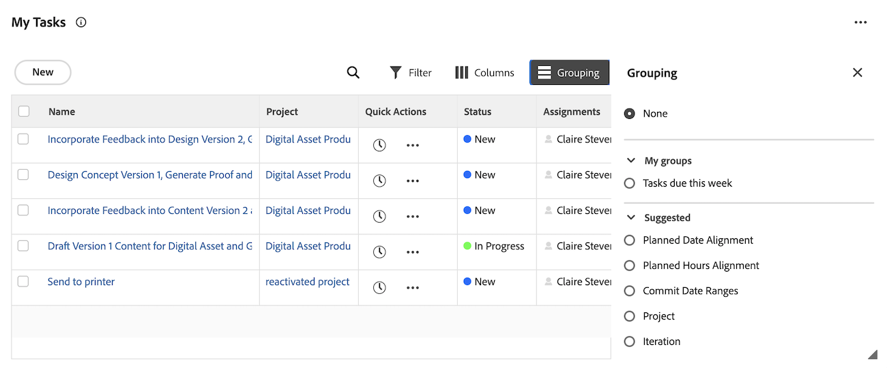

# Afficher les éléments de la [!UICONTROL liste de travail] dans la zone [!UICONTROL Accueil]

<!-- Audited: 1/2024 -->

Chaque widget contient sa propre liste de tâches. Les listes de travail affichent toutes les tâches qui vous sont affectées. Vous pouvez contrôler les éléments qui s’affichent dans votre [!UICONTROL liste de tâches] à l’aide de filtres et de regroupements.

>[!IMPORTANT]
>
>* Pour afficher les tâches et les événements dans les widgets d’Accueil, leur projet parent doit avoir le statut Actuel ou un statut équivalent au statut actuel.
>* Les projets doivent également avoir le statut Actuel ou un statut équivalent au statut actuel pour s’afficher dans l’Accueil.

## Conditions d’accès

+++ Développez pour afficher les exigences d’accès aux fonctionnalités de cet article.

Vous devez disposer des accès suivants pour effectuer les étapes de cet article :

<table style="table-layout:auto"> 
 <col> 
 </col> 
 <col> 
 </col> 
 <tbody> 
  <tr> 
   <td role="rowheader"><strong>[!DNL Adobe Workfront plan]</strong></td> 
   <td> 
Tous
 </td> 
  </tr> 
  <tr> 
   <td role="rowheader"><strong>[!DNL Adobe Workfront] licence</strong></td> 
   <td> 
Nouveau :
<ul><li>[!UICONTROL Contributor] pour les approbations uniquement</li> <li>[!UICONTROL Standard] ou de niveau supérieur pour tous les autres objets</li> 
Ou
 
  </ul>
Actuel :
<ul><li>[!UICONTROL Review] pour les approbations uniquement</li> <li>[!UICONTROL Work] ou de niveau supérieur pour tous les autres objets</li> </td> 
  </tr> </ul>
  <tr> 
   <td role="rowheader"><strong>Configurations des niveaux d’accès</strong></td> 
   <td> 
Accès en [!UICONTROL View] ou de niveau supérieur aux projets, tâches, problèmes et documents
 </td> 
  </tr> 
  <tr> 
   <td role="rowheader"><strong>Autorisations d’objet</strong></td> 
   <td> 
Autorisations Contribute ou supérieures pour les tâches et les événements sur lesquels vous devez travailler
  </td> 
  </tr> 
 </tbody> 
</table>

Pour plus de détails sur les informations contenues dans ce tableau, consultez [Conditions d’accès préalables dans la documentation Workfront](/help/quicksilver/administration-and-setup/add-users/access-levels-and-object-permissions/access-level-requirements-in-documentation.md).

+++

## Conditions requises pour que les éléments de travail s’affichent dans la liste de travail

Il existe des exigences intégrées pour lesquelles les éléments de travail s’affichent dans certaines listes de travail de widgets. Les éléments de travail doivent répondre à ces exigences pour apparaître dans les listes de travail du widget suivant.

### Widget Mes tâches

Les tâches doivent répondre aux exigences suivantes pour apparaître dans le widget Mes tâches :

* Le statut de la tâche n’est pas équivalent à Terminé.
* L&#39;utilisateur connecté doit être affecté à la tâche.
* Le statut de la tâche n’est pas égal à Terminé.
* Le projet auquel appartient la tâche doit avoir un statut équivalent à Actuel.

### Widget Mes événements

Les événements doivent répondre aux exigences suivantes pour apparaître dans le widget Mes événements :

* L&#39;utilisateur connecté doit être affecté à l&#39;événement.
* Le statut de l&#39;événement n&#39;est pas défini sur Terminé.
* Aucun objet non résolu n’est associé au problème.
* Le statut de l&#39;événement n&#39;est pas égal à Terminé.
* Le projet auquel appartient le problème doit avoir un statut équivalent à Actuel.

### Widget Mes équipes

Les demandes de l’équipe doivent répondre aux exigences suivantes pour apparaître dans le widget Mes équipes :

* L&#39;utilisateur connecté appartient à l&#39;équipe à laquelle l&#39;élément de travail est affecté.
* Le statut de l’élément de travail n’est pas équivalent à Terminé.
* Aucun processus d&#39;approbation non résolu n&#39;est associé à l&#39;élément de travail.
* L’élément de travail n’est pas une tâche périodique.
* Le projet auquel appartient l’élément de travail doit avoir un statut équivalent à Actuel.

## Filtrer votre travail

Vous pouvez filtrer les éléments dans la [!UICONTROL Liste de travail] d’un widget pour n’afficher que des types d’éléments spécifiques. Par exemple, vous pouvez filtrer la liste Mes tâches [!UICONTROL Liste de travail] pour afficher uniquement les problèmes ou les demandes.

>[!NOTE]
>
>Les options de filtre sont stockées dans le navigateur. Si vous utilisez toujours le même navigateur sur le même ordinateur (et n’effacez pas les données du site), les filtres sélectionnés ne changent pas. Si vous changez de navigateur ou d’ordinateur, les filtres reviennent à l’option par défaut, qui consiste à désélectionner tous les filtres.

Pour filtrer votre travail :

1. Cliquez sur le **[!UICONTROL menu principal]**  dans le coin supérieur droit, puis cliquez sur **[!UICONTROL Accueil]**.
1. (Conditionnel) Cliquez sur **Personnaliser** pour ajouter l’un des widgets suivants :

   | Widget | Description |
   |--------------|---------------------------------------------------------------------------------------------------|
   | Panneaux | Affiche les tableaux que vous avez créés ou que vous avez été invité à utiliser |
   | Mon travail | Affiche les tâches et les événements qui vous sont affectés |
   | Mes projets | Affiche les projets que vous possédez ou les projets auxquels vous participez |
   | Mes tâches | Affiche les tâches qui vous sont assignées |
   | Mes problèmes | Affiche les événements qui vous sont affectés |
   | Mes demandes | Affiche toutes les demandes que vous avez envoyées |
   | Mes approbations | Affiche toutes les approbations en attente, affectées, déléguées et envoyées |

1. Cliquez sur l’icône **Filtre**  dans le coin supérieur droit de la liste de travail du widget.
1. Choisissez un filtre **Suggested** ou un filtre que vous avez créé.
Pour plus d’informations sur les filtres suggérés, voir [Présentation des filtres du widget d’accueil](/help/quicksilver/workfront-basics/using-home/using-the-home-area/widget-filter-overview-home.md).
1. (Facultatif) Activez le bouton (bascule) **Empiler des filtres** pour sélectionner plusieurs options de filtre.

   

## Regrouper votre travail

Vous pouvez regrouper le widget [!UICONTROL liste de travail] pour organiser vos tâches.

Pour regrouper votre liste de travail :

1. Cliquez sur le **[!UICONTROL menu principal]**  dans le coin supérieur droit, puis cliquez sur **[!UICONTROL Accueil]**.
1. (Conditionnel) Cliquez sur **Personnaliser** pour ajouter l’un des widgets suivants :

   | Widget | Description |
   |--------------|---------------------------------------------------------------------------------------------------|
   | Panneaux | Affiche les tableaux que vous avez créés ou que vous avez été invité à utiliser |
   | Mon travail | Affiche les tâches et les événements qui vous sont affectés |
   | Mes projets | Affiche les projets que vous possédez ou les projets auxquels vous participez |
   | Mes tâches | Affiche les tâches qui vous sont assignées |
   | Mes problèmes | Affiche les événements qui vous sont affectés |
   | Mes demandes | Affiche toutes les demandes que vous avez envoyées |
   | Mes approbations | Affiche toutes les approbations en attente, affectées, déléguées et envoyées |

1. Cliquez sur l’icône **Groupe**  dans le coin supérieur droit de la liste de travail du widget.
1. Choisissez un regroupement **Suggestions** ou un regroupement que vous avez créé.
   

## Personnaliser les colonnes de la liste de travail

Vous pouvez choisir les colonnes qui apparaîtront dans la liste de travail du widget :

1. Cliquez sur le **[!UICONTROL menu principal]**  dans le coin supérieur droit, puis cliquez sur **[!UICONTROL Accueil]**.
1. (Conditionnel) Cliquez sur **Personnaliser** pour ajouter l’un des widgets suivants :

   | Widget | Description |
   |--------------|---------------------------------------------------------------------------------------------------|
   | Panneaux | Affiche les tableaux que vous avez créés ou que vous avez été invité à utiliser |
   | Mon travail | Affiche les tâches et les événements qui vous sont affectés |
   | Mes projets | Affiche les projets que vous possédez ou les projets auxquels vous participez |
   | Mes tâches | Affiche les tâches qui vous sont assignées |
   | Mes problèmes | Affiche les événements qui vous sont affectés |
   | Mes demandes | Affiche toutes les demandes que vous avez envoyées |
   | Mes approbations | Affiche toutes les approbations en attente, affectées, déléguées et envoyées |

1. Cliquez sur l’icône **Colonne**  dans le coin supérieur droit de la liste de travail du widget.
1. Activez ou désactivez les colonnes en fonction de vos préférences.
1. (Facultatif) Cliquez sur l’ de l’icône **Faire glisser** pour réorganiser les colonnes.
   

## Afficher les éléments en retard

[!DNL Adobe Workfront] utilise les dates suivantes pour déterminer si les demandes de travail sont en retard :

* **Tâches** : [!UICONTROL date d’achèvement prévue]
* **Problèmes** : [!UICONTROL date d’achèvement prévue]
* **Documents** : [!UICONTROL date d’envoi]
* **Feuilles de temps** : [!UICONTROL date d’envoi]
* **Approbations** : [!UICONTROL date d’envoi]
* **Approbations des épreuves** : [!UICONTROL date d’échéance pour la relecture]

