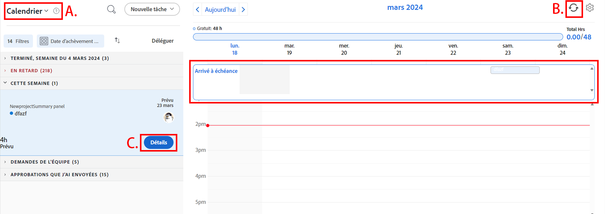
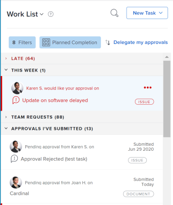
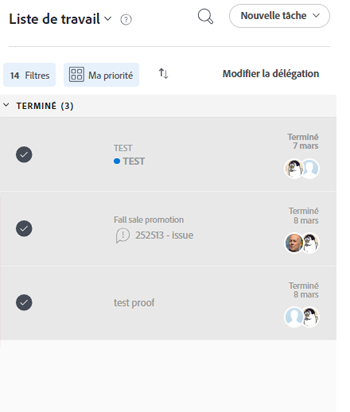
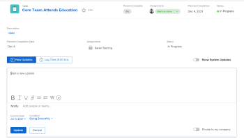

# Prise en main de [!UICONTROL Home]

<!--Audited: 12/2023-->

Cet article décrit un aperçu de la zone [!UICONTROL Home] actuelle dans [!DNL Adobe Workfront]. Pour plus d&#39;informations sur l&#39;utilisation de la nouvelle [!UICONTROL page d&#39;accueil], voir [Prise en main de la nouvelle page d&#39;accueil](../new-home/get-started-with-new-home.md).

Il existe deux façons d&#39;afficher votre travail dans la zone [!UICONTROL Home] actuelle :

* À partir de la [!UICONTROL liste de travail]
* Dans le [!UICONTROL calendrier].

## [!UICONTROL Liste de travail]

Vous pouvez afficher toutes les tâches qui vous sont assignées à un seul emplacement, dans la [!UICONTROL liste de tâches] :

![[!UICONTROL Liste de travail] panneaux](assets/worklist-and-right-panel-home.png)

Passez en revue les sections suivantes de la zone [!UICONTROL Accueil] actuelle, comme indiqué dans l’image ci-dessus :

* **A** : utilisez le panneau de gauche pour filtrer, trier et sélectionner la tâche qui vous est assignée.

* **B** : après avoir sélectionné un élément de travail dans le panneau de gauche, utilisez le panneau de droite pour interagir avec des champs personnalisés, effectuer des mises à jour et consigner le temps.

Pour plus d’informations sur l’utilisation de la [!UICONTROL liste de travail à domicile], consultez les articles suivants :

* [Afficher les éléments dans la [!UICONTROL liste de travail] de la zone [!UICONTROL Accueil]](../../../workfront-basics/using-home/using-the-home-area/display-items-in-home-work-list.md)
* [Créez des tâches à partir de la zone [!UICONTROL Accueil]](../../../workfront-basics/using-home/using-the-home-area/create-work-items-in-home.md)

## [!UICONTROL Calendrier]

Vous pouvez visualiser votre travail en affichant le moment où les tâches sont à venir et vous pouvez bloquer le temps nécessaire pour les terminer, en consultant votre travail dans le [!UICONTROL calendrier] de la zone [!UICONTROL Accueil] :

Passez en revue les sections suivantes de la zone [!UICONTROL Accueil] actuelle, comme indiqué dans l’image ci-dessus :

* **A** : utilisez la vue [!UICONTROL Calendrier] pour créer une carte visuelle du travail que vous devez effectuer. Il vous suffit de cliquer et de faire glisser des éléments de travail de la [!UICONTROL liste de travail] vers le [!UICONTROL calendrier] pour bloquer le temps de travail.

* **B** : utilisez l’option de synchronisation du [!UICONTROL calendrier] pour vous synchroniser avec votre calendrier [!DNL Outlook]. Gérez vos réunions et travaillez au même endroit.

* **C** : utilisez le bouton [!UICONTROL Détails] pour ouvrir un nouveau panneau de droite où vous pouvez afficher plus d’informations sur l’élément de travail.

* **D** : utilisez la barre d’échéance pour effectuer le suivi du moment où le travail qui vous est assigné doit être effectué.

Pour plus d’informations sur l’utilisation du calendrier d’accueil, voir [Utilisation de la vue [!UICONTROL Calendrier d’accueil]](../../../workfront-basics/using-home/using-the-home-area/use-home-calendar-view.md).

## Trouver votre travail

La zone [!UICONTROL Accueil] est votre guichet unique pour trouver les tâches, les problèmes et les approbations qui vous ont été attribués. Les options de filtrage, de regroupement et de tri fonctionnent ensemble pour vous aider à organiser vos tâches comme vous le souhaitez. Vous pouvez utiliser des regroupements pour regrouper des éléments, des filtres pour vous concentrer sur le travail qui doit être terminé et enfin, un tri pour répertorier les éléments dans l’ordre croissant ou décroissant de votre regroupement.

>[!NOTE]
>
>Les options de filtrage et de tri sont stockées dans le navigateur. Si vous utilisez systématiquement le même navigateur sur le même ordinateur (et que vous n’effacez pas les données du site), les filtres et le tri ne changeront pas, mais si vous changez de navigateur ou d’ordinateur, les filtres et le tri seront différents.

### Regrouper des tâches similaires avec des regroupements

Vous pouvez utiliser des regroupements pour afficher comme des éléments sous un en-tête commun dans la liste de travail. Vous pouvez regrouper des éléments en procédant comme suit :

* [!UICONTROL Achèvement planifié]
* [!UICONTROL Début planifié]
* [!UICONTROL Date de validation]
* [!UICONTROL Projet]
* [!UICONTROL Ma priorité]

Pour plus d’informations sur l’utilisation des regroupements, voir [Affichage des éléments dans la [!UICONTROL liste de travail] dans la [!UICONTROL zone d’accueil]](../../../workfront-basics/using-home/using-the-home-area/display-items-in-home-work-list.md).

### Restreindre la cible d’action avec des filtres

Le filtre [!UICONTROL Liste de travail] vous permet de vous concentrer uniquement sur des tâches spécifiques.

Vous trouverez ci-dessous des exemples de filtrage des éléments que vous affichez dans la page d’accueil :

* Filtrez par type d’élément et état.

  Par exemple, si vous souhaitez afficher toutes les tâches, vous pouvez sélectionner le filtre [!UICONTROL Tâches] . Si vous souhaitez être plus précis et afficher uniquement les tâches sur lesquelles vous êtes prêt à commencer à travailler, sélectionnez les filtres [!UICONTROL Prêt à démarrer] sous le filtre [!UICONTROL Tâches] .

* Filtrage par type d’élément uniquement.

  Par exemple, vous pouvez sélectionner [!UICONTROL Problèmes] pour afficher tous les problèmes dans tous les états ([!UICONTROL Travail sur] ou [!UICONTROL Demandé]) ou [!UICONTROL Approbations] pour afficher tous les éléments de travail, les demandes d’accès, la feuille de temps, le document et les approbations de BAT.

Pour plus d’informations sur l’utilisation des filtres, voir [Afficher les éléments dans la [!UICONTROL liste de travail] dans la [!UICONTROL zone d’accueil]](../../../workfront-basics/using-home/using-the-home-area/display-items-in-home-work-list.md).

### Accéder au travail assigné à votre équipe

La zone [!UICONTROL Accueil] possède un groupe permanent ([!UICONTROL Demandes d’équipe]) qui affiche les tâches et les problèmes affectés à vos équipes. Les équipes s’affichent dans cette section. Cliquez sur le nom d’une équipe pour ouvrir la page Demandes d’équipe de cette équipe.

>[!NOTE]
>
>Les options de filtrage et de tri n’affectent pas le regroupement [!UICONTROL Requêtes d’équipe]. Ce regroupement est visible tant que du travail est assigné à votre équipe.

Pour plus d’informations sur l’accès aux demandes de l’équipe, consultez l’article [[!UICONTROL Gérer] les demandes de travail et d’équipe dans la [!UICONTROL zone d’accueil]](../../../workfront-basics/using-home/using-the-home-area/manage-work-and-team-requests-home.md).

### Surveiller les travaux que vous avez envoyés

Gardez une trace du travail que vous avez soumis pour approbation directement à partir de la [!UICONTROL liste de travail]. Il existe un groupe permanent pour les [!UICONTROL approbations que j&#39;ai envoyées] lorsque vous sélectionnez l&#39;affichage des [!UICONTROL approbations] dans la [!UICONTROL liste de travail]. Vous pouvez rappeler à l’approbateur le travail qui doit être approuvé. Vous pouvez également rappeler l’approbation si nécessaire.

>[!NOTE]
>
>Le filtre et le tri n’affectent pas le regroupement [!UICONTROL Validations que j’ai envoyées]. Ce groupement est visible tant que le travail est en attente d&#39;approbation.
>
>Le nombre d’approbations défini dans le filtre [!UICONTROL Validations] n’affiche pas le nombre d’éléments que vous avez soumis pour approbation. Le filtre [!UICONTROL Validations] affiche uniquement les éléments en attente de votre approbation.

## Définir la priorité de ce qui est important pour vous

La [!UICONTROL liste de travail] vous permet de faire surface et de hiérarchiser les tâches importantes pour vous avec le regroupement [!UICONTROL Ma priorité]. Vous pouvez ajouter jusqu’à 20 éléments à votre liste [!UICONTROL Ma priorité].

>[!NOTE]
>
>Toutes les tâches ajoutées à [!UICONTROL Ma priorité] sont visibles par vous uniquement et personne ne peut donner la priorité au travail pour vous.

Pour plus d&#39;informations sur l&#39;utilisation de [!UICONTROL My Priority], consultez la section [ Priorisation du travail dans la [!UICONTROL zone d&#39;accueil] ](../../../workfront-basics/using-home/using-the-home-area/prioritize-work-in-home.md).

## Obtenir le résultat

Après avoir cliqué sur le nom d’un élément dans la [!UICONTROL liste de travail], utilisez le panneau de droite dans [!UICONTROL Accueil] pour mettre à jour et terminer votre travail.

### Travailler dans un espace personnalisé

Votre administrateur [!DNL Workfront] peut ajouter jusqu&#39;à 16 champs personnalisés aux éléments de la [!UICONTROL liste de travail] pour faciliter la recherche et la mise à jour des informations dont vous avez besoin. La plupart des champs étant modifiables, il n’est pas nécessaire de naviguer dans l’élément de travail.

Pour mettre à jour l’un des champs de cette zone, cliquez simplement sur un champ. Si le champ est modifiable, vous pouvez le modifier dans le panneau de droite.

>[!NOTE]
>
>Vous ne pouvez pas mettre à jour la [!UICONTROL Date de validation] si ce champ est ajouté à un élément de travail à partir d’un modèle de mise en page.

### Mettre à jour les autres avec des informations importantes

Communiquez rapidement et efficacement avec d’autres personnes de la zone [!UICONTROL Home]. En utilisant la zone de commentaires d’un élément de travail, vous pouvez poser des questions, avertir les autres des mises à jour récentes ou répondre aux commentaires directs depuis la zone [!UICONTROL Accueil]. Vous pouvez, en outre, mettre à jour les progrès réalisés en procédant comme suit :

* Mise à jour de la [!UICONTROL date de validation] dans la zone de commentaire

  >[!NOTE]
  >
  >   Il s’agit du seul endroit où vous pouvez mettre à jour la date de validation dans la page d’accueil.

* Création de rapports sur votre ressenti en ajoutant un commentaire ou en mettant à jour la [!UICONTROL condition] d’un élément
* Mise à jour de la barre de pourcentage complète

Pour plus d&#39;informations sur la communication dans la zone [!UICONTROL Accueil], voir [Mise à jour du travail](../../../workfront-basics/updating-work-items-and-viewing-updates/update-work.md).

### Consignez votre heure

Gardez une trace des heures que vous avez passées à travailler sur des tâches individuelles. Vous pouvez choisir un type d’heure général, tel que [!UICONTROL Heure de la tâche], ou choisir un type d’heure spécifique au projet configuré par votre administrateur [!DNL Workfront].

Pour plus d’informations sur la façon de se connecter à la zone [!UICONTROL Home], reportez-vous à la section [Home](../../../timesheets/create-and-manage-timesheets/log-time.md#home) de l’article [Log time](../../../timesheets/create-and-manage-timesheets/log-time.md).

