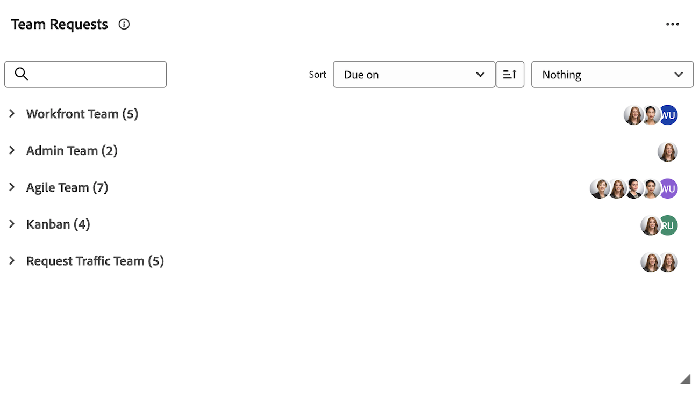

# Gérer les tâches et les demandes de l’équipe dans la zone [!UICONTROL Accueil]

Lorsque des tâches et des événements vous sont affectés, ils sont répertoriés dans les widgets Mes tâches, Mes tâches et Mes événements .  Vous pouvez afficher, modifier ou supprimer des tâches et des demandes.

## Conditions d’accès

+++ Développez pour afficher les exigences d’accès aux fonctionnalités de cet article. 

<table style="table-layout:auto"> 
 <col> 
 </col> 
 <col> 
 </col> 
 <tbody> 
  <tr> 
   <td role="rowheader"><strong>[!DNL Adobe Workfront package]</strong></td> 
   <td> 
Tous
 </td> 
  </tr> 
  <tr> 
   <td role="rowheader"><strong>[!DNL Adobe Workfront] licence</strong></td> 
   <td>
   
Standard

    
Travail ou supérieur
 </td> 
  </tr> 
  <tr> 
   <td role="rowheader"><strong>Configurations des niveaux d’accès</strong></td> 
   <td> 
Accès [!UICONTROL Edit] aux tâches et aux problèmes
 </td> 
  </tr> 
  <tr> 
   <td role="rowheader"><strong>Autorisations d’objet</strong></td> 
   <td> 
Autorisations de contribution ou niveau supérieur pour les tâches et les problèmes sur lesquels vous devez travailler
</td> 
  </tr> 
 </tbody> 
</table>

Pour plus d’informations, voir [Conditions d’accès requises dans la documentation Workfront](/help/quicksilver/administration-and-setup/add-users/access-levels-and-object-permissions/access-level-requirements-in-documentation.md).

+++

## Afficher un élément de travail dans le widget Mon travail

Les éléments de travail qui vous sont affectés s’affichent dans le widget Mon travail de l’[!UICONTROL Accueil]. Vous pouvez configurer les éléments de travail à afficher dans le widget Mes tâches à l’aide du filtre en haut du widget [!UICONTROL liste de travail].

Vous pouvez sélectionner des filtres qui affichent les éléments prêts à être traités ou les éléments sur lesquels vous travaillez déjà.

Cet article explique comment utiliser les filtres de la zone d’[!UICONTROL accueil] pour afficher les éléments sur lesquels vous travaillez actuellement ou sur lesquels vous pourriez envisager de commencer à travailler. Pour plus d’informations sur l’utilisation des filtres dans la zone [!UICONTROL Accueil], voir [Afficher les éléments dans la [!UICONTROL liste de travail] dans la zone [!UICONTROL Accueil]](/help/quicksilver/workfront-basics/using-home/using-the-home-area/display-items-in-home-work-list.md).

Pour afficher un élément de travail dans le widget Mon travail :

1. Cliquez sur l’icône **[!UICONTROL Menu principal]**  dans le coin supérieur droit, puis cliquez sur **[!UICONTROL Accueil]**.
1. (Conditionnel) Cliquez sur **Personnaliser** pour ajouter le widget **Mon travail**.

1. Cliquez sur l’icône **Filtrer**  dans le coin supérieur gauche de la liste de travail du widget.

1. Cliquez sur l’une ou l’autre des options suivantes pour les tâches :

   **[!UICONTROL Prêt à démarrer] :** affiche uniquement les tâches et les problèmes qui sont prêts à démarrer. Les deux affirmations suivantes doivent être vraies :

   * Les tâches et leurs parents n’ont pas de tâches/parents antérieurs ou de contraintes de tâches qui les empêchent d’être traités.
   * La [!UICONTROL date de début prévue] des tâches ou des problèmes se situe dans le passé ou jusqu’à deux semaines dans le futur.

   **[!UICONTROL Pas prêt]** : affiche uniquement les tâches et les problèmes qui ne sont pas encore prêts à démarrer. L’une ou l’autre des affirmations suivantes doit être vraie :

   * Les tâches et leurs parents peuvent avoir des tâches/parents antérieurs ou des contraintes de tâches qui les empêchent d’être traités.
   * Les tâches ou les problèmes ont une [!UICONTROL date de début planifiée] qui se situe plus de deux semaines dans le futur.

1. Cliquez sur **[!UICONTROL En train de travailler sur]** sous [!UICONTROL Tâches] ou [!UICONTROL Problèmes] pour afficher les tâches et les problèmes sur lesquels vous travaillez actuellement.
1. Cliquez sur **[!UICONTROL Demandés]** sous [!UICONTROL Problèmes] pour afficher les problèmes qui vous ont été demandés (qui vous sont affectés), mais sur lesquels vous n’avez pas encore accepté de travailler.

## Accéder à une demande d’équipe dans le widget Demande d’équipe

Vous pouvez accéder directement à une demande affectée à votre équipe à partir du widget Demandes de l’équipe dans la zone [!UICONTROL Accueil]. Pour plus d’informations sur les demandes d’équipe, voir [Vue d’ensemble des demandes d’équipe](../../../people-teams-and-groups/work-with-team-requests/team-requests-overview.md).

Pour accéder à une demande d&#39;équipe :

1. Cliquez sur l’icône **[!UICONTROL Menu principal]**  dans le coin supérieur droit, puis cliquez sur **[!UICONTROL Accueil]**.
1. (Conditionnel) Cliquez sur **Personnaliser** pour ajouter le widget **Demandes de l’équipe**.

   Le widget affiche les requêtes d&#39;équipe sous des regroupements d&#39;équipes. Le widget **[!UICONTROL Demandes de l’équipe]** s’affiche avec toutes les demandes affectées aux équipes auxquelles vous appartenez. Pour plus d’informations sur l’utilisation des demandes d’équipe, voir [Gérer les demandes d’équipe et de travail](../../../people-teams-and-groups/work-with-team-requests/manage-work-and-team-requests.md).

   

## Travailler sur un élément de travail dans le widget Mes tâches

Lorsque vous cliquez sur le bouton [!UICONTROL Travailler sur ce projet], vous indiquez à l’utilisateur qui a envoyé l’élément de travail et à tout autre utilisateur susceptible d’être affecté à l’élément de travail que vous allez commencer à travailler.

Pour travailler sur un élément de travail :

1. Cliquez sur l’icône **[!UICONTROL Menu principal]**  dans le coin supérieur droit, puis cliquez sur **[!UICONTROL Accueil]**.
1. (Conditionnel) Cliquez sur **Personnaliser** pour ajouter le widget **Mon travail**.

1. Dans la zone **[!UICONTROL liste de tâches]** du widget, sélectionnez la demande sur laquelle vous souhaitez travailler, puis cliquez sur **[!UICONTROL Travailler sur celle-ci]**.
1. Pointez sur l’élément de travail, puis cliquez sur l’icône **Résumé** pour afficher des informations sur l’élément de travail.

   

## Supprimer un élément de travail

Si vous décidez de ne pas travailler sur l’élément de travail, vous pouvez le supprimer de votre liste.

Pour supprimer un élément de travail :

1. Cliquez sur l’icône **[!UICONTROL Menu principal]**  dans le coin supérieur droit, puis cliquez sur **[!UICONTROL Accueil]**.
1. (Conditionnel) Cliquez sur **Personnaliser** pour ajouter le widget **Mon travail**.

1. Dans la liste de travail du widget, passez la souris sur l’élément de travail, puis cliquez sur l’icône **Résumé** pour afficher des informations sur l’élément de travail.
   
1. dans la section **Affectations**, supprimez votre nom.
   

<!--
## Reassign a request

1. Click the **[!UICONTROL Main Menu]**  in the upper-right corner, then click **[!UICONTROL Home]**.
1. In the **[!UICONTROL Work List]** area, select the request you want to reassign.

1. Click on the **[!UICONTROL Assignments]** widget and remove yourself from the request, then type the name of the user you want to reassign the request to.

   >[!TIP]
   >
   >If the work request is still in the Ready to Start or Not Ready state, you can use the **[!UICONTROL Reassign]** button in the **[!UICONTROL More]** menu in the [!UICONTROL Work List].\
   >

1. If a task's status is changed to [!UICONTROL New] or [!UICONTROL In Progress] after it was completed, you must unassign the user, save the task, then reassign the user in order for the task to reappear in their Home Work List.

## Reply to a request

You can reply to a request to further clarify the request or to propose a new date.

1. Click the **[!UICONTROL Main Menu]**  in the upper-right corner, then click **[!UICONTROL Home]**.
1. In the **[!UICONTROL Work List]** area, select the request you want to reply to.
1. Locate the individual who assigned the request to you.

   You can find this information on the [!UICONTROL Updates] tab of the task. Make sure the option to **[!UICONTROL Show System Updates]** is enabled.

1. Click **[!UICONTROL Start new update]** and begin typing your reply.
1. Enter the name of the recipient in the **[!UICONTROL Notify]** box, then click **[!UICONTROL Update]**.

   >[!TIP]
   >
   >If the work request is still in the Ready to Start or [!UICONTROL Not Ready] state, you can use the **[!UICONTROL Reply]** button in the **[!UICONTROL More]** menu in the [!UICONTROL Work List].\
   >![[!UICONTROL Reply button]](assets/reassign-in-left-panel-350x204.png)   

   -->
