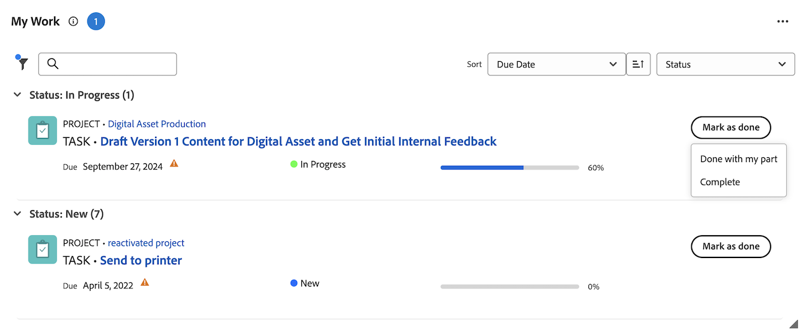

# Marquer un élément comme [!UICONTROL Terminé] dans la zone [!UICONTROL Accueil].

Vous pouvez marquer une tâche ou un problème comme Terminé si vous êtes le ou la cessionnaire de la tâche ou du problème. Lorsque vous marquez une tâche ou un problème comme [!UICONTROL Terminé], le statut de la tâche ou du problème passe à [!UICONTROL Terminé].

>[!NOTE]
>
>Vous ne voyez pas le bouton [!UICONTROL Terminé] si vous n’êtes pas l’une des ressources affectées à la tâche ou au problème.

## Conditions d’accès

+++ Développez pour afficher les exigences d’accès aux fonctionnalités de cet article. 

<table style="table-layout:auto"> 
 <col> 
 </col> 
 <col> 
 </col> 
 <tbody> 
  <tr> 
   <td role="rowheader"><strong>[!DNL Adobe Workfront package]</strong></td> 
   <td> 
Tous
 </td> 
  </tr> 
  <tr> 
   <td role="rowheader"><strong>[!DNL Adobe Workfront] licence</strong></td> 
   <td> 
   
Standard

   
Travail ou supérieur
 </td> 
  </tr> 
  <tr> 
   <td role="rowheader"><strong>Configurations des niveaux d’accès</strong></td> 
   <td> 
Accès [!UICONTROL Edit] aux tâches et aux problèmes
</td> 
  </tr> 
  <tr> 
   <td role="rowheader"><strong>Autorisations d’objet</strong></td> 
   <td> 
Autorisations de contribution ou niveau supérieur pour les tâches et les problèmes sur lesquels vous devez travailler
</td> 
  </tr> 
 </tbody> 
</table>

Pour plus d’informations, voir [Conditions d’accès requises dans la documentation Workfront](/help/quicksilver/administration-and-setup/add-users/access-levels-and-object-permissions/access-level-requirements-in-documentation.md).

+++

## Marquer un élément de travail comme Terminé dans le widget Mon travail

1. Cliquez sur l’icône **[!UICONTROL Menu principal]**  dans le coin supérieur droit, puis cliquez sur **[!UICONTROL Accueil]**.
1. (Conditionnel) Cliquez sur **Personnaliser** pour ajouter le widget **Mon travail**.
1. Recherchez l’élément de travail, puis cliquez sur **[!UICONTROL Marquer comme terminé]** sur l’élément de travail.
Voir [Comprendre les options du bouton [!UICONTROL Terminé]](#understand-the-options-of-the-done-button) pour des informations plus détaillées sur la façon dont ce bouton peut apparaître.
   

## Marquer un élément de travail comme Terminé dans le panneau Résumé

Vous pouvez marquer un élément de travail comme Terminé dans le widget Mes tâches et mes problèmes à l’aide du panneau Résumé .

1. Cliquez sur l’icône **[!UICONTROL Menu principal]**  dans le coin supérieur droit, puis cliquez sur **[!UICONTROL Accueil]**.
1. (Conditionnel) Cliquez sur **Personnaliser** pour ajouter les widgets **Mes tâches** ou **Mes problèmes**.
1. Pointez sur l’élément de travail, puis cliquez sur l’icône **Résumé**.
   
1. Cliquez sur **Marquer comme terminé** en haut du panneau Résumé .

## Comprendre les options du bouton [!UICONTROL Terminé]

Par défaut, le fait de cliquer sur le bouton [!UICONTROL Terminé] sur un élément de travail fait passer le statut de cet élément à [!UICONTROL Terminé] (pour les tâches) ou [!UICONTROL Résolu] (pour les problèmes).

Votre administrateur ou administratrice [!DNL Adobe Workfront] peut personnaliser les statuts associés au bouton [!UICONTROL Terminé] et appliquer ces personnalisations à votre équipe interne.

Selon le nombre de statuts associés au bouton [!UICONTROL Terminé] ou le nombre de ressources affectées à la tâche ou au problème, l’aspect du bouton [!UICONTROL Terminé] peut changer.

* [Bouton [!UICONTROL Terminé] associé à un statut](#done-button-associated-with-one-status)
* [Bouton [!UICONTROL Terminé] associé à plusieurs statuts](#done-button-associated-with-multiple-statuses)
* [Bouton [!UICONTROL Terminé] pour les éléments affectés à plusieurs ressources](#done-button-for-items-assigned-to-multiple-resources)

### Bouton [!UICONTROL Terminé] associé à un statut

Lorsque le bouton [!UICONTROL Terminé] est associé à un statut et que l’élément de travail ne vous est affecté qu’à vous, le bouton indique **[!UICONTROL Terminé]**. Lorsque vous cliquez sur ce bouton, le statut de la tâche ou du problème passe au statut associé au bouton [!UICONTROL Terminé].

Pour savoir quel statut est associé au bouton [!UICONTROL Terminé], vérifiez les [!UICONTROL Paramètres d’équipe] de votre équipe interne pour la section [!UICONTROL Bouton Terminé], comme décrit dans [Modifier les paramètres d’équipe](../../../people-teams-and-groups/create-and-manage-teams/edit-team-settings.md).

Si vous n’avez pas d’affectation à une équipe interne, le statut par défaut est choisi lorsque vous cliquez sur [!UICONTROL Terminé], comme décrit ci-dessus dans [Comprendre les options du bouton [!UICONTROL Terminé]](#understand-the-options-of-the-done-button).

### Bouton [!UICONTROL Terminé] associé à plusieurs statuts

Lorsque le bouton [!UICONTROL Terminé] est associé à plusieurs statuts, le bouton affiche le mot **[!UICONTROL Terminé]** qui est suivi d’un menu déroulant. Dans ce cas, vous ne pouvez pas simplement cliquer sur [!UICONTROL Terminé]. Vous devez sélectionner un statut dans le menu déroulant. Sélectionnez le statut qui correspond le mieux à l’achèvement de l’élément de travail. Ce faisant, vous modifiez le statut de l’élément de travail.

Pour comprendre comment vous pouvez associer plusieurs statuts au bouton [!UICONTROL Terminé], voir [Configurer le bouton [!UICONTROL Terminé] pour les tâches](../../../people-teams-and-groups/create-and-manage-teams/configure-the-done-button-for-tasks.md) et [Configurer le bouton [!UICONTROL Terminé] pour les problèmes](../../../people-teams-and-groups/create-and-manage-teams/configure-the-done-button-for-issues.md).

### Bouton [!UICONTROL Terminé] pour les éléments affectés à plusieurs ressources

Lorsque la tâche ou le problème est affecté à plus d’une ressource, le bouton affiche le mot **[!UICONTROL Terminé]** suivi d’un menu déroulant. Dans le menu déroulant, vous avez la possibilité de choisir entre **[!UICONTROL Terminé avec ma partie]** (qui permet aux membres de l’équipe de savoir que vous avez terminé votre partie de la tâche), ou le statut associé au bouton [!UICONTROL Terminé] (qui complète l’élément). Lorsque vous avez sélectionné **[!UICONTROL J’ai fait ma part]**, l’élément de travail est supprimé de votre liste de travail, mais reste dans celle des personnes encore affectées à l’élément de travail.\
Si le bouton Terminé est associé à plusieurs statuts, ceux-ci sont répertoriés sous **J’ai fait ma part**.

>[!NOTE]
>
>Dans le cas d’une tâche ou d’un problème comportant plusieurs personnes cessionnaires, chaque personne est tenue d’indiquer que sa propre affectation sur la tâche ou le problème est effectivement terminée. C’est la raison pour laquelle chaque personne cessionnaire doit cliquer sur [!UICONTROL Terminé] pour montrer qu’elle a terminé le travail qui lui a été assigné sur l’élément.

