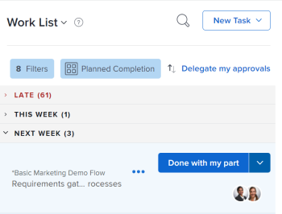

# Marquage d’un élément en tant que [!UICONTROL Terminé] dans le [!UICONTROL Accueil] area

Vous pouvez marquer une tâche ou un problème comme Terminé si vous êtes la tâche ou la personne désignée pour le problème. Lorsque vous marquez une tâche ou un problème comme [!UICONTROL Terminé], l’état de la tâche ou du problème est modifié en [!UICONTROL Terminer].

>[!NOTE]
>
>Vous ne voyez pas la variable [!UICONTROL Terminé] sauf si vous êtes l’une des ressources affectées à la tâche ou au problème.

## Exigences d’accès

Vous devez disposer des accès suivants pour effectuer les étapes de cet article :

<table style="table-layout:auto"> 
 <col> 
 </col> 
 <col> 
 </col> 
 <tbody> 
  <tr> 
   <td role="rowheader"><strong>[!DNL Adobe Workfront plan*]</strong></td> 
   <td> 
Tous
 </td> 
  </tr> 
  <tr> 
   <td role="rowheader"><strong>[!DNL Adobe Workfront] license*</strong></td> 
   <td> 
[!UICONTROL Work] ou version ultérieure
 </td> 
  </tr> 
  <tr> 
   <td role="rowheader"><strong>Paramétrages du niveau d'accès*</strong></td> 
   <td> 
Accès à [!UICONTROL Modifier] Tâches et problèmes
 
Remarque : Si vous n’avez toujours pas accès à , demandez à votre [!DNL Workfront] s’ils définissent des restrictions supplémentaires au niveau de votre accès. Pour plus d’informations sur la manière dont une [!DNL Workfront] l’administrateur peut modifier votre niveau d’accès, voir <a href="../../../administration-and-setup/add-users/configure-and-grant-access/create-modify-access-levels.md" class="MCXref xref">Création ou modification de niveaux d’accès personnalisés</a>.
 </td> 
  </tr> 
  <tr> 
   <td role="rowheader"><strong>Autorisations d’objet</strong></td> 
   <td> 
Attribuez des autorisations ou des autorisations supérieures aux tâches et problèmes sur lesquels vous devez travailler.
 
Pour plus d’informations sur la demande d’accès supplémentaire, voir <a href="../../../workfront-basics/grant-and-request-access-to-objects/request-access.md" class="MCXref xref">Demande d’accès aux objets </a>.
 </td> 
  </tr> 
 </tbody> 
</table>

&#42;Pour connaître le plan, le type de licence ou l’accès dont vous disposez, contactez votre [!DNL Workfront] administrateur.

## Marquer une tâche ou un problème comme [!UICONTROL Terminé]

Seul l’utilisateur affecté à la tâche ou au problème peut le marquer comme [!UICONTROL Terminé].

1. Cliquez sur le bouton **[!UICONTROL Menu Principal]**  dans le coin supérieur droit, puis cliquez sur **[!UICONTROL Accueil]**.
1. Dans le **[!UICONTROL Liste de tâches]**, localisez l’un des éléments en attente de traitement.
1. Effectuez l’une des opérations suivantes :

* Cliquez sur **[!UICONTROL Terminé]** sur l’élément de travail.\
   Voir [Présentation des options de la fonction [!UICONTROL Terminé] button](#understand-the-options-of-the-done-button) pour plus d’informations sur l’affichage possible de ce bouton.

* Sélectionnez l’élément que vous souhaitez marquer comme terminé, puis, dans le panneau de droite, cliquez sur **[!UICONTROL État de mise à jour]**, puis définissez l’état de l’élément sur un état correspondant à [!UICONTROL Terminer] ou [!UICONTROL Fermé].

## Présentation des options de la fonction [!UICONTROL Terminé] button

Par défaut, cliquez sur le bouton [!UICONTROL Terminé] sur un élément de travail, l’état de cet élément devient [!UICONTROL Terminer] (pour les tâches) ou [!UICONTROL Résolu] (pour les problèmes).

Votre [!DNL Adobe Workfront] L’administrateur peut personnaliser les états associés à la variable [!UICONTROL Terminé] et appliquez ces personnalisations à votre équipe d’accueil.

Selon le nombre d’états associés à la variable [!UICONTROL Terminé] ou le nombre de ressources affectées à la tâche ou au problème, l’aspect de la tâche [!UICONTROL Terminé] peut changer.

* [[!UICONTROL Terminé] bouton associé à un état](#done-button-associated-with-one-status)
* [[!UICONTROL Terminé] bouton associé à plusieurs états](#done-button-associated-with-multiple-statuses)
* [[!UICONTROL Terminé] bouton pour les éléments affectés à plusieurs ressources](#done-button-for-items-assigned-to-multiple-resources)

### [!UICONTROL Terminé] bouton associé à un état

Lorsque la variable [!UICONTROL Terminé] est associé à un état et l’élément de travail vous est attribué uniquement, le bouton se lit comme suit : **[!UICONTROL Terminé]**. Lorsque vous cliquez dessus, l’état de la tâche ou du problème est remplacé par l’état associé à l’événement [!UICONTROL Terminé] bouton .

Pour déterminer quel état est associé à la variable [!UICONTROL Terminé] , vérifiez les [!UICONTROL Paramètres de l’équipe] de votre équipe d’accueil pour le [!UICONTROL Bouton Terminé] , comme décrit dans la section [Modification des paramètres de l’équipe](../../../people-teams-and-groups/create-and-manage-teams/edit-team-settings.md).

Si vous n’êtes pas affecté à une équipe d’accueil, l’état par défaut est sélectionné lorsque vous cliquez sur [!UICONTROL Terminé], comme décrit ci-dessus dans [Présentation des options de la fonction [!UICONTROL Terminé] button](#understand-the-options-of-the-done-button).

### [!UICONTROL Terminé] bouton associé à plusieurs états

Lorsque la variable [!UICONTROL Terminé] est associé à plusieurs statuts, le bouton affiche le mot **[!UICONTROL Terminé]** , suivie d’un menu déroulant. Dans ce scénario, vous ne pouvez pas simplement cliquer sur [!UICONTROL Terminé]. Vous devez sélectionner un état dans le menu déroulant. Sélectionnez l’état qui correspond le mieux à la fin de l’élément de travail. Ce faisant, vous modifiez l’état de l’élément de travail.

Pour comprendre comment associer plusieurs états à la variable [!UICONTROL Terminé] bouton, voir [Configurez la variable [!UICONTROL Terminé] bouton pour les tâches](../../../people-teams-and-groups/create-and-manage-teams/configure-the-done-button-for-tasks.md) et [Configurez la variable [!UICONTROL Terminé] bouton pour les problèmes](../../../people-teams-and-groups/create-and-manage-teams/configure-the-done-button-for-issues.md).

<!--

-->

### [!UICONTROL Terminé] bouton pour les éléments affectés à plusieurs ressources

Lorsque la tâche ou le problème est assigné à plusieurs ressources, le bouton affiche le mot **[!UICONTROL Terminé]** , suivie d’un menu déroulant. Dans le menu déroulant, vous avez la possibilité de choisir entre **[!UICONTROL C&#39;est fait de ma part.]** (qui informe les membres de l’équipe que vous avez terminé la partie de la tâche), ou l’état associé à l’événement [!UICONTROL Terminé] (qui termine l’élément). Après avoir sélectionné **[!UICONTROL C&#39;est fait de ma part.]**, l’élément de travail est supprimé de votre liste de tâches, mais reste dans la liste de tâches des tâches toujours affectées à l’élément de travail.\
Si le bouton Terminé est associé à plusieurs états, ils sont répertoriés sous **C&#39;est fait de ma part.**.

>[!NOTE]
>
>Sur une tâche ou un problème avec plusieurs personnes désignées, chaque utilisateur est responsable d’indiquer que sa propre affectation à la tâche ou au problème a été effectivement terminée. Pour cette raison, chaque personne désignée doit cliquer sur [!UICONTROL Terminé] pour afficher qu’ils ont terminé la tâche qui leur a été affectée sur l’élément.

