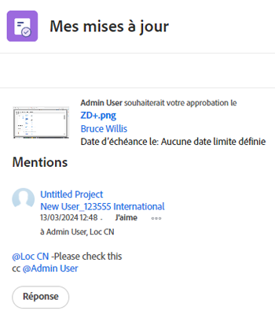
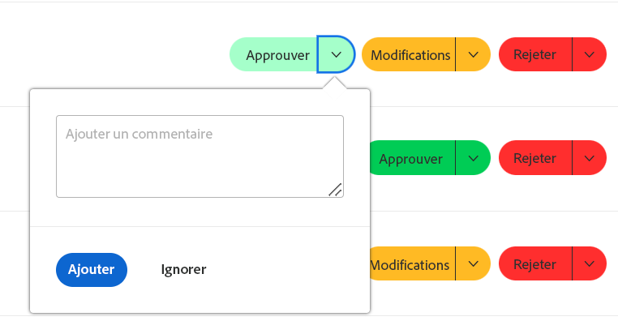
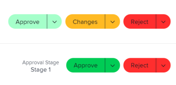
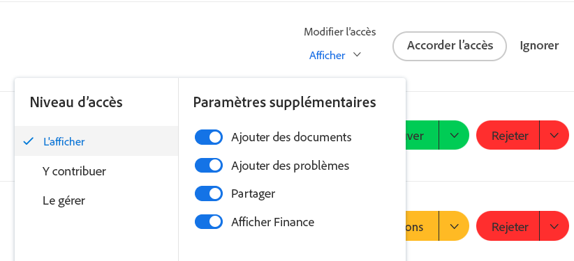

# Utiliser la zone [!UICONTROL Mes mises à jour]

<!--The highlighted information on this page refers to functionality not yet generally available. It is available only in the Preview environment for all customers. After the monthly releases to Production, the same features are also available in the Production environment for customers who enabled fast releases.    

For information about fast releases, see [Enable or disable fast releases for your organization](/help/quicksilver/administration-and-setup/set-up-workfront/configure-system-defaults/enable-fast-release-process.md). -->

Vous pouvez utiliser la zone [!UICONTROL Mes mises à jour] pour consulter rapidement les approbations en attente de votre décision ou les conversations auxquelles vous avez participé.

En tant que personne disposant d’une licence de [!UICONTROL Révision], vous pouvez trouver la zone [!UICONTROL Mes mises à jour] dans le [!UICONTROL Menu principal] par défaut et la zone [!UICONTROL Mes mises à jour] est la page de destination par défaut pour vous.

Pour plus d’informations sur les licences [!DNL Adobe Workfront], voir [[!DNL Adobe Workfront] Vue d’ensemble des licences](../../../administration-and-setup/add-users/access-levels-and-object-permissions/wf-licenses.md).

Si vous disposez d’un type de licence différent de Révision, l’administrateur ou administratrice [!DNL Workfront] ou de groupes doit ajouter la zone [!UICONTROL Mes mises à jour] à votre modèle de mise en page pour qu’elle s’affiche dans le menu principal. Pour plus d’informations, voir [Personnaliser le [!UICONTROL Menu principal] à l’aide d’un modèle de mise en page](../../../administration-and-setup/customize-workfront/use-layout-templates/customize-main-menu.md).

## Conditions d’accès

+++ Développez pour afficher les exigences d’accès aux fonctionnalités de cet article.

<table style="table-layout:auto"> 
 <col> 
 <col> 
 <tbody> 
  <tr> 
   <td role="rowheader"><strong>[!DNL Adobe Workfront package]</strong></td> 
   <td> 
Tous
 </td> 
  </tr> 
  <tr> 
   <td role="rowheader"><strong>[!DNL Adobe Workfront] licence</strong></td> 
   <td> 
Contributeur ou version ultérieure

   
Requête ou supérieure
 </td> 
  </tr> 
  <tr> 
   <td role="rowheader"><strong>Configuration du niveau d’accès</strong></td> 
   <td> 
Accès en affichage ou supérieur à tout objet pour lequel vous êtes tagué dans une conversation ou pour lequel vous devez résoudre une approbation (projets, tâches, problèmes, documents)
 </td> 
  </tr> 
  <tr> 
   <td role="rowheader"><strong>Autorisations d’objet</strong></td> 
   <td> 
Autorisations [!UICONTROL View] ou supérieures pour les projets, les tâches, les problèmes, les documents pour lesquels vous faites l’objet d’un tag dans une conversation ou pour lesquels devez résoudre une approbation.
 </td> 
  </tr> 
 </tbody> 
</table>

Pour plus d’informations, voir [Conditions d’accès requises dans la documentation Workfront](/help/quicksilver/administration-and-setup/add-users/access-levels-and-object-permissions/access-level-requirements-in-documentation.md).

+++

## Conditions préalables

Vous devez disposer des éléments suivants avant de commencer :

* Si vous disposez d’une licence [!DNL Workfront] autre que [!UICONTROL Révision], votre administrateur ou administratrice [!DNL Workfront] ou de groupes doit ajouter la zone [!UICONTROL Mes mises à jour] au [!UICONTROL Menu principal] à l’aide d’un modèle de mise en page et vous affecter à ce modèle.

* Les personnes utilisant une licence Révision peuvent consulter la zone [!UICONTROL Mes mises à jour] dans leur [!UICONTROL Menu principal] par défaut.

## Accéder à la zone [!UICONTROL Mes mises à jour]

{{step1-to-my-updates}}

La zone [!UICONTROL Mes mises à jour] s’affiche.

Les approbations et demandes d’accès qui vous sont affectées sont répertoriées dans la première moitié de la page, sous **Mes mises à jour**.

1. (Facultatif) Descendez au bas de la zone [!UICONTROL **Mes mises à jour**] et cliquez sur la flèche pointant vers la droite pour afficher d’autres approbations qui s’affichent sur des pages supplémentaires.

   >[!TIP]
   >
   >Les cinq premières approbations ou demandes d’accès s’affichent par défaut. Les autres approbations s’affichent sur des pages supplémentaires. Vous pouvez afficher un maximum de 2000 approbations dans la zone [!UICONTROL Mes mises à jour].

   

1. (Facultatif) Développez le menu déroulant **[!UICONTROL Filtre]**  dans le coin supérieur droit de la section **[!UICONTROL Mes mises à jour]** et sélectionnez l’une des options suivantes :

   <table style="table-layout:auto"> 
    <col> 
    </col> 
    <col> 
    </col> 
    <tbody> 
     <tr> 
      <td role="rowheader"><strong>[!UICONTROL All]</strong></td> 
      <td>Approbations qui vous sont soumises ou qui vous sont déléguées par une autre personne. Pour plus d’informations sur la délégation d’approbations, voir <a href="../../../review-and-approve-work/manage-approvals/delegate-approval-requests.md" class="MCXref xref">Déléguer une demande d’approbation</a>. </td> 
     </tr> 
     <tr> 
      <td role="rowheader"><strong>[!UICONTROL Delegated Approvals]</strong></td> 
      <td>Approbations qui vous sont déléguées par une autre personne. </td> 
     </tr> 
     <tr> 
      <td role="rowheader"><strong>[!UICONTROL My Approvals]</strong></td> 
      <td> 
Approbations qui vous sont soumises. 
 
Pour plus d’informations sur l’approbation des éléments, voir <a href="../../../review-and-approve-work/manage-approvals/approving-work.md" class="MCXref xref">Approbation du travail</a>.
 </td> 
     </tr> 
    </tbody> 
   </table>

1. Pour approuver ou rejeter un élément ou suggérer des modifications à un document avant de l’approuver, procédez comme suit :

   1. (Facultatif) Cliquez sur l’icône **liste déroulante**  en regard de votre décision d’approbation (**[!UICONTROL Approuver]**, **[!UICONTROL Modifications]**,**[!UICONTROL Rejeter]**) et ajoutez un commentaire, puis cliquez sur **[!UICONTROL Ajouter]**.

      Ou

      Cliquez sur **[!UICONTROL Ignorer]** si vous ne souhaitez pas saisir de commentaire.

      

      >[!NOTE]
      >
      >L’option [!UICONTROL Modifications] ne s’affiche que pour les approbations de documents.

      Selon l’icône de la liste déroulante que vous avez sélectionnée, l’élément est approuvé, rejeté ou, dans le cas de l’approbation d’un document, approuvé avec une demande de modifications supplémentaires.

      >[!TIP]
      >
      >Si vous ne souhaitez pas ajouter de commentaire à votre décision, vous pouvez cliquer sur le bouton **[!UICONTROL Approuver]**, **[!UICONTROL Rejeter]** ou **[!UICONTROL Modifications]** et la décision d’approbation sera accordée immédiatement.
      >
      >
      >
      >
      >Pour plus d’informations sur l’approbation du travail, voir [Approbation de travail](../../../review-and-approve-work/manage-approvals/approving-work.md).

1. Cliquer sur **[!UICONTROL Accorder l’accès]** pour accorder la demande d’accès qui vous a été soumise.

   Ou

   Développez le menu déroulant **[!UICONTROL Modifier l’accès]** pour modifier l’accès demandé avant de l’accorder.

   

1. (Facultatif) Cliquez sur **[!UICONTROL Ignorer]** pour supprimer la demande d’accès de votre liste d’approbation sans l’accorder.
1. Cliquez sur **[!UICONTROL Déléguer mes approbations]** pour déléguer les approbations qui vous ont été soumises si vous n’êtes pas disponible pour prendre des décisions d’approbation pendant un certain temps. Pour plus d’informations sur la délégation d’approbations, voir [Déléguer une demande d’approbation](../../../review-and-approve-work/manage-approvals/delegate-approval-requests.md).
1. Faites défiler jusqu’à la zone **[!UICONTROL Mentions]** située sous vos approbations. Ici, vous pouvez voir tous les éléments dans lesquels vous avez été inclus dans une conversation.

   >[!TIP]
   >
   >Les 50 premières mentions s’affichent par défaut.

1. (Facultatif) Cliquez sur **[!UICONTROL Afficher davantage de mises à jour]** pour afficher d’autres mentions.
1. (Facultatif) Cliquez sur **[!UICONTROL Répondre]** pour répondre à un commentaire et effectuez l’une des opérations suivantes :
   * Commencer à saisir une réponse
   * Utilisez la barre d’outils de texte enrichi pour mettre en forme votre texte, ajouter des liens, des listes, des émoticônes, des citations ou des images à votre message.
   * Ajoutez des utilisateurs, des utilisatrices ou des équipes pour les avertir de votre réponse.

     Pour plus d’informations sur la réponse aux mises à jour, voir [Mettre à jour le travail](/help/quicksilver/workfront-basics/updating-work-items-and-viewing-updates/update-work.md).

     Lorsque vous avez terminé d’ajouter la réponse, cliquez sur **[!UICONTROL Envoyer]**.

     

1. (Facultatif) Cliquez sur **[!UICONTROL Épingler la page actuelle]** pour épingler la zone [!UICONTROL Mes mises à jour] à votre navigation supérieure.
