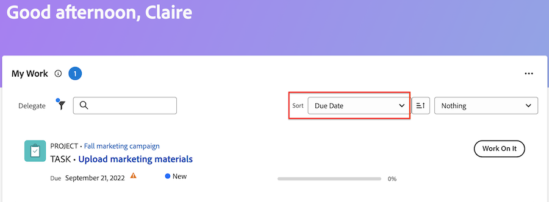

# Gérer votre travail à l’aide du widget Mes tâches

Le widget Mon travail affiche toutes les tâches, tous les événements et toutes les demandes qui vous sont affectés au même endroit. Ici, vous pouvez filtrer et organiser votre travail, consigner le temps, effectuer des mises à jour et marquer les éléments de travail comme terminés.

>[!IMPORTANT]
>
>Pour afficher les tâches et les événements dans le widget Mon travail, le statut du projet parent doit être Actuel ou égal à Actuel.

## Conditions d’accès

+++ Développez pour afficher les exigences d’accès aux fonctionnalités de cet article.

Vous devez disposer des accès suivants pour effectuer les étapes de cet article :

<table style="table-layout:auto"> 
 <col> 
 </col> 
 <col> 
 </col> 
 <tbody> 
  <tr> 
   <td role="rowheader"><strong>[!DNL Adobe Workfront plan]</strong></td> 
   <td> 
Tous
 </td> 
  </tr> 
  <tr> 
   <td role="rowheader"><strong>[!DNL Adobe Workfront] licence</strong></td> 
   <td> 
Actuel : Contribute

   
Ou
 
   
Nouveau :[!UICONTROL Light] ou version ultérieure
 
  </td> 
  </tr> </ul>
  <tr> 
   <td role="rowheader"><strong>Configurations des niveaux d’accès</strong></td> 
   <td> 
Accès en [!UICONTROL View] ou de niveau supérieur aux projets, tâches, problèmes et documents
 </td> 
  </tr>  
  <tr> 
   <td role="rowheader"><strong>Autorisations d’objet</strong></td> 
   <td> 
Autorisations Contribute ou supérieures pour les tâches et les événements sur lesquels vous devez travailler
  </td> 
  </tr> 
 </tbody> 
</table>

Pour plus de détails sur les informations contenues dans ce tableau, consultez [Conditions d’accès préalables dans la documentation Workfront](/help/quicksilver/administration-and-setup/add-users/access-levels-and-object-permissions/access-level-requirements-in-documentation.md).

+++

## Rechercher votre travail avec les filtres

Vous pouvez affiner les filtres Mon travail pour qu’ils se concentrent sur des éléments spécifiques de votre liste de travail :

### Filtrer les détails

<table>
  <tbody>
    <tr>
      <td>Utilisation de</td>
      <td>Affiche les éléments sur lesquels vous travaillez actuellement</td>
    </tr>
    <tr>
      <td>Démarrage possible</td>
      <td>Affiche les éléments avec 
      <ul>
      <li>Aucune contrainte de tâches ou de prédécesseurs incomplète</li>
      
et

      <li>La date de début prévue est dans le passé ou peut être dans les deux semaines à venir</li>
      </ul>
      </td>
    </tr>
    <tr>
      <td>À préparer</td>
      <td>Affiche les éléments qui ont
       <ul>
      <li>Prédécesseurs incomplets ou contraintes de tâche empêchant le traitement de l'élément</li>
      
ou

      <li>La date de début prévue est dans le futur depuis plus de deux semaines</li>
      </ul>
       </td>
    </tr>
    <tr>
      <td>Demandé</td>
      <td>Affiche les problèmes sur lesquels vous n'avez pas encore commencé à travailler</td>
    </tr>
    <tr>
      <td>Délégué par moi-même</td>
      <td>Affiche les éléments que vous avez délégués à d’autres utilisateurs</td>
    </tr>
    <tr>
      <td>M’a été délégué</td>
      <td>Affiche les éléments que les utilisateurs vous ont délégués</td>
    </tr>
    <tr>
      <td>Terminé</td>
      <td>Affiche le travail effectué au cours des deux dernières semaines. Cette option de filtre n’inclut pas les validations.</td>
    </tr>
  </tbody>
</table>

>[!TIP]
>
>Si vous recherchez des options de filtrage plus spécifiques, vous pouvez utiliser les widgets Ma tâche ou Mon problème . Pour plus d’informations sur les filtres Ma tâche et Mon problème, voir [Présentation des filtres du widget Accueil](/help/quicksilver/workfront-basics/using-home/using-the-home-area/widget-filter-overview-home.md).

## Organiser votre travail

Vous pouvez utiliser les fonctionnalités de tri et de groupe du widget Mon travail pour organiser votre travail d’une manière qui vous semble logique.

### Trier

Vous pouvez trier la liste de travail par

* Date d&#39;échéance
Les éléments en retard affichent une icône d&#39;avertissement en regard de la date. Workfront utilise la date d&#39;achèvement prévue pour déterminer si des tâches et des événements sont en retard.
* Nom
* Pourcentage d’achèvement
* Statut

>[!TIP]
>
>Pour créer une liste qui affiche tous les éléments en retard en haut du widget Mon travail, triez par Date d&#39;échéance et n&#39;appliquez pas de regroupement.

### Groupe

Vous pouvez regrouper la liste de travail par

* Projet
* Statut
* Date d&#39;échéance
La date d&#39;échéance est déterminée par la date d&#39;achèvement prévue.

>[!NOTE]
>
>Lorsque vous appliquez un regroupement, votre sélection dans le menu Trier détermine l’ordre au sein du regroupement.

## Mettre à jour les informations sur l’élément de travail dans le résumé

Vous pouvez ouvrir le panneau Résumé pour mettre rapidement à jour les informations d’une tâche ou d’un événement. Dans le résumé, vous pouvez effectuer les opérations suivantes :

* Mettre à jour le pourcentage terminé
* Ajouter une mise à jour
* Accédez à la zone Document pour charger un document
* Affichage des détails des éléments de travail et mise à jour des champs personnalisés
L’administration de Workfront peut personnaliser les champs qui apparaissent dans le résumé du modèle de mise en page. Pour plus d’informations, voir [Personnaliser le panneau Résumé à l’aide d’un modèle de disposition](/help/quicksilver/administration-and-setup/customize-workfront/use-layout-templates/customize-home-summary-layout-template.md).
* Modifier le statut de l’élément de travail
* Afficher les sous-tâches
* Enregistrer des heures
* Afficher les processus d&#39;approbation joints

Pour ouvrir le résumé, pointez sur l’élément de travail, puis cliquez sur l’icône **Résumé** .

Pour plus d’informations sur l’utilisation du panneau Résumé, voir [Aperçu du résumé](/help/quicksilver/workfront-basics/the-new-workfront-experience/summary-overview.md).

## Utiliser des actions rapides pour mettre à jour les éléments de travail

Le menu d’actions rapides permet d’effectuer les actions suivantes :

* Enregistrer des heures
* Ajouter une mise à jour
* Mise à jour d’un formulaire personnalisé
* Charger un fichier

Pour localiser le menu d’actions rapides, passez la souris sur l’élément de travail. La liste des actions rapides s’affiche à côté du bouton **Travailler sur ce projet** ou **Terminé**.

## Afficher les validations et les demandes d&#39;équipe

Les approbations et les demandes de l’équipe ne s’affichent pas dans le widget Mon travail. Si vous travaillez régulièrement avec des approbations et des demandes d&#39;équipe, nous vous recommandons d&#39;ajouter les widgets suivants à votre nouvelle page d&#39;accueil :

* Mon approbation
* Toutes les approbations
* Demandes de l’équipe

Pour plus d’informations sur l’ajout de widgets à votre nouvelle page d’accueil, voir [Ajouter, modifier ou supprimer des widgets dans l’Accueil](/help/quicksilver/workfront-basics/using-home/using-the-home-area/add-edit-remove-widgets-in-new-home.md).
