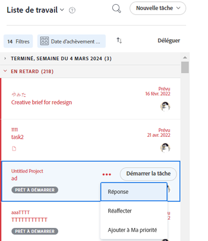

# Définir la priorité du travail dans le [!UICONTROL Accueil] area

Vous pouvez hiérarchiser les éléments de votre [!UICONTROL Liste de tâches] in [!UICONTROL Accueil]. Éléments que vous ajoutez à [!UICONTROL Ma priorité] sont des priorités pour vous uniquement. Ils ne sont prioritaires pour personne d&#39;autre, et personne ne peut les hiérarchiser pour vous. Vous pouvez ajouter jusqu’à 20 éléments sous le [!UICONTROL Ma priorité] [!UICONTROL Trier par] .

## Exigences d’accès

Vous devez disposer des accès suivants pour effectuer les étapes de cet article :

<table style="table-layout:auto"> 
 <col> 
 </col> 
 <col> 
 </col> 
 <tbody> 
  <tr> 
   <td role="rowheader"><strong>[!DNL Adobe Workfront plan*]</strong></td> 
   <td> 
Tous
 </td> 
  </tr> 
  <tr> 
   <td role="rowheader"><strong>[!DNL Adobe Workfront] license*</strong></td> 
   <td> 
[!UICONTROL Work] ou version ultérieure
 </td> 
  </tr> 
  <tr> 
   <td role="rowheader"><strong>Paramétrages du niveau d'accès*</strong></td> 
   <td> 
Accès à [!UICONTROL Modifier] Tâches et problèmes
 
Remarque : Si vous n’avez toujours pas accès à , demandez à votre [!DNL Workfront] s’ils définissent des restrictions supplémentaires au niveau de votre accès. Pour plus d’informations sur la manière dont une [!DNL Workfront] l’administrateur peut modifier votre niveau d’accès, voir <a href="../../../administration-and-setup/add-users/configure-and-grant-access/create-modify-access-levels.md" class="MCXref xref">Création ou modification de niveaux d’accès personnalisés</a>.
 </td> 
  </tr> 
  <tr> 
   <td role="rowheader"><strong>Autorisations d’objet</strong></td> 
   <td> 
Attribuez des autorisations ou des autorisations supérieures aux tâches et problèmes que vous souhaitez hiérarchiser.
 
Pour plus d’informations sur la demande d’accès supplémentaire, voir <a href="../../../workfront-basics/grant-and-request-access-to-objects/request-access.md" class="MCXref xref">Demande d’accès aux objets </a>.
 </td> 
  </tr> 
 </tbody> 
</table>

Pour connaître le plan, le type de licence ou l’accès dont vous disposez, contactez votre [!DNL Workfront] administrateur.

## Ajouter des éléments à [!UICONTROL Ma priorité]

Vous pouvez ajouter tout élément qui vous est affecté dans votre [!UICONTROL Liste de tâches] to [!UICONTROL Ma priorité]. De nouveaux éléments sont ajoutés au bas de la liste.

1. Cliquez sur le bouton **[!UICONTROL Menu Principal]**  dans le coin supérieur droit, puis cliquez sur **[!UICONTROL Accueil]**.
1. Dans le panneau de gauche, assurez-vous que la variable **[!UICONTROL Group by]** Le menu déroulant est trié selon l’une des options suivantes :

   * [!UICONTROL Date d’achèvement prévue]
   * [!UICONTROL Date de début prévue]
   * [!UICONTROL Date d&#39;engagement]
   * [!UICONTROL Projet]

1. Passez la souris sur une tâche, puis cliquez sur l’icône **[!UICONTROL Plus]** icon .

1. Sélectionner **[!UICONTROL Ajouter à ma priorité]**.

   

## Définir la priorité des éléments à l’aide de la fonction [!UICONTROL Ma priorité] groupement

Vous pouvez donner la priorité à votre travail une fois que vous avez sélectionné [!UICONTROL Ma priorité] dans le menu déroulant de votre groupement, placez les éléments les plus importants en haut de la liste. Les priorités que vous définissez ne sont visibles que par vous. Personne d&#39;autre ne peut donner la priorité au travail pour vous.

Vous devez ajouter des tâches à [!UICONTROL Ma priorité] avant de commencer à établir des priorités.

Pour plus d’informations, voir la section [Ajouter des éléments à [!UICONTROL Ma priorité]](#add-items-to-my-priority) dans cet article.

1. Cliquez sur le bouton **[!UICONTROL Menu Principal]**  dans le coin supérieur droit, puis cliquez sur **[!UICONTROL Accueil]**.
1. Dans le panneau de gauche, cliquez sur le **[!UICONTROL Group by]** menu déroulant, puis sélectionnez **[!UICONTROL Ma priorité]**.

1. Sélectionnez un élément de travail et faites-le glisser et déposez-le au bon endroit pour le classer par priorité dans votre liste.

   

## Supprimer des éléments de [!UICONTROL Ma priorité]

Vous pouvez supprimer des éléments de [!UICONTROL Ma priorité] en exécutant l’élément de travail ou en le supprimant manuellement à l’aide de la fonction [!UICONTROL Plus] icône . Si vous n’êtes pas affecté à un élément de travail, il est également supprimé de [!UICONTROL Ma priorité].

1. Cliquez sur le bouton **[!UICONTROL Menu Principal]**  dans le coin supérieur droit, puis cliquez sur **[!UICONTROL Accueil]**.
1. Dans le panneau de gauche, cliquez sur le **[!UICONTROL Plus]** puis sélectionnez **[!UICONTROL Supprimer de ma priorité]**.

   ![[!UICONTROL [!UICONTROL Supprimer de Ma priorité]]](assets/getting-started-remove-from-priority-nwe-350x395.png)
