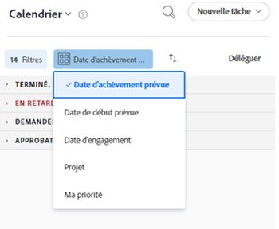

# Utilisez la variable [!UICONTROL Calendrier d’accueil] view

Vous pouvez utiliser la vue Calendrier dans la [!UICONTROL Accueil] zone pour gérer vos tâches et vos tâches. Vous seul pouvez afficher et gérer votre [!UICONTROL Calendrier d’accueil].

>[!NOTE]
>
>Le [!UICONTROL Calendrier] dans la [!UICONTROL Accueil] est différente d’une zone [!DNL Adobe Workfront] [!UICONTROL Calendrier] rapport dynamique qui fournit une représentation visuelle de votre travail. Pour plus d’informations sur la variable [!DNL Workfront] [!UICONTROL Calendrier] rapport, voir [Présentation des rapports sur les calendriers](../../../reports-and-dashboards/reports/calendars/calendar-reports-overview.md).
>
>  <!--
>  <li data-mc-conditions="QuicksilverOrClassic.Draft mode">Due to a temporary problem, your Workfront Calendar data might not display as described in this article. This problem will be fixed in the near future. (NOTE: From Alina: Spoke with Lisa and Court and they agreed to draft or delete this. Court could not remember what this was referring to and Lisa did not add this note. Lisa might update this if she hears from the team that this is still accurate.)</li>>
>  -->

## Exigences d’accès

Vous devez disposer des accès suivants pour effectuer les étapes de cet article :

<table style="table-layout:auto"> 
 <col> 
 </col> 
 <col> 
 </col> 
 <tbody> 
  <tr> 
   <td role="rowheader"><strong>[!DNL Adobe Workfront plan*]</strong></td> 
   <td> 
Tous
 </td> 
  </tr> 
  <tr> 
   <td role="rowheader"><strong>[!DNL Adobe Workfront] license*</strong></td> 
   <td> 
[!UICONTROL Work] ou version ultérieure
 </td> 
  </tr> 
  <tr> 
   <td role="rowheader"><strong>Paramétrages du niveau d'accès*</strong></td> 
   <td> 
Accès à [!UICONTROL Modifier] Tâches et problèmes
 
Remarque : Si vous n’avez toujours pas accès à , demandez à votre [!DNL Workfront] s’ils définissent des restrictions supplémentaires au niveau de votre accès. Pour plus d’informations sur la manière dont une [!DNL Workfront] l’administrateur peut modifier votre niveau d’accès, voir <a href="../../../administration-and-setup/add-users/configure-and-grant-access/create-modify-access-levels.md" class="MCXref xref">Création ou modification de niveaux d’accès personnalisés</a>.
 </td> 
  </tr> 
  <tr> 
   <td role="rowheader"><strong>Autorisations d’objet</strong></td> 
   <td> 
Autorisations [!UICONTROL Contribuer] ou supérieures aux tâches et problèmes que vous souhaitez ajouter au calendrier
 
Pour plus d’informations sur la demande d’accès supplémentaire, voir <a href="../../../workfront-basics/grant-and-request-access-to-objects/request-access.md" class="MCXref xref">Demande d’accès aux objets </a>.
 </td> 
  </tr> 
 </tbody> 
</table>

&#42;Pour connaître le plan, le type de licence ou l’accès dont vous disposez, contactez votre [!DNL Workfront] administrateur.

## Planification des éléments de travail dans votre [!UICONTROL Calendrier d’accueil]

Vous pouvez utiliser la variable [!UICONTROL Calendrier d’accueil] pour planifier des tâches pour votre semaine.

>[!NOTE]
>
>Placement d’une tâche sur votre [!UICONTROL Calendrier d’accueil] ne modifie pas les dates existantes associées à l’élément de travail.

Pour ajouter une [!DNL Workfront] élément de travail dans votre calendrier :

1. Accédez au [!UICONTROL Calendrier d’accueil] , comme expliqué dans la section [Afficher la variable [!UICONTROL Calendrier d’accueil]](../../../workfront-basics/using-home/using-the-home-area/view-home-calendar.md).

   Toutes les tâches qui vous sont affectées, ainsi qu’à vos groupes, équipes ou rôles de tâche, s’affichent dans le panneau de gauche. Vous pouvez trier la liste et la filtrer pour n&#39;afficher que certains éléments.

   Pour plus d’informations, voir [Filtrage et tri des éléments de travail](#filter-and-sort-work-items) plus loin dans cet article.

1. Dans le panneau de gauche, faites glisser l’élément de travail jusqu’au jour et à l’heure auxquels vous souhaitez y travailler.

   Si vous planifiez de travailler sur un élément après sa date d’achèvement prévue ou pendant plus de temps que le nombre d’heures prévu, l’élément de travail s’affiche en rouge et un avertissement s’affiche.

   Pour en savoir plus sur les dates d’échéance des éléments de travail et sur la manière dont elles affectent le temps alloué dans [!UICONTROL Calendrier d’accueil], voir  [[!UICONTROL Calendrier d’accueil] view](../../../workfront-basics/using-home/using-the-home-area/home-calendar-view.md).

1. Effectuez l’une des opérations suivantes :

   * **Pour planifier une tâche pendant plusieurs jours :** Répétez l’étape 2 pour ajouter l’élément à chaque jour et heure auxquels vous souhaitez l’utiliser.
   * **Pour modifier la durée d’un élément de calendrier :** Passez la souris sur le bord inférieur de l’élément jusqu’à ce que le curseur devienne une double flèche, puis faites glisser le bord inférieur vers l’heure de fin de votre choix.
   * **Pour supprimer un élément de calendrier :** Passez la souris sur l’élément, puis cliquez sur l’icône [!UICONTROL trashcan] qui s’affiche.

## Mettez à jour une tâche sur votre [!UICONTROL Calendrier d’accueil]

Vous pouvez effectuer des mises à jour des tâches qui s’affichent dans [!UICONTROL Calendrier d’accueil] vue. Vos mises à jour s’affichent également sur la page [!UICONTROL Mises à jour] de l’élément de travail réel.

1. Accédez au [!UICONTROL Calendrier d’accueil] , comme expliqué dans la section [Afficher la variable [!UICONTROL Calendrier d’accueil]](../../../workfront-basics/using-home/using-the-home-area/view-home-calendar.md).

1. Ouvrez le [!UICONTROL Détails] pour l’élément de travail que vous souhaitez mettre à jour :

   * Dans le panneau de gauche : Sélectionnez l’élément de travail, puis cliquez sur **[!UICONTROL Détails]**.
   * Dans le calendrier : Cliquez sur l’événement de calendrier planifié.

   Les détails de l’élément de travail s’affichent dans un panneau situé à droite de la fenêtre.

   

1. Pour mettre à jour l’élément de travail, effectuez l’une des opérations suivantes :

   * Dans le **[!UICONTROL Démarrer une nouvelle mise à jour]** , saisissez votre mise à jour, indiquez l’une des informations suivantes, puis cliquez sur **[!UICONTROL Mettre à jour]**.

      <table style="table-layout:auto">
      <col>
      <col>
      <tbody>
       <tr>
        <td role="rowheader"><strong>[!UICONTROL Notifier]</strong></td>
        <td>
 Balisez les utilisateurs que vous souhaitez avertir au sujet de votre mise à jour. Pour plus d’informations, voir <a href="../../../workfront-basics/updating-work-items-and-viewing-updates/tag-others-on-updates.md" class="MCXref xref">Balisage des autres sur les mises à jour</a>.

 
</td>
       </tr>
       <tr data-mc-conditions="">
        <td role="rowheader"><strong>[!UICONTROL Date de validation]</strong></td>
        <td>Dans le calendrier déroulant, sélectionnez la date de validation de l’élément de travail. Pour plus d’informations sur la définition de la date de validation [!UICONTROL], voir <a href="../../../manage-work/projects/updating-work-in-a-project/overview-of-commit-dates.md" class="MCXref xref">Présentation de la date de validation [!UICONTROL]</a>.</td>
       </tr>
       <tr data-mc-conditions="">
        <td role="rowheader"><strong>[!UICONTROL Comment ça se passe ?]</strong></td>
        <td>Sélectionnez une nouvelle condition pour la tâche ou le problème. Pour plus d’informations sur les conditions de tâche et de problème, voir <a href="../../../manage-work/projects/updating-work-in-a-project/update-condition-for-tasks-and-issues.md" class="MCXref xref">Mise à jour de la condition pour les tâches et les problèmes</a>.</td>
       </tr>
       <tr>
        <td role="rowheader"><strong>[!UICONTROL Privé à] ma société</strong></td>
        <td>Désactivez cette option pour empêcher les utilisateurs en dehors de votre entreprise d’afficher cette mise à jour.</td>
       </tr>
      </tbody>
     </table>

   * Cliquez sur la **[!UICONTROL État]** pour l’élément, puis cliquez sur un nouvel état dans la liste qui s’affiche. Pour plus d’informations, voir [Présentation du processus de validation](../../../review-and-approve-work/manage-approvals/approval-process-in-workfront.md).

      >[!NOTE]
      >
      >Si vous marquez une tâche qui vous a été affectée comme [!UICONTROL Terminé - En attente d’approbation], vous pouvez constater qu’il n’apparaît plus dans votre calendrier. Cela est dû au fait qu’aucune autre action n’est attendue de votre part tant que l’utilisateur qui est configuré pour approuver l’élément ne l’a pas marqué comme [!UICONTROL Approuvé]. Dans ce cas, vous pourrez voir l’élément de votre calendrier sous la forme d’une [!UICONTROL Approuvé] élément .

   * (Facultatif) Pour répondre à un commentaire ou à une mise à jour existant, cliquez sur **[!UICONTROL Répondre]**, spécifiez les destinataires dans la variable **[!UICONTROL Notifier]** , saisissez votre réponse, puis cliquez sur **[!UICONTROL Répondre]**.\

      Si vous avez besoin d’informations sur la définition des destinataires, reportez-vous à la section [Balisage des autres sur les mises à jour](../../../workfront-basics/updating-work-items-and-viewing-updates/tag-others-on-updates.md).

1. (Facultatif) Pour fermer la variable **[!UICONTROL Détails]** , cliquez n’importe où en dehors du panneau.

## Mise à jour d’événements à partir de calendriers intégrés

Pour mettre à jour les événements de calendrier intégrés dans [!UICONTROL Calendrier d’accueil]:

1. Accédez au [!UICONTROL Calendrier d’accueil] , comme expliqué dans la section [Afficher la variable [!UICONTROL Calendrier d’accueil]](../../../workfront-basics/using-home/using-the-home-area/view-home-calendar.md).
1. Cliquez sur **[!UICONTROL Actualisation des calendriers]** dans le coin supérieur droit du [!UICONTROL Calendrier d’accueil].

   

   Les événements de calendrier intégrés sont automatiquement mis à jour lorsque vous ouvrez votre [!UICONTROL Calendrier d’accueil] ou lorsque vous actualisez votre [!UICONTROL Calendrier d’accueil].

## Filtrage et tri des éléments de travail

1. Accédez au [!UICONTROL Calendrier d’accueil] , comme expliqué dans la section [Afficher la variable [!UICONTROL Calendrier d’accueil]](../../../workfront-basics/using-home/using-the-home-area/view-home-calendar.md).
1. Cliquez sur le bouton **[!UICONTROL Filtrer]** menu déroulant.

   >[!NOTE]
   >
   >Certaines options de filtre reposent sur des objets (Tâches, Demandes, Problèmes, Approbations, BAT et Personnel), tandis que d’autres reposent sur l’état ([!UICONTROL Utilisation de], [!UICONTROL Prêt à démarrer], [!UICONTROL Pas prêt], et [!UICONTROL Terminé]). Si aucun état n’est sélectionné, la variable [!UICONTROL Calendrier d’accueil] affiche tous les objets sélectionnés, quel que soit leur état. De même, si aucun objet n’est sélectionné, tous les objets de l’état sélectionné s’affichent.

1. Sélectionnez l’une des options de filtre suivantes pour spécifier les types d’éléments à afficher :

   <table style="table-layout:auto"> 
    <col> 
    <col> 
    <tbody> 
     <tr> 
      <td role="rowheader"><strong>[!UICONTROL Toutes]</strong></td> 
      <td>Affiche et sélectionne tous les éléments. Cela inclut les tâches, Problèmes, les validations, les tâches personnelles et les tâches et problèmes terminés.</td> 
     </tr> 
     <tr> 
      <td role="rowheader"><strong>[!UICONTROL Tâches En Cours D’Utilisation]</strong></td> 
      <td> 
Affiche uniquement les tâches sur lesquelles vous travaillez activement. Il s’agit des tâches qui vous ont été affectées et pour lesquelles vous avez cliqué sur le bouton [!UICONTROL Travailler dessus] . 
 </td> 
     </tr> 
     <tr> 
      <td role="rowheader"><strong>[!UICONTROL Tâches prêtes à démarrer]</strong></td> 
      <td> 
       
 
        
Affiche uniquement les tâches que vous êtes prêt à démarrer. Les deux instructions suivantes doivent être vraies :
 
        <ul style="list-style-type: square;"> 
         <li> 
Les tâches et leurs parents n'ont pas de prédécesseurs ou de contraintes de tâche qui les empêchent de travailler.
 </li> 
         <li> 
La [!UICONTROL Date de début planifiée] des tâches se situe dans le passé ou jusqu’à deux semaines à l’avenir.
 </li> 
        </ul> 
       
 </td> 
     </tr> 
     <tr> 
      <td role="rowheader"><strong>[!UICONTROL Tâches non prêtes]</strong></td> 
      <td> 
       
 
        
Affiche uniquement les tâches qui ne sont pas encore prêtes à démarrer. L’une des instructions suivantes doit être vraie :
 
        <ul> 
         <li> 
Les tâches et leurs parents peuvent avoir des prédécesseurs ou des contraintes de tâche qui les empêchent de travailler.
 </li> 
         <li> 
Les tâches comportent une [!UICONTROL Date de début planifiée] qui se situe à plus de deux semaines à l’avenir.
 </li> 
        </ul> 
       
 </td> 
     </tr> 
     <tr> 
      <td role="rowheader"><strong>[!UICONTROL Problèmes En Cours D’Utilisation]</strong></td> 
      <td> 
Affiche uniquement les problèmes sur lesquels vous travaillez activement. Il s’agit des problèmes qui vous ont été attribués pour lesquels vous avez cliqué sur le bouton [!UICONTROL Travailler dessus] .
 </td> 
     </tr> 
     <tr> 
      <td role="rowheader"><strong>[!UICONTROL Problèmes demandés]</strong></td> 
      <td>Affiche uniquement les problèmes auxquels vous êtes affecté mais pour lesquels vous n’avez pas cliqué sur le bouton [!UICONTROL Travailler dessus]. </td> 
     </tr> 
     <tr> 
      <td role="rowheader"><strong>[!UICONTROL Personal]</strong></td> 
      <td>Affiche uniquement les tâches personnelles. Il s’agit des tâches que vous créez en tant que tâche [!UICONTROL À faire], comme décrit dans la section . <a href="../../../workfront-basics/using-home/using-the-home-area/create-work-items-in-home.md#creating-a-personal-task">[!UICONTROL Créer une tâche personnelle]</a> dans l’article <a href="../../../workfront-basics/using-home/using-the-home-area/create-work-items-in-home.md">Création d’éléments de travail à partir de la zone [!UICONTROL Accueil]</a>.</td> 
     </tr> 
     <tr> 
      <td role="rowheader"><strong>[!UICONTROL Approbations]</strong></td> 
      <td> 
       
 
        
Affiche uniquement les approbations qui vous ont été attribuées ou qui vous ont été déléguées, ainsi que les approbations que vous avez soumises. Les approbations comprennent les approbations sur les tâches (projets, tâches et problèmes), ainsi que les approbations pour les documents, les bons à tirer, les demandes d’accès et les feuilles de temps. Pour plus d’informations sur les approbations, consultez les articles suivants :
 
        <ul> 
         <li><a href="../../../review-and-approve-work/manage-approvals/view-approvals.md" class="MCXref xref">Afficher les approbations </a> </li> 
        </ul> 
        <ul> 
         <li> 
<a href="../../../review-and-approve-work/manage-approvals/manage-approvals.md" class="MCXref xref">Gérer les validations</a> 
 </li> 
        </ul> 
        
Remarque : Les approbations que vous avez envoyées et pour lesquelles vous êtes également l’un des approbateurs sont comptabilisées deux fois. 
 
       
 </td> 
     </tr> 
     <tr> 
      <td role="rowheader"><strong>[!UICONTROL terminé]</strong></td> 
      <td>Affiche uniquement les tâches terminées, les problèmes et les tâches personnelles. Les tâches terminées s’affichent pendant les deux semaines précédentes et sont regroupées dans la liste des tâches en fonction de la semaine. Les validations ne sont pas incluses. </td> 
     </tr> 
    </tbody> 
   </table>

   

1. Pour regrouper et trier votre liste de travail, cliquez sur le bouton **[!UICONTROL Group by]** , puis sélectionnez les critères à utiliser.

   Les éléments sont répertoriés sur le côté gauche du calendrier en fonction des critères et dans l’ordre indiqué.

   

   Choisissez l’une des options suivantes :

   <table style="table-layout:auto">
    <tr>
        <td><strong>[!UICONTROL Fin planifiée]</strong></td>
        <td>Les tâches et les problèmes sont triés dans l’ordre des [!UICONTROL Dates d’achèvement prévues]. Pour en savoir plus sur les [!UICONTROL Dates d’achèvement prévues], voir <a href="../../../manage-work/tasks/task-information/planned-hours.md">Présentation des heures planifiées</a>.</td>
        <td></td>
    </tr>
    <tr>
        <td><strong>[!UICONTROL Démarrage planifié]</strong></td>
        <td>Les tâches et les problèmes sont triés dans l’ordre des [!UICONTROL Dates de début planifiées]. Pour plus d’informations sur la tâche [!UICONTROL Dates de début planifiées], voir <a href="../../../manage-work/tasks/task-information/task-planned-start-date.md">Présentation de la tâche [!UICONTROL Date de début planifiée]</a>.</td>
    </tr>
    <tr>
        <td><strong>[!UICONTROL Date de validation]</strong></td>
        <td>Les tâches et les problèmes sont triés dans l’ordre des dates de validation [!UICONTROL]. Pour en savoir plus sur les [!UICONTROL dates de validation], voir <a href="../../../manage-work/projects/updating-work-in-a-project/overview-of-commit-dates.md">Présentation de la date de validation [!UICONTROL]</a>.</td>
    </tr>
    <tr>
        <td><strong>[!UICONTROL Project]</strong></td>
        <td>Les éléments de travail sont triés par projet.</td>
    </tr>
    <tr>
        <td><strong>[!UICONTROL Ma priorité]</strong></td>
        <td>Les éléments s’affichent dans l’ordre de votre choix. Pour plus d’informations, voir <a href="../../../workfront-basics/using-home/using-the-home-area/prioritize-work-in-home.md">Définir la priorité du travail dans la zone [!UICONTROL Accueil]</a>.</td>
    </tr>
   </table>

## Accéder à une autre semaine

1. Accédez à [!UICONTROL Calendrier d’accueil] , comme expliqué dans la section [Afficher la variable [!UICONTROL Calendrier d’accueil]](../../../workfront-basics/using-home/using-the-home-area/view-home-calendar.md).
1. Sur le **[!UICONTROL Barre d’outils Calendrier]**, cliquez sur la flèche gauche de l’indicateur de date pour rétablir l’affichage du calendrier d’une semaine ou sur la flèche droite pour avancer d’une semaine.

   

   Vous pouvez cliquer sur **[!UICONTROL Aujourd&#39;hui]** pour revenir à la semaine en cours.

## Définition des calendriers affichés

Vous pouvez spécifier les calendriers intégrés, tels que votre calendrier PTO, Anniversaire ou Jours fériés, que vous souhaitez afficher dans votre [!UICONTROL Calendrier d’accueil]. Pour obtenir des instructions, voir [Configurez [!UICONTROL Calendrier d’accueil] paramètres d’affichage](../../../workfront-basics/using-home/using-the-home-area/configure-home-calendar-view.md).
