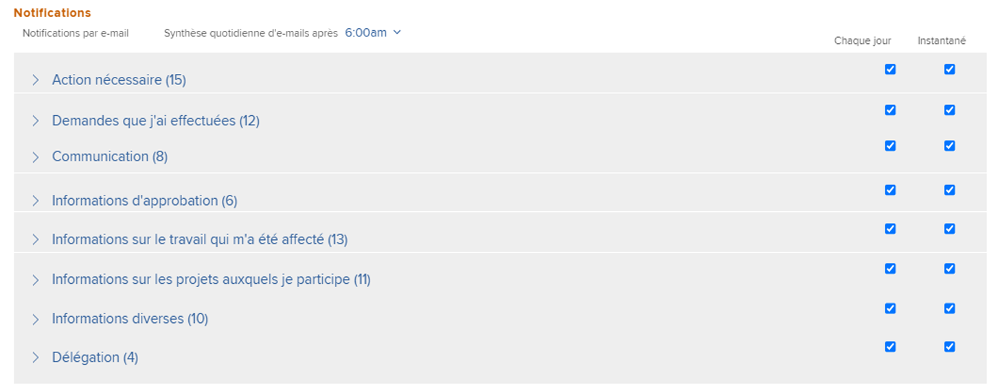
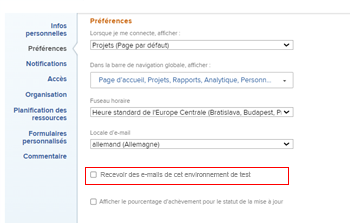

# Modifier vos propres notifications électroniques

<!-- Audited: 1/2024 -->

Votre administrateur ou votre administratrice Adobe [!DNL Workfront] configure les notifications par e-mail que les utilisateurs et les utilisatrices reçoivent lorsque des événements se produisent dans Workfront (comme décrit dans l’article [[!UICONTROL Configurer les notifications d’événements] pour tout le monde dans le système](../../administration-and-setup/manage-workfront/emails/configure-event-notifications-for-everyone-in-the-system.md)).

L’administrateur ou l’administratrice de groupes peut également configurer les notifications qui sont activées pour vous et les personnes composant votre [!UICONTROL groupe principal]. Si votre [!UICONTROL groupe principal] est un sous-groupe, vous recevez les notifications activées pour le groupe de niveau immédiatement supérieur à votre groupe.

Vous pouvez apporter plus de personnalisation en configurant les notifications que vous recevez. Vous pouvez également choisir de recevoir des notifications au fur et à mesure des événements ou dans un e-mail de synthèse quotidienne.

Pour plus d’informations sur les notifications reçues par e-mail, consultez la rubrique [[!DNL Adobe Workfront] Notifications](../../workfront-basics/using-notifications/wf-notifications.md).

>[!NOTE]
>
>* Si vous activez un type de notification puis constatez que vous ne recevez pas de notifications de ce type, c’est peut-être parce que ce type ne s’applique pas à votre rôle.
>* L’administrateur ou l’administratrice [!DNL Workfront], ou un administrateur ou une administratrice de groupe ne peut pas configurer les notifications pour [!DNL Workfront Goals]. Pour plus d’informations sur les notifications que l’administrateur ou l’administratrice [!DNL Workfront] peut configurer, consultez l’article [Configurer les notifications d’événements pour toutes les personnes dans le système](../../administration-and-setup/manage-workfront/emails/configure-event-notifications-for-everyone-in-the-system.md). Pour plus d’informations sur la configuration de notifications individuelles pour [!DNL Workfront Goals], lisez la suite de cet article.
>

## Conditions d’accès

+++ Développez pour afficher les exigences d’accès aux fonctionnalités de cet article.

<table style="table-layout:auto"> 
 <col> 
 </col> 
 <col> 
 </col> 
 <tbody> 
  <tr> 
   <td role="rowheader"><strong>[!DNL Adobe Workfront package]</strong></td> 
   <td> 
Tous
 </td> 
  </tr> 
  <tr> 
   <td role="rowheader"><strong>[!DNL Adobe Workfront] licence</strong></td> 
   <td> 
Contributeur ou supérieur

   
Requête ou supérieur

   </td> 
  </tr> 
 </tbody> 
</table>

Pour plus d’informations, voir [Conditions d’accès requises dans la documentation Workfront](/help/quicksilver/administration-and-setup/add-users/access-levels-and-object-permissions/access-level-requirements-in-documentation.md).

+++

## Afficher et modifier vos paramètres de notification par e-mail

{{step1-click-profile-pic}}

1. Cliquez sur l’icône **[!UICONTROL Plus]**  en regard de votre nom, puis cliquez sur **[!UICONTROL Modifier]**.

1. Dans la zone **[!UICONTROL Modifier une personne]** qui s’affiche, accédez à la section **[!UICONTROL Notifications]**.

1. Cliquez sur une catégorie pour afficher les paramètres de notification associés à cette catégorie.

   

1. Cochez ou décochez les cases à droite pour recevoir ou non des notifications quotidiennement, instantanément ou les deux.

   Vous pouvez également cocher les cases d’une catégorie pour activer ou désactiver toutes les notifications de cette catégorie.

   >[!NOTE]
   >
   >Si vous êtes membre de l’équipe d’un projet, vous continuerez à recevoir des notifications par e-mail jusqu’à ce que vous soyez supprimé de l’équipe, même si vous n’avez plus accès au projet. Pour obtenir des instructions sur la suppression d’utilisateurs ou d’utilisatrices d’une équipe, consultez l’article [Suppression des utilisateurs ou des utilisatrices des projets](../../manage-work/projects/manage-projects/remove-users-from-projects.md).

   Pour la catégorie **[!UICONTROL Communication]**, vous pouvez sélectionner des notifications individuelles pour une diffusion instantanée uniquement. Pour que les notifications soient diffusées dans une synthèse quotidienne, vous devez toutes les sélectionner.

   Si toutes les notifications par e-mail d’une catégorie donnée sont activées, la case du titre de la catégorie apparaît comme étant sélectionnée. Si toutes les notifications par e-mail d’une catégorie donnée sont désactivées, la case est désélectionnée. Si certaines notifications sont activées et que d’autres sont désactivées, la case à cocher de catégorie s’affiche comme une ligne droite.\
   Lorsque vous modifiez un paramètre de notification, le libellé **[!UICONTROL Modifié]** s’affiche pour votre information.

1. Si vous avez sélectionné des notifications à envoyer sous forme de synthèse quotidienne, sélectionnez l’heure de la journée à laquelle vous souhaitez la recevoir en haut de la section **[!UICONTROL Notifications]** dans le menu **[!UICONTROL Synthèse quotidienne par e-mail]**.

   

   La synthèse quotidienne comprend les événements qui répondent aux critères des notifications 24 heures avant l’heure sélectionnée. Vous recevez un une synthèse quotidienne par e-mail pour chaque type de notification.\
   La synthèse quotidienne peut arriver après l’heure sélectionnée, selon le nombre d’e-mails placés en file d’attente pour diffusion dans le système. L’heure indiquée correspond à l’heure locale spécifiée dans les paramètres du navigateur.

1. (Conditionnel et facultatif) Lors de la modification des paramètres des notifications par e-mail dans l’environnement Prévisualisation, activez le paramètre **[!UICONTROL Recevoir des e-mails à partir de cet environnement de test]** pour recevoir des e-mails. Les e-mails ne sont pas générés automatiquement à partir de l’environnement de prévisualisation.

   

1. Cliquez sur **[!UICONTROL Enregistrer les modifications]**.
