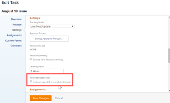

# Joindre une notification de rappel à un objet

Les notifications de rappel peuvent être associées à plusieurs types d’objets différents : Projets, tâches, problèmes, feuilles de calcul, modèles, tâches de modèle et profils de feuille de calcul récurrente.

Avant de pouvoir joindre des notifications de rappel à un objet, une [!DNL Adobe Workfront] L’administrateur doit créer la notification, comme décrit dans la section [Configuration des notifications de rappel](../../administration-and-setup/manage-workfront/emails/set-up-reminder-notifications.md).

Les étapes pour joindre des notifications de rappel sont les mêmes, quel que soit le type d’objet auquel vous les joignez.

## Exigences d’accès

Vous devez disposer des accès suivants pour effectuer les étapes de cet article :

<table style="table-layout:auto"> 
 <col> 
 </col> 
 <col> 
 </col> 
 <tbody> 
  <tr> 
   <td role="rowheader"><strong>[!DNL Adobe Workfront plan*]</strong></td> 
   <td> 
Tous
 </td> 
  </tr> 
  <tr> 
   <td role="rowheader"><strong>[!DNL Adobe Workfront] license*</strong></td> 
   <td> 
[!UICONTROL Work] 
 </td> 
  </tr> 
  <tr> 
   <td role="rowheader"><strong>Paramétrages du niveau d'accès*</strong></td> 
   <td> 
[!UICONTROL Worker] ou version ultérieure
 
Remarque : Si vous n’avez toujours pas accès à , demandez à votre [!DNL Workfront] s’ils définissent des restrictions supplémentaires au niveau de votre accès. Pour plus d’informations sur la manière dont une [!DNL Workfront] l’administrateur peut modifier votre niveau d’accès, voir <a href="../../administration-and-setup/add-users/configure-and-grant-access/create-modify-access-levels.md" class="MCXref xref">Création ou modification de niveaux d’accès personnalisés</a>.
 </td> 
  </tr> 
  <tr> 
   <td role="rowheader"><strong>Autorisations d’objet</strong></td> 
   <td> 
Gérer l’accès à l’objet
 
Pour plus d’informations sur la demande d’accès supplémentaire, voir <a href="../../workfront-basics/grant-and-request-access-to-objects/request-access.md" class="MCXref xref">Demande d’accès aux objets </a>.
 </td> 
  </tr> 
 </tbody> 
</table>

&#42;Pour connaître le plan, le type de licence ou l’accès dont vous disposez, contactez votre [!DNL Workfront] administrateur.

## Joindre des notifications de rappel à un objet

1. Accédez à l&#39;objet auquel vous souhaitez joindre la notification de rappel.
1. Cliquez sur l’icône Modifier .
1. Dans le panneau de gauche du **[!UICONTROL Modifier]** s’affiche, cliquez sur **[!UICONTROL Paramètres]**.

1. Sous **[!UICONTROL Notification de rappel]**, sélectionnez les notifications à joindre à l’objet.

   Dans cet exemple, l’objet en cours de modification est une tâche :

   

   Si la variable [!DNL Workfront] L’administrateur a créé plusieurs notifications de rappel. vous pouvez joindre plusieurs notifications à un seul objet.

1. Cliquez sur **[!UICONTROL Enregistrer les modifications]**.

   Si vous avez besoin d’aide pour tester la diffusion d’une notification de rappel, reportez-vous à la section [!DNL Workfront] administrateur.
