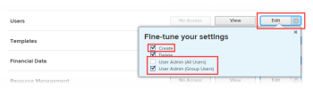

# Activer l’envoi d’e-mails à partir de l’environnement Sandbox de prévisualisation

[!UICONTROL Adobe Workfront] désactive toutes les communications par e-mail dans les environnements de sandbox de prévisualisation et d’actualisation personnalisée. Pour plus d’informations sur l’environnement de sandbox de prévisualisation, voir [Environnement de sandbox de prévisualisation Adobe Workfront](../../administration-and-setup/set-up-workfront/workfront-testing-environments/wf-preview-sandbox-environment.md). Pour plus d’informations sur l’environnement de sandbox d’actualisation personnalisée, voir [Environnement de sandbox d’actualisation personnalisée Adobe Workfront](../../administration-and-setup/set-up-workfront/workfront-testing-environments/wf-custom-refresh-sandbox-environment.md).

Si vous souhaitez recevoir les notifications par e-mail suivantes de l’environnement de sandbox de prévisualisation, vous devez activer cette fonctionnalité dans vos paramètres utilisateur lorsque vous accédez à l’environnement de prévisualisation :

* Notifications par e-mail déclenchées par des notifications d’événements
* Notifications de rappel
* Notifications automatiques de rappel de retard ou d’avance
* Invitations par e-mail

Vous pouvez le faire pour vous-même ou pour toute personne que vous avez le droit de modifier. Pour plus d’informations sur l’accès nécessaire pour modifier les utilisateurs et utilisatrices, voir [Accorder l’accès aux utilisateurs et utilisatrices](../../administration-and-setup/add-users/configure-and-grant-access/grant-access-other-users.md).

>[!NOTE]
>
>La remise de rapports et les notifications push sur l’application mobile sont toujours désactivées dans l’environnement de prévisualisation de sandbox. Ni vous ni l’équipe d’administration [!DNL Workfront] ne pouvez activer la diffusion de rapports ou les notifications push pour l’application mobile lorsque vous accédez à l’environnement de sandbox de prévisualisation.
>
>Pour plus d’informations sur les diffusions de rapports, voir [Vue d’ensemble des diffusions de rapports](../../reports-and-dashboards/reports/creating-and-managing-reports/set-up-report-deliveries.md).

## Conditions d’accès

Vous devez disposer des accès suivants pour effectuer les étapes décrites dans cet article :

<table style="table-layout:auto"> 
 <col> 
 </col> 
 <col> 
 </col> 
 <tbody> 
  <tr> 
   <td role="rowheader"><strong>[!DNL Adobe Workfront plan*]</strong></td> 
   <td> 
Tous
 </td> 
  </tr> 
  <tr> 
   <td role="rowheader"><strong>[!DNL Adobe Workfront] licence*</strong></td> 
   <td> 
[!UICONTROL Request] ou de niveau supérieur pour modifier vos propres paramètres
 
[!UICONTROL Plan] pour modifier les paramètres des autres utilisateurs et utilisatrices
 </td> 
  </tr> 
  <tr> 
   <td role="rowheader"><strong>Configurations du niveau d’accès*</strong></td> 
   <td> 
Vous devez disposer de l’une des autorisations suivantes :
 
    <ul> 
     <li> 
Niveau d’accès [!UICONTROL System Administrator].
 
 Pour plus d’informations sur ce niveau d’accès, voir <a href="../../administration-and-setup/add-users/configure-and-grant-access/grant-a-user-full-administrative-access.md" class="MCXref xref">Accorder à un utilisateur ou une utilisatrice un accès administratif complet</a>. 
 </li> 
     <li> 
Dans votre niveau d’accès, [!UICONTROL Edit] doit être sélectionné pour le paramètre [!UICONTROL Users]. Pour le paramètre [!UICONTROL Users], sous [!UICONTROL Fine-tune your settings] , l’option [!UICONTROL Create] et au moins l’une des deux options [!UICONTROL User Admin] doivent être activées. 
 
Si vous utilisez l’option [!UICONTROL User Admin (Group Users)], vous devez faire partie de l’équipe d’administration du groupe dont la personne est membre.
 
  
 
Pour plus d’informations sur le paramètre [!UICONTROL Users] dans un niveau d’accès, voir <a href="../../administration-and-setup/add-users/configure-and-grant-access/grant-access-other-users.md" class="MCXref xref">Accorder l’accès aux utilisateurs et utilisatrices</a>.
 </li> 
    </ul> 
Note : si vous ne disposez toujours pas d’un accès, demandez à votre équipe d’administration [!DNL Workfront] si elle a défini des restrictions supplémentaires sur votre niveau d’accès. Pour savoir comment une équipe d’administration [!DNL Workfront] peut modifier votre niveau d’accès, voir <a href="../../administration-and-setup/add-users/configure-and-grant-access/create-modify-access-levels.md" class="MCXref xref">Créer ou modifier des niveaux d’accès personnalisés</a>.
 </td> 
  </tr> 
 </tbody> 
</table>

&#42;Pour connaître la formule, le type de licence ou l’accès dont vous disposez, contactez votre administrateur ou administratrice [!DNL Workfront].

## Activer l’envoi d’e-mails à partir de l’environnement de sandbox de prévisualisation

1. Connectez-vous à votre environnement de sandbox de prévisualisation.
1. Cliquez sur votre photo de profil dans le coin supérieur droit d’[!DNL Adobe Workfront]. Ensuite, cliquez sur le menu **[!UICONTROL Plus]** et sélectionnez **[!UICONTROL Modifier]**.

   Ou

   Recherchez un utilisateur ou une utilisatrice dans [!DNL Workfront] et cliquez sur son nom. Ensuite, cliquez sur le menu **[!UICONTROL Plus]** et sélectionnez **[!UICONTROL Modifier]**.

   Ou

   Pour plusieurs utilisateurs : cliquez sur l’icône **[!UICONTROL Menu principal]**  dans le coin supérieur droit de Workfront, puis cliquez sur **[!UICONTROL Utilisateurs]** .  Sélectionnez ensuite plusieurs utilisateurs et utilisatrices, et cliquez sur **[!UICONTROL Modifier]**.

1. Cliquez sur **[!UICONTROL Préférences]**.
1. Sélectionnez **[!UICONTROL Recevoir des e-mails de cet environnement de test]**.

   >[!NOTE]
   >
   >Cette option n’est pas disponible si vous êtes dans un environnement de production.

1. Cliquez sur **[!UICONTROL Enregistrer les modifications]**.
