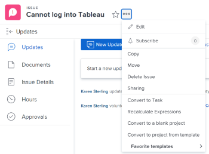
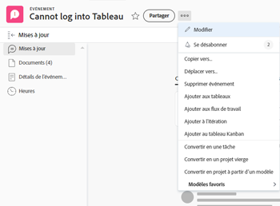
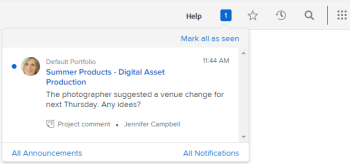

# S’abonner aux éléments dans [!DNL Adobe Workfront]

[!UICONTROL Adobe Workfront] envoie des notifications sur les éléments qui vous sont affectés ou qui vous appartiennent. Si vous souhaitez suivre la communication sur des éléments qui ne vous sont pas affectés mais qui peuvent avoir un impact sur votre travail, vous pouvez vous y abonner.

Vous pouvez également tenir votre responsable et vos pairs informés de votre travail en les abonnant au statut de mise à jour des éléments pour lesquels vous disposez des autorisations [!UICONTROL Gérer] et [!UICONTROL Partager].

Actuellement, vous pouvez vous abonner aux éléments suivants :

* Problèmes
* Tâches
* Projets

Lorsque vous vous abonnez à des problèmes, des tâches ou des projets, vous recevez des notifications in-app lorsque quelqu’un publie un commentaire à leur sujet. Selon les fonctions que vous avez activées, vous pouvez également recevoir des notifications push par e-mail et par application mobile pour les éléments auxquels vous avez souscrit un abonnement.

>[!NOTE]
>
>Les autres événements auxquels vous avez souscrit un abonnement ne vous seront pas signalés. Vous recevrez un avertissement uniquement lorsque quelqu’un postera un commentaire sur l’élément.

Pour plus d’informations sur l’utilisation des abonnements, consultez [À propos de l’utilisation des abonnements](#about-working-with-subscriptions).

## Conditions d’accès

Vous devez disposer des accès suivants pour effectuer les étapes décrites dans cet article :

<table style="table-layout:auto"> 
 <col> 
 </col> 
 <col> 
 </col> 
 <tbody> 
  <tr> 
   <td role="rowheader"><strong>Plan [!UICONTROL Adobe Workfront]*</strong></td> 
   <td> 
Tous
 </td> 
  </tr> 
  <tr> 
   <td role="rowheader"><strong>[!DNL Adobe Workfront] licence*</strong></td> 
   <td> 
[!UICONTROL Request] ou version ultérieure
 </td> 
  </tr> 
  <tr> 
   <td role="rowheader"><strong>Configurations du niveau d’accès*</strong></td> 
   <td> 
Si votre administrateur ou administratrice [!DNL Workfront] a activé <strong>[!UICONTROL View only updates in which they have been included in the conversation]</strong> dans votre niveau d’accès, vous ne pouvez pas vous abonner à des éléments dans [!DNL Workfront].
 
Note : si vous n’avez toujours pas accès, demandez à votre administrateur ou administratrice [!UICONTROL Workfront] s’il ou elle a défini des restrictions supplémentaires dans votre niveau d’accès. Pour savoir comment un administrateur ou une administratrice [!UICONTROL Workfront] peut modifier votre niveau d’accès, consultez <a href="../../administration-and-setup/add-users/configure-and-grant-access/create-modify-access-levels.md" class="MCXref xref">Créer ou modifier des niveaux d’accès personnalisés</a>.
 </td> 
  </tr> 
  <tr> 
   <td role="rowheader"><strong>Autorisations d’objet</strong></td> 
   <td> 
L’accès [!UICONTROL View] ou supérieur au projet, à la tâche ou au problème (pour s’abonner)
 
L’accès [!UICONTROL Manage] et les autorisations [!UICONTROL Share] au projet, à la tâche ou au problème (pour abonner d’autres personnes)
 </td> 
  </tr> 
 </tbody> 
</table>

Pour connaître le plan, le type de licence ou l’accès dont vous disposez, contactez l’administration de [!DNL Workfront].

## S’abonner à un élément

La procédure d’abonnement à un élément est identique pour tous les éléments.

Par exemple, pour s’abonner à un problème :

1. Accédez au problème auquel vous souhaitez vous abonner.

   >[!TIP]
   >
   >Pour vous abonner à des projets, vous pouvez procéder de l’une des manières suivantes :
   >
   >* Accédez au projet auquel vous souhaitez vous abonner, cliquez sur l’icône **[!UICONTROL Plus]**  à droite du nom du projet, puis sur **[!UICONTROL S’abonner]**.
   >* Dans une liste de projets ou un rapport, sélectionnez un projet, cliquez sur l’icône **[!UICONTROL Plus]**  en haut de la liste, puis cliquez sur **[!UICONTROL S’abonner]**. Cette action n’est disponible que dans une liste de projets.

1. Cliquez sur **[!UICONTROL Plus]** , puis sur **[!UICONTROL S’abonner]**.

   

   Une coche apparaît sur la cloche et le chiffre à côté se met à jour pour vous ajouter au nombre d’utilisateurs et utilisatrices abonnés.

   Vous faites désormais partie des personnes abonnées au problème. Le statut de mise à jour du problème indique que vous êtes une personne abonnée au problème.

   Chaque fois que quelqu’un commente le problème, vous recevez une notification in-app. Selon les fonctions que vous avez activées, vous pouvez également recevoir des notifications par e-mail et des notifications push dans l’application mobile.

   Pour en savoir plus sur l’e-mail d’abonnement, consultez [Modifier vos propres notifications par e-mail](../../workfront-basics/using-notifications/activate-or-deactivate-your-own-event-notifications.md).

## Se désabonner d’un élément

Vous pouvez facilement vous désabonner d’un élément dans [!DNL Workfront]. La procédure de désabonnement d’un élément dans [!DNL Workfront] est identique pour tous les éléments.

Par exemple, pour se désabonner d’un problème :

1. Accédez au problème dont vous souhaitez vous désabonner.

   >[!TIP]
   >
   >Pour vous désabonner des projets, vous pouvez procéder de l’une des manières suivantes :
   >
   >* Accédez au projet dont vous souhaitez vous désabonner, cliquez sur l’icône **[!UICONTROL Plus]**  à droite du nom du projet, puis sur **[!UICONTROL Se désabonner]**.
   >* Dans une liste de projets ou un rapport, sélectionnez un projet, cliquez sur l’icône **[!UICONTROL Plus]**  en haut de la liste, puis cliquez sur **[!UICONTROL Se désabonner]**. Cette action n’est disponible que dans une liste de projets.

1. Cliquez sur **[!UICONTROL Plus]** , puis sur **[!UICONTROL Se désabonner]**.

   

1. Vous pouvez également vous désabonner d’un élément auquel vous avez souscrit un abonnement en cliquant sur le lien [!UICONTROL Se désabonner] dans l’e-mail d’abonnement.

   Lorsque vous vous désabonnez d’un élément, vous ne recevez plus de notification lorsque quelqu’un commente le problème.

   Le statut de mise à jour de l’élément indique que vous avez annulé votre abonnement au problème.

## Gérer les personnes abonnées

Vous pouvez gérer les personnes qui s’abonnent aux projets, aux tâches et aux problèmes pour lesquels vous avez des autorisations de gestion et de partage.

* [Abonner une autre personne à un élément](#subscribe-another-user-to-an-item)
* [Désinscrire une autre personne d’un élément](#unsubscribe-another-person-from-an-item)

Toutes les personnes abonnées disposent d’autorisations d’[!UICONTROL affichage] pour les éléments auxquels elles sont abonnées. Si les nouvelles personnes abonnées disposent déjà d’autorisations pour l’élément, celles-ci sont conservées.

### Abonner une autre personne à un élément

1. Accédez à l’élément auquel vous souhaitez abonner une autre personne.

   >[!TIP]
   >
   >Pour abonner une autre personne à des projets, vous pouvez effectuer l’une des opérations suivantes :
   >
   >* Accédez au projet auquel vous souhaitez abonner d’autres personnes, ou
   >   
   >* accédez à une liste de projets ou à un rapport et sélectionnez un projet.

1. Cliquez sur **[!UICONTROL Plus]** .
1. Cliquez sur la bulle numérique en regard du lien **[!UICONTROL S’abonner]**.
1. Dans la boîte qui apparaît, commencez à entrer le nom de l’utilisateur ou de l’utilisatrice dans la boîte **[!UICONTROL Abonner d’autres personnes]**, puis sélectionnez son nom dans les options affichées.

1. (Facultatif) Pour ajouter d’autres personnes abonnées, répétez l’étape 4.
1. Cliquer sur **[!UICONTROL Enregistrer]**.

La personne abonnée n’est pas notifiée de l’abonnement, mais une entrée concernant l’abonnement est ajoutée aux mises à jour du système pour l’élément.

Lorsqu’une personne ajoute un commentaire à l’onglet [!UICONTROL Mises à jour] de l’élément, la personne abonnée reçoit une notification in-app. En fonction des fonctionnalités activées par votre administrateur ou administratrice Workfront, la personne abonnée peut également recevoir des notifications par e-mail et par mobile concernant l’élément.

### Désinscrire une autre personne d’un élément

1. Accédez à l’élément dont vous souhaitez désinscrire une autre personne.

   >[!TIP]
   >
   >Pour désabonner une autre personne des projets, vous pouvez effectuer l’une des opérations suivantes :
   >
   >* Accédez au projet dont vous souhaitez désabonner d’autres personnes, ou
   >   
   >* accédez à une liste de projets ou à un rapport et sélectionnez un projet.

1. Cliquez sur **[!UICONTROL Plus]** .
1. Cliquez sur la bulle numérique en regard du lien **[!UICONTROL S’abonner]** ou **[!UICONTROL Se désabonner]**.
1. Sur la page **[!UICONTROL Personnes abonnées]** qui s’affiche, cliquez sur le « X » en regard du nom de l’utilisateur ou de l’utilisatrice que vous souhaitez désabonner.

   Ou

   Commencez à saisir le nom de l’utilisateur ou de l’utilisatrice dans la zone **[!UICONTROL Rechercher des personnes dans la liste]**, puis cliquez sur le « X » à droite du nom de la personne.

1. Cliquer sur **[!UICONTROL Enregistrer]**.

   La personne n’est pas informée de son désabonnement à l’élément, mais une entrée concernant l’abonnement est ajoutée aux mises à jour du système pour l’élément.

## Recevoir une notification in-app

Dès qu’une personne publie un commentaire sur un élément auquel vous avez souscrit un abonnement, vous recevez une notification in-app.

Pour plus d’informations, voir [Afficher et gérer les notifications in-app](../../workfront-basics/using-notifications/view-and-manage-in-app-notifications.md).

## Recevoir l’e-mail d’abonnement

Selon les fonctions activées votre administrateur ou administratrice de [!UICONTROL Workfront], vous pouvez recevoir des e-mails d’abonnement en plus des notifications in-app lorsqu’une personne publie un commentaire sur un élément auquel vous avez souscrit un abonnement.

Pour plus d’informations sur la configuration ou la désactivation des e-mails, voir [Configurer les notifications d’événements pour tous les utilisateurs et utilisatrices du système](../../administration-and-setup/manage-workfront/emails/configure-event-notifications-for-everyone-in-the-system.md).

>[!NOTE]
>
>Même si vous désactivez les e-mails d’abonnement, vous continuerez à recevoir des notifications in-app lorsqu’une personne publie un commentaire sur un article auquel vous avez souscrit un abonnement.

## Répertorier les utilisateurs et utilisatrices abonnés à un élément

Pour afficher les personnes abonnées à un élément, procédez comme suit :

1. Accédez à un élément dont vous souhaitez voir les personnes abonnées.

   Si des personnes sont abonnées à l’élément, le nombre de personnes abonnées s’affiche en regard de la cloche. Vous pouvez pointer sur le chiffre pour afficher la liste des personnes abonnées à l’élément. Les 25 premières personnes abonnées s’affichent par ordre alphabétique.

   

   Vous pouvez également afficher une liste des personnes abonnées en ajoutant un champ [!UICONTROL Personnes abonnées] comme colonne dans un rapport ou dans une vue de l’élément abonné. Pour plus d’informations, voir [Glossaire de la terminologie  [!DNL Adobe Workfront] ](../../workfront-basics/navigate-workfront/workfront-navigation/workfront-terminology-glossary.md).

## Comment utiliser des abonnements

Tenez compte des éléments suivants lorsque vous travaillez avec des abonnements :

* L’administration de [!DNL Workfront] ne contrôle pas ce à quoi les utilisateurs et utilisatrices peuvent ou ne peuvent pas s’abonner.

  Toute personne disposant de l’autorisation [!UICONTROL Affichage] ou d’une autorisation supérieure pour une tâche, un problème ou un projet peut s’y abonner.

* Les abonnements ne peuvent pas être configurés pour une synthèse quotidienne par e-mail.
* Si vous vous abonnez à une tâche, un problème ou un projet et que vous en êtes également la personne cessionnaire, la personne de contact principale ou la personne propriétaire du projet, vous recevrez l’e-mail d’abonnement uniquement lorsqu’une personne commente l’élément auquel vous vous avez souscrit un abonnement.

  Pour plus d’informations sur les notifications par e-mail qui se déclenchent lorsqu’une personne commente l’un de vos éléments, consultez la section [Notifications dans Adobe Workfront](../../workfront-basics/using-notifications/wf-notifications.md).

* Si vous vous abonnez à un élément et que vous le commentez, vous ne recevrez pas d’e-mail d’abonnement concernant ce commentaire, à moins que vous n’incluiez votre nom dans le commentaire.
* Si la personne qui commente l’article rend le commentaire privé en le verrouillant et que vous ne faites pas partie de la même entreprise que cette personne, vous ne recevrez pas de notification pour ce commentaire. Pour plus d’informations sur la façon de rendre un commentaire réservé à votre entreprise, consultez la section [Ajouter une mise à jour à un élément de travail](../../workfront-basics/updating-work-items-and-viewing-updates/update-work.md#add) dans [Mettre à jour le travail](../../workfront-basics/updating-work-items-and-viewing-updates/update-work.md).

* Vous ne pouvez pas créer de rapport pour les abonnements. Un audit est enregistré dans le statut de mise à jour de chaque élément lorsqu’une personne s’abonne ou se désabonne de l’élément.
* Les commentaires laissés sur les objets enfant ne déclenchent pas de notifications d’abonnement pour les objets parent. Si vous vous abonnez à un projet, vous recevrez uniquement des notifications sur les commentaires de ce projet. Vous ne recevrez pas de notification des commentaires effectués sur les éléments enfants associés au projet (c’est-à-dire les tâches ou les problèmes), à moins que vous ne vous abonniez à chaque élément enfant. Pour plus d’informations sur les relations entre les objets, voir la section [Interdépendance et hiérarchie des objets](../../workfront-basics/navigate-workfront/workfront-navigation/understand-objects.md#understanding-interdependency-and-hierarchy-of-objects) dans [Comprendre les objets dans  [!DNL Adobe Workfront]](../../workfront-basics/navigate-workfront/workfront-navigation/understand-objects.md).
