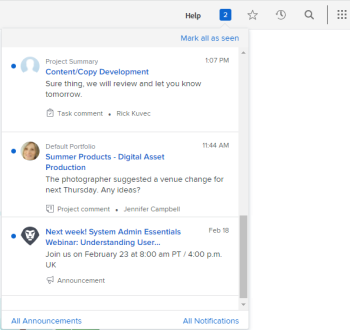
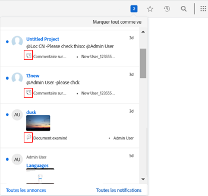

# Afficher et gérer les notifications in-app

Les notifications in-app vous donnent deux types d’informations : les notifications d’annonce et les notifications d’élément de travail. Elles sont disponibles à la fois dans l’application web et dans l’application mobile.

Pour obtenir une liste des notifications d’éléments de travail et d’annonces que vous pouvez recevoir, voir [Vue d’ensemble des notifications in-app](../../workfront-basics/using-notifications/in-app-notifications-overview.md).

>[!NOTE]
>
>* Les notifications in-app pour les activités de travail ne sont pas liées aux notifications par e-mail dans [!DNL Workfront]. Pour plus d’informations, voir [[!DNL Adobe Workfront] Notifications](../../workfront-basics/using-notifications/wf-notifications.md)
>* Les notifications in-app ne peuvent pas être personnalisées.
>

## Conditions d’accès

Vous devez disposer des accès suivants pour effectuer les étapes décrites dans cet article :

<table style="table-layout:auto"> 
 <col> 
 </col> 
 <col> 
 </col> 
 <tbody> 
  <tr> 
   <td role="rowheader"><strong>[!DNL Adobe Workfront] formule*</strong></td> 
   <td> 
Tous
 </td> 
  </tr> 
  <tr> 
   <td role="rowheader"><strong>[!DNL Adobe Workfront] licence*</strong></td> 
   <td> 
[!UICONTROL Request] ou version ultérieure
 </td> 
  </tr> 
 </tbody> 
</table>

Pour connaître le type de plan ou de licence dont vous disposez, contactez votre équipe d’administration [!DNL Workfront].

## Afficher les notifications

L’icône numérotée dans le coin supérieur droit de [!DNL Workfront] affiche le nombre de notifications que vous n’avez pas encore confirmées.

>[!NOTE]
>
>Vous pouvez consulter toutes les notifications in-app à partir de l’application web et de l’application mobile. Seules certaines notifications sont envoyées sous forme de notifications push dans l’application mobile. Pour plus d’informations sur les notifications dans l’application mobile, voir [[!DNL Adobe Workfront] pour iOS](../../workfront-basics/mobile-apps/using-the-workfront-mobile-app/workfront-for-ios.md) ou [[!DNL Adobe Workfront] pour Android](../../workfront-basics/mobile-apps/using-the-workfront-mobile-app/workfront-for-android.md).

1. Cliquez sur l’icône numérotée  dans le coin supérieur droit de [!DNL Workfront] pour ouvrir votre liste de notifications.

   Vos dernières notifications non lues apparaissent sous l’icône numérotée, les plus récentes étant placées en haut.

   

   Jusqu’à 80 notifications s’affichent dans une liste déroulante. Pour en voir plus, vous pouvez cliquer sur **[!UICONTROL Toutes les notifications]** en bas de la liste pour afficher jusqu’à 100 notifications. Les notifications sont automatiquement supprimées après 30 jours.

   Au bas de chaque notification,vous trouverez le [!UICONTROL type de notification] et une icône d’identification correspondante. Ces éléments vous aident à identifier ce qui s’est passé avec l’élément [!DNL Workfront] mentionné et vous alertent si vous avez un élément action :

   * Les notifications d’annonces sont signalées par l’icône [!UICONTROL Annonces] .

   * Toutes les autres notifications sont indiquées par des icônes qui suggèrent le type d’élément de travail auquel elles sont associées.

     
L’icône située à droite du point bleu affiche l’un des éléments suivants :

   * Photo de profil de la personne qui a saisi l’information, généralement une mise à jour concernant un objet [!DNL Workfront] sur lequel vous travaillez.
   * Logo [!DNL Workfront], si la notification est une annonce système.

1. (Facultatif) Si vous souhaitez afficher la date à laquelle vous avez reçu une notification, passez la souris sur l’indicateur de jour ou d’heure dans le coin supérieur droit de la notification.

   

1. Cliquez sur la notification que vous souhaitez afficher :

   * Si la notification sur laquelle vous cliquez concerne un élément de travail, l’objet [!DNL Workfront] associé s’ouvre et affiche le message complet dans l’onglet **[!UICONTROL Mises à jour]**. Vous pouvez **[!UICONTROL Démarrer une nouvelle zone de mise à jour]** ou **[!UICONTROL Saisir une réponse]**.

     

   * Si la notification sur laquelle vous cliquez concerne une annonce , la page **[!UICONTROL Annonces]** s’affiche, avec la liste de toutes vos annonces. L’annonce sur laquelle vous avez cliqué est sélectionnée à gauche et le message est affiché à droite.

     

1. (Facultatif) Téléchargez les pièces jointes incluses dans le message de notification ou téléchargez toutes les pièces jointes sous forme de fichier ZIP.

   

## Confirmer des notifications

Après avoir consulté les notifications, vous pouvez les confirmer pour les supprimer de la liste [!UICONTROL Notifications] ou les laisser pour y répondre ultérieurement.

Sur la page [!UICONTROL Notifications], vous pouvez voir les notifications en cours et celles qui ont été effacées. Vous pouvez également ramener les notifications effacées dans la liste [!UICONTROL Notifications].

* [Confirmer des notifications](#acknowledge-notifications)
* [Afficher des notifications confirmées](#view-acknowledged-notifications)

### Confirmer des notifications

Le fait de cliquer sur l’icône numérotée pour ouvrir la liste des notifications ne signifie pas automatiquement que vous avez confirmé toutes les notifications.

Pour confirmer une notification et la supprimer de la liste des notifications, procédez comme suit :

1. Cliquez sur l’icône numérotée  dans le coin supérieur droit de [!DNL Workfront] pour ouvrir votre liste de notifications.
1. Utilisez l’une des méthodes suivantes :

   * Cliquez sur le point bleu dans le coin supérieur gauche de la notification.
   * Si la notification concerne un élément de travail (et non pas une annonce), cliquez sur la notification pour accéder à l’élément.
   * Si la notification concerne une annonce, cliquez sur la notification pour ouvrir la page **[!UICONTROL Annonces]**.
   * Cliquez sur **[!UICONTROL Toutes les notifications]** dans le coin inférieur droit de la liste des notifications pour afficher la page **[!UICONTROL Notifications]**, puis cliquez sur **[!UICONTROL Marquer tout comme vu]** dans le coin supérieur droit de Workfront.

### Afficher des notifications confirmées

Pour consulter les notifications que vous avez déjà confirmées, procédez comme suit :

1. Cliquez sur l’icône numérotée  dans le coin supérieur droit de [!DNL Workfront] pour ouvrir votre liste de notifications.
1. Cliquez sur **[!UICONTROL Toutes les notifications]** dans le coin inférieur droit de votre liste de notifications.
1. Sur la page **[!UICONTROL Notifications]** qui s’affiche, faites défiler vers le bas pour afficher les notifications antérieures.
1. (Facultatif) Pour ramener une notification que vous avez confirmée dans votre liste de notifications, cliquez sur le cercle bleu à côté de la notification.

## Supprimer une notification d’annonce

Vous ne pouvez pas supprimer les notifications d’éléments de travail. [!DNL Workfront] supprime toutes les notifications (qu’elles soient lues ou non) après 30 jours.

Toutefois, vous pouvez supprimer une notification d’annonce. Vous pouvez également accéder à une annonce que vous avez supprimée dans les 30 jours suivant sa suppression. [!DNL Workfront] ne supprime pas automatiquement les annonces.

* [Supprimer une annonce](#delete-an-announcement)
* [Accéder à une annonce récemment supprimée et la restaurer](#access-and-restore-an-announcement-you-deleted-recently)

### Supprimer une annonce

1. Cliquez sur l’icône numérotée  dans le coin supérieur droit de [!DNL Workfront] pour ouvrir votre liste de notifications.
1. Cliquez sur **[!UICONTROL Annonces]** ou sur **[!UICONTROL Voir toutes les annonces]**.

1. Sur la page **[!DNL Announcements]** qui s’affiche, cliquez sur l’annonce que vous souhaitez supprimer dans la liste de gauche, puis cliquez sur **[!UICONTROL Supprimer]** dans le coin supérieur droit de la page.

### Accéder à une annonce récemment supprimée et la restaurer

Vous pouvez accéder aux notifications que vous avez supprimées au cours des 30 derniers jours.

1. Cliquez sur l’icône numérotée  dans le coin supérieur droit de [!DNL Workfront] pour ouvrir votre liste de notifications.
1. Cliquez sur **[!UICONTROL Annonces]** ou **[!UICONTROL Afficher toutes les annonces]**.

1. Dans la page **[!UICONTROL Annonces]** qui s’affiche, cliquez sur **[!UICONTROL Supprimées]**.

1. Cliquez sur le message que vous souhaitez afficher.
1. (Facultatif) Si vous souhaitez restaurer l’annonce, cliquez sur **[!UICONTROL Déplacer vers la boîte de réception]** au-dessus et à droite du corps de l’annonce.
