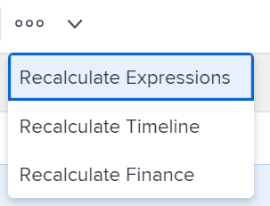

# Modifier les informations dans les champs des formulaire personnalisés

<!--Audited: 10/2025-->

Vous pouvez modifier les informations d’un formulaire personnalisé après l’avoir joint à un objet. Pour plus d’informations sur l’ajout de formulaires personnalisés aux objets, voir [Ajouter un formulaire personnalisé à un objet](../../workfront-basics/work-with-custom-forms/add-a-custom-form-to-an-object.md).

## Conditions d’accès

+++ Développez pour afficher les exigences d’accès aux fonctionnalités de cet article.

<table style="table-layout:auto"> 
 <col> 
 <col> 
 <tbody> 
  <tr> 
   <td role="rowheader"> 
Package Adobe Workfront
 </td> 
   <td>Tous</td> 
  </tr> 
  <tr> 
   <td role="rowheader"> 
Licence Adobe Workfront
 </td> 
   <td> 
Contributeur ou version ultérieure
 
   
Requête ou supérieure
 </td> 
  </tr> 
  <tr data-mc-conditions=""> 
   <td role="rowheader">Configurations des niveaux d’accès</td> 
   <td> 
Accédez à l’objet pour lequel vous souhaitez modifier des informations sur le formulaire personnalisé.
 </td> 
  </tr> 
  <tr data-mc-conditions=""> 
   <td role="rowheader"> 
Autorisations d’objet
 </td> 
   <td> 
    <ul> 
     <li> 
Autorisation de contribution ou supérieure sur l’objet dont vous souhaitez modifier le formulaire personnalisé.
 </li> 
     <li>
Autorisations d’affichage des champs que vous souhaitez modifier.
</li> 
     <li>
Autorisations de modification pour les sections du formulaire qui contiennent les champs à modifier.
</li> 
    </ul></td> 
  </tr> 
 </tbody> 
</table>

Pour plus d’informations, voir [Conditions d’accès requises dans la documentation Workfront](/help/quicksilver/administration-and-setup/add-users/access-levels-and-object-permissions/access-level-requirements-in-documentation.md).

+++

<!--Old:
<table style="table-layout:auto"> 
 <col> 
 <col> 
 <tbody> 
  <tr> 
   <td role="rowheader"> 
Adobe Workfront plan*
 </td> 
   <td>Team or higher</td> 
  </tr> 
  <tr> 
   <td role="rowheader"> 
Adobe Workfront licenses*
 </td> 
   <td> 
Request or higher
 </td> 
  </tr> 
  <tr data-mc-conditions=""> 
   <td role="rowheader">Access level*</td> 
   <td> 
Edit access to the object for which you want to edit the custom form
 
Note: If you still don't have access, ask your Workfront administrator if they set additional restrictions in your access level. For information on how a Workfront administrator can change your access level, see <a href="../../administration-and-setup/add-users/configure-and-grant-access/create-modify-access-levels.md" class="MCXref xref">Create or modify custom access levels</a>.
 </td> 
  </tr> 
  <tr data-mc-conditions=""> 
   <td role="rowheader"> 
Object permissions
 </td> 
   <td> 
    <ul> 
     <li> 
Contribute or higher permissions on the object for which you want to edit the custom form
 </li> 
     <li>View permissions on the fields you want to edit. For information about sharing permissions for custom fields, see <a href="/help/quicksilver/administration-and-setup/customize-workfront/create-manage-custom-forms/form-designer/manage-a-form/share-custom-fields.md" class="MCXref xref">Configure sharing for custom fields and widgets</a>.</li> 
     <li> 
Edit permissions for the sections on the form where the fields you want to edit are located
 </li> 
    </ul> 
For information on requesting additional access for objects, see <a href="../../workfront-basics/grant-and-request-access-to-objects/request-access.md" class="MCXref xref">Request access to objects </a>.
 </td> 
  </tr> 
 </tbody> 
</table>-->

## Conditions préalables

* L’équipe d’administration Workfront ou l’utilisateur ou utilisatrice Plan ayant accès à des formulaires personnalisés doit créer des formulaires personnalisés dans votre environnement. Pour plus d’informations, voir [Créer un formulaire personnalisé](/help/quicksilver/administration-and-setup/customize-workfront/create-manage-custom-forms/form-designer/design-a-form/design-a-form.md).
* Vous devez avoir des formulaires personnalisés joints à un objet.

  Pour plus d’informations sur l’application de formulaires personnalisés à un objet, voir [Ajouter un formulaire personnalisé à un objet](../../workfront-basics/work-with-custom-forms/add-a-custom-form-to-an-object.md).

## Modifier les informations d’un formulaire personnalisé

La modification des informations d’un formulaire personnalisé joint à un objet est similaire pour la plupart des objets.

Pour plus d’informations sur les objets pouvant avoir un formulaire personnalisé, voir [Vue d’ensemble des formulaires personnalisés](../../administration-and-setup/customize-workfront/create-manage-custom-forms/custom-forms-overview.md).

1. Accédez à n’importe quelle liste d’objets pour lesquels vous souhaitez modifier des informations sur le formulaire personnalisé, à l’exception d’une liste d’itérations.
1. Sélectionnez un ou plusieurs objets dans la liste, puis cliquez sur l&#39;icône **Modifier**  en haut de la liste.
1. Cliquez sur **Custom Forms** dans le panneau de gauche, dans la zone **Edit &lt; object >**.

   Lorsqu’un formulaire personnalisé est joint à l’objet , le nom du formulaire s’affiche sous forme de zone dans la section **Custom Forms**.
1. Commencez à saisir des informations dans les champs auxquels vous avez accès.

   

   Si plusieurs formulaires personnalisés sont joints à l’objet , faites-le pour chaque formulaire.

   Selon le type de champ dans lequel vous travaillez, tenez compte des éléments suivants :

   * Vous ne pouvez sélectionner qu’une seule option pour les champs à cases d’option.
   * Vous pouvez sélectionner une ou plusieurs options dans un champ à cases à cocher, selon la manière dont le créateur ou la créatrice du formulaire a configuré le champ.
   * Vous pouvez sélectionner une ou plusieurs options dans un champ déroulant à sélection multiple, en fonction de la manière dont le créateur ou la créatrice du formulaire a configuré le champ.
   * Vous ne pouvez formater les champs de texte (gras, italique ou souligné) que si la personne qui a créé le formulaire les a configurés en tant que type de champ Champ de texte avec formatage. Les types Champs de texte à ligne simple et Champs de texte de paragraphe ne peuvent pas être formatés.
   * Vous pouvez mettre à jour l’heure dans un champ de type de champ Date uniquement si la personne qui a créé le formulaire l’a indiqué lors de la création du champ.

   >[!NOTE]
   >
   >Les champs qui autorisent plusieurs sélections peuvent limiter le nombre d’options que vous pouvez choisir. Les cases à cocher et les listes déroulantes à sélection multiple sont limitées à 5 000 sélections.

   Pour plus d’informations sur tous les types de champ, voir [Création d’un formulaire personnalisé](/help/quicksilver/administration-and-setup/customize-workfront/create-manage-custom-forms/form-designer/design-a-form/design-a-form.md).

1. Cliquer sur **Enregistrer**.

   >[!IMPORTANT]
   >
   >Vous devez remplir tous les champs obligatoires du formulaire avant de pouvoir l’enregistrer. Le nom d’un champ obligatoire est suivi d’un astérisque.
   >
   >

   Lorsque quelqu’un modifie des données dans un autre objet qui est référencé par des champs personnalisés calculés dans votre objet, les modifications ne sont pas reflétées automatiquement dans votre objet. Pour plus d’informations sur la mise à jour manuelle de tous les champs personnalisés calculés dans votre objet, voir [Recalculer tous les champs personnalisés calculés pour un objet](#recalculate-all-calculated-custom-fields-for-an-object) dans cet article.

   Lorsque les champs dépendants de la page sont modifiés, les champs calculés du formulaire personnalisé sont recalculés dynamiquement en temps réel. Vous pouvez voir la nouvelle valeur du champ calculé sans enregistrer le formulaire, mais elle n’est pas réellement appliquée au formulaire et à l’objet tant que vous n’avez pas enregistré les modifications. Cela s’applique aux champs calculés des formulaires par défaut et des formulaires personnalisés.

   Vous pouvez également mettre à jour manuellement tous les champs personnalisés calculés pour un objet lorsque vous modifiez l’objet en bloc avec d’autres objets dans une liste. Pour les instructions, voir [Recalculer tous les champs personnalisés calculés pour plusieurs objets d’une liste lors de la modification des objets](#recalculate-all-calculated-custom-fields-for-multiple-objects-in-a-list-when-editing-the-objects) dans cet article.

1. (Conditionnel) Pour mettre à jour les champs personnalisés d’un formulaire personnalisé d’itération, procédez comme suit :

   1. Accédez à une itération.
   1. Cliquez sur **Formulaires personnalisés** dans le panneau de gauche.
   1. Pour ajouter des formulaires personnalisés, commencez à saisir le nom d’un formulaire dans le champ **Ajouter un formulaire personnalisé** dans le coin supérieur droit de la page

      Ou

      Cliquez sur l’icône **Modifier** dans la même zone pour commencer à modifier les champs des formulaires joints.

      

   1. Cliquez sur **Enregistrer les modifications**.

## Recalculer les champs personnalisés pour les objets

Régulièrement, en fonction des modifications susceptibles d’être apportées aux formulaires personnalisés ou aux modifications apportées aux champs référencés dans les champs personnalisés, les valeurs des champs personnalisés calculés peuvent être obsolètes. Dans ce cas, vous devrez peut-être recalculer les champs personnalisés ou recalculer les expressions personnalisées pour les objets.

Les sections suivantes décrivent comment recalculer des expressions personnalisées pour des objets avec des formulaires personnalisés.

>[!NOTE]
>
>Vous ne pouvez pas recalculer les expressions personnalisées pour les groupes.

### Recalculer tous les champs personnalisés calculés à partir de la page d’un objet

>[!IMPORTANT]
>
>Vous devez disposer d’un formulaire personnalisé avec des champs calculés joints à l’objet avant de pouvoir suivre les étapes de cette section.

1. Accédez à la page principale de l’un des objets suivants dont vous souhaitez recalculer les champs personnalisés :

   * Projet
   * Tâche
   * Problème
   * Portfolio
   * Programme
   * Document

1. Cliquez sur le menu **Plus**  à droite du nom de l’objet, puis cliquez sur **Recalculer les expressions**.

   Cela permet de recalculer tous les champs personnalisés du formulaire de l’objet.

### Recalculer tous les champs personnalisés calculés pour plusieurs objets d’une liste lors de la modification des objets {#recalculate-all-calculated-custom-fields-for-multiple-objects-in-a-list-when-editing-the-objects}

<!--

(NOTE: this will need to be edited when the bulk edit for objects update in NW)

-->

Selon les objets pour lesquels vous souhaitez recalculer les expressions personnalisées, vous pouvez le faire dans les zones suivantes :

* Dans une liste d’objets, à partir du menu Plus en haut de la liste.
* Dans la zone Modifier, lors de la sélection et de la modification de plusieurs objets en bloc.

Pour recalculer manuellement les champs personnalisés de plusieurs objets en les modifiant en bloc depuis une liste ou un rapport :

1. Accédez à une liste des types d’objets suivants dont les objets contiennent des formulaires personnalisés avec des champs calculés :

   * Utilisateurs et utilisatrices
   * Entreprises
   * Enregistrements de facturation

1. Sélectionnez les objets dont vous souhaitez mettre à jour les champs personnalisés calculés.
1. Cliquez sur l’**icône Modifier**.
1. Cliquez sur **Formulaires personnalisés** dans le menu de gauche, puis sélectionnez **Recalculer les expressions personnalisées**.
1. Cliquez sur **Enregistrer** ou **Enregistrer les modifications**.

   Workfront calcule tous les champs personnalisés pour tous les objets sélectionnés.

Pour recalculer des expressions personnalisées à partir d’une liste d’objets :

1. Dans une liste de projets ou un rapport, sélectionnez un ou plusieurs des types d&#39;objets suivants :

   * Projets
   * Tâches
   * Problèmes
   * Portefeuilles
   * Programmes
   * Frais
1. Cliquez sur le menu **Plus** , puis sur **Recalculer les expressions personnalisées**.

Workfront calcule immédiatement tous les champs personnalisés pour tous les projets sélectionnés.
Toutes les listes de tous les objets ne disposent pas de cette fonctionnalité.

>[!NOTE]
>
>Lors du recalcul d&#39;expressions pour plusieurs projets, en fonction de leur complexité, nous vous recommandons de ne pas sélectionner un trop grand nombre de projets pour assurer une performance optimale.
>
>Un projet peut être trop complexe s’il comporte de multiples dépendances ou affectations ou un grand nombre de champs personnalisés.

